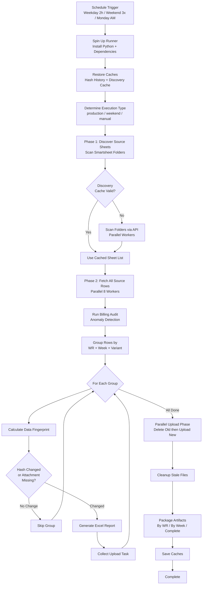
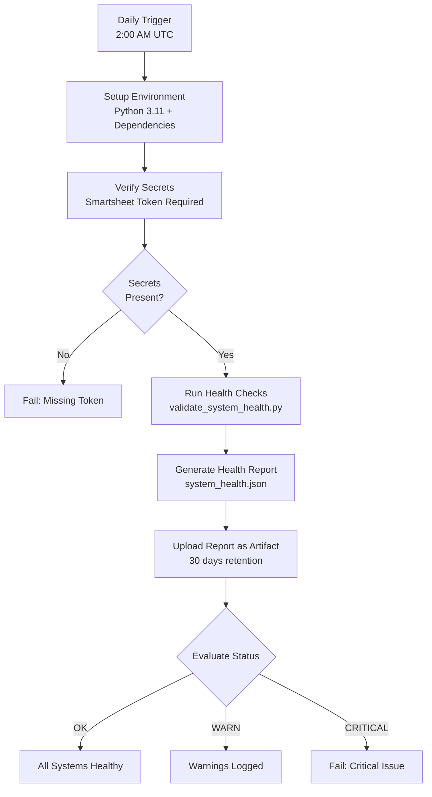
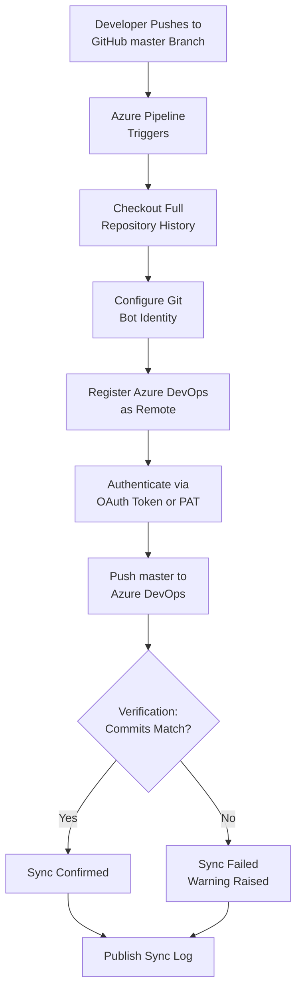
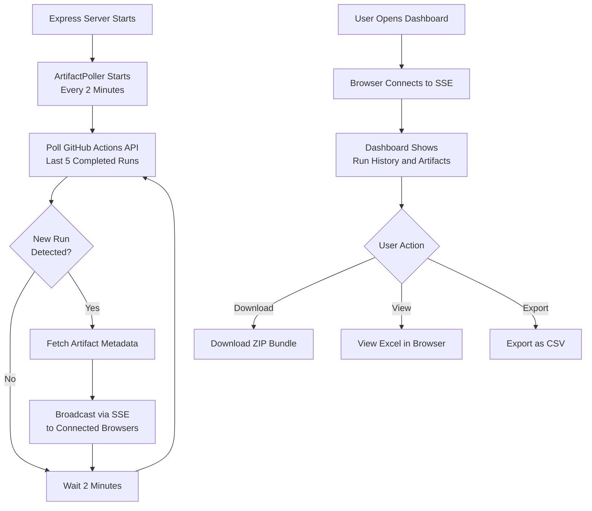
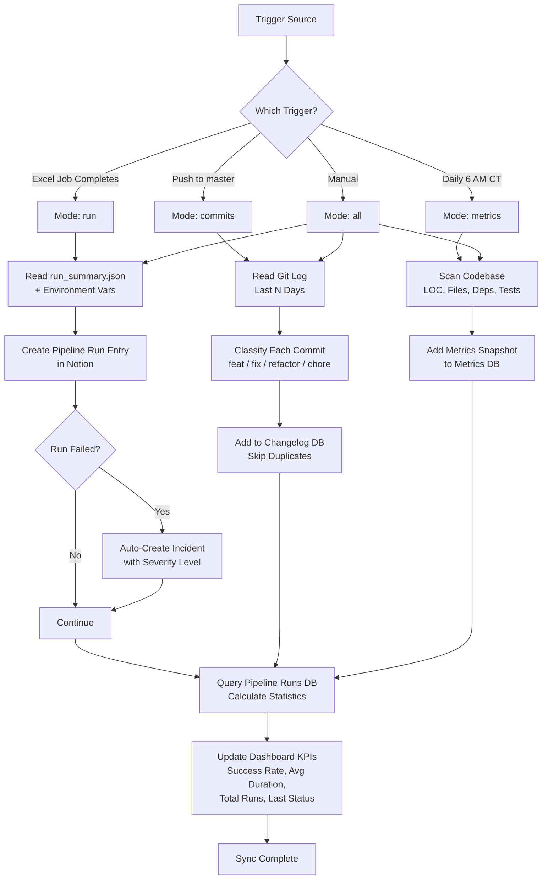
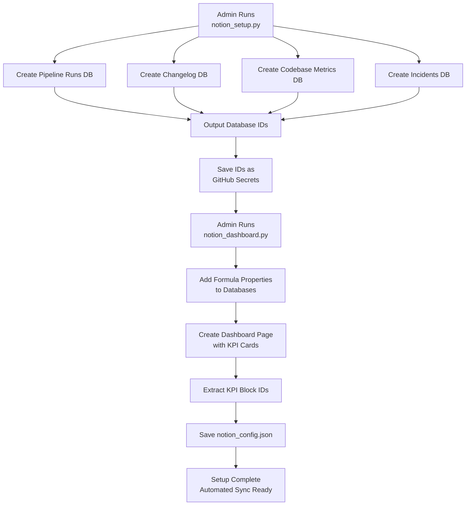
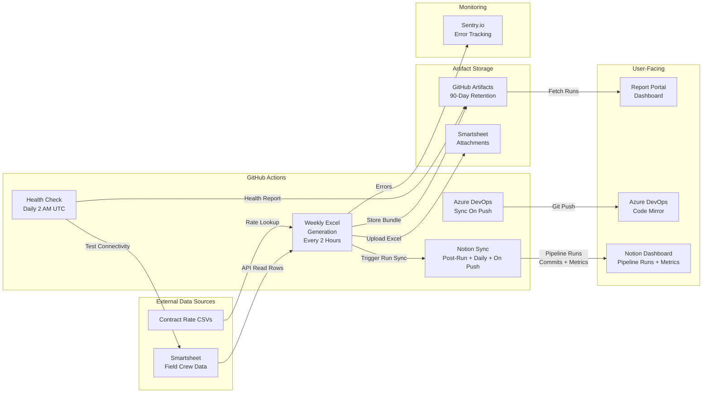

# Sync Job Run Logs — Generate-Weekly-PDFs-DSR-Resiliency

> **Last Updated:** April 9, 2026 | **Repository:** Generate-Weekly-PDFs-DSR-Resiliency

This document provides plain-English explanations and visual diagrams for every automated sync job in the `Generate-Weekly-PDFs-DSR-Resiliency` repository. It is designed for non-technical stakeholders who need to understand what each job does, when it runs, what it produces, and what happens when something goes wrong.

---

## 1. Weekly Excel Report Generation

### Sync Job Name
`weekly-excel-generation` (GitHub Actions workflow + Python data pipeline)

### Primary Purpose
This is the main workhorse of the system. It automatically connects to **Smartsheet** (a cloud spreadsheet platform where field crews log their daily work), pulls billing data, generates formatted **Excel reports** for each Work Request and billing week, and uploads those reports back to Smartsheet as file attachments. The goal is to turn raw field data into polished, auditable billing documents — without any manual effort.

### How It Works (Step-by-Step)

1. **A timer kicks off the job.** GitHub Actions runs this job automatically on three schedules:
   - **Weekdays (Mon–Fri):** Every 2 hours between 8 AM and 8 PM Central Time.
   - **Weekends (Sat–Sun):** Three times a day (10 AM, 2 PM, 6 PM CT) for maintenance coverage.
   - **Monday mornings:** A comprehensive run at midnight CT to start the week fresh.
   - The job can also be triggered manually through GitHub with custom options.
2. **The system sets up its environment.** A fresh virtual machine spins up, installs Python 3.12, and restores two caches:
   - **Hash History** — a record of which reports were generated last time and what data they contained.
   - **Discovery Cache** — a saved list of which Smartsheet sheets contain relevant data.
3. **The execution type is determined.** The system figures out if this is a weekday production run, weekend maintenance, Monday comprehensive, or manual trigger.
4. **Phase 1 — Discover source sheets.** The system connects to the Smartsheet API and scans specific folders to find all spreadsheets that contain billing data. It checks Subcontractor folders and Original Contract folders. If a valid cache exists (less than 7 days old), it reuses the cached list.
5. **Phase 2 — Fetch all source data.** Using up to 8 parallel workers, the system downloads every row of billing data. Each row represents a unit of work completed in the field.
6. **Billing Audit runs.** An audit system scans the data for anomalies — unusual price swings, missing fields, or suspicious patterns — producing a risk level (OK, WARN, or CRITICAL).
7. **Group the data.** Rows are organized by Work Request number, Week Ending date, and Variant (primary or helper).
8. **Change detection.** For each group, a data fingerprint (hash) is calculated and compared against the saved Hash History. Unchanged groups with existing attachments are skipped.
9. **Generate Excel reports.** For groups that need updating, branded Excel workbooks are built with company logo, summary info, and detailed line-item tables with proper formatting.
10. **Upload to Smartsheet (parallel).** All files are uploaded as row-level attachments, with old attachments deleted first. Uploads run in parallel for speed.
11. **Time budget safety.** If running past 80 minutes (of 90 max), the job stops gracefully. Remaining groups are picked up next run.
12. **Cleanup.** Stale local files and untracked Smartsheet attachments are removed.
13. **Package artifacts.** Excel files are organized and uploaded to GitHub artifact storage in four bundles: Complete, By Work Request, By Week Ending, and Manifest.
14. **Save caches.** Hash History and Discovery Cache are saved for the next run.
15. **Report completion.** A summary is logged showing files generated, uploaded, skipped, or errored.

### Visual Logic Map

### Expected Outcomes and Error Handling

- **Successful Run:** Excel files are generated for all WR groups with new/changed data, uploaded to Smartsheet, and stored in GitHub artifacts for 90 days. Hash History is updated for next run.
- **Error Handling:**
  - **Sentry Monitoring:** All errors reported to Sentry.io in real time with rich context. Cron Monitors alert if the job misses a window or fails 2 consecutive times.
  - **Per-Group Resilience:** If one WR group fails, the system continues processing the rest.
  - **Time Budget:** Stops gracefully at 80 minutes to preserve caches. Unfinished groups handled on next run.
  - **Rate Limiting:** 8 parallel workers stay within Smartsheet's 300 req/min limit. SDK auto-retries on HTTP 429.
  - **Cache Persistence:** Caches saved even on failure or timeout.

---

## 2. System Health Check

### Sync Job Name
`system-health-check` (GitHub Actions workflow + Python validation)

### Primary Purpose
A daily watchdog that verifies all external systems the billing pipeline depends on are reachable and functioning. It catches outages, expired API keys, or configuration problems before the main Excel generation job runs into them.

### How It Works (Step-by-Step)

1. **Daily 2:00 AM UTC trigger.** Runs every day automatically, or manually on demand.
2. **Environment setup.** Virtual machine provisioned with Python 3.11 and dependencies.
3. **Secret verification.** Confirms SMARTSHEET_API_TOKEN is available (required). Logs if SENTRY_DSN is absent.
4. **Run health checks.** Connects to each external service and validates connectivity, authentication, and accessibility.
5. **Upload health report.** Saves `system_health.json` as a GitHub artifact (30-day retention).
6. **Evaluate status.** Reads the report's overall status: OK (green), WARN (yellow), or CRITICAL (red failure).

### Visual Logic Map

### Expected Outcomes and Error Handling

- **Successful Run:** A `system_health.json` artifact is produced. Overall status is OK or WARN.
- **Error Handling:**
  - **CRITICAL status:** Workflow fails visibly in GitHub Actions tab.
  - **Missing secrets:** Job fails immediately with clear error message.
  - **Script failure:** Partial report is still uploaded for diagnostics.

---

## 3. GitHub to Azure DevOps Code Sync

### Sync Job Name
`Sync-GitHub-to-Azure-DevOps` (Azure Pipeline YAML)

### Primary Purpose
Keeps a mirror copy of the codebase in Azure DevOps automatically synchronized with the GitHub repository. GitHub is the authoritative source of truth. Whenever a developer pushes to `master` on GitHub, this job copies those changes to Azure DevOps.

### How It Works (Step-by-Step)

1. **Trigger on push to master.** Activates when code is pushed to `master` (excluding README and `.github/` changes).
2. **Full repository checkout.** Clones entire repository with complete history.
3. **Configure Git bot identity.** Sets up "Azure Pipeline Sync Bot" identity.
4. **Add Azure DevOps as remote.** The Azure DevOps repository URL is configured as a second Git remote.
5. **Force-push to Azure DevOps.** Current HEAD is pushed to Azure DevOps with OAuth authentication. The `--force-with-lease` safety check ensures it only overwrites if no one else pushed since the last fetch.
6. **Verify the sync.** Fetches back and compares commit hashes. If they match, sync is confirmed.
7. **Publish sync log.** Git reflog saved as build artifact for auditing.

### Visual Logic Map

### Expected Outcomes and Error Handling

- **Successful Run:** Azure DevOps `master` is an exact copy of GitHub's `master`. Verification confirms matching commit SHAs.
- **Error Handling:**
  - **Commit mismatch:** Workflow exits with error if verification fails.
  - **Missing configuration:** Pipeline skips gracefully if repo URL not set.
  - **PAT expiration:** Push fails with auth error; pipeline skips if PAT empty.
  - **Force-with-lease:** Prevents overwriting concurrent changes on Azure DevOps.

---

## 4. Report Portal — Run Observer

### Sync Job Name
`report-portal` (Node.js Express server with artifact polling)

### Primary Purpose
The Report Portal is the **observation and delivery layer**. It provides a web dashboard where team members can see the status of recent Excel generation runs, browse generated reports, and download or view them. It watches GitHub Actions for new completed runs and pushes real-time updates.

### How It Works (Step-by-Step)

1. **Server starts and begins polling.** Express server boots and starts an ArtifactPoller that checks the GitHub Actions API every 2 minutes.
2. **Poll cycle.** Each poll lists the 5 most recent completed workflow runs and compares against the last known run ID.
3. **Real-time push via SSE.** When a new run is detected, all connected browsers instantly receive a notification via Server-Sent Events.
4. **Dashboard API.** REST endpoints allow listing runs, browsing artifacts, downloading ZIPs, viewing Excel in-browser, and exporting to CSV.
5. **Portal v2 (React).** A modern React frontend with Supabase auth, Framer Motion animations, and Tailwind styling.

### Visual Logic Map

### Expected Outcomes and Error Handling

- **Successful Operation:** Dashboard shows real-time status of all recent runs. Users can download, view, and export reports without GitHub access.
- **Error Handling:**
  - **GitHub API errors:** Logged and poller retries on next interval. Server stays up.
  - **Missing token:** Works without token but at lower rate limit (60/hour vs 5,000/hour).
  - **Client disconnection:** SSE connections cleaned up automatically.
  - **Download failures:** Each endpoint returns 502 with descriptive error.

---

## 5. Notion Dashboard Sync

### Sync Job Name
`notion-sync` (GitHub Actions workflow + Python sync script: `notion_sync.py`)

### Primary Purpose
This job automatically pushes pipeline run data, code change history, and codebase health metrics from GitHub into a set of **Notion databases** — giving project managers and stakeholders a live, browsable view of system activity without needing GitHub access. When a pipeline run fails, it also auto-creates an **incident ticket** in Notion for the team to triage.

### How It Works (Step-by-Step)

1. **Three triggers activate this sync.** The Notion sync runs in three different contexts:
   - **After every Excel generation run:** The main weekly-excel-generation workflow calls this sync at the end to log the run's results (files generated, duration, errors, audit risk).
   - **On every push to master:** When developers push code to the main branch, recent commits are synced to a Changelog database.
   - **Daily at 6:00 AM Central Time:** A scheduled run captures a codebase health snapshot (lines of code, file counts, dependencies).
   - The job can also be triggered manually through GitHub with options for sync mode and lookback window.
2. **Authentication and setup.** The script uses a stored Notion integration token (`NOTION_TOKEN`) to connect to four Notion databases: Pipeline Runs, Changelog, Codebase Metrics, and Incidents.
3. **The sync mode determines what data flows to Notion:**
   - **Run mode** — Reads the run summary JSON (files generated, groups processed, duration, audit risk level) and creates a new entry in the Pipeline Runs database with 20+ properties including status, trigger type, file counts, and a direct link to the GitHub Actions run. If the run failed, an incident entry is automatically created in the Incidents database with severity based on audit risk.
   - **Commits mode** — Reads the Git log for the last N days (default 7, or 3 on push events), classifies each commit by conventional commit type (feature, fix, refactor, chore, docs, etc.), and adds it to the Changelog database with file change stats (insertions, deletions, files changed).
   - **Metrics mode** — Scans the entire codebase to count Python lines of code, total files, test files, dependencies from `requirements.txt`, source sheet count, and workflow step count. A daily snapshot is added to the Codebase Metrics database.
4. **Duplicate prevention.** Before adding any entry, the script checks if a page with the same title already exists in the target database. This makes every sync run fully idempotent — safe to re-run without creating duplicates.
5. **Dashboard KPIs are updated.** After syncing data, the script queries the entire Pipeline Runs database to calculate four live statistics: success rate percentage, average run duration, total run count, and last run status. These values are written directly into callout blocks on the Notion Operations Dashboard page, with color-coded backgrounds (green for healthy, red for failures).

### Visual Logic Map

### Expected Outcomes and Error Handling

- **Successful Run:** Notion databases are updated with the latest pipeline run data, commit history, or codebase metrics. Dashboard KPI cards reflect current statistics with color-coded backgrounds.
- **Error Handling:**
  - **Non-blocking design:** The Notion sync step in the Excel generation workflow uses `continue-on-error: true`, so a Notion API failure never blocks the main pipeline.
  - **Idempotent syncs:** Every entry is checked for duplicates before creation. Re-running the same sync produces no side effects.
  - **KPI update is non-fatal:** If dashboard callout blocks can't be located or updated, the sync still completes successfully.
  - **Graceful degradation:** If any database ID is not configured, that sync mode is skipped with a warning — other modes still run.
  - **Automatic incidents:** Failed pipeline runs automatically generate a tracked incident with severity, error summary, and a link back to the GitHub Actions run.

---

## 6. Notion Workspace Setup (One-Time Bootstrap)

### Sync Job Name
`notion_setup.py` + `notion_dashboard.py` (Manual Python scripts — run once)

### Primary Purpose
These are one-time setup scripts that create the four Notion databases and the Operations Dashboard page used by the automated Notion sync. They are run manually by an administrator once to bootstrap the entire Notion integration, then never need to run again.

### How It Works (Step-by-Step)

1. **`notion_setup.py` creates four databases** inside a designated Notion parent page:
   - **Pipeline Runs** — Stores every workflow execution with 20+ tracked properties.
   - **Changelog** — Stores classified git commits with change statistics.
   - **Codebase Metrics** — Stores daily health snapshots.
   - **Incidents** — Stores failed run tickets with severity and resolution tracking.
2. **Database IDs are output.** The script prints the database IDs that must be saved as GitHub repository secrets so the automated sync can find them.
3. **`notion_dashboard.py` builds the Operations Dashboard.** It creates a child page with:
   - Four live KPI callout cards (auto-updated by `notion_sync.py` after each run).
   - Database @mentions linking to each of the four databases.
   - Recommended view setup instructions for each database.
   - Quick links to GitHub, Actions, and API documentation.
4. **Formula properties are added.** The dashboard script adds computed columns to databases: Duration Category, Files per Minute, Impact Score, Test Ratio, and Days Open.
5. **Configuration is saved locally.** A `notion_config.json` file stores all database IDs and KPI block IDs for future reference.

### Visual Logic Map

### Expected Outcomes and Error Handling

- **Successful Run:** Four databases and a dashboard page are created in Notion. Configuration file saved. GitHub secrets ready to set.
- **Error Handling:**
  - **Missing environment variables:** Script exits with clear instructions for setting `NOTION_TOKEN` and `NOTION_PARENT_PAGE`.
  - **Duplicate runs:** Running setup again creates duplicate databases — only run once per workspace.
  - **Permission errors:** The Notion integration must be shared with the parent page before running.

---

## System Architecture Overview

---

## Configuration Quick Reference

| Sync Job | Trigger | Frequency | Key Secrets |
|----------|---------|-----------|-------------|
| Smartsheet → Excel | GitHub Actions Cron | Every 2 hrs weekdays, 3x weekends | `SMARTSHEET_API_TOKEN`, `SENTRY_DSN` |
| GitHub → Azure DevOps | Push to `master` | On every qualifying push | `AZDO_PAT` or `System.AccessToken` |
| Artifact Poller | Server startup | Every 2 minutes (configurable) | `GITHUB_TOKEN` |
| Notion Dashboard Sync | Post-run / Push / Cron | After each Excel run + daily + on push | `NOTION_TOKEN`, `NOTION_PIPELINE_DB`, `NOTION_CHANGELOG_DB`, `NOTION_METRICS_DB` |

---

## Glossary

| Term | Definition |
|------|-----------|
| Work Request (WR) | A unique identifier for a unit of field work being tracked and billed |
| Week Ending | The last day (typically Sunday) of a billing period. Reports grouped by this date. |
| CU (Compatible Unit) | A standardized code identifying a type of work. Each CU has a fixed price. |
| Hash / Fingerprint | A short code calculated from data. If data doesn't change, the hash stays the same. |
| Artifact | A file or bundle produced by a workflow run, stored in GitHub cloud for download. |
| SSE (Server-Sent Events) | Web technology letting the server push live updates to the browser. |
| Sentry | Third-party error monitoring service for error reports, performance data, and job check-ins. |
| Helper Variant | A secondary report format breaking down a WR by individual foreman, department, and job. |
| Discovery Cache | Saved list of relevant Smartsheet sheets. Valid for 7 days before a fresh scan. |
| Hash History | JSON file mapping each WR+Week+Variant to the data fingerprint from last generation. |
| Notion Sync | Automated push of pipeline data, commits, and metrics to Notion databases. |
| KPI (Key Performance Indicator) | Dashboard metrics like success rate, average duration, total runs, and last status. |
| Idempotent | A process that produces the same result no matter how many times it runs. |
