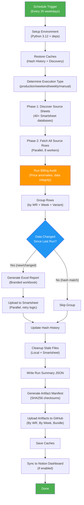
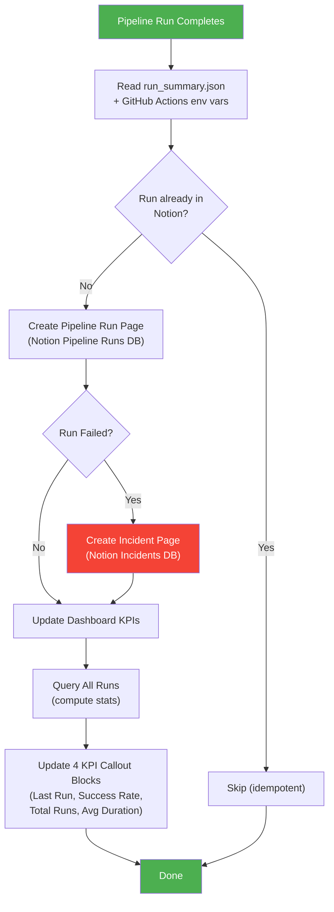
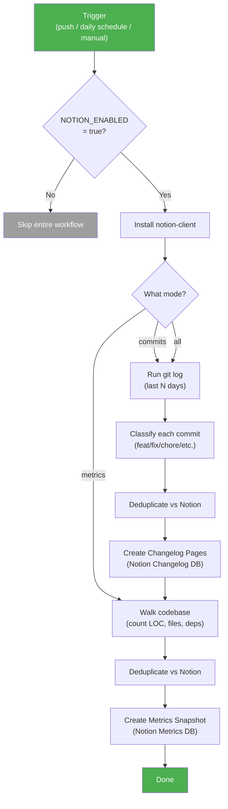
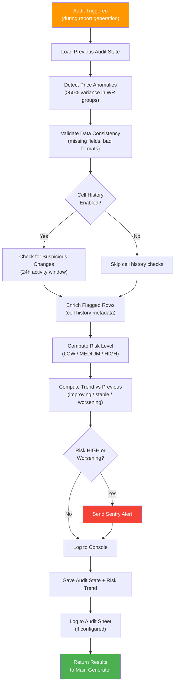
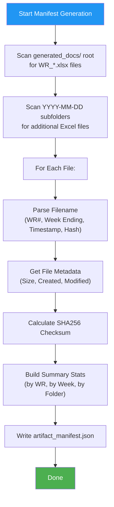
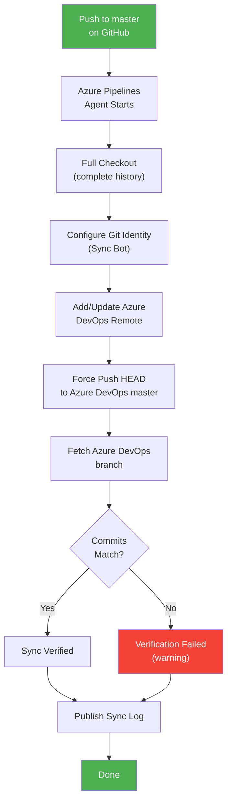
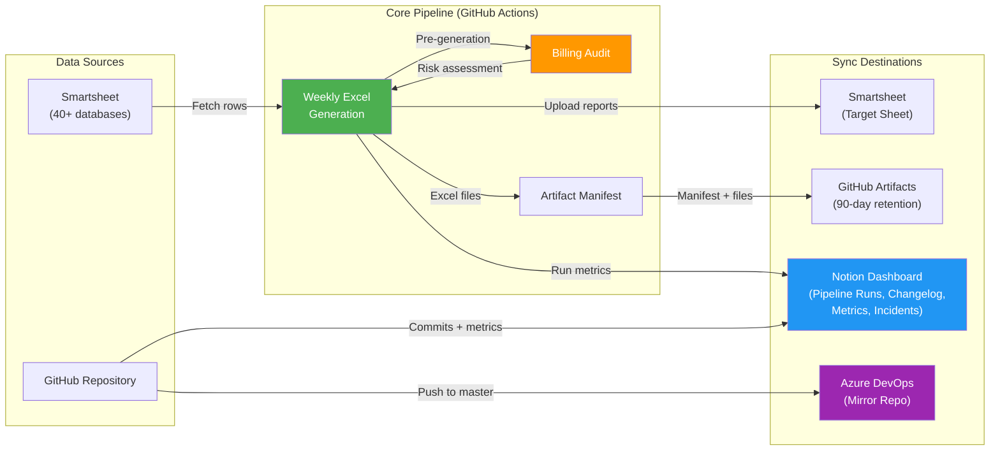

# Sync Job Run Logs

> Generated: April 15, 2026 | Repository: `Generate-Weekly-PDFs-DSR-Resiliency`

This document provides plain-English Run Logs for every automated sync job in the repository. Each entry explains **what** the job does, **how** it works step-by-step, a visual logic map, and what to expect on success or failure.

---

## Table of Contents

1. [Weekly Excel Report Generation](#1-weekly-excel-report-generation)
2. [Notion Dashboard Sync — Pipeline Run](#2-notion-dashboard-sync--pipeline-run)
3. [Notion Dashboard Sync — Commits & Metrics](#3-notion-dashboard-sync--commits--metrics)
4. [Billing Audit System](#4-billing-audit-system)
5. [Artifact Manifest Generator](#5-artifact-manifest-generator)
6. [GitHub-to-Azure DevOps Repository Sync](#6-github-to-azure-devops-repository-sync)

---

## 1. Weekly Excel Report Generation

### Sync Job Name
`weekly-excel-generation` (GitHub Actions Workflow + `generate_weekly_pdfs.py`)

### Primary Purpose
This is the core production job. It automatically pulls billing data from dozens of Smartsheet databases, verifies data integrity, and produces individual Excel reports for each Work Request and billing week. These reports are then uploaded back to Smartsheet and preserved as downloadable artifacts in GitHub. In simple terms: **it turns raw billing data in spreadsheets into polished, per-project weekly Excel reports — automatically, every two hours on workdays.**

### How It Works (Step-by-Step)

1. **Trigger**: The job runs on a schedule — every 2 hours during weekday business hours (Mon–Fri), three times per day on weekends, and a comprehensive weekly run on Monday nights. It can also be triggered manually with custom options (test mode, filters, debug, etc.).

2. **Environment Setup**: A fresh cloud server (Ubuntu) spins up, installs Python 3.12 and all required libraries (Smartsheet SDK, openpyxl for Excel, pandas, Sentry for error monitoring, etc.).

3. **Cache Restoration**: The system restores two key caches from previous runs:
   - **Hash History** — remembers what data was already processed so unchanged reports are skipped.
   - **Discovery Cache** — remembers which Smartsheet databases to read so it doesn't have to re-scan every time.

4. **Execution Type Detection**: The system determines what kind of run this is (production frequent, weekend maintenance, weekly comprehensive, or manual) to tailor its behavior.

5. **Phase 1 — Source Sheet Discovery**: The script connects to Smartsheet and identifies all source databases (40+ sheets). It checks configured Smartsheet folders for new sheets, loads any cached discovery data, and validates each sheet has the required columns (Work Request #, Weekly Reference Logged Date, Units Completed, Units Total Price, etc.).

6. **Phase 2 — Data Fetching**: All rows from every source sheet are pulled down in parallel (8 concurrent workers). Each row's data is mapped from Smartsheet columns to standardized field names. Subcontractor sheet prices are reverted to original contract rates using a CSV lookup table. Helper rows and VAC Crew rows are detected and tagged for separate reporting.

7. **Billing Audit**: Before generating reports, the system runs a financial audit — checking for unusual price swings, missing data, negative prices, and suspicious changes. It assigns a risk level (LOW / MEDIUM / HIGH) and logs the results.

8. **Data Grouping**: Rows are organized into groups by Work Request number, week ending date, and variant type (primary, helper, or VAC crew). Each group becomes one Excel file.

9. **Change Detection**: For each group, a data "fingerprint" (hash) is calculated. If the fingerprint matches the previous run AND the corresponding file already exists on Smartsheet, the group is skipped — saving time and API calls.

10. **Excel Generation**: For groups that need new reports, a formatted Excel workbook is created with company branding (logo, headers), line-item details (CU codes, quantities, prices), daily breakdowns, and calculated totals.

11. **Parallel Upload**: New Excel files are uploaded to the target Smartsheet in parallel. Old versions of the same report are deleted first. The system uses retry logic with exponential backoff for rate limits and transient errors.

12. **Cleanup**: Stale local files and orphaned Smartsheet attachments are removed. Hash history is updated and pruned.

13. **Run Summary**: A `run_summary.json` file is written with statistics (files generated, skipped, errors, duration, audit risk level) for downstream consumers.

14. **Artifact Preservation**: The `generate_artifact_manifest.py` script scans all generated Excel files, computes SHA256 checksums, and creates a JSON manifest. Files are organized by Work Request and by Week Ending, then uploaded to GitHub's artifact storage (90-day retention for production, 30 days for test runs).

15. **Cache Save**: Hash history and discovery caches are saved back, even if the job failed or timed out — ensuring the next run picks up where this one left off.

16. **Notion Sync** (if enabled): Pipeline run metrics are pushed to Notion dashboards (see Sync Job #2 below).

### Visual Logic Map

### Expected Outcomes & Error Handling

**Successful Run:**
- Excel reports generated for each Work Request / Week Ending with changed data.
- Files uploaded to Smartsheet and preserved in GitHub artifacts (90-day retention).
- Run summary JSON written with metrics.
- Caches updated for the next run.

**Failure Handling:**
- **Sentry Monitoring**: All errors are sent to Sentry.io with rich context (stack traces, session data, audit results). Sentry cron monitors detect missed or failed runs.
- **Graceful Time Budget**: If the job is about to exceed the 80-minute time budget, it stops processing new groups but still saves caches and artifacts — unfinished groups run next time.
- **Retry Logic**: API calls use exponential backoff (up to 4 retries) for rate limits and transient network errors.
- **Partial Success**: Even if some groups fail, others still complete. Error counts are tracked in the run summary.
- **Notion Incident Creation**: If the workflow fails and Notion sync is enabled, an incident is automatically created in the Notion Incidents database.

---

## 2. Notion Dashboard Sync — Pipeline Run

### Sync Job Name
`notion_sync.py --mode run` (invoked by `weekly-excel-generation.yml` after report generation)

### Primary Purpose
After each Excel generation run, this job pushes the run's results and metrics into a Notion database so the team can track pipeline health from a central dashboard — without needing to dig into GitHub Actions logs. **It translates raw CI/CD run data into a visual Notion dashboard.**

### How It Works (Step-by-Step)

1. **Trigger**: Runs automatically at the end of the weekly Excel generation workflow (if `NOTION_ENABLED` is set to `true` in the repo settings). Also callable manually.

2. **Read Run Metrics**: The script reads `run_summary.json` (written by the main generator) and GitHub Actions environment variables to gather: files generated/uploaded/skipped, duration, audit risk level, execution type, commit SHA, etc.

3. **Duplicate Check**: Before creating a new entry, it queries the Notion Pipeline Runs database to see if this run number already exists — preventing duplicate entries if the job is retried.

4. **Create Pipeline Run Page**: A new page is created in the Notion Pipeline Runs database with properties including: Run number, Status (Success/Failed/Skipped), Trigger type, Duration, Files Generated, Audit Risk Level, and a link back to the GitHub Actions run.

5. **Auto-Create Incident (on failure)**: If the pipeline run failed, an incident page is automatically created in the Notion Incidents database with severity based on the audit risk level, error details, and a link to the failed run.

6. **Update Dashboard KPIs**: If KPI callout blocks are configured on the Notion dashboard page, the script queries all pipeline runs and updates four live KPI cards:
   - **Last Run** — status and date of the most recent run
   - **Success Rate** — percentage of successful runs
   - **Total Runs** — count since tracking began
   - **Avg Duration** — average run time across all timed runs

### Visual Logic Map

### Expected Outcomes & Error Handling

**Successful Run:**
- New entry in the Notion Pipeline Runs database with full metrics.
- Dashboard KPI cards updated with latest statistics.
- Incident auto-created for failed runs.

**Failure Handling:**
- The Notion sync step uses `continue-on-error: true` in the workflow — it never blocks the main pipeline.
- If `NOTION_TOKEN` is missing, the script exits with an error message directing the user to run setup.
- If a database ID is not configured, that sync mode is skipped with a warning.
- Duplicate detection prevents data pollution on retries.

---

## 3. Notion Dashboard Sync — Commits & Metrics

### Sync Job Name
`notion-sync.yml` workflow → `notion_sync.py --mode commits|metrics|all`

### Primary Purpose
This job keeps the Notion workspace up to date with the project's development activity. It syncs recent code commits into a Changelog database and takes daily snapshots of codebase health metrics. **Think of it as an automated project status reporter that runs in the background.**

### How It Works (Step-by-Step)

1. **Trigger**:
   - **On every push to `master`**: Syncs the last 3 days of commits.
   - **Daily at 6:00 AM CT**: Takes a codebase metrics snapshot.
   - **Manual**: Choose any mode (commits, metrics, or all) with custom lookback.

2. **Guard Check**: The entire workflow only runs if `NOTION_ENABLED` is set to `true` in GitHub repository variables.

3. **Commits Mode** (`--mode commits`):
   - Runs `git log` to get recent commits with stats (files changed, insertions, deletions).
   - Each commit message is classified using conventional commit parsing (feat, fix, refactor, chore, docs, perf, security, test) with emoji prefixes.
   - For each commit not already in Notion, a new page is created in the Changelog database with: short SHA, message, author, date, type, scope, stats, breaking change flag, and a link to the commit on GitHub.

4. **Metrics Mode** (`--mode metrics`):
   - Walks the codebase to count: Python lines of code, total files, test files, dependencies (from `requirements.txt`), source Smartsheet IDs, workflow steps, and cache version.
   - Creates a daily snapshot page in the Metrics database (one per day, deduplicated).

5. **All Mode**: Runs both commits and metrics modes sequentially.

### Visual Logic Map

### Expected Outcomes & Error Handling

**Successful Run:**
- New commit entries in the Notion Changelog database (deduplicated).
- Daily metrics snapshot in the Notion Metrics database.

**Failure Handling:**
- If `NOTION_TOKEN` is not set, the script exits with an explicit error and setup instructions.
- If any individual database ID is missing, that specific mode is skipped (not a fatal error).
- Git log failures (e.g., in a shallow clone) are caught and logged as warnings.
- Each commit creation is independent — one failure doesn't block others.

---

## 4. Billing Audit System

### Sync Job Name
`audit_billing_changes.py` (integrated into `generate_weekly_pdfs.py` as a pre-generation audit phase)

### Primary Purpose
Before Excel reports are generated, this system scans all the billing data for problems: unauthorized price changes, data entry errors, missing required fields, and suspicious patterns. **It's an automated financial watchdog that flags risky data before it ends up in official reports.**

### How It Works (Step-by-Step)

1. **Initialization**: The audit system loads its previous state from `generated_docs/audit_state.json` (tracks what was found last time, for trend analysis).

2. **Price Anomaly Detection**: Groups rows by Work Request and checks if the price range within a group exceeds 50% of the average price — a signal for potential data entry errors or unauthorized changes.

3. **Data Consistency Validation**: Checks every row for:
   - Missing required fields (Work Request #, Units Total Price, Quantity, CU code)
   - Negative prices
   - Invalid price or quantity formats
   - Zero or negative quantities

4. **Suspicious Change Detection** (optional): If cell history checks are enabled, queries Smartsheet for recent discussion activity on financial columns — flagging anything within the last 24 hours.

5. **Selective Cell History Enrichment**: For rows that triggered anomalies, the system records metadata about available cell history for deeper investigation (without making excessive API calls).

6. **Risk Level Assessment**:
   - **LOW**: No issues detected.
   - **MEDIUM**: 1–3 issues found (review recommended).
   - **HIGH**: 4+ issues found (immediate review required).

7. **Trend Computation**: Compares the current risk level and issue count against the previous audit to determine if risk is **improving**, **stable**, or **worsening**.

8. **Reporting & Alerting**:
   - Console logging with color-coded risk indicators.
   - Sentry alerts for HIGH risk or worsening trends.
   - Audit log row in a dedicated Smartsheet (if configured).
   - Rolling risk trend history saved to `generated_docs/risk_trend.json` (last 50 entries).

### Visual Logic Map

### Expected Outcomes & Error Handling

**Successful Run:**
- Risk level assigned (LOW/MEDIUM/HIGH) and included in run summary.
- Audit state persisted for trend tracking.
- Risk trend JSON maintained (last 50 audits).

**Failure Handling:**
- The audit system is wrapped in a try/except — failures are logged and reported to Sentry, but never block report generation.
- If the audit module fails to import, a stub class is used and the risk level is reported as "UNKNOWN".
- Individual detection steps (price, consistency, cell history) fail independently without affecting each other.

---

## 5. Artifact Manifest Generator

### Sync Job Name
`scripts/generate_artifact_manifest.py` (invoked by the weekly Excel generation workflow)

### Primary Purpose
After Excel reports are generated, this script inventories every file, records its size, checksum, and metadata, and produces a machine-readable JSON manifest. **It's the "packing list" for every batch of reports — enabling auditing, validation, and easy discovery of specific files.**

### How It Works (Step-by-Step)

1. **Scan Root Folder**: Looks in `generated_docs/` for files matching `WR_*.xlsx`.

2. **Scan Week Subfolders**: Checks any subfolder matching the `YYYY-MM-DD` date pattern for additional Excel files.

3. **Parse Filenames**: Extracts structured metadata from each filename: Work Request number, Week Ending date, generation timestamp, and data hash.

4. **Collect File Metadata**: For each file, records: file size (bytes and MB), creation time, modification time.

5. **Calculate SHA256 Checksums**: Computes a cryptographic hash for each file — enabling integrity verification.

6. **Build Summary Statistics**: Aggregates: total file count, total size, unique Work Requests, unique Week Endings, and breakdowns by WR, by week, and by folder.

7. **Write Manifest**: Saves the complete inventory as `generated_docs/artifact_manifest.json`.

### Visual Logic Map

### Expected Outcomes & Error Handling

**Successful Run:**
- `artifact_manifest.json` created with full inventory and checksums.
- Summary printed to console (total files, size, WR count, week count).

**Failure Handling:**
- If the output folder doesn't exist, an empty manifest is returned with a warning.
- Individual file parsing or hashing errors are logged as warnings but don't stop the manifest generation.
- The script is resilient to unexpected filenames — non-matching files are simply excluded.

---

## 6. GitHub-to-Azure DevOps Repository Sync

### Sync Job Name
`Sync-GitHub-to-Azure-DevOps` (Azure Pipelines YAML: `azure-pipelines.yml`)

### Primary Purpose
This pipeline mirrors the GitHub `master` branch to an Azure DevOps repository. **It ensures the Azure DevOps copy of the codebase stays in lockstep with GitHub — enabling teams that use Azure DevOps to access the latest code without manual effort.**

### How It Works (Step-by-Step)

1. **Trigger**: Runs automatically on every push to the `master` branch on GitHub (excludes README and `.github/` changes to avoid unnecessary syncs).

2. **Full Checkout**: The Azure Pipelines agent checks out the full repository history (not a shallow clone) so commit references are accurate.

3. **Configure Git**: Sets up a bot identity (`Azure Pipeline Sync Bot`) for any authored commits in the sync process.

4. **Add Azure Remote**: Adds (or updates) a git remote pointing to the Azure DevOps repository URL, which is provided as a pipeline variable.

5. **Force Push**: Pushes the current HEAD to the target branch (`master`) on Azure DevOps using the Azure DevOps OAuth token for authentication. This is a force push to ensure exact mirroring.

6. **Verification**: After pushing, fetches the Azure DevOps branch and compares commit SHAs. If they match, the sync is verified. If they don't, the step fails with a warning.

7. **Publish Sync Log**: Regardless of success or failure, the git HEAD log is published as a build artifact for auditing.

### Visual Logic Map

### Expected Outcomes & Error Handling

**Successful Run:**
- Azure DevOps `master` branch matches GitHub `master` exactly.
- Sync log published as a build artifact.

**Failure Handling:**
- If the `AzureDevOpsRepoUrl` pipeline variable is not set, the script fails immediately with a clear error message and setup instructions.
- If the push fails (authentication, permissions, network), Azure Pipelines reports the failure.
- If post-push verification shows mismatched commits, the step fails with a warning — indicating the push may have been blocked or Azure DevOps has diverged.
- The sync log is always published (even on failure) for troubleshooting.

---

## System Architecture Overview

The following diagram shows how all six sync jobs fit together in the overall system:

