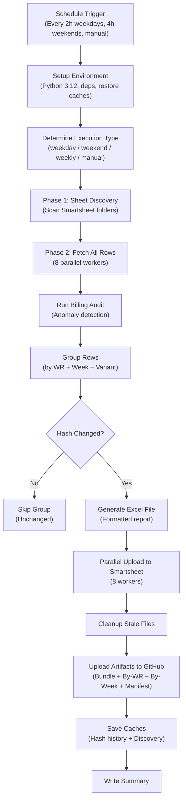
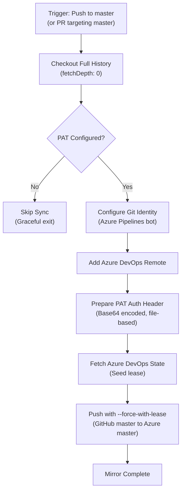
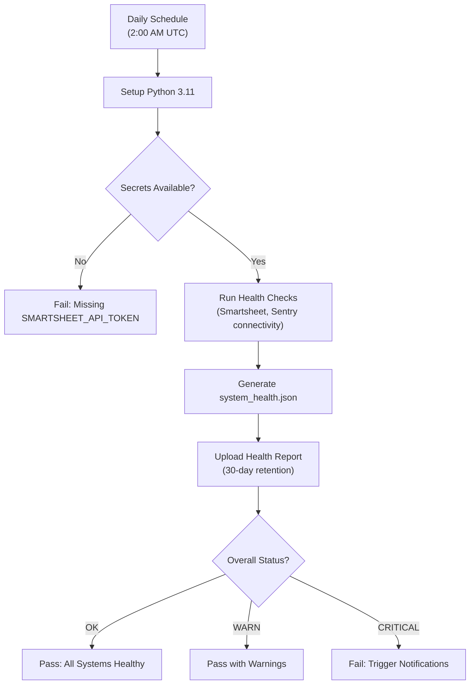
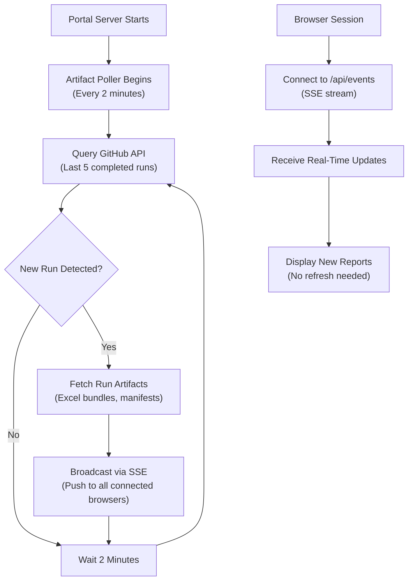
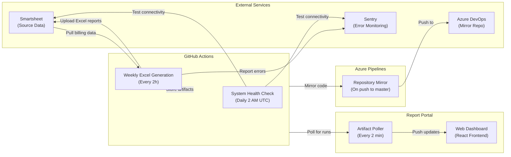

# Sync Job Run Logs — Linetec Report System

> **Last Updated:** 2026-03-31  
> **Notion Page:** [View in Notion](https://www.notion.so/334aa083d70981719837e0521d89cc4e)

This document provides a complete, non-technical explanation of every automated sync job in the **Linetec Weekly Report System** (repository: `Generate-Weekly-PDFs-DSR-Resiliency`).

---

## Table of Contents

1. [Weekly Excel Report Generation](#1-weekly-excel-report-generation)
2. [GitHub-to-Azure DevOps Repository Mirror](#2-github-to-azure-devops-repository-mirror)
3. [System Health Check](#3-system-health-check)
4. [Portal Artifact Poller (Real-Time Sync)](#4-portal-artifact-poller-real-time-sync)
5. [System Architecture Overview](#5-system-architecture-overview)
6. [Quick Reference](#6-quick-reference)

---

## 1. Weekly Excel Report Generation

**Sync Job Name:** `weekly-excel-generation.yml` + `generate_weekly_pdfs.py`

### Primary Purpose

This is the **core sync job** of the entire system. It automatically pulls billing data from Smartsheet, transforms that data into organized Excel reports grouped by Work Request number and billing week, and uploads those reports back to Smartsheet as file attachments. It also stores copies as downloadable artifacts in GitHub. This ensures that project managers and billing teams always have up-to-date, audit-ready weekly billing reports without any manual effort.

### How It Works (Step-by-Step)

1. **Schedule triggers the job** — The workflow runs automatically every 2 hours during business days (Mon–Fri, 8 AM–8 PM Central Time), every 4 hours on weekends, and once on Monday morning for a comprehensive weekly run. It can also be triggered manually with custom options.
2. **Environment setup** — A fresh cloud server (Ubuntu) is provisioned. Python 3.12 is installed, dependencies are loaded, and caches from previous runs (hash history, discovery cache) are restored to speed things up.
3. **Execution type determination** — The system figures out what kind of run this is: a regular weekday check, a weekend maintenance pass, a Monday comprehensive sweep, or a manual trigger with custom parameters.
4. **Phase 1 — Sheet Discovery** — The system connects to Smartsheet using an API token and scans configured folders (Subcontractor folders and Original Contract folders) to find all relevant data sheets. It uses a discovery cache (valid for 7 days) to avoid re-scanning every run.
5. **Phase 2 — Data Fetching** — All rows from discovered sheets are pulled down in parallel (using 8 concurrent workers) to maximize speed while respecting Smartsheet's rate limits (300 requests/minute).
6. **Billing Audit** — An integrated audit system scans the data for financial anomalies, unusual pricing, or data quality issues. Results are tagged with a risk level (OK, WARN, or CRITICAL).
7. **Data Grouping** — Rows are organized into groups by Work Request number, week-ending date, and variant type (primary report vs. helper/subcontractor report). The system supports three modes: "both" (primary + helper files), "primary" only, or "helper" only.
8. **Change Detection** — For each group, a data hash (fingerprint) is computed. If the hash matches the previous run and the corresponding attachment still exists on Smartsheet, the group is skipped entirely — no wasted processing. Extended change detection includes foreman assignments, department numbers, and financial totals.
9. **Excel Generation** — For each group that has changed or is new, a formatted Excel file is created with the Linetec logo, proper styling, financial calculations, and audit metadata. For subcontractor sheets, prices are automatically reverted to 100% original contract rates.
10. **Parallel Upload** — All generated Excel files are uploaded to the target Smartsheet in parallel (8 workers), replacing any outdated attachments for the same Work Request and week.
11. **Cleanup** — Old/stale attachments and local files that no longer correspond to current data are removed.
12. **Artifact Preservation** — All generated Excel files are packaged and uploaded to GitHub as downloadable artifacts, organized three ways: as a complete bundle, by Work Request number, and by week-ending date. A JSON manifest with SHA256 checksums is created for validation.
13. **Cache Saving** — Hash history and discovery caches are saved (even if the job fails or times out) so the next run can pick up where this one left off.
14. **Summary** — A detailed summary is written to the GitHub Actions run page showing file counts, sizes, and organization details.

### Visual Logic Map

### Expected Outcomes & Error Handling

- ✅ **Successful Run:** Excel reports are generated for all changed Work Requests, uploaded to Smartsheet, and preserved as GitHub artifacts with a 90-day retention policy.
- ⚠️ **Partial Success:** If some groups fail, the system continues processing remaining groups. Failed groups are logged and reported to Sentry. Hash history is still saved.
- ❌ **Failure Scenarios:**
  - **Missing API token** — Job fails immediately with a clear error message.
  - **Smartsheet rate limiting** — The SDK automatically retries with exponential backoff.
  - **Time budget exceeded** — After 80 minutes, the job gracefully stops (leaving 10 min for artifact saving). Remaining groups are picked up on the next run.
  - **Critical errors** — Captured by Sentry with full context and sent as alerts.
  - **Job timeout** — Caches are saved even on failure so no progress is lost.

---

## 2. GitHub-to-Azure DevOps Repository Mirror

**Sync Job Name:** `azure-pipelines.yml` (Azure DevOps Pipeline)

### Primary Purpose

This sync job keeps a **mirror copy** of the entire codebase in Azure DevOps. Whenever code is pushed to the `master` branch on GitHub, this pipeline automatically copies those changes to Azure DevOps. This ensures the organization has a backup in their corporate infrastructure.

### How It Works (Step-by-Step)

1. **Trigger** — The pipeline runs automatically whenever a commit is pushed to `master` on GitHub, or when a PR targets `master`.
2. **Full checkout** — Checks out the complete repository with full history (not a shallow clone).
3. **Git configuration** — Sets up a Git identity ("Azure Pipelines" bot) and adds an Azure DevOps remote URL.
4. **Authentication** — A Personal Access Token (PAT) is securely encoded as a Base64 HTTP header.
5. **Safety check** — If the PAT is missing or expired, the pipeline skips gracefully.
6. **Fetch Azure state** — Fetches current Azure DevOps state to seed the lease.
7. **Safe force push** — Pushes using `--force-with-lease` (only succeeds if no concurrent changes on Azure).

### Visual Logic Map

### Expected Outcomes & Error Handling

- ✅ **Successful Run:** Azure DevOps repo is an exact mirror of GitHub `master`.
- ❌ **Failure Scenarios:**
  - **Expired/missing PAT** — Pipeline exits gracefully with a warning.
  - **Concurrent Azure push** — `--force-with-lease` prevents overwriting; pipeline can be re-run.
  - **Shallow clone issue** — Automatically converts to full clone.

---

## 3. System Health Check

**Sync Job Name:** `system-health-check.yml` + `validate_system_health.py`

### Primary Purpose

A **daily diagnostic check** on all external services (Smartsheet, Sentry). Verifies API connections and credentials before the next report generation run.

### How It Works (Step-by-Step)

1. **Schedule** — Runs daily at 2:00 AM UTC. Can also be triggered manually.
2. **Environment setup** — Python 3.11 with project dependencies.
3. **Secret verification** — Verifies `SMARTSHEET_API_TOKEN` is available.
4. **Health check execution** — Tests connectivity to Smartsheet and Sentry.
5. **Report generation** — Results written to `system_health.json`.
6. **Report upload** — JSON uploaded as GitHub artifact with 30-day retention.
7. **Status evaluation** — OK (pass), WARN (pass with warnings), or CRITICAL (fail).

### Visual Logic Map

### Expected Outcomes & Error Handling

- ✅ **Successful Run:** `system_health.json` shows "OK" status. All services reachable.
- ❌ **Failure Scenarios:**
  - **Missing secrets** — Fails immediately, alerting the team.
  - **Smartsheet unreachable** — CRITICAL status, job fails, triggering notifications.
  - **Sentry unavailable** — Logged as a warning (non-critical).

---

## 4. Portal Artifact Poller (Real-Time Sync)

**Sync Job Name:** `portal/services/poller.js` + `portal/services/github.js`

### Primary Purpose

Runs **continuously** inside the Report Portal. Every 2 minutes, it checks GitHub for new completed workflow runs and pushes updates to connected browsers via Server-Sent Events (SSE). Users see new reports appear in real-time without refreshing.

### How It Works (Step-by-Step)

1. **Portal startup** — Artifact Poller begins in the background.
2. **Polling loop** — Every 2 minutes, queries GitHub API for the 5 most recent completed runs.
3. **New run detection** — Compares latest run ID against last known ID.
4. **Artifact fetching** — For new runs, fetches artifact lists (bundles, manifests, by-WR packages).
5. **Real-time broadcast** — Pushes `newRun` events to all connected browsers via SSE.
6. **Portal API endpoints:**
   - `/api/runs` — List completed workflow runs
   - `/api/runs/:runId/artifacts` — Artifacts for a specific run
   - `/api/artifacts/:id/download` — Download artifact ZIP
   - `/api/artifacts/:id/view` — Parse and view Excel in-browser
   - `/api/artifacts/:id/export` — Export as XLSX or CSV
   - `/api/latest` — Most recent run with artifacts
   - `/api/events` — SSE endpoint for real-time updates
7. **Error resilience** — Failed polls are logged; poller continues on next cycle.

### Visual Logic Map

### Expected Outcomes & Error Handling

- ✅ **Normal Operation:** New reports appear in portal within 2 minutes of workflow completion.
- ❌ **Failure Scenarios:**
  - **GitHub API errors** — Logged; poller retries next cycle.
  - **Missing token** — Rate-limited to 60 req/hour instead of 5,000.
  - **SSE drops** — Cleaned up automatically; reconnect on page refresh.

---

## 5. System Architecture Overview

---

## 6. Quick Reference

| Sync Job | Frequency | Duration | Key Systems | Alert Channel |
|---|---|---|---|---|
| Weekly Excel Generation | Every 2h (weekdays), 4h (weekends) | Up to 80 min | Smartsheet, GitHub Artifacts | Sentry + GitHub Notifications |
| Azure DevOps Mirror | On every push to master | Under 2 min | GitHub, Azure DevOps | Azure Pipeline Notifications |
| System Health Check | Daily at 2:00 AM UTC | Under 10 min | Smartsheet, Sentry | GitHub Notifications |
| Portal Artifact Poller | Every 2 minutes (continuous) | Seconds per poll | GitHub API, SSE Clients | Console Logs |
