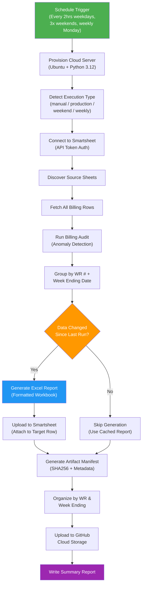
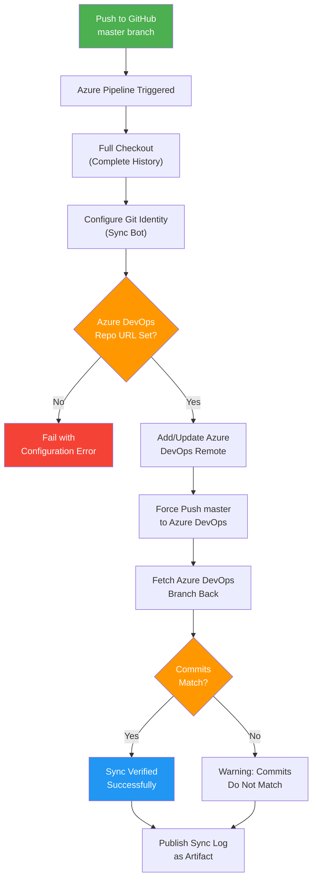
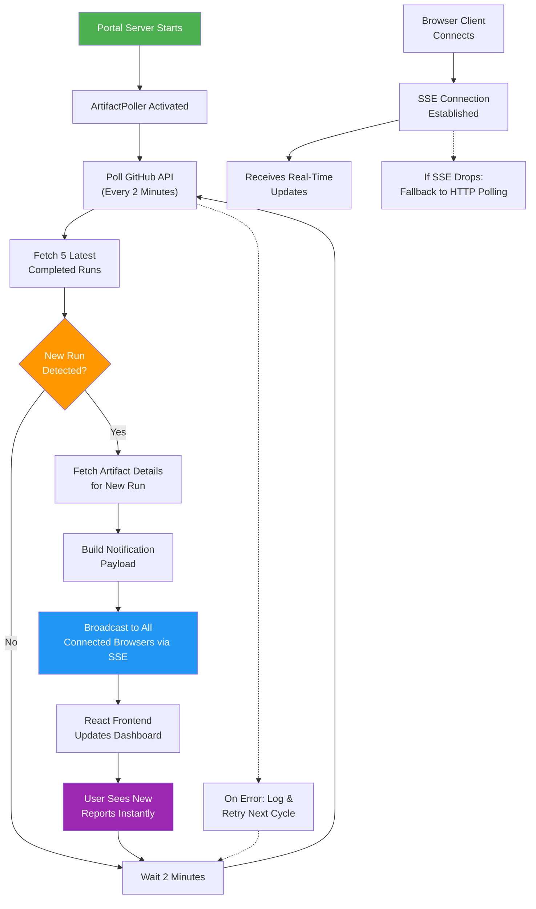
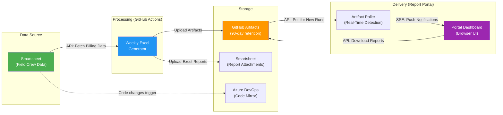

# Sync Job Run Logs

> **Generated:** 2026-03-20  
> **Repository:** Generate-Weekly-PDFs-DSR-Resiliency  
> **Purpose:** Non-technical documentation of all automated sync jobs in this system

---

## Table of Contents

1. [Weekly Excel Report Generator](#1-weekly-excel-report-generator)
2. [GitHub → Azure DevOps Repository Sync](#2-github--azure-devops-repository-sync)
3. [Report Portal Artifact Poller](#3-report-portal-artifact-poller)

---

## 1. Weekly Excel Report Generator

### Sync Job Name
`weekly-excel-generation.yml` — Weekly Excel Generation with Sentry Monitoring

### Primary Purpose
This is the core automated job in the system. It connects to Smartsheet (an online spreadsheet platform where field crews log their daily work), pulls billing data, and generates formatted Excel reports for each Work Request and billing week. These reports are used for invoicing and financial tracking. The job runs automatically throughout the day so reports always reflect the latest field data.

### How It Works (Step-by-Step)

1. **Trigger**: The job starts automatically on a schedule — every 2 hours on weekdays (8 AM–8 PM CT), three times on weekends, and a comprehensive run every Monday at midnight. It can also be started manually with custom options (test mode, filters, debug logging, etc.).

2. **Environment Setup**: A fresh cloud server (Ubuntu) is provisioned by GitHub Actions. Python 3.12 is installed along with all required libraries (smartsheet SDK, openpyxl for Excel, Sentry for error tracking, etc.). Previously cached dependencies are restored to speed this up.

3. **Execution Type Detection**: The system checks the current day and time to categorize the run as one of: `manual`, `production_frequent` (weekday), `weekend_maintenance`, or `weekly_comprehensive` (Monday night).

4. **Connect to Smartsheet**: Using a secure API token, the script authenticates with Smartsheet and discovers all relevant source sheets that contain field work data.

5. **Fetch Source Data**: All rows of billing data are pulled from the discovered Smartsheet sheets. This includes Work Request numbers, dates, pricing, foremen, quantities, and other billing fields.

6. **Billing Audit**: An automated audit system scans the financial data for anomalies (e.g., unusual pricing, missing fields) and assigns a risk level. This helps catch data quality issues before reports are generated.

7. **Group Data**: Rows are grouped by Work Request number and week-ending date. Both "primary" (standard per-WR) and "helper" (per-WR/per-helper-foreman) Excel variants can be generated depending on configuration.

8. **Change Detection**: For each group, a data hash (fingerprint) is calculated. If the data hasn't changed since the last run and the previous report still exists, generation is skipped to save time and resources.

9. **Generate Excel Reports**: For each group that has new or changed data, a formatted Excel workbook is created with the company logo, properly formatted columns, financial calculations, and billing details.

10. **Upload to Smartsheet**: In production mode, the generated Excel files are attached to the corresponding rows in the target Smartsheet sheet, making them immediately available to the billing team.

11. **Create Artifact Manifest**: A JSON manifest is generated listing every Excel file with metadata (SHA256 hash, file size, Work Request number, week ending date) for auditing and integrity verification.

12. **Organize & Upload Artifacts**: Excel files are organized into folders by Work Request and by Week Ending date, then uploaded to GitHub's cloud storage as downloadable artifacts. These are retained for 90 days (30 days for test runs).

13. **Summary Report**: A detailed summary is written to the GitHub Actions run page showing file counts, sizes, Work Request numbers, and download instructions.

### Visual Logic Map

### Expected Outcomes & Error Handling

**Successful Run:**
- Excel reports are generated for all Work Requests with new or changed data
- Files are attached to the correct Smartsheet rows for the billing team
- Artifacts are uploaded to GitHub with 90-day retention
- A manifest JSON is produced with SHA256 checksums for every file

**Error Handling:**
- **Sentry Monitoring**: All errors are reported to Sentry with full context (stack traces, affected Work Requests, row counts)
- **Audit Warnings**: If the billing audit detects anomalies, warnings are logged but generation continues
- **Missing API Token**: The job fails immediately with a clear error message
- **No Data Found**: The job raises an exception if no source sheets or data rows are found
- **Individual Group Failures**: If one Work Request fails to generate, the error is logged and the job continues processing remaining groups
- **Artifact Upload**: Uses `if-no-files-found: warn` so missing files produce warnings rather than failures
- **Timeout**: The job has a 120-minute hard timeout to prevent runaway executions

---

## 2. GitHub → Azure DevOps Repository Sync

### Sync Job Name
`azure-pipelines.yml` — Sync GitHub Master to Azure DevOps

### Primary Purpose
This job keeps a mirror copy of the codebase in Azure DevOps in sync with the primary GitHub repository. Whenever code is pushed to the `master` branch on GitHub, this pipeline automatically copies those changes to Azure DevOps. This ensures the Azure DevOps team always has access to the latest code without any manual copying.

### How It Works (Step-by-Step)

1. **Trigger**: The pipeline runs automatically whenever a commit is pushed to the `master` branch on GitHub. It ignores changes to README files and GitHub-specific configuration (`.github/` folder) since those don't affect the core codebase.

2. **Full Checkout**: The pipeline checks out the complete repository history (not just the latest snapshot). This is critical because a shallow copy would cause errors when pushing to Azure DevOps.

3. **Configure Git Identity**: Git is configured with a bot identity ("Azure Pipeline Sync Bot") for consistency in logs and commit attribution.

4. **Validate Configuration**: The pipeline checks that the Azure DevOps repository URL has been provided as a pipeline variable. If missing, it fails with a clear error message explaining what to set.

5. **Add Azure DevOps Remote**: The Azure DevOps repository is added as a secondary "remote" (destination) in Git. If it was already configured from a previous run, the URL is updated.

6. **Push to Azure DevOps**: The current commit on `master` is force-pushed to the `master` branch on Azure DevOps. Authentication uses either the Azure Pipelines system OAuth token or a Personal Access Token (PAT), depending on the pipeline variant.

7. **Verify Sync**: After pushing, the pipeline fetches the Azure DevOps branch back and compares commit IDs. If the GitHub commit matches the Azure DevOps commit, the sync is verified as successful.

8. **Publish Sync Log**: The Git log from the sync operation is published as a build artifact for troubleshooting if needed.

### Visual Logic Map

### Expected Outcomes & Error Handling

**Successful Run:**
- The `master` branch on Azure DevOps contains the exact same commit as GitHub's `master`
- A sync log artifact is published for audit trails
- The verification step confirms matching commit SHAs

**Error Handling:**
- **Missing Configuration**: If `AzureDevOpsRepoUrl` is not set, the pipeline fails immediately with setup instructions
- **Missing PAT Token**: If the personal access token is not configured, sync steps are skipped gracefully with a warning
- **Push Rejection**: The primary variant uses `--force` push; the secondary variant uses `--force-with-lease` (safer, only pushes if remote hasn't changed independently)
- **Verification Failure**: If commits don't match after push, the pipeline exits with error code 1 and a warning message
- **Sync Log**: Always published (even on failure) so administrators can diagnose issues

---

## 3. Report Portal Artifact Poller

### Sync Job Name
`ArtifactPoller` — Real-Time Workflow Run Monitoring Service

### Primary Purpose
The Artifact Poller is a background service running inside the Report Portal web application. It continuously checks GitHub for new completed workflow runs (from the Excel generation job above) and instantly notifies connected users through their web browsers. This means portal users see new reports appear in real-time without having to manually refresh the page.

### How It Works (Step-by-Step)

1. **Startup**: When the Report Portal Express server starts, the poller is automatically activated (if polling is enabled in configuration). It begins its first check immediately.

2. **Poll GitHub API**: Every 2 minutes (configurable), the poller calls the GitHub Actions API to retrieve the 5 most recent completed workflow runs for the `weekly-excel-generation.yml` workflow.

3. **Detect New Runs**: The poller keeps track of the last known workflow run ID. When a new run appears (a different ID at the top of the list), it knows fresh reports have been generated.

4. **Fetch Artifact Details**: For each newly detected run, the poller calls GitHub's API again to get the list of artifacts (the Excel files, manifests, etc.) associated with that run, including their names, sizes, and expiration status.

5. **Build Notification Payload**: A structured notification is created containing the run details (run number, status, conclusion, trigger event, branch) and all artifact details.

6. **Broadcast via SSE**: The notification is sent to all connected browser clients using Server-Sent Events (SSE). This is a live connection that pushes updates to users instantly — no page refresh needed.

7. **Client-Side Update**: The React frontend (Portal v2) listens for these SSE events. When a `newRun` event arrives, it automatically fetches the updated run list from the API and highlights the new entries in the dashboard.

8. **Fallback Polling**: If the SSE connection drops, the frontend falls back to its own 2-minute polling cycle, calling `/api/poll` with the last known run ID to check for updates.

9. **Status Monitoring**: The poller exposes a `/api/poller-status` endpoint that reports whether it's running, when it last polled, the last known run ID, any errors, and how many browser clients are connected.

### Visual Logic Map

### Expected Outcomes & Error Handling

**Successful Run:**
- New workflow runs are detected within 2 minutes of completion
- All connected portal users see the new reports appear automatically
- Artifact details (names, sizes, expiration) are immediately available for download

**Error Handling:**
- **GitHub API Errors**: If the API call fails (rate limiting, network issues, auth problems), the error is logged and the poller retries on the next cycle — it never crashes
- **SSE Client Disconnects**: When a browser tab is closed, the client is automatically removed from the broadcast list; broken connections are cleaned up silently
- **No Error Listeners**: If no code is listening for error events, errors are logged to the console as a fallback
- **Configuration**: Polling can be disabled entirely via environment variable (`POLLING_ENABLED=false`), and the interval is bounded between 1 second and 1 hour to prevent misconfiguration

---

## System Architecture Overview

The three sync jobs work together as an integrated pipeline:

**End-to-End Flow:**
1. Field crews enter work data into Smartsheet throughout the day
2. Every 2 hours, the Excel Generator pulls this data, creates billing reports, and uploads them
3. The Report Portal detects new reports within 2 minutes and pushes notifications to users
4. Users download reports directly from the portal dashboard
5. Meanwhile, any code changes are automatically mirrored to Azure DevOps for the wider engineering team
