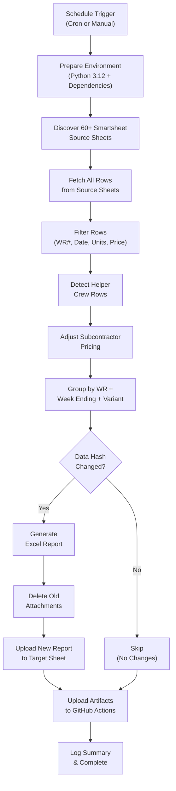
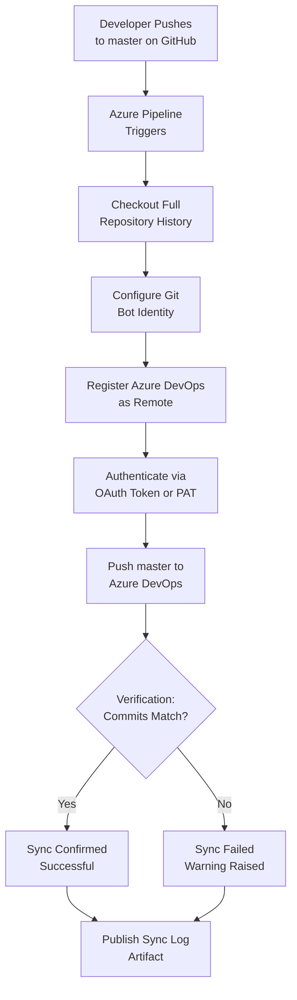
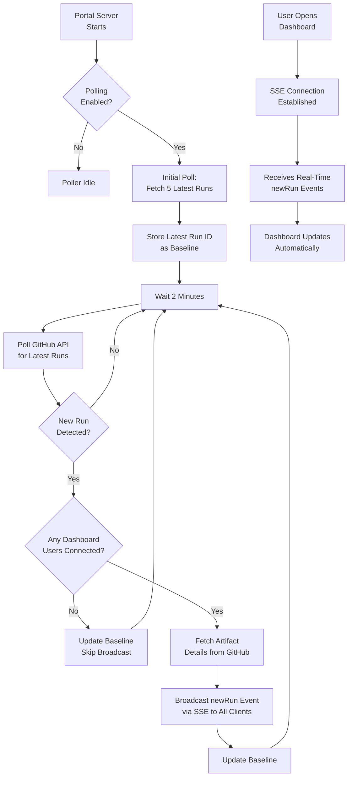

# Sync Job Run Logs

> **Last Updated:** March 18, 2026  
> **Repository:** Generate-Weekly-PDFs-DSR-Resiliency  
> **Purpose:** Non-technical documentation of every automated sync job in this codebase, including visual logic maps, step-by-step walkthroughs, and error-handling expectations.

---

## Table of Contents

1. [Smartsheet → Excel Report Generation (Weekly Sync)](#1-smartsheet--excel-report-generation-weekly-sync)
2. [GitHub → Azure DevOps Repository Mirror](#2-github--azure-devops-repository-mirror)
3. [Artifact Poller (Real-Time Dashboard Sync)](#3-artifact-poller-real-time-dashboard-sync)

---

## 1. Smartsheet → Excel Report Generation (Weekly Sync)

### Sync Job Name

**Weekly Excel Generation with Sentry Monitoring** (`weekly-excel-generation.yml` → `generate_weekly_pdfs.py`)

### Primary Purpose

This job automatically pulls field crew data from over 60 Smartsheet source sheets, groups the data by Work Request and week, generates individual Excel reports for each group, and uploads them back to a centralized Smartsheet target sheet. It runs multiple times daily so stakeholders always have up-to-date billing and production reports without any manual effort.

### How It Works (Step-by-Step)

1. **The schedule kicks off the job.** GitHub Actions starts the workflow on a set timer — every 2 hours on weekdays (7 AM to 7 PM CT, plus off-hours runs), three times on weekends, and once at midnight Sunday (CT). It can also be triggered manually with custom options.

2. **The environment is prepared.** The system checks out the latest code, installs Python 3.12, and loads all required libraries (Smartsheet SDK, OpenPyXL for Excel, Sentry for error tracking).

3. **The execution type is determined.** Based on the current day and time, the system decides whether this is a "scheduled" run, a "weekly" run (Monday early morning), or a "manual" run (triggered by a person). This affects logging and notifications.

4. **Source sheets are discovered.** The script connects to the Smartsheet API and scans 60+ source sheets (organized by crew type — Promax, Resiliency, Intake, etc.). It reads every row and its columns from these sheets.

5. **Data is filtered.** Only rows that have a valid Work Request number, a logged date, confirmed completed units, and a price greater than zero are kept. Rows with `#NO MATCH` pricing are excluded.

6. **Helper rows are detected.** The system identifies "helper" crew entries — cases where one foreman's crew helped another. These are tracked separately so billing goes to the correct department.

7. **Subcontractor pricing is adjusted.** For designated subcontractor sheets, the system reverts unit prices to 100% of the contract rate (from a CSV lookup table), ensuring accurate billing regardless of field-entered values.

8. **Data is grouped.** Qualifying rows are organized by Work Request number + week ending date + variant (primary crew vs. helper crew). Each group becomes one Excel report.

9. **Change detection runs.** A hash (digital fingerprint) is computed for each group's data. If the hash matches a previously generated report and that report is still attached to the target sheet, the group is skipped — saving time and avoiding duplicate uploads.

10. **Excel reports are generated.** For each new or changed group, an Excel workbook is created with formatted columns (Foreman, CU Code, Description, Quantity, Unit Price, Extended Price), styled headers, and auto-calculated totals.

11. **Old attachments are cleaned up.** Before uploading a new version, any outdated Excel files for the same Work Request + week are deleted from the target Smartsheet row.

12. **New reports are uploaded.** The freshly generated Excel files are attached to the corresponding Work Request row on the centralized target sheet in Smartsheet.

13. **Artifacts are preserved in GitHub.** All generated Excel files are organized by Work Request and by week, then uploaded as downloadable GitHub Actions artifacts. A manifest file summarizing every generated report is also created.

14. **A summary is logged.** The job prints a human-readable summary (reports generated, skipped, errors) to the GitHub Actions run page.

### Visual Logic Map

### Expected Outcomes & Error Handling

- **Successful run:** All changed Work Request groups produce new Excel reports uploaded to the target Smartsheet. Unchanged groups are skipped. GitHub Actions artifacts are available for download. The run summary shows counts of generated, skipped, and failed reports.
- **Partial failure:** If an individual report fails (e.g., API rate limit on one sheet), the job continues processing remaining groups. The failed group is logged and reported via Sentry.
- **Full failure:** If the Smartsheet API is unreachable or the API token is invalid, the job fails immediately. Sentry captures the error with full context (stack trace, environment, tags). The GitHub Actions run is marked as failed and appears with a red status.
- **Monitoring:** Sentry receives error events and session data for every run, enabling alerting and trend analysis.

---

## 2. GitHub → Azure DevOps Repository Mirror

### Sync Job Name

**Sync-GitHub-to-Azure-DevOps** (`azure-pipelines.yml` and `.github/workflows/azure-pipelines.yml`)

### Primary Purpose

This job keeps the Azure DevOps repository in perfect sync with the GitHub repository. Every time code is pushed to the `master` branch on GitHub, this job automatically copies those changes to Azure DevOps. This ensures both platforms always have the same version of the code, which is critical for teams that use Azure DevOps for builds, deployments, or compliance tracking.

### How It Works (Step-by-Step)

1. **A code push to `master` triggers the sync.** Whenever a developer pushes code to the `master` branch on GitHub, the Azure DevOps pipeline automatically starts. Changes to only documentation files (`README.md`, `.github/` folder) are ignored to avoid unnecessary runs.

2. **The full code history is downloaded.** The pipeline checks out the entire repository with complete history (not a shallow copy). This prevents errors that can happen when only recent commits are available.

3. **Git identity is configured.** The pipeline sets up a bot identity ("Azure Pipeline Sync Bot") so that any sync-related metadata is clearly attributed to the automation, not a person.

4. **The Azure DevOps remote is registered.** The pipeline adds (or updates) a Git remote pointing to the Azure DevOps repository URL. This tells Git where to push the code.

5. **Authentication is prepared.** The pipeline uses either the built-in Azure DevOps system token (OAuth) or a Personal Access Token (PAT) to authenticate. The PAT is converted into a secure HTTP header — it is never embedded in URLs.

6. **Code is pushed to Azure DevOps.** The pipeline force-pushes the current `master` branch to the Azure DevOps repository. The `--force-with-lease` variant (in the PAT-based pipeline) adds a safety check: it only overwrites the remote if no one else has pushed changes there since the last fetch.

7. **The sync is verified.** After pushing, the pipeline fetches back from Azure DevOps and compares commit hashes. If the GitHub and Azure DevOps commits match, the sync is confirmed successful. If they don't match, the pipeline fails with a warning.

8. **A sync log is published.** Regardless of success or failure, the Git log file is saved as a downloadable build artifact for audit and troubleshooting purposes.

### Visual Logic Map

### Expected Outcomes & Error Handling

- **Successful run:** The Azure DevOps `master` branch is an exact copy of GitHub's `master`. The verification step confirms matching commit SHAs. A sync log artifact is available.
- **Push failure:** If the force-push is rejected (e.g., Azure DevOps permissions issue), the pipeline fails. The error is visible in the Azure DevOps build log. The sync log artifact is still published for debugging.
- **Verification mismatch:** If the pushed commit doesn't match what Azure DevOps reports, the pipeline exits with a warning. This could indicate concurrent changes on the Azure DevOps side or a permissions issue.
- **Missing configuration:** If the `AzureDevOpsRepoUrl` variable or `AZDO_PAT` secret is not set, the pipeline logs a clear error message and exits early without attempting the sync.
- **Monitoring:** Failures appear as red builds in Azure DevOps Pipelines dashboard. No external alerting (like Sentry) is configured — teams rely on Azure DevOps notifications.

---

## 3. Artifact Poller (Real-Time Dashboard Sync)

### Sync Job Name

**ArtifactPoller** (`portal/services/poller.js` — Linetec Report Portal)

### Primary Purpose

This job runs inside the Report Portal web server and continuously checks GitHub for newly completed report-generation runs. When it detects a new run, it instantly notifies all connected dashboard users in real time, so they see fresh reports without refreshing their browser. Think of it as a live notification system that bridges GitHub and the portal dashboard.

### How It Works (Step-by-Step)

1. **The portal server starts up.** When the Linetec Report Portal Express.js server boots, it checks if polling is enabled (it is by default). If enabled, the Artifact Poller starts running automatically.

2. **The first poll establishes a baseline.** The poller immediately queries the GitHub API for the 5 most recent completed workflow runs of the `weekly-excel-generation.yml` workflow. It records the ID of the newest run as its reference point.

3. **Polling continues on a timer.** Every 2 minutes (configurable), the poller checks GitHub again for the latest completed runs. This interval can be adjusted from 1 second to 1 hour via environment variable.

4. **New runs are detected by comparison.** On each poll, the poller compares the latest run's ID against its stored reference. If the ID has changed, a new run has completed since the last check.

5. **Artifact details are fetched.** When a new run is detected and at least one user is viewing the dashboard, the poller fetches the list of artifacts (Excel report bundles) from that run, including names, sizes, and creation times.

6. **Dashboard users are notified instantly.** The poller broadcasts a real-time event to every connected browser via Server-Sent Events (SSE). The event includes the run details (status, branch, timing) and the list of available artifacts. The dashboard updates automatically — no page refresh needed.

7. **The reference point is updated.** After each poll, the stored "last known run ID" is updated, so the next poll only triggers on genuinely new runs.

8. **Connection health is maintained.** The SSE connection sends a keepalive ping every 30 seconds to prevent browsers and proxies from timing out. When a user closes their browser tab, their connection is automatically cleaned up.

### Visual Logic Map

### Expected Outcomes & Error Handling

- **Successful operation:** The poller runs silently in the background. Users see new reports appear on the dashboard within ~2 minutes of a GitHub Actions run completing. The `/api/poller-status` endpoint reports `running: true`, the last poll time, and the count of connected clients.
- **GitHub API errors:** If a poll fails (network issue, rate limit, invalid token), the error is logged to the server console. The poller does **not** stop — it retries on the next cycle. The `lastError` field in the status endpoint shows the most recent error message.
- **No connected users:** If no one is viewing the dashboard, the poller still checks for new runs (to keep its baseline current) but skips the artifact-fetching and broadcasting steps. This reduces unnecessary GitHub API calls.
- **Client disconnection:** When a user closes their browser, the SSE connection's `close` event fires and the client is removed from the broadcast list. Stale connections that fail during a broadcast are also automatically cleaned up.
- **Monitoring:** The poller status is available at `GET /api/poller-status` and returns: running state, last poll time, last known run ID, last error (if any), connected client count, and poll interval. There is no external alerting — errors are logged to stdout/stderr.

---

## Configuration Quick Reference

| Sync Job | Trigger | Frequency | Key Secrets |
|----------|---------|-----------|-------------|
| Smartsheet → Excel | GitHub Actions Cron | Every 2 hrs weekdays, 3x weekends | `SMARTSHEET_API_TOKEN`, `SENTRY_DSN` |
| GitHub → Azure DevOps | Push to `master` | On every qualifying push | `AZDO_PAT` (or `System.AccessToken`) |
| Artifact Poller | Server startup | Every 2 minutes (configurable) | `GITHUB_TOKEN` |

---

## Glossary

| Term | Definition |
|------|------------|
| **Work Request (WR)** | A unique identifier for a unit of field work being tracked and billed |
| **CU Code** | Compatible Unit code — a standardized billing code for a specific type of work |
| **Helper Row** | A data entry where one crew assisted another crew's Work Request |
| **SSE (Server-Sent Events)** | A web technology that lets the server push real-time updates to the browser |
| **PAT (Personal Access Token)** | A password-like credential used to authenticate with Azure DevOps |
| **Sentry** | An error-monitoring service that captures and alerts on application failures |
| **Hash / Data Fingerprint** | A computed value that uniquely represents a set of data; used to detect changes |
| **Artifact** | A file or bundle of files produced by a GitHub Actions workflow run |
