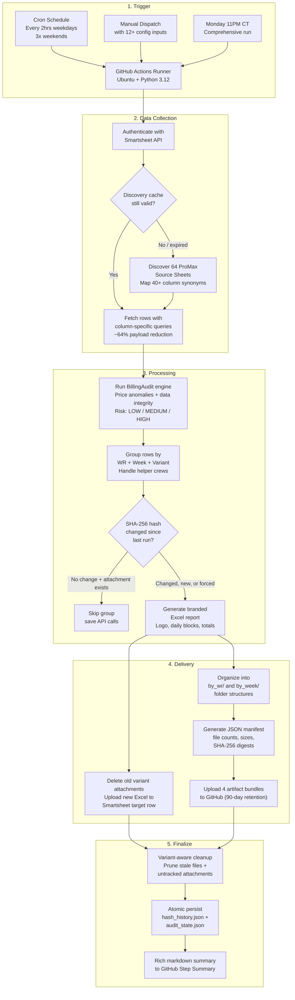
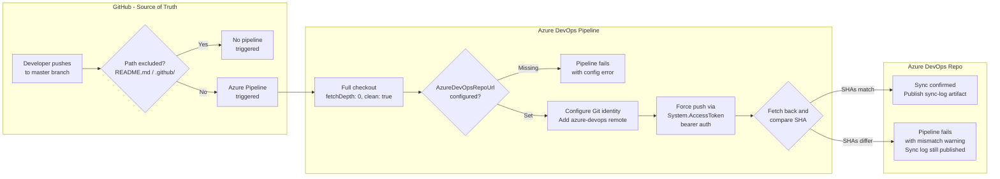
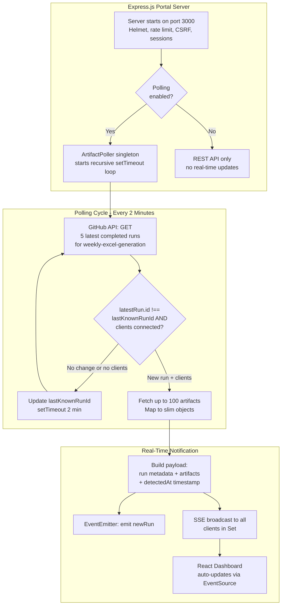
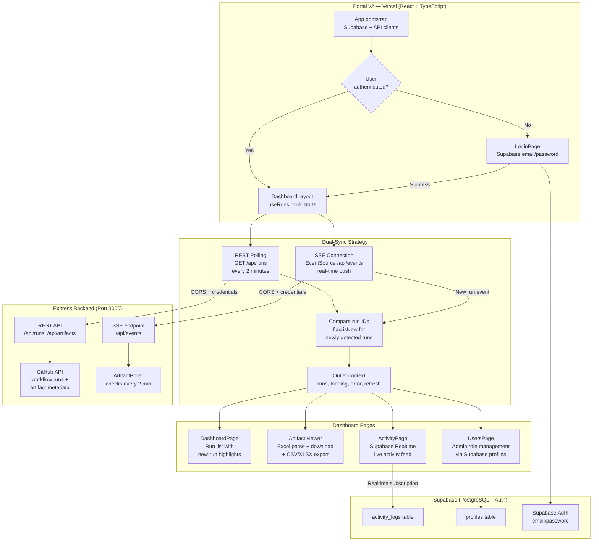
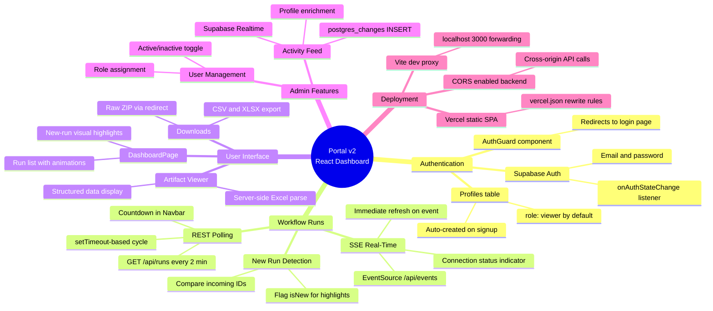
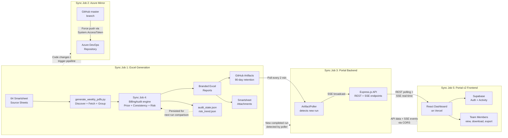

# Sync Job Run Logs — Generate-Weekly-PDFs-DSR-Resiliency

**Last Updated:** March 19, 2026 | **Repository:** `Generate-Weekly-PDFs-DSR-Resiliency` | **Branch:** `cursor/sync-job-run-logs-a906`

This document provides non-technical "Run Logs" for every automated sync job in the codebase. Each section explains what the job does, how it works step by step, and what to expect when it runs.

**System Status (as of Mar 19, 2026):** All scheduled workflow runs passing — 10/10 recent runs completed successfully (all `schedule`-triggered, all `success` conclusion). Average run time: ~35 minutes. No new PRs merged since Mar 13 (PR #92: Subcontractor Pricing Reversion). Source sheet count stable at 64. PR #91 (Code Quality Improvements) and PR #93 (Folder Sync Service) remain open as drafts.

---

## Table of Contents

1. [Smartsheet → Excel Report Generation (Weekly Sync)](#1-smartsheet--excel-report-generation-weekly-sync)
2. [GitHub → Azure DevOps Repository Mirror](#2-github--azure-devops-repository-mirror)
3. [Report Portal — Real-Time Artifact Poller](#3-report-portal--real-time-artifact-poller)
4. [Billing Audit Engine](#4-billing-audit-engine)
5. [Portal v2 — React Dashboard with Supabase Real-Time](#5-portal-v2--react-dashboard-with-supabase-real-time)
6. [System Integration — How All Five Jobs Connect](#6-system-integration--how-all-five-jobs-connect)
7. [Configuration Quick Reference](#7-configuration-quick-reference)
8. [Glossary](#8-glossary)

---

## 1. Smartsheet → Excel Report Generation (Weekly Sync)

### Sync Job Name

**Weekly Excel Generation with Sentry Monitoring** (`weekly-excel-generation.yml` → `generate_weekly_pdfs.py`)

### Primary Purpose

This is the core billing engine of the Resiliency project. It automatically pulls production data that field crews enter into Smartsheet, calculates pricing and hours for each Work Request, and produces formatted Excel billing reports — one per Work Request per week. These reports are then uploaded back to Smartsheet and stored as downloadable artifacts in GitHub. This job ensures that billing data stays current without any manual spreadsheet work.

### How It Works (Step-by-Step)

1. **Trigger:** The job runs automatically on a schedule — every 2 hours during weekdays (Mon–Fri, 7 AM to 7 PM Central), three times on weekends (9 AM, 1 PM, 5 PM Central), and a comprehensive weekly run on Monday at 11 PM CT. It can also be started manually with custom options (test mode, debug logging, specific Work Requests, force regeneration, hash resets, grouping mode, etc.).

2. **Environment Setup:** A fresh Ubuntu server is provisioned in GitHub Actions. Python 3.12 is installed along with all dependencies (Smartsheet SDK, openpyxl for Excel, Pillow for image embedding, pandas, Sentry SDK 2.x for error tracking and performance profiling). Pip caching accelerates subsequent runs.

3. **Determine Execution Type:** The system checks the day/time and classifies the run as one of: `production_frequent` (weekday), `weekend_maintenance`, `weekly_comprehensive` (Monday night), or `manual` (user-triggered). Advanced options can be passed for manual runs, including `max_groups`, `regen_weeks`, and `reset_wr_list`.

4. **Connect to Smartsheet:** The script authenticates with the Smartsheet API using a secure token. It then discovers all 64 source sheets — these are the ProMax backend sheets (Resiliency Promax Databases 16–58, Promax Databases 31–36, Intake Promax 1–6, plus legacy sheets) where crews log their daily production units. A discovery cache stored at `discovery_cache.json` (60-minute TTL) is used to skip rediscovery on repeated runs. Each sheet's columns are mapped using a synonym dictionary covering 40+ column name variants.

5. **Fetch All Rows:** Every row from all 64 source sheets is downloaded using column-specific fetching (reducing API payload by ~64%). Column names are normalized to a standard format (e.g., "Work Request #", "CU Code", "Units Total Price", "Foreman"). For sheets identified via `SUBCONTRACTOR_SHEET_IDS`, the `revert_subcontractor_price` function loads original contract rates from dual CSV files and reverts any modified `Units Total Price` back to the contract rate based on CU code matching (with CU Helper fallback). Rows are accepted only if they have a Work Request #, a weekly reference date, `Units Completed = true`, and `Units Total Price > 0`.

6. **Run Billing Audit:** Before generating reports, the `BillingAudit` engine runs three checks: price anomaly detection (flags WRs with >50% price variance), data consistency validation (missing fields, negative prices, invalid formats), and suspicious change detection. A risk level (LOW / MEDIUM / HIGH) is computed and trend-compared against the previous run. See Sync Job 4 for full details.

7. **Group Data:** Rows are grouped by Work Request number and week-ending date into keys like `MMDDYY_WRNUMBER`. The grouping mode (`RES_GROUPING_MODE`) controls helper handling: `primary` keeps all rows in main groups, `helper` splits helper rows into separate groups, and `both` (default) does full separation. Helper crew rows are detected via the "Foreman Helping?" column.

8. **Change Detection:** For each group, a SHA-256 hash is calculated from the data (in extended mode: includes foreman, department, scope, totals, row count, and variant metadata). This hash is compared against the persistent history stored in `hash_history.json`. If the data has not changed AND the Excel file is still attached to the Smartsheet target row, the group is skipped — saving time and API calls. The `FORCE_GENERATION` flag can override this.

9. **Generate Excel Reports:** For each group with new or changed data, a branded `.xlsx` file is created using openpyxl. The report includes the LineTec logo, a Report Summary (total billed, line items, billing period Mon–Sun), Report Details (foreman, WR#, scope, work order, customer, job#, dept#), and Daily Data Blocks (rows grouped by Snapshot Date with pole#, CU code, work type, description, UOM, quantity, pricing). Files are named `WR_<wr>_WeekEnding_<MMDDYY>_<timestamp>[_Helper_<name>]_<hash>.xlsx`.

10. **Upload to Smartsheet:** In production mode, the system first deletes old Excel attachments matching the exact variant identity (WR + week + variant + identifier) from the target Smartsheet row, then uploads the new file via the Attachments API. If `SKIP_UPLOAD` is set, files are saved locally only.

11. **Organize Artifacts:** All generated Excel files are organized into `by_wr/WR_<num>/` and `by_week/Week_<date>/` folder structures. A JSON manifest is generated by `scripts/generate_artifact_manifest.py` with file counts, sizes, WR numbers, week endings, and SHA-256 digests.

12. **Upload to GitHub:** Four artifact bundles are uploaded to GitHub via `actions/upload-artifact@v4`: a Complete Bundle (all Excel + manifest + hash history + audit state), By-Work-Request, By-Week-Ending, and a standalone Manifest. Production runs are retained for 90 days; test runs for 30 days.

13. **Cleanup:** Variant-aware local file cleanup removes stale files. Untracked Smartsheet attachments from previous runs are pruned. The hash history JSON is atomically persisted (via tmp + `os.replace()`) for the next run's change detection.

14. **Report Summary:** A rich markdown summary is written to `$GITHUB_STEP_SUMMARY`, showing execution type, file counts, total sizes, Work Request numbers, week endings, and any errors encountered.

### Visual Logic Map

### Expected Outcomes & Error Handling

| Condition | What Happens |
|-----------|-------------|
| **Successful run** | Excel files generated, uploaded to Smartsheet, artifacts stored in GitHub for 90 days. Step summary shows file counts and WR numbers. |
| **No data changes detected** | All groups are skipped. No new files are created. This is normal and expected during quiet periods. |
| **Smartsheet API failure** | Exception is captured by Sentry with full context (WR number, row count, stack trace). The failed group is skipped and remaining groups continue processing. |
| **Missing API token** | In test mode: synthetic data is generated for validation. In production: the job fails immediately with a clear error. |
| **Individual group failure** | Error is logged, Sentry alert is sent with group details, and processing continues with the next group. One bad Work Request does not block others. |
| **Timeout (120 min limit)** | GitHub Actions kills the job. Partial artifacts may still be uploaded since the upload step runs with `if: always()`. |

---

## 2. GitHub → Azure DevOps Repository Mirror

### Sync Job Name

**Sync-GitHub-to-Azure-DevOps** (`azure-pipelines.yml`)

### Primary Purpose

This job keeps the Azure DevOps repository in perfect sync with the GitHub repository. Every time code is pushed to the `master` branch on GitHub, this job automatically copies those changes to Azure DevOps. This ensures both platforms always have the same version of the code — critical for teams that use Azure DevOps for builds, deployments, or compliance tracking.

### How It Works (Step-by-Step)

1. **A code push to master triggers the sync.** Whenever a developer pushes code to the `master` branch on GitHub, the Azure DevOps pipeline automatically starts. Changes to only documentation files (README.md, .github/) are ignored via path exclusion filters.

2. **The full code history is downloaded.** The pipeline checks out the entire repository with complete history (`fetchDepth: 0`, `clean: true`) — not a shallow copy. This is critical to prevent object-resolution errors during push.

3. **Git identity is configured.** The pipeline sets up a bot identity ("Azure Pipeline Sync Bot" / `pipeline-sync@azure-devops.com`) and logs diagnostic information: Git version, current branch, and the last 5 commits for traceability.

4. **Configuration is validated.** Before attempting the push, the pipeline validates that the `AzureDevOpsRepoUrl` environment variable is set. If missing, the pipeline fails immediately with a clear error message — no partial work is done.

5. **The Azure DevOps remote is registered.** The pipeline adds a Git remote named `azure-devops` pointing to the Azure DevOps repository URL (e.g., `https://dev.azure.com/LinetecDevelopment/Resiliency%20-%20Development/_git/Generate-Weekly-PDFs-DSR-Resiliency`).

6. **Authentication is prepared.** The pipeline uses Azure DevOps' built-in OAuth token (`System.AccessToken`) passed as a bearer token via `http.extraheader`. All scripts use `set -euo pipefail` for strict error handling.

7. **Code is pushed to Azure DevOps.** The pipeline force-pushes the current HEAD to `refs/heads/master` on Azure DevOps. The `--force-with-lease` safety check ensures it only overwrites if no one else has pushed there since the last fetch.

8. **The sync is verified.** After pushing, the pipeline fetches back from Azure DevOps and compares commit hashes. If they match, the sync is confirmed. If they differ, the pipeline exits with code 1.

9. **A sync log is published.** Regardless of success or failure (`condition: always()`), the Git log file (`.git/logs/HEAD`) is saved as a downloadable build artifact named `sync-log` for auditing.

### Visual Logic Map

### Expected Outcomes & Error Handling

| Condition | What Happens |
|-----------|-------------|
| **Successful sync** | Azure DevOps `master` branch matches GitHub `master` exactly. Verification confirms matching commit SHAs. Sync log artifact published. |
| **Commit mismatch after push** | Verification step exits with code 1, failing the pipeline. The `sync-log` artifact is still published for post-mortem analysis. |
| **Missing AzureDevOpsRepoUrl** | Pipeline fails immediately at the validation step with a clear error message. No push is attempted. |
| **OAuth token expired** | Git push fails with an authentication error. Fix: Azure DevOps Project Settings → "Allow scripts to access the OAuth token" must be enabled. |
| **Documentation-only changes** | Pipeline is NOT triggered (README.md and .github/ are excluded from the trigger path filter). |
| **Pull request to master** | Pipeline is NOT triggered (PR triggers are explicitly disabled with `pr: none`). |

---

## 3. Report Portal — Real-Time Artifact Poller

### Sync Job Name

**ArtifactPoller** (`portal/services/poller.js` — Linetec Report Portal)

### Primary Purpose

The Report Portal is a web application that lets team members view, download, and inspect the Excel billing reports generated by Sync Job 1. The Artifact Poller is the real-time engine inside this portal — it continuously checks GitHub for new workflow runs and instantly notifies all connected dashboard users in real time, so they see fresh reports without refreshing their browser.

### How It Works (Step-by-Step)

1. **Portal Starts:** When the Express.js server boots on port 3000 (configurable via `PORT`), it sets up security middleware (Helmet CSP, rate limiting at 100 req/15 min, CSRF protection), session management (8-hour cookies with `httpOnly` + `secure`), and automatically starts the Artifact Poller singleton if `POLLING_ENABLED` is not set to `false`.

2. **Polling Loop:** Every 2 minutes (configurable via `POLL_INTERVAL_MS`, clamped between 1 second and 1 hour), the poller calls the GitHub API to check the 5 most recent completed runs of the `weekly-excel-generation` workflow. The loop uses recursive `setTimeout` (not `setInterval`) to prevent overlapping polls.

3. **New Run Detection:** The poller compares the latest run's ID against the `lastKnownRunId` stored in memory. If they differ AND there are SSE clients connected, a new run has been detected and notification begins.

4. **Fetch Artifact Details:** When a new run is found, the poller immediately fetches the full list of artifacts from that run via the GitHub API (up to 100 artifacts). Each artifact is mapped to a slim object with `id`, `name`, `sizeInBytes`, `expired`, and `createdAt`.

5. **Broadcast via SSE:** A payload containing the run metadata, full artifact list, and a `detectedAt` timestamp is broadcast to all connected browser clients using Server-Sent Events (SSE). The payload is also emitted as a `'newRun'` event on the Node.js EventEmitter for any in-process listeners.

6. **API Endpoints:** The portal exposes REST endpoints behind session-based authentication:
   - `/api/runs` — List paginated workflow runs (10 per page)
   - `/api/runs/:runId/artifacts` — List artifacts for a specific run
   - `/api/artifacts/:id/download` — Download artifact as raw ZIP
   - `/api/artifacts/:id/view` — Parse Excel via `adm-zip` + `exceljs`, return structured JSON
   - `/api/artifacts/:id/export?format=xlsx|csv` — Export in XLSX or CSV format
   - `/api/artifacts/:id/files` — List files inside an artifact ZIP
   - `/api/latest` — Fetch the most recent completed run and its artifacts
   - `/api/poll?lastRunId=X` — REST-based polling alternative
   - `/api/events` — SSE stream endpoint
   - `/api/poller-status` — Diagnostic snapshot: running, lastPollTime, lastKnownRunId, lastError, connectedClients, intervalMs

7. **Client Connection Management:** The poller maintains a `Set` of SSE response objects. When a client disconnects (socket `close` event), it is automatically removed. A keepalive comment is sent every 30 seconds to keep connections alive through proxies and load balancers.

8. **Error Isolation:** If a poll fails (e.g., GitHub API rate limit, network error), the error message is stored in `lastError` and emitted as an `'error'` event if listeners are registered (or logged to `console.error` if not). The poller continues its next cycle — one failed poll does not break the system.

### Visual Logic Map

### Expected Outcomes & Error Handling

| Condition | What Happens |
|-----------|-------------|
| **Normal operation** | Poller quietly checks GitHub every 2 minutes. Users see new reports appear within ~2 minutes of a workflow run completing. Status is available at `/api/poller-status`. |
| **GitHub API rate limit hit** | Poll error is logged to console. `lastError` is updated in poller status. Next cycle retries automatically. Rate limit: 5,000 req/hr with token, 60 req/hr without. |
| **No GitHub token configured** | API calls use unauthenticated access (60 req/hr limit). Portal still works but will hit rate limits quickly. |
| **Client disconnects** | SSE client is automatically removed from the broadcast Set on socket `close`. No resource leak. |
| **Portal server restarts** | Poller resets its `lastKnownRunId` to null. First poll establishes a baseline without broadcasting. |
| **Artifact expired on GitHub** | Artifact metadata shows `expired: true`. Download/view/export attempts return 502 from the portal API. |

---

## 4. Billing Audit Engine

### Sync Job Name

**BillingAudit** (`audit_billing_changes.py` — runs inside Sync Job 1)

### Primary Purpose

The Billing Audit is an automated financial watchdog that runs inside the Weekly Excel Generation pipeline (Sync Job 1). Its job is to catch problems with billing data before reports are generated — things like unusually high or low prices, missing required fields, and recent suspicious changes. It computes a risk level for each run and tracks whether the data quality is improving or getting worse over time.

### How It Works (Step-by-Step)

1. **Initialization:** The audit engine receives the Smartsheet API client from the parent pipeline and loads the previous run's state from `generated_docs/audit_state.json`. This saved state enables run-over-run trend comparisons.

2. **Price Anomaly Detection:** All rows are grouped by Work Request number. For each WR, the system parses every `Units Total Price` value (stripping `$` and `,` formatting) and calculates the price range. If the range exceeds 50% of the average price for that WR, it is flagged as a pricing anomaly with `medium` severity.

3. **Data Consistency Validation:** Every row is checked individually for: missing required fields (Work Request #, Units Total Price, Quantity, CU code), negative price values, invalid price formats that cannot be parsed as numbers, and zero or negative quantities. Each issue is recorded with `low` or `medium` severity.

4. **Suspicious Change Detection:** When enabled (not skipped), the system calls the Smartsheet API to fetch discussions/comments on each source sheet. Discussions created within the last 24 hours are flagged. Note: this step is currently skipped in production CI runs (`SKIP_CELL_HISTORY=true`) for performance reasons.

5. **Risk Level Calculation:** All findings are tallied. The total count determines the risk level: **LOW** (0 issues), **MEDIUM** (1–3 issues), or **HIGH** (more than 3 issues). Actionable recommendations are generated based on the specific findings.

6. **Trend Analysis:** The current run's summary is compared against the previous run's summary. The system computes a `risk_direction` (worsening / improving / stable / baseline for first run), a numeric `risk_level_delta`, and the percentage change in total issues.

7. **Alerting:** If the risk level is HIGH or the trend is worsening, a Sentry alert is sent with full context tags. Console logging captures all findings regardless of severity.

8. **State Persistence:** The updated audit state is written to `generated_docs/audit_state.json`. A risk history entry is appended to `generated_docs/risk_trend.json`, maintaining a rolling window of the last 50 runs.

### Visual Logic Map

### Expected Outcomes & Error Handling

| Condition | What Happens |
|-----------|-------------|
| **Clean run (LOW risk)** | No anomalies or data issues found. State persisted for trend tracking. Report generation proceeds normally. |
| **MEDIUM risk** | 1–3 issues found. Issues are logged with recommendations. Report generation continues — the audit is advisory, not blocking. |
| **HIGH risk** | 4+ issues found. A Sentry alert is sent with full context. Report generation still continues — the audit never blocks output. |
| **Worsening trend** | More issues than the previous run. A Sentry alert is sent even if the absolute risk level is MEDIUM. |
| **Audit engine failure** | All methods are wrapped in `try/except`. Failure is captured by Sentry but never stops the report generation pipeline. |
| **First run (no previous state)** | Trend direction is reported as `baseline`. State files are created fresh. |

---

## 5. Portal v2 — React Dashboard with Supabase Real-Time

### Sync Job Name

**Portal v2 Frontend** (`portal-v2/` — React 18 + TypeScript + Vite + Supabase)

### Primary Purpose

Portal v2 is a modern React-based replacement for the original server-rendered portal. It provides a faster, more polished user experience for viewing, downloading, and exporting billing reports. It adds real-time functionality via Supabase Realtime for activity monitoring and connects to the Express backend for workflow run data via both REST polling and SSE. Deployed on Vercel as a static single-page application.

### How It Works (Step-by-Step)

1. **Application Bootstrap:** Portal v2 is a React 18 + TypeScript application built with Vite, styled with Tailwind CSS, and animated with Framer Motion. On startup, it initializes two external connections: the Supabase client (for authentication and activity tracking) and the Express backend API (for workflow run data).

2. **Authentication via Supabase:** Unlike the original portal which uses Express session cookies, Portal v2 uses Supabase Auth with email/password authentication. A PostgreSQL trigger (`handle_new_user()`) automatically creates a `profiles` row with `role = 'viewer'` on signup. The `AuthGuard` component redirects unauthenticated users to the login page.

3. **Workflow Run Polling (useRuns Hook):** The central data-fetching mechanism employs a dual-sync strategy:
   - **REST Polling:** Every 2 minutes, the hook calls `GET /api/runs` on the Express backend. Uses `setTimeout` (not `setInterval`) to prevent overlapping requests. A countdown timer in the Navbar shows when the next refresh will occur.
   - **SSE Real-Time:** An `EventSource` connection to `GET /api/events` provides instant updates when the backend's ArtifactPoller detects a new workflow run, bypassing the 2-minute wait. Connection status is shown in the Navbar.

4. **New Run Detection:** When fresh data arrives (via polling or SSE), the hook compares incoming run IDs against the current set. Runs not previously present are flagged with `isNew: true`, enabling visual highlights on the dashboard.

5. **Dashboard Display:** The main dashboard shows all workflow runs in a list. Users can click a run to see its artifacts, then view, download, or export individual Excel reports. The artifact viewer uses the Express backend's `/api/artifacts/:id/view` endpoint to parse Excel files server-side and render them as structured data.

6. **Activity Feed via Supabase Realtime:** The admin Activity page subscribes to Supabase Realtime's `postgres_changes` channel on the `activity_logs` table. When any user performs an action (download, login, export), all connected admin clients receive the update instantly.

7. **User Management:** Admins can view all users and update their roles via the `profiles` table in Supabase. Role changes take effect immediately.

8. **CORS and Deployment:** Portal v2 is deployed on Vercel with SPA rewrite rules. The Express backend was updated with CORS support (`credentials: true`) to allow cross-origin API requests from the Vercel domain. In local development, Vite's proxy routes API calls to `localhost:3000`.

### Visual Logic Map

### Portal v2 Mind Map

### Expected Outcomes & Error Handling

| Condition | What Happens |
|-----------|-------------|
| **Normal operation** | Dashboard shows workflow runs with a 2-minute polling cycle. SSE provides instant updates. Countdown timer resets on each fetch. Activity feed updates in real-time for admins. |
| **SSE connection lost** | Navbar indicator shows disconnected. REST polling continues on its 2-minute cycle. EventSource auto-reconnects per browser retry logic. |
| **Express backend unreachable** | REST polling fails with a network error. Error displayed on dashboard. Supabase features (auth, activity, user management) continue independently. |
| **Supabase unreachable** | Authentication fails. Workflow run data from Express backend continues to function normally. |
| **New user signup** | Supabase Auth creates the user. Database trigger inserts `profiles` row with `role = 'viewer'`. User immediately logged in. |
| **CORS misconfiguration** | API calls from Vercel fail with CORS errors. Dashboard shows "Failed to fetch runs". Fix: ensure Express CORS middleware includes the Vercel domain. |
| **Artifact expired on GitHub** | Download and view attempts return 502. Artifact metadata still appears in the run list but cannot be accessed. |

---

## 6. System Integration — How All Five Jobs Connect

The five sync jobs form a pipeline: Job 1 generates the billing data with Job 4 as its internal quality gate, Job 2 mirrors the codebase, Job 3 provides the backend polling engine, and Job 5 delivers the results to users through a modern React dashboard with real-time capabilities.

---

## 7. Configuration Quick Reference

| Sync Job | Trigger | Frequency | Key Secrets |
|----------|---------|-----------|-------------|
| Smartsheet → Excel | GitHub Actions Cron | Every 2 hrs weekdays, 3x weekends | `SMARTSHEET_API_TOKEN`, `SENTRY_DSN` |
| GitHub → Azure DevOps | Push to `master` | On every qualifying push | `AZDO_PAT` or `System.AccessToken` |
| Artifact Poller | Server startup | Every 2 minutes (configurable) | `GITHUB_TOKEN` |
| Billing Audit | Runs inside Sync Job 1 | Same as Sync Job 1 | Same as Sync Job 1 |
| Portal v2 | Always running (Vercel) | Polls every 2 min + SSE real-time | `VITE_SUPABASE_URL`, `VITE_SUPABASE_ANON_KEY` |

**Key Environment Variables:**
- `SMARTSHEET_API_TOKEN` — Smartsheet API authentication (stored in GitHub Actions secrets)
- `SENTRY_DSN` — Error monitoring (stored in GitHub Actions secrets)
- `AzureDevOpsRepoUrl` — Azure DevOps target repo (pipeline variable)
- `GITHUB_TOKEN` — Portal server GitHub API access
- `POLL_INTERVAL_MS` — Poller interval (default: 120000ms / 2 minutes, clamped 1s–1hr)
- `RES_GROUPING_MODE` — Grouping mode: `primary` / `helper` / `both` (default: `both`)
- `EXTENDED_CHANGE_DETECTION` — Hash includes extra fields (default: `true`)
- `HISTORY_SKIP_ENABLED` — Skip unchanged groups (default: `true`)
- Cron Schedules: Weekday every 2hrs `0 13,15,17,19,21,23,1 * * 1-5` / Weekend 3x `0 15,19,23 * * 0,6` / Weekly Monday `0 5 * * 1`
- Source Sheet Count: 64 total (Resiliency Promax 16–58, Promax 31–36, Intake Promax 1–6, plus legacy sheets)

---

## 8. Glossary

| Term | Definition |
|------|-----------|
| Work Request (WR) | A unique identifier for a unit of field work being tracked and billed |
| CU Code | Compatible Unit code — a standardized billing code for a specific type of work |
| Helper Row | A data entry where one crew assisted another crew's Work Request |
| SSE | Server-Sent Events — a web technology that lets the server push real-time updates to the browser |
| PAT | Personal Access Token — a password-like credential used to authenticate with Azure DevOps |
| Sentry | An error-monitoring service that captures and alerts on application failures |
| Hash / Data Fingerprint | A computed value that uniquely represents a set of data; used to detect changes |
| Artifact | A file or bundle of files produced by a GitHub Actions workflow run |
| Variant | Either "primary" (main crew) or "helper" (assisting crew) — determines how Excel reports are grouped |
| Discovery Cache | A local JSON file storing the list of Smartsheet source sheets to avoid re-scanning on every run |

---

> *Auto-generated from codebase analysis on March 19, 2026. Source: `Generate-Weekly-PDFs-DSR-Resiliency` repository, branch `cursor/sync-job-run-logs-a906`. Cron-triggered daily refresh. No new PRs merged since Mar 13 — system stable. PR #92 (subcontractor pricing reversion) remains the latest merge to master. All 10 recent workflow runs passed successfully (schedule-triggered, all `success`, avg ~35 min). Source sheet count: 64. PR #91 (code quality) and PR #93 (folder sync service) remain open as drafts. All five sync jobs confirmed operational.*
