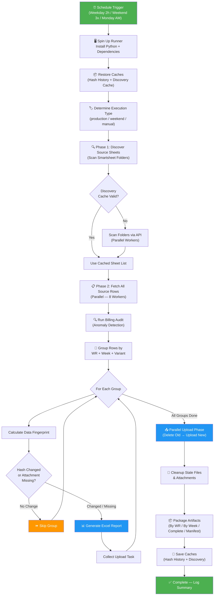
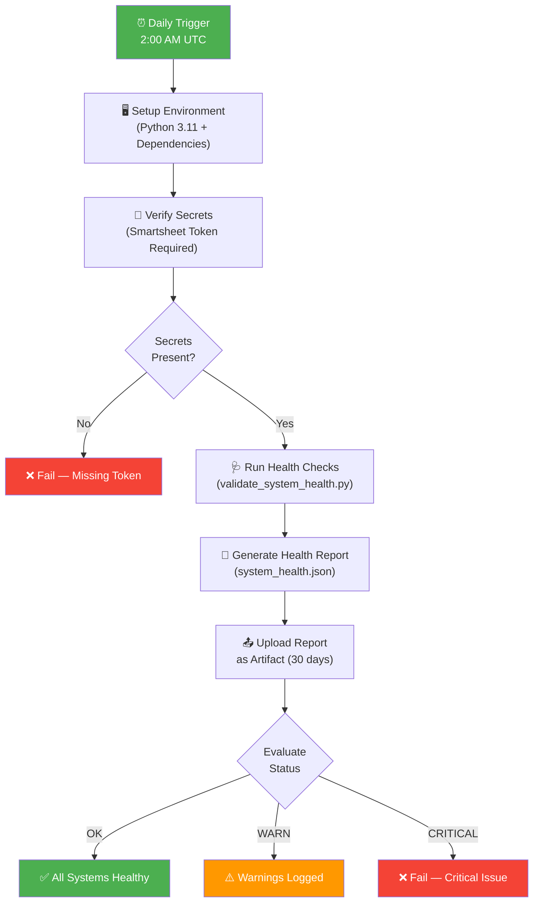
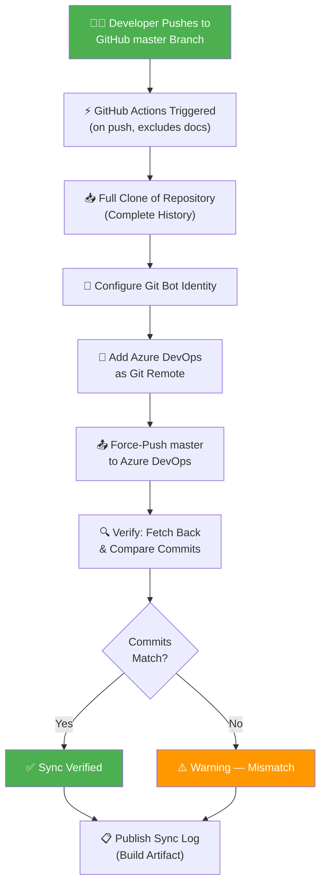
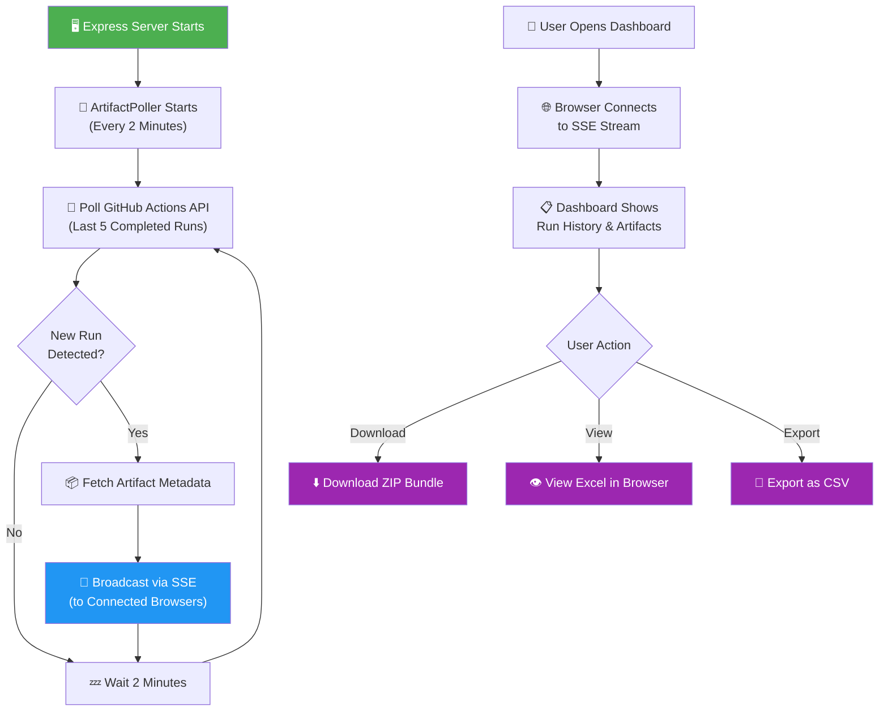
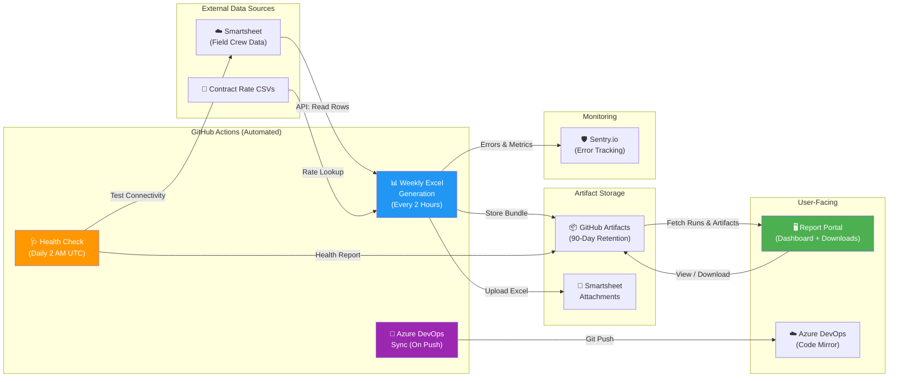

# Sync Job Run Logs

> **Last Updated:** April 2, 2026
> **Repository:** `Generate-Weekly-PDFs-DSR-Resiliency`
> **Maintainer:** Linetec Services Engineering

This document provides plain-English explanations and visual diagrams for every automated sync job in this repository. It is designed for non-technical stakeholders who need to understand what each job does, when it runs, what it produces, and what happens when something goes wrong.

---

## Table of Contents

1. [Weekly Excel Report Generation](#1-weekly-excel-report-generation)
2. [System Health Check](#2-system-health-check)
3. [GitHub → Azure DevOps Code Sync](#3-github--azure-devops-code-sync)
4. [Report Portal — Run Observer](#4-report-portal--run-observer)

---

## 1. Weekly Excel Report Generation

### Sync Job Name

`weekly-excel-generation` (GitHub Actions workflow + Python data pipeline)

### Primary Purpose

This is the main workhorse of the system. It automatically connects to Smartsheet (a cloud spreadsheet platform where field crews log their daily work), pulls billing data, generates formatted Excel reports for each Work Request and billing week, and uploads those reports back to Smartsheet as file attachments. The goal is to turn raw field data into polished, auditable billing documents — without any manual effort.

### How It Works (Step-by-Step)

1. **A timer kicks off the job.** GitHub Actions runs this job automatically on three schedules:
   - **Weekdays (Mon–Fri):** Every 2 hours between 8:00 AM and 8:00 PM Central Time (7 AM, 9 AM, 11 AM, 1 PM, 3 PM, 5 PM, 7 PM CT).
   - **Weekends (Sat–Sun):** Three times a day (10 AM, 2 PM, 6 PM CT) for maintenance coverage.
   - **Monday mornings:** A comprehensive run at midnight CT to start the week fresh.
   - The job can also be triggered manually through GitHub with custom options (test mode, debug logging, filters, etc.).

2. **The system sets up its environment.** A fresh virtual machine spins up, installs Python 3.12 and all required libraries, and restores two caches from previous runs:
   - **Hash History** — a record of which reports were generated last time and what data they contained, so unchanged reports can be skipped.
   - **Discovery Cache** — a saved list of which Smartsheet sheets contain relevant data, so the system doesn't have to re-scan every run.

3. **The execution type is determined.** The system figures out what kind of run this is: weekday production, weekend maintenance, Monday weekly comprehensive, or a manual trigger. This label is used for logging and artifact naming.

4. **Phase 1 — Discover source sheets.** The system connects to the Smartsheet API and scans specific folders (configured via folder IDs) to find all spreadsheets that contain billing data. It looks in two categories of folders:
   - **Subcontractor folders** — sheets with subcontractor pricing that may need rate adjustments.
   - **Original Contract folders** — sheets already at standard rates.
   If a valid discovery cache exists (less than 7 days old), it skips the scan and reuses the cached sheet list. This saves significant time.

5. **Phase 2 — Fetch all source data.** Using up to 8 parallel workers (threads), the system downloads every row of billing data from the discovered sheets. Each row represents a unit of work completed in the field (e.g., "Pole P-001, installed CU code ABC, quantity 3"). The system maps Smartsheet column IDs to human-readable field names and normalizes the data.

6. **Billing Audit runs.** Before generating reports, an audit system scans the data for anomalies — unusual price swings, missing fields, or suspicious patterns. The audit produces a risk level (OK, WARN, or CRITICAL) and logs any findings.

7. **Group the data.** Rows are organized into groups based on:
   - **Work Request number** (e.g., WR 90093002) — the contract or project identifier.
   - **Week Ending date** — the billing period (typically ending on Sunday).
   - **Variant** — "primary" (standard reports) or "helper" (per-foreman/department breakdowns).

8. **Change detection.** For each group, the system calculates a fingerprint (hash) of the data. It compares this fingerprint against the saved Hash History from the last run:
   - **If the data is identical AND the report attachment still exists on Smartsheet** → skip this group (no regeneration needed).
   - **If the data changed, the attachment is missing, or a force-regenerate flag is set** → proceed to generate a new Excel report.
   Extended change detection also tracks foreman assignments, department numbers, scope IDs, row counts, and aggregated totals — so even subtle changes trigger a refresh.

9. **Generate Excel reports.** For each group that needs updating, the system builds a branded Excel workbook containing:
   - A company logo header.
   - Summary information (WR number, week ending, foreman, scope).
   - A detailed line-item table with columns for date, CU code, description, quantity, unit price, and total price.
   - Proper number formatting, column widths, and professional styling.
   - For subcontractor sheets, prices are automatically reverted from subcontractor rates back to original contract rates using a CSV lookup table.
   
   Files are saved locally with a structured filename: `WR_{number}_WeekEnding_{MMDDYY}_{timestamp}_{hash}.xlsx`

10. **Upload to Smartsheet (parallel).** All generated files are uploaded back to Smartsheet as row-level attachments on a target sheet. Before uploading, old attachments for the same WR/week are deleted to prevent duplicates. Uploads run in parallel (up to 8 workers) for speed.

11. **Time budget safety.** If the job has been running for more than 80 minutes (of the 90-minute maximum), it stops processing new groups gracefully. Remaining groups will be picked up on the next scheduled run since hash history is preserved.

12. **Cleanup.** The system removes stale local files and untracked Smartsheet attachments that no longer correspond to any active group.

13. **Package artifacts for download.** All generated Excel files are organized and uploaded to GitHub's artifact storage in four bundles:
    - **Complete Bundle** — every report, plus the manifest and audit logs.
    - **By Work Request** — files sorted into per-WR folders.
    - **By Week Ending** — files sorted into per-week folders.
    - **Manifest** — a JSON index listing every file, its SHA-256 checksum, size, WR, and week ending.
    
    Production artifacts are retained for 90 days; test-mode artifacts for 30 days.

14. **Save caches.** The updated Hash History and Discovery Cache are saved so the next run can benefit from them — even if the job failed or timed out.

15. **Report completion.** A summary is written to the GitHub Actions log and the workflow's step summary page, showing how many files were generated, uploaded, skipped, or errored.

### Visual Logic Map

### Expected Outcomes & Error Handling

**Successful Run:**
- Excel files are generated for all Work Request groups that have new or changed data.
- Files are uploaded to Smartsheet as row-level attachments.
- Artifacts are stored in GitHub for 90 days.
- A JSON manifest provides a searchable index of all generated files.
- Hash History is updated so the next run can skip unchanged groups.

**Error Handling:**
- **Sentry Monitoring:** All errors are reported to Sentry.io in real time with rich context (WR number, phase, stack trace). Sentry Cron Monitors track whether the job ran on schedule and alert if it misses a window or fails repeatedly (2 consecutive failures trigger an issue).
- **Per-Group Resilience:** If one Work Request group fails, the system logs the error and continues processing the remaining groups. A single bad sheet doesn't bring down the entire run.
- **Time Budget:** If the job approaches the 90-minute GitHub Actions limit, it stops gracefully at the 80-minute mark to preserve caches and artifacts. Unfinished groups are automatically picked up on the next run.
- **Rate Limiting:** The Smartsheet API has a 300 requests/minute limit. The system uses 8 parallel workers (well within safe limits) and the SDK auto-retries on HTTP 429 (rate limit) responses with exponential backoff.
- **Cache Persistence:** Caches are saved even when the job fails or times out, preventing unnecessary rework on the next run.

---

## 2. System Health Check

### Sync Job Name

`system-health-check` (GitHub Actions workflow + Python validation script)

### Primary Purpose

This is a daily watchdog that verifies all external systems the billing pipeline depends on are reachable and functioning. It runs once per day to catch outages, expired API keys, or configuration problems before the main Excel generation job runs into them.

### How It Works (Step-by-Step)

1. **Daily 2:00 AM UTC trigger.** GitHub Actions launches this job every day at 2:00 AM UTC (automatically, with no human intervention). It can also be triggered manually at any time.

2. **Environment setup.** A virtual machine is provisioned with Python 3.11 and the project's dependencies.

3. **Secret verification.** Before running any checks, the system confirms that the critical secrets are available:
   - **SMARTSHEET_API_TOKEN** — required for connecting to Smartsheet. If missing, the job fails immediately.
   - **SENTRY_DSN** — optional, but logged if absent so operators know error monitoring is offline.

4. **Run health checks.** The Python script `validate_system_health.py` connects to each external service and validates:
   - Smartsheet API connectivity and authentication.
   - Whether target sheets and folders are accessible.
   - Any other service dependencies (e.g., Sentry connectivity).
   Results are compiled into a JSON report.

5. **Upload health report.** The report (`system_health.json`) is saved as a GitHub Actions artifact, retained for 30 days.

6. **Evaluate status.** The workflow reads the report's `overall_status` field:
   - **OK** → All systems healthy. Green check mark.
   - **WARN** → Some non-critical issues detected (e.g., slow response times). Yellow warning.
   - **CRITICAL** → A vital dependency is unreachable or misconfigured. Red failure — the workflow exits with an error code to make the failure visible in GitHub.

### Visual Logic Map

### Expected Outcomes & Error Handling

**Successful Run:**
- A `system_health.json` artifact is produced with the status of each checked service.
- The overall status is OK or WARN, and the workflow completes with a green check.

**Error Handling:**
- **CRITICAL status:** The workflow exits with a non-zero code, making the failure visible in GitHub's Actions tab. Team members watching the repository (or using GitHub notification settings) will be alerted.
- **Missing secrets:** If `SMARTSHEET_API_TOKEN` is not configured, the job fails immediately with a clear error message before attempting any API calls.
- **Script failure:** If the health check script itself crashes, the workflow still uploads whatever partial report exists (using the `if: always()` condition) so there's some diagnostic data available.

---

## 3. GitHub → Azure DevOps Code Sync

### Sync Job Name

`Sync-GitHub-to-Azure-DevOps` (GitHub Actions workflow + Azure Pipeline)

### Primary Purpose

This job keeps a mirror copy of the codebase in Azure DevOps automatically synchronized with the GitHub repository. GitHub is the authoritative source of truth for all code. Whenever a developer pushes changes to the `master` branch on GitHub, this job automatically copies those changes to Azure DevOps so that teams using Azure DevOps have an up-to-date version of the code.

### How It Works (Step-by-Step)

**GitHub-Hosted Workflow (`.github/workflows/azure-pipelines.yml`):**

1. **Trigger on push to master.** Whenever code is pushed to the `master` branch on GitHub (excluding README and `.github/` changes), this workflow activates.

2. **Full repository checkout.** The runner clones the entire repository with full commit history (not a shallow clone). This ensures all commits, tags, and references are available for an accurate mirror.

3. **Configure Git identity.** Git is set up with a bot identity ("Azure Pipeline Sync Bot") so all mirrored operations are clearly labeled.

4. **Add Azure DevOps as a remote.** The Azure DevOps repository URL is added as a second Git remote called `azure-devops`. The URL comes from a pipeline variable (`AzureDevOpsRepoUrl`).

5. **Force-push to Azure DevOps.** The current HEAD of the `master` branch is pushed to Azure DevOps using `--force`, with authentication via an OAuth bearer token (`System.AccessToken`).

6. **Verify the sync.** The workflow fetches back from Azure DevOps and compares commit hashes. If the GitHub and Azure DevOps commits match, the sync is confirmed successful.

7. **Publish sync log.** The Git reflog is saved as a build artifact (`sync-log`) for auditing.

**Azure Pipeline (`azure-pipelines.yml`):**

This is a complementary pipeline running on the Azure side. It uses a Personal Access Token (PAT) and `--force-with-lease` (a safer alternative to `--force` that prevents overwriting concurrent changes) to mirror the `master` branch. It includes safeguards:
- Skips gracefully if the PAT is not configured.
- Converts shallow clones to full clones automatically.
- Fetches the current Azure state before pushing (lease-based safety).

### Visual Logic Map

### Expected Outcomes & Error Handling

**Successful Run:**
- The Azure DevOps repository's `master` branch is an exact copy of GitHub's `master` branch.
- A sync log artifact is published for audit trail purposes.

**Error Handling:**
- **Commit mismatch:** If the verification step finds that Azure DevOps and GitHub commits don't match, the workflow exits with an error. This could indicate the push was blocked by a branch policy or another concurrent change.
- **Missing configuration:** If `AzureDevOpsRepoUrl` is not set, the Azure-hosted pipeline skips gracefully with a clear message. On the GitHub side, the pipeline variable must be configured or the push step will fail.
- **PAT expiration:** If the Azure PAT has expired, the push will fail with an authentication error. The Azure pipeline includes a guard that skips all steps if the PAT is empty or unreplaced.
- **Force-with-lease safety:** The Azure pipeline uses `--force-with-lease` instead of `--force`, which prevents accidentally overwriting changes that were pushed to Azure DevOps from another source.

---

## 4. Report Portal — Run Observer

### Sync Job Name

`report-portal` (Node.js Express server with artifact polling)

### Primary Purpose

The Report Portal is not a data-generating sync job itself — it is the **observation and delivery layer**. It provides a web dashboard where team members can see the status of the most recent Excel generation runs, browse generated reports, and download or view them. It watches GitHub Actions for new completed runs and pushes real-time updates to anyone viewing the dashboard.

### How It Works (Step-by-Step)

1. **Server starts and begins polling.** When the Express server boots up, it starts an `ArtifactPoller` that checks the GitHub Actions API every 2 minutes (configurable) for new completed runs of the `weekly-excel-generation` workflow.

2. **Poll cycle.** Each poll:
   - Calls the GitHub API to list the 5 most recent completed workflow runs.
   - Compares the latest run ID against the last known run ID.
   - If a new run is detected and there are active dashboard users connected, it fetches the run's artifacts (file metadata) and broadcasts a real-time notification.

3. **Real-time push via SSE.** The portal uses Server-Sent Events (SSE) — a one-way live connection from the server to each browser tab. When a new run is detected, all connected browsers instantly receive a notification with the run details and artifact list. No manual refresh needed.

4. **Dashboard API.** The portal exposes a REST API (behind authentication middleware) that allows the dashboard to:
   - **List runs** (`GET /api/runs`) — paginated list of past workflow runs with status, conclusion, timestamps.
   - **List artifacts** (`GET /api/runs/:runId/artifacts`) — see what files a specific run produced.
   - **Download artifacts** (`GET /api/artifacts/:artifactId/download`) — download the raw ZIP bundle.
   - **View Excel in-browser** (`GET /api/artifacts/:artifactId/view`) — parse and render Excel contents as JSON for a web viewer.
   - **Export as CSV** (`GET /api/artifacts/:artifactId/export?format=csv`) — convert an Excel file to CSV format.
   - **List files in artifact** (`GET /api/artifacts/:artifactId/files`) — browse the contents of a ZIP artifact.
   - **Get latest run** (`GET /api/latest`) — quick access to the most recent run and its artifacts.
   - **Poller status** (`GET /api/poller-status`) — check if the background poller is running, when it last polled, and how many users are connected.

5. **Portal v2 (React).** A modern React-based frontend (`portal-v2/`) is being developed with Supabase authentication, Framer Motion animations, and a Tailwind-styled UI. It proxies API calls to the same Express backend and adds features like activity logging and user profiles.

### Visual Logic Map

### Expected Outcomes & Error Handling

**Successful Operation:**
- The dashboard shows real-time status of all recent Excel generation runs.
- Users can download, view, and export reports without needing direct GitHub access.
- New runs appear automatically in connected browsers within 2 minutes.

**Error Handling:**
- **GitHub API errors:** If the poll fails (e.g., rate limit, network issue), the error is logged to the console and the poller continues on its next interval. It does not crash the server.
- **Missing GitHub token:** The portal works with or without a `GITHUB_TOKEN`, but unauthenticated requests have a lower rate limit (60/hour vs. 5,000/hour).
- **Client disconnection:** When a browser tab is closed, the SSE connection is cleaned up automatically. The poller tracks connected clients and only fetches full artifact details when someone is actually listening.
- **Download/parse failures:** Each API endpoint has try-catch error handling that returns a `502` status with a descriptive error message, preventing server crashes.

---

## System Architecture Overview

The following diagram shows how all four sync jobs relate to each other and to the external systems they interact with:

---

## Glossary

| Term | Meaning |
|------|---------|
| **Work Request (WR)** | A numbered project or contract under which field work is performed. Each WR gets its own set of billing reports. |
| **Week Ending** | The last day (typically Sunday) of a billing period. Reports are grouped by this date. |
| **CU (Compatible Unit)** | A standardized code that identifies a type of work (e.g., installing a specific piece of equipment). Each CU has a fixed price. |
| **Hash / Fingerprint** | A short code calculated from the data. If the data doesn't change, the hash stays the same — allowing the system to skip regenerating identical reports. |
| **Artifact** | A file or bundle of files produced by a workflow run, stored in GitHub's cloud for later download. |
| **SSE (Server-Sent Events)** | A web technology that lets the server push updates to the browser in real time, without the browser having to repeatedly ask for updates. |
| **Sentry** | A third-party error monitoring service that receives and organizes error reports, performance data, and scheduled job check-ins. |
| **Helper Variant** | A secondary report format that breaks down a Work Request's data by individual foreman, department, and job — useful for granular billing review. |
| **Discovery Cache** | A saved list of which Smartsheet sheets contain relevant data. Valid for 7 days, after which a fresh scan is performed. |
| **Hash History** | A JSON file mapping each WR+Week+Variant combination to the data fingerprint from the last generation. Used to skip unchanged groups. |
