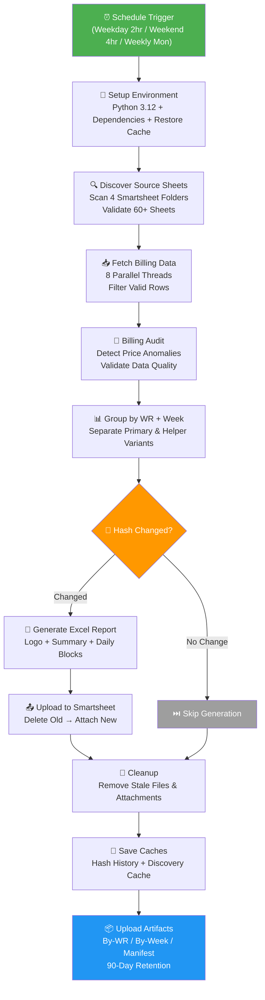
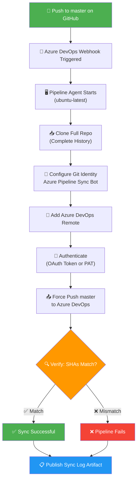
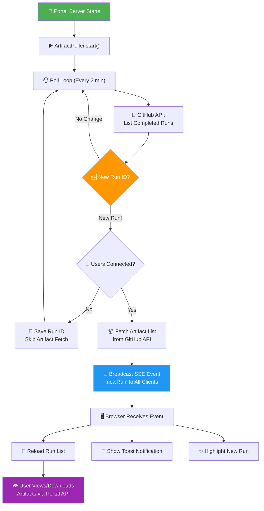
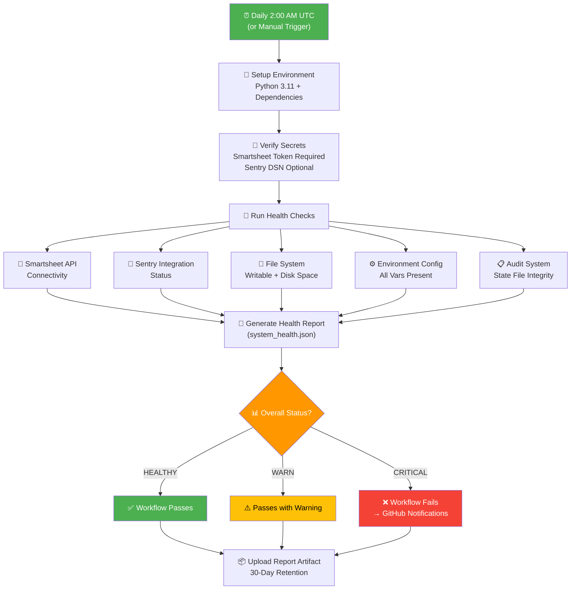
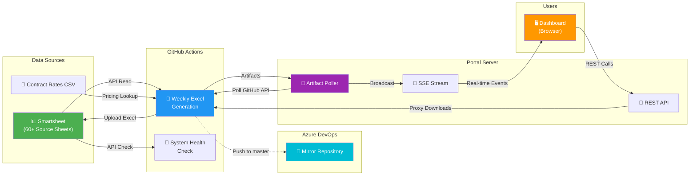

# Sync Job Run Logs

> **Last Updated:** April 3, 2026
> **Repository:** Generate-Weekly-PDFs-DSR-Resiliency
>
> This document provides plain-English Run Logs for every automated sync job in this repository. Each section explains *what* the job does, *how* it works step-by-step, a visual logic map, and what happens on success or failure.

---

## Table of Contents

1. [Weekly Excel Generation](#1-weekly-excel-generation)
2. [GitHub → Azure DevOps Repository Mirror](#2-github--azure-devops-repository-mirror)
3. [Portal Artifact Poller (Real-Time Dashboard Sync)](#3-portal-artifact-poller-real-time-dashboard-sync)
4. [System Health Check](#4-system-health-check)

---

## 1. Weekly Excel Generation

### Sync Job Name

`weekly-excel-generation.yml` — Weekly Billing Excel Report Generator

### Primary Purpose

This job automatically pulls billing data from dozens of Smartsheet spreadsheets, organizes it by Work Request and week, generates professional Excel reports, and uploads them back to Smartsheet as attachments. It ensures that billing teams always have up-to-date, formatted Excel reports without any manual spreadsheet work. The system is smart enough to skip reports that haven't changed, saving time and API calls.

### How It Works (Step-by-Step)

1. **The job starts on a schedule.** It runs automatically every two hours on weekdays, every four hours on weekends, and once weekly on Monday at midnight for a comprehensive pass. It can also be triggered manually with custom options (test mode, force regeneration, debug logging, etc.).

2. **The environment is prepared.** GitHub Actions provisions a fresh Linux machine, installs Python 3.12, restores cached data from previous runs (change history and sheet discovery cache), and installs all required libraries.

3. **Source sheets are discovered.** The system scans four Smartsheet folders and validates roughly 60+ individual spreadsheets. It maps each sheet's column names (handling dozens of naming variations) to a standard internal format. Valid sheets must have a "Weekly Reference Logged Date" column. Discovery results are cached for 7 days to avoid repeating this expensive step.

4. **Billing data is fetched in parallel.** Using 8 simultaneous threads, the system reads rows from every validated sheet. Each row must meet strict criteria to be included: it needs a Work Request number, a logged date, must be marked as "units completed," and must have a positive dollar amount. Rows are also checked for "helper foreman" assignments, which get tracked separately.

5. **A billing audit runs.** The system checks the fetched data for anomalies — prices that vary more than 50% from the average for that Work Request, missing required fields, negative prices, or invalid quantities. If the risk level is HIGH, an alert is sent to Sentry (the error monitoring service).

6. **Data is grouped.** Rows are organized into groups by Work Request number and week-ending date. In the default mode, both "primary" and "helper" variants are generated — helper foremen get their own separate reports. Filters can include or exclude specific Work Requests.

7. **Change detection decides what to regenerate.** For each group, the system computes a digital fingerprint (SHA-256 hash) of the data across 16+ fields. If this fingerprint matches the one from the last run AND the report is already attached to Smartsheet, generation is skipped. This avoids wasting time rebuilding unchanged reports.

8. **Excel reports are generated.** For each group that needs updating, a formatted Excel workbook is created containing: the company logo, a report summary (total billed, line items, billing period), report details (foreman, work request, scope, customer), and daily data blocks showing each day's billable units, codes, descriptions, and pricing with daily totals.

9. **Reports are uploaded to Smartsheet.** Old versions of the same report are deleted from the target Smartsheet, and the new Excel file is attached to the corresponding row. Uploads run in parallel for speed.

10. **Cleanup and caching.** Stale local files and outdated Smartsheet attachments are removed. The change-detection history and discovery cache are saved back to GitHub Actions cache for the next run.

11. **Artifacts are preserved.** All generated Excel files are organized by Work Request and by week, a JSON manifest with file checksums is created, and everything is uploaded as GitHub Actions artifacts (retained for 90 days in production, 30 days in test mode).

### Visual Logic Map

### Expected Outcomes & Error Handling

**Successful Run:**
- New or changed billing data produces updated Excel reports attached to the target Smartsheet.
- Unchanged data is skipped (hash match), saving processing time.
- GitHub Actions artifacts contain all generated files with a checksummed manifest.
- Sentry receives a "check-in OK" notification confirming the run completed.

**Error Handling:**
- **Per-sheet errors** are caught and logged — one failing sheet does not stop the entire job.
- **Per-group errors** are similarly isolated — one bad Work Request won't block others.
- **Time budget** (80 minutes) stops processing gracefully before GitHub's hard timeout (90 minutes), ensuring caches are always saved.
- **Sentry integration** captures all exceptions with full context, custom fingerprinting, and breadcrumb trails. HIGH-risk audit findings trigger Sentry alerts.
- **Caches are saved unconditionally** (even on failure) so the next run has the latest state.
- **Smartsheet 404 errors** during cleanup are automatically filtered out of Sentry to reduce noise.

---

## 2. GitHub → Azure DevOps Repository Mirror

### Sync Job Name

`azure-pipelines.yml` — GitHub to Azure DevOps Code Mirror

### Primary Purpose

This job keeps a copy of the repository in Azure DevOps perfectly in sync with the GitHub version. Every time code is pushed to the `master` branch on GitHub, this pipeline automatically mirrors that exact code (including full history) to Azure DevOps. This ensures teams using Azure DevOps always see the same codebase as GitHub, enabling cross-platform CI/CD and redundancy.

### How It Works (Step-by-Step)

1. **A push to `master` triggers the pipeline.** Whenever code is merged or pushed to the `master` branch on GitHub, Azure DevOps detects the change and starts this pipeline. Changes only to `README.md` or the `.github/` folder are excluded (they don't trigger a sync).

2. **The full repository is cloned.** The pipeline agent checks out the entire GitHub repository with complete commit history (not a shallow clone). This ensures the mirror gets every commit, tag, and branch reference.

3. **Git identity is configured.** The agent sets itself up as "Azure Pipeline Sync Bot" so that any mirror-related git operations are clearly attributed.

4. **The Azure DevOps remote is added.** The agent registers the Azure DevOps repository URL as a secondary git remote called `azure-devops`.

5. **The code is pushed to Azure DevOps.** Using an authentication token (either an auto-generated OAuth token or a Personal Access Token), the agent force-pushes the `master` branch to Azure DevOps. This overwrites the Azure copy with the exact GitHub state.

6. **The sync is verified.** The agent fetches back from Azure DevOps and compares the commit SHA (a unique identifier for the exact state of the code). If the SHA on Azure DevOps matches GitHub, the sync was successful. If they differ, the pipeline fails.

7. **A sync log is published.** Regardless of success or failure, the git log is saved as a build artifact for debugging and auditing.

### Visual Logic Map

### Expected Outcomes & Error Handling

**Successful Run:**
- Azure DevOps `master` branch has the identical commit history and HEAD as GitHub's `master`.
- Verification step confirms SHA match.
- Sync log artifact is published for audit trail.

**Error Handling:**
- **Missing configuration:** If the Azure DevOps repo URL is not set, the pipeline fails immediately with a diagnostic message.
- **Authentication failure:** Rejected pushes (401/403) cause immediate pipeline failure.
- **SHA mismatch:** If the verification step detects different commits on GitHub vs Azure DevOps, the pipeline fails — indicating a partial or corrupted sync.
- **Sync log always published:** Even on failure, the git log artifact is available for post-mortem analysis.
- **Alerting:** Relies on Azure DevOps' built-in notification system (email on pipeline failure). No external Slack or PagerDuty integration.

> **Note:** There are two pipeline definitions in the repo — the primary one (`.github/workflows/azure-pipelines.yml`) uses OAuth and includes verification; an alternative (`azure-pipelines.yml` at root) uses a Personal Access Token with safer `--force-with-lease` push but has no verification step.

---

## 3. Portal Artifact Poller (Real-Time Dashboard Sync)

### Sync Job Name

`ArtifactPoller` — Report Portal Real-Time Dashboard Sync

### Primary Purpose

This background service continuously monitors GitHub Actions for newly completed Excel report generation runs. When a new run finishes, it instantly notifies all connected dashboard users in real-time, so they can view and download the latest billing reports without refreshing their browser or waiting for updates. It bridges the gap between the automated Excel generation (which runs on GitHub) and the human-facing web portal.

### How It Works (Step-by-Step)

1. **The poller starts with the server.** When the Express.js portal server boots, it automatically starts a background polling loop (unless disabled via configuration). The default polling interval is every 2 minutes.

2. **Every 2 minutes, it checks GitHub.** The poller calls the GitHub REST API to fetch the 5 most recent completed runs of the `weekly-excel-generation.yml` workflow. It uses a secure Bearer token for authentication.

3. **It compares against the last known run.** The poller keeps track of the most recently seen Run ID. If the latest run from GitHub has a different ID, a new run has completed since the last check.

4. **If a new run is found (and users are connected), artifacts are fetched.** The poller retrieves the list of artifacts (Excel files, manifests) associated with the new run from GitHub. It only does this if at least one user has the dashboard open — saving unnecessary API calls when nobody is watching.

5. **A real-time notification is broadcast.** Using Server-Sent Events (SSE), the poller pushes a `newRun` event to every connected browser. This event includes the run details, artifact list, and a timestamp. The browser receives this instantly — no page refresh needed.

6. **The dashboard updates automatically.** When the browser receives the SSE event, it immediately reloads the run list, shows a toast notification ("New run detected!"), and highlights the new run with a "NEW" badge for 15 seconds.

7. **Users can browse and download artifacts.** Through the portal API, users can list artifacts, view Excel files in-browser (with full formatting and styles), download ZIP archives, or export to CSV — all proxied through the server with authentication.

8. **Keepalive and reconnection.** The SSE connection sends a keepalive comment every 30 seconds to prevent proxy timeouts. If the connection drops, the browser automatically reconnects after 5 seconds.

### Visual Logic Map

### Expected Outcomes & Error Handling

**Successful Run:**
- Dashboard users see new Excel report runs within 2 minutes of completion.
- Real-time toast notifications appear without page refresh.
- Artifact viewing, download, and export all function through the authenticated portal.

**Error Handling:**
- **Polling errors are isolated.** If a single poll fails (network issue, GitHub rate limit), the error is logged and stored in `lastError`. The polling loop continues on the next interval — it never crashes.
- **SSE reconnection.** If the browser loses connection, it automatically reconnects after 5 seconds with visual indicator (red/green dot).
- **Failed SSE clients are pruned.** If writing to a client's SSE stream throws an error, that client is silently removed from the broadcast list.
- **Rate limiting.** The portal applies rate limiting (100 requests per 15 minutes per client) to protect the server. The 2-minute poll interval keeps GitHub API usage well under the 5,000/hour limit.
- **Authentication required.** All API routes require an active session. Unauthenticated requests receive a 401 error.
- **Path traversal protection.** Artifact file downloads sanitize filenames to prevent directory traversal attacks.
- **Diagnostic endpoint.** `GET /api/poller-status` returns the poller's health: running state, last poll time, last error, connected client count, and interval.

---

## 4. System Health Check

### Sync Job Name

`system-health-check.yml` — Daily System Health Monitor

### Primary Purpose

This job is designed to run daily automated health checks on all critical systems — Smartsheet API connectivity, Sentry monitoring integration, file system integrity, and environment configuration. It acts as an early warning system: if any component degrades or fails, the team is alerted before it impacts the billing generation process.

### How It Works (Step-by-Step)

1. **The job runs daily at 2:00 AM UTC.** It can also be triggered manually at any time through GitHub Actions.

2. **The environment is prepared.** A fresh Linux machine is provisioned with Python 3.11, dependencies are installed, and secrets (Smartsheet API token, optional Sentry DSN) are verified.

3. **Health checks are executed.** The script is intended to validate:
   - **Smartsheet API:** Can we authenticate and reach the API?
   - **Sentry Integration:** Is error monitoring active?
   - **File System:** Is the output directory writable? Is there sufficient disk space?
   - **Environment Configuration:** Are all required environment variables present and valid?
   - **Audit System:** Is the audit state file intact?
   - **Performance Metrics:** Are API response times within acceptable limits?

4. **A health report is generated.** Results are written to `generated_docs/system_health.json` with an overall status of HEALTHY, WARN, or CRITICAL.

5. **The report is evaluated.** The workflow reads the JSON report and:
   - **CRITICAL** → the workflow fails, triggering GitHub notifications
   - **WARN** → the workflow passes but logs a warning
   - **HEALTHY** → the workflow passes normally

6. **The report is preserved.** The health report JSON is uploaded as a GitHub Actions artifact (retained for 30 days) for historical trending.

### Visual Logic Map

### Expected Outcomes & Error Handling

**Successful Run:**
- All systems report HEALTHY status.
- `system_health.json` artifact confirms clean bill of health.
- No notifications triggered.

**Error Handling:**
- **CRITICAL failures** (Smartsheet unreachable, filesystem broken) cause the workflow to fail, which triggers GitHub's built-in notification system (email to repo watchers).
- **WARN-level issues** (Sentry offline, slow API responses) are logged but don't fail the workflow, allowing the team to address them proactively.
- **Missing secrets** cause immediate failure at the verification step, before any checks run.
- **Report always uploaded:** Even on failure, the health report artifact is published for diagnostics.

> **Important Note:** As of this writing, the `validate_system_health.py` script referenced by the workflow does not exist in the repository. The workflow YAML and a design specification (in `.github/prompts/error-handling-resilience.md`) are in place, but the implementation script has not yet been created. This means the daily health check is currently failing on every scheduled run. This should be prioritized for implementation.

---

## Appendix: System Architecture Overview

### Technology Stack Summary

| Component | Technology |
|---|---|
| Excel Generation | Python 3.12, openpyxl, pandas, Smartsheet SDK |
| Error Monitoring | Sentry SDK |
| CI/CD | GitHub Actions, Azure Pipelines |
| Portal Backend | Node.js, Express.js |
| Portal Frontend (v1) | Vanilla React via htm/UMD |
| Portal Frontend (v2) | Vite, React 18, TypeScript, Tailwind CSS |
| Database | Supabase (Postgres) for portal v2 |
| Authentication | Session-based (portal), Supabase Auth (v2) |
| Real-time Updates | Server-Sent Events (SSE) |

### Environment Variables Quick Reference

| Variable | Used By | Required |
|---|---|---|
| `SMARTSHEET_API_TOKEN` | Excel Generation, Health Check | Yes |
| `SENTRY_DSN` | Excel Generation, Health Check | No |
| `TARGET_SHEET_ID` | Excel Generation | Yes (has default) |
| `GITHUB_TOKEN` | Portal Poller | Yes |
| `GITHUB_OWNER` / `GITHUB_REPO` | Portal Poller | Yes (has defaults) |
| `POLL_INTERVAL_MS` | Portal Poller | No (default: 2 min) |
| `AzureDevOpsRepoUrl` | Azure Mirror | Yes |
| `AZDO_PAT` | Azure Mirror (alt) | Conditional |
