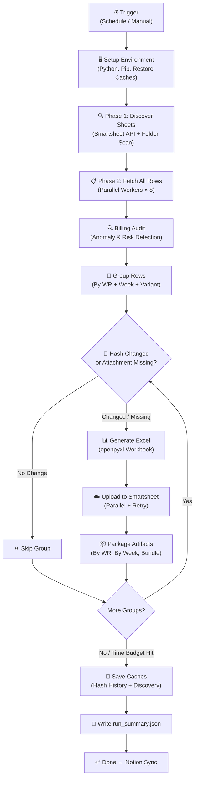
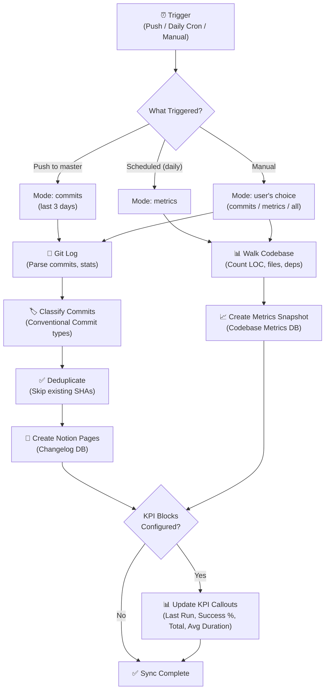
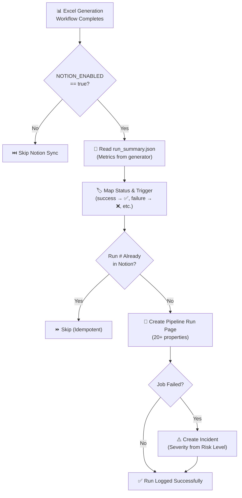
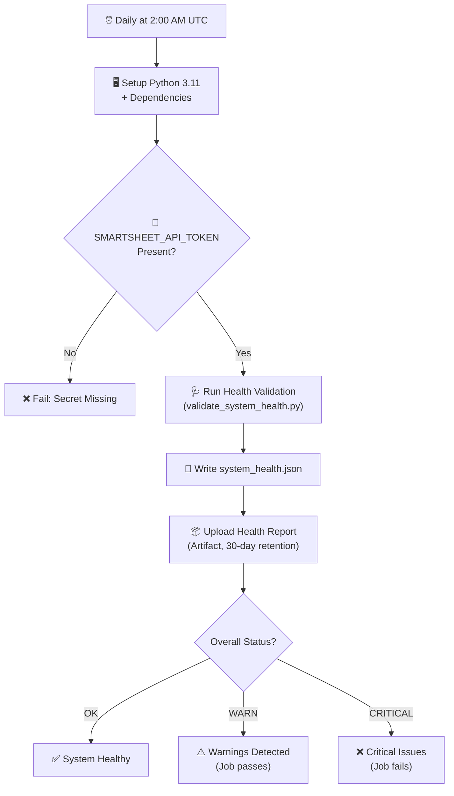
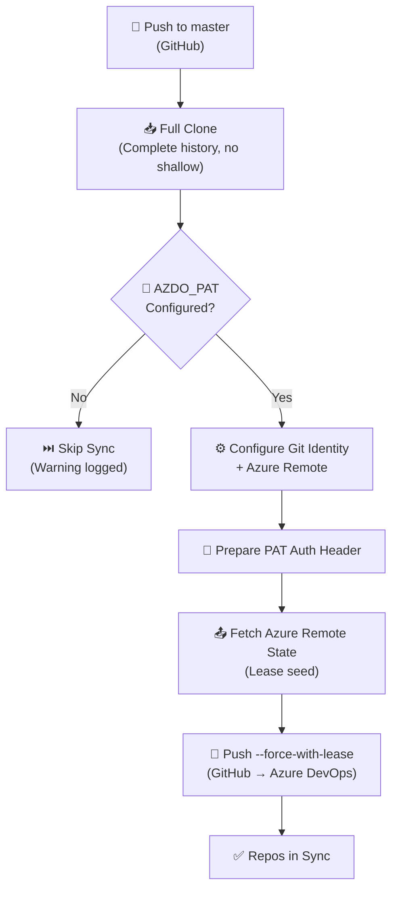
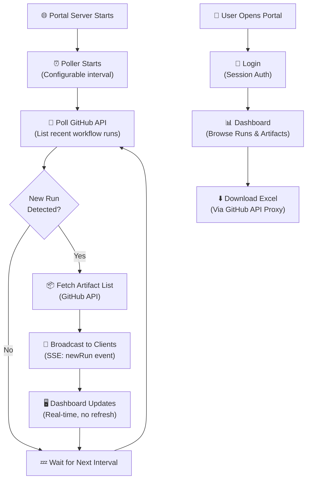
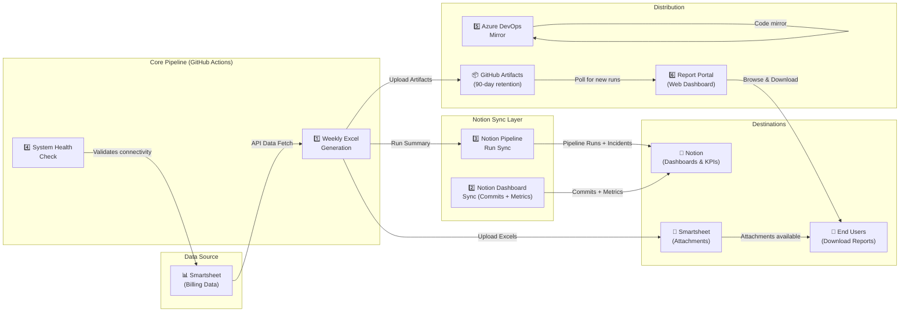

# Sync Job Run Logs

> **Generated:** 2026-04-11  
> **Repository:** Generate-Weekly-PDFs-DSR-Resiliency  
> **Purpose:** Non-technical documentation of every automated sync job in this repository, explaining what each job does, how it works, and what to expect when it runs.

---

## Table of Contents

1. [Weekly Excel Report Generation](#1-weekly-excel-report-generation)
2. [Notion Dashboard Sync](#2-notion-dashboard-sync)
3. [Notion Pipeline Run Sync (Post-Generation)](#3-notion-pipeline-run-sync-post-generation)
4. [System Health Check](#4-system-health-check)
5. [GitHub → Azure DevOps Repository Mirror](#5-github--azure-devops-repository-mirror)
6. [Report Portal Artifact Poller](#6-report-portal-artifact-poller)

---

## 1. Weekly Excel Report Generation

**Sync Job Name:** `weekly-excel-generation.yml` / `generate_weekly_pdfs.py`

### Primary Purpose

This is the core production job of the entire repository. It automatically pulls billing data from Smartsheet (the company's project-tracking spreadsheet platform), processes thousands of rows of work-order records, and generates formatted Excel reports broken down by **Work Request number** and **billing week**. These reports are then uploaded back to Smartsheet as attachments and preserved as downloadable artifacts in GitHub. This job is critical because it automates what would otherwise be hours of manual Excel preparation for weekly billing reviews.

### How It Works (Step-by-Step)

1. **Trigger:** The job runs automatically on a recurring schedule — every 2 hours during weekdays (Mon–Fri), every 4 hours on weekends, and a comprehensive weekly run on Monday mornings. It can also be started manually from the GitHub Actions interface with customizable options (test mode, debug logging, force regeneration, etc.).

2. **Environment Setup:** A fresh virtual machine (Ubuntu) is spun up in GitHub's cloud. Python 3.12 is installed, along with all required libraries (Smartsheet SDK, openpyxl for Excel, Sentry for error monitoring, etc.). Previous caches — the "hash history" (a record of what was already generated) and the "discovery cache" (a map of known Smartsheet sheets) — are restored from prior runs to avoid redundant work.

3. **Execution Type Detection:** The job figures out *what kind of run* this is based on the current day and time: a frequent production check, a weekend maintenance pass, a comprehensive weekly run, or a manual trigger. This classification affects logging and reporting but not the core logic.

4. **Phase 1 — Sheet Discovery:** The system connects to Smartsheet using an API key and discovers all relevant billing source sheets. It looks inside designated Smartsheet folders (subcontractor folders and original-contract folders) and also checks a hardcoded list of known sheet IDs. Results are cached locally so future runs can skip this step when nothing has changed (cache lasts 7 days by default).

5. **Phase 2 — Data Fetch:** All rows from every discovered source sheet are downloaded in parallel (using up to 8 concurrent workers). Each row represents a billing line item containing fields like Work Request #, Week Ending date, price, quantity, CU code, foreman name, and more. Column names are matched using a synonym dictionary (e.g., "Units Total Price" might appear as "Unit Price" in some sheets).

6. **Billing Audit:** Before generating reports, the data is run through an audit system that checks for financial anomalies — duplicate charges, suspicious price changes, missing fields, etc. The audit assigns a risk level (Low, Medium, High, or Critical) that is recorded for compliance tracking.

7. **Data Grouping:** The fetched rows are grouped into logical report units. Each group represents one Work Request + one billing week. The system also creates **helper file** variants (when a helper foreman is assigned to a work request) and **VAC Crew** variants (when vacuum crew assistance is flagged on specific rows). This means a single Work Request in a single week can produce multiple Excel files — one primary, one per helper foreman, and one for VAC crew activity.

8. **Change Detection (Hash Check):** For each group, the system computes a "fingerprint" (SHA-256 hash) of the data content. It compares this fingerprint against the stored history from prior runs. If the data hasn't changed *and* the corresponding Excel attachment still exists in Smartsheet, the group is **skipped** — saving time by not regenerating identical reports. If data has changed, or the attachment is missing, the report is regenerated.

9. **Excel Generation:** For each group that needs processing, a formatted Excel workbook is created using the `openpyxl` library. The Excel file includes a company logo, a summary header with the Work Request number and week-ending date, and a detailed table of every billing line item (CU code, description, quantity, unit price, total, work type, pole number, etc.). Subcontractor prices are automatically reverted to original contract rates when applicable. The filename follows a structured pattern: `WR_{number}_WeekEnding_{MMDDYY}_{timestamp}_{hash}.xlsx`.

10. **Upload to Smartsheet:** Generated Excel files are uploaded as attachments to the corresponding Work Request row on a designated Smartsheet target sheet. Old attachments for the same week/variant are deleted first to avoid duplicates. Uploads run in parallel batches for performance, with automatic retry logic for rate-limiting and transient network errors.

11. **Artifact Preservation:** All generated Excel files are packaged and uploaded to GitHub Actions as downloadable artifacts, organized three ways: (a) a complete bundle, (b) grouped by Work Request number, and (c) grouped by week-ending date. A JSON manifest is generated containing SHA-256 checksums for every file, enabling integrity verification. Artifacts are retained for 90 days (or 30 days in test mode).

12. **Cache Save:** The updated hash history and discovery cache are saved back to GitHub's cache storage so the next run can benefit from them. This step runs even if the job fails or times out, ensuring progress is never lost.

13. **Time Budget:** If the job runs for longer than 80 minutes, it gracefully stops processing new groups (leaving them for the next scheduled run) so the remaining 10 minutes can be used for artifact uploads and cache saving, preventing GitHub from hard-killing the process.

14. **Run Summary:** A `run_summary.json` file is written with statistics from the session — files generated, groups skipped, errors encountered, duration, API calls made, and audit risk level. This file is consumed by the Notion sync step that follows.

### Visual Logic Map

### Expected Outcomes & Error Handling

- **Successful Run:** All eligible groups are processed, Excel files are generated and uploaded, artifacts are preserved, and the run summary shows zero errors. The hash history is updated so future identical data is skipped.
- **Partial Success (Time Budget):** If the 80-minute budget is exceeded, remaining groups are deferred to the next scheduled run. Processed groups and their caches are still saved. This is normal behavior for large datasets.
- **Failure Modes:**
  - *Missing API Token:* The job fails immediately with a clear error message. Sentry captures the event.
  - *Smartsheet Rate Limiting:* Automatic exponential backoff retries (up to 4 attempts). If all retries fail, the individual group is marked as errored and the job continues with the next group.
  - *Network Errors:* Transient disconnects trigger retries. Persistent failures are logged to Sentry with full context.
  - *Data Errors:* Invalid rows are filtered out during grouping. Groups with zero valid rows are skipped.
- **Alerts:** All errors are sent to **Sentry.io** with rich context (error type, stack trace, session state, configuration). Sentry cron monitoring detects missed runs. Failed runs also trigger an incident record in Notion (see Sync Job #3).

---

## 2. Notion Dashboard Sync

**Sync Job Name:** `notion-sync.yml` / `scripts/notion_sync.py`

### Primary Purpose

This job keeps a Notion-based project dashboard up to date by automatically pushing two types of data: **recent code changes** (git commits) and **codebase health metrics** (lines of code, test files, dependency counts, etc.). It runs independently of the Excel generation job and provides the development team with a living changelog and code health snapshot — all visible in Notion without needing to visit GitHub.

### How It Works (Step-by-Step)

1. **Trigger:** Runs on three occasions: (a) automatically after every push to the `master` branch (syncs recent commits), (b) daily at 6:00 AM Central Time via scheduled cron (syncs metrics), and (c) manually via the GitHub Actions UI with customizable mode and lookback window.

2. **Mode Selection:** Based on the trigger event, the system selects a sync mode:
   - **Push to master →** Sync the last 3 days of commits only.
   - **Daily schedule →** Sync a codebase metrics snapshot only.
   - **Manual →** User chooses: `commits`, `metrics`, or `all`.

3. **Commits Sync (when applicable):**
   - The job runs `git log` to retrieve recent commits within the lookback window (default: 7 days, 3 for push events).
   - Each commit is parsed to extract: SHA, message, author, date, files changed, lines added, and lines deleted.
   - Commit messages are classified using **conventional commit** patterns (e.g., `feat:` → Feature, `fix:` → Bug Fix, `refactor:` → Refactor). If no conventional pattern is found, a heuristic fallback guesses the type from keywords.
   - Each commit is checked for duplicates against the Notion Changelog database (by short SHA). Only new commits are created as Notion pages.

4. **Metrics Sync (when applicable):**
   - The system walks the entire codebase to count: total Python lines of code (excluding comments), total file count, number of test files, number of Python dependencies (from `requirements.txt`), number of Smartsheet source sheets (from hardcoded IDs), and number of CI workflow steps.
   - A daily snapshot is created as a Notion page in the Codebase Metrics database, titled with today's date. Duplicate snapshots for the same date are skipped.

5. **KPI Dashboard Update (optional):** After syncing, if KPI callout block IDs are configured in `notion_config.json`, the system queries all pipeline runs from the Pipeline Runs database and updates four live KPI indicators on a Notion dashboard page:
   - **Last Run Status** (green/red/yellow indicator)
   - **Success Rate** (percentage across all tracked runs)
   - **Total Runs** (cumulative count)
   - **Average Duration** (mean processing time)

6. **Write to Notion:** All data is pushed via the official Notion API using an integration token. Properties are mapped to Notion's rich text, number, select, date, URL, and checkbox field types.

### Visual Logic Map

### Expected Outcomes & Error Handling

- **Successful Run:** New commits appear in the Notion Changelog database, today's metrics snapshot is created, and KPI dashboard callouts show live statistics.
- **No New Data:** If all commits already exist in Notion, or today's metrics snapshot was already created, the job completes quickly with "already exists — skipping" log messages. This is by design — the job is **idempotent** (safe to run multiple times).
- **Failure Modes:**
  - *Missing NOTION_TOKEN:* Job exits with a clear error and setup instructions.
  - *Missing database IDs:* Individual sync modes are skipped with a warning (e.g., "NOTION_CHANGELOG_DB not set — skipping commit sync").
  - *Notion API errors:* Logged and the job continues with remaining operations.
  - *KPI update failure:* Non-fatal — logged as a warning. Does not block the rest of the sync.
- **Alerts:** Errors are logged in the GitHub Actions job output. The job has `continue-on-error` behavior for KPI updates.

---

## 3. Notion Pipeline Run Sync (Post-Generation)

**Sync Job Name:** `notion_sync.py --mode run` (called from `weekly-excel-generation.yml`)

### Primary Purpose

After every Excel report generation run (Sync Job #1), this sub-step pushes a **detailed run record** to a Notion database, creating a complete history of every pipeline execution. Each record captures: status (success/failure), trigger type, duration, files generated, groups processed, API calls made, audit risk level, and more. If the run **failed**, the system also automatically creates an **incident** entry for investigation. This gives stakeholders visibility into the health and throughput of the billing automation without needing to navigate GitHub.

### How It Works (Step-by-Step)

1. **Activation:** This step runs at the end of the Weekly Excel Generation workflow, after all files have been generated and artifacts uploaded. It only activates if the repository variable `NOTION_ENABLED` is set to `true`.

2. **Load Run Metrics:** The step reads `generated_docs/run_summary.json` — a JSON file written by the main generator script — to extract key metrics: files generated, files uploaded, files skipped, groups processed, groups errored, sheets discovered, rows fetched, duration in minutes, hash updates, API calls, and audit risk level.

3. **Determine Status & Trigger:** The job's final status (`success`, `failure`, `cancelled`, `timed_out`) and the trigger type (`Scheduled`, `Manual`, `Push`, `Weekly`, `Weekend`) are mapped to human-readable labels with emoji icons.

4. **Duplicate Check:** Before creating a new Notion page, the system checks whether a record with the same `Run #` title already exists. If so, it skips the creation (idempotent safety).

5. **Create Pipeline Run Page:** A rich Notion page is created in the Pipeline Runs database with 20+ properties covering every dimension of the run: status, trigger, timestamp, duration, file counts, group counts, variant breakdown, commit SHA, branch, run URL, execution type, hash updates, API calls, and audit risk level.

6. **Auto-Create Incident (on failure):** If the job status is `failure`, an incident entry is automatically created in the Incidents database with: title, severity (mapped from audit risk level), status ("Active"), detection time, error summary, run URL, and impact assessment.

### Visual Logic Map

### Expected Outcomes & Error Handling

- **Successful Run:** A new entry appears in the Notion Pipeline Runs database, and KPI dashboard cards reflect the latest statistics.
- **Failed Pipeline:** An incident is created alongside the run record, flagging the failure for investigation. Severity is determined by the audit risk level of the run.
- **Failure Modes:**
  - *Notion sync is set to `continue-on-error`* in the workflow, so any failure in this step does **not** fail the overall workflow or prevent artifact preservation.
  - *Missing run_summary.json:* Defaults are used (zero counts), and the sync still proceeds.
  - *API errors:* Logged but non-blocking.

---

## 4. System Health Check

**Sync Job Name:** `system-health-check.yml` / `validate_system_health.py`

### Primary Purpose

This daily diagnostic job verifies that the entire billing automation system is healthy and operational. It checks API connectivity (can we reach Smartsheet?), validates that secrets are properly configured, and produces a system health report. Think of it as an automated "morning checkup" that catches problems before they affect the real Excel generation run.

### How It Works (Step-by-Step)

1. **Trigger:** Runs daily at 2:00 AM UTC via scheduled cron, or manually on demand.

2. **Environment Setup:** Python 3.11 is installed and all project dependencies are loaded.

3. **Secrets Verification:** Before running the health check, the workflow verifies that the `SMARTSHEET_API_TOKEN` secret is present and accessible. If it's missing, the job fails immediately with a clear error message.

4. **Health Validation:** The script `validate_system_health.py` is executed. It performs a series of checks on the system's components — API access, data availability, configuration integrity — and writes a JSON report to `generated_docs/system_health.json`.

5. **Status Evaluation:** The workflow reads the health report and evaluates the `overall_status` field:
   - **OK:** All systems healthy. Job passes.
   - **WARN:** Non-critical issues detected (e.g., slow API responses). Job passes with a warning.
   - **CRITICAL:** Major problems found (e.g., API unreachable, invalid credentials). Job **fails** to attract attention.

6. **Report Artifact:** The health report JSON is uploaded as a GitHub Actions artifact (retained for 30 days) for post-mortem analysis.

### Visual Logic Map

### Expected Outcomes & Error Handling

- **Successful Run:** The system is healthy. A green check appears in GitHub Actions.
- **Warnings:** Non-critical issues are flagged. The job passes but the warnings are visible in the log and health report artifact.
- **Critical Failure:** The job fails with a red X, signaling that the billing system may not work correctly. The team should investigate before the next scheduled Excel generation run.
- **Alerts:** GitHub Actions notifications for failed jobs. The health report artifact provides detailed diagnostic information.

---

## 5. GitHub → Azure DevOps Repository Mirror

**Sync Job Name:** `azure-pipelines.yml` (Azure DevOps Pipeline)

### Primary Purpose

This job mirrors the repository from GitHub (the primary code host) to Azure DevOps (a secondary platform used by the organization). Every time code is pushed to the `master` branch on GitHub, Azure DevOps automatically pulls those changes and keeps its copy in sync. This ensures that teams using Azure DevOps always have the latest version of the codebase without any manual copy-paste.

### How It Works (Step-by-Step)

1. **Trigger:** Runs automatically whenever there is a push or pull request targeting the `master` branch on GitHub. Azure Pipelines detects the change and initiates the sync.

2. **Full Clone:** The pipeline checks out the GitHub repository with **complete history** (not a shallow clone). This is critical because Azure DevOps needs the full commit history to accept the push without errors.

3. **Configure Git & Azure Remote:** The pipeline sets up a Git identity ("Azure Pipelines") and adds the Azure DevOps repository as a remote endpoint named `azure`. The URL follows the pattern: `https://dev.azure.com/{org}/{project}/_git/{repo}`.

4. **Prepare Authentication:** A Personal Access Token (PAT) stored as a pipeline secret is encoded into an HTTP Basic Auth header. This header is saved to a secure temporary file and used for all Azure DevOps operations — the PAT is never embedded in the URL.

5. **Sync with Force-with-Lease:** The pipeline fetches the current state of the Azure remote (to know what's already there), then pushes the GitHub `master` branch using `--force-with-lease`. This is safer than a regular `--force` push because it will fail if someone else has pushed to Azure DevOps in the meantime, preventing accidental data loss.

6. **Safety Checks:** If the `AZDO_PAT` secret is not configured or not available, every step gracefully skips with a warning message instead of failing.

### Visual Logic Map

### Expected Outcomes & Error Handling

- **Successful Sync:** Azure DevOps `master` branch matches GitHub `master` exactly.
- **No PAT Configured:** All steps gracefully skip. The sync simply doesn't happen, and the Azure DevOps copy remains at its previous state. No errors are raised.
- **Concurrent Push Conflict:** If someone pushed directly to Azure DevOps, `--force-with-lease` rejects the push to prevent overwriting their changes. The sync will retry on the next GitHub push.
- **Alerts:** Azure DevOps pipeline notifications for failures. No external monitoring (Sentry, Notion) is configured for this sync.

---

## 6. Report Portal Artifact Poller

**Sync Job Name:** `portal/services/poller.js` (Node.js Background Service)

### Primary Purpose

The Linetec Report Portal is a web application that lets authorized users browse and download the Excel billing reports generated by Sync Job #1. The Artifact Poller is a background service inside this portal that periodically checks GitHub for new completed workflow runs and their downloadable artifacts. When a new run is detected, the poller broadcasts a real-time notification to all connected browser sessions via Server-Sent Events (SSE), so the dashboard updates automatically without requiring a page refresh.

### How It Works (Step-by-Step)

1. **Startup:** When the Express.js portal server starts, the poller begins running at a configurable interval (default: every few minutes, set via `polling.intervalMs` in the portal config).

2. **Poll GitHub API:** On each tick, the poller calls the GitHub REST API to list the 5 most recent completed runs of the `weekly-excel-generation.yml` workflow. It uses the repository's GitHub token for authentication.

3. **Detect New Runs:** The poller compares the latest run's ID against the last known run ID it stored in memory. If they differ, a **new run** has been detected.

4. **Fetch Artifact Details:** For the newly detected run, the poller fetches the list of attached artifacts (Excel report bundles, manifests, per-WR packages) from the GitHub API.

5. **Broadcast to Clients:** The poller emits a `newRun` event containing the run details (ID, number, status, conclusion, branch, timestamps) and artifact list. This event is sent to all connected browser sessions via SSE, causing the dashboard to update in real time.

6. **API Passthrough:** Separately, the portal server also provides REST endpoints (`/api/...`) that proxy GitHub artifact data to the frontend — allowing users to browse artifacts by Work Request, view run history, and download individual Excel files directly through the portal (which handles the GitHub authentication transparently).

### Visual Logic Map

### Expected Outcomes & Error Handling

- **Successful Poll Cycle:** No new run detected → silent wait. New run detected → dashboard updates in real time for all connected users.
- **No Connected Clients:** Even if no users are logged in, the poller still tracks the latest run ID so it's ready when someone connects.
- **Failure Modes:**
  - *GitHub API Errors:* Logged to console. The poller stores the error and retries on the next interval. It does not crash.
  - *Network Timeouts:* Requests have a 30-second timeout. Failures are silently retried next cycle.
  - *SSE Disconnects:* When a browser disconnects, the client is automatically removed from the broadcast list.
- **Alerts:** Errors are logged to the server console. The poller status (running, last poll time, last error, connected clients) is available via the portal's health endpoint.

---

## End-to-End System Overview

The diagram below shows how all six sync jobs fit together as a complete system:

---

## Glossary

| Term | Meaning |
|------|---------|
| **Work Request (WR)** | A numbered job order in the billing system (e.g., WR 90093002). Each WR can span multiple weeks. |
| **Week Ending** | The Sunday date that marks the end of a billing week (format: MMDDYY in filenames). |
| **Variant** | The type of Excel report: *primary* (standard), *helper* (for a helper foreman), or *vac_crew* (vacuum crew activity). |
| **Hash History** | A JSON file storing fingerprints of previously generated reports, enabling the system to skip regenerating unchanged data. |
| **Discovery Cache** | A JSON file storing the list of known Smartsheet source sheets and their column mappings, avoiding repeated API calls. |
| **CU Code** | "Compatible Unit" — a billing code that identifies a specific type of work (e.g., pole installation, wire transfer). |
| **Artifact** | A downloadable file attached to a GitHub Actions run (Excel reports, manifests, health reports). |
| **Sentry** | An external error-monitoring service that captures and alerts on runtime exceptions. |
| **SSE** | Server-Sent Events — a web protocol for pushing real-time updates from server to browser. |
| **PAT** | Personal Access Token — a secret credential used to authenticate with Azure DevOps or GitHub APIs. |
| **Idempotent** | Safe to run multiple times — running the same job twice won't create duplicate data. |
