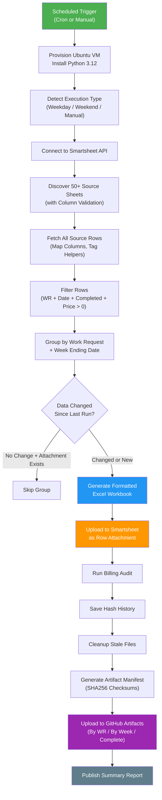
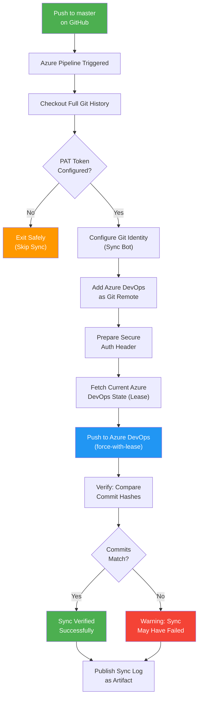
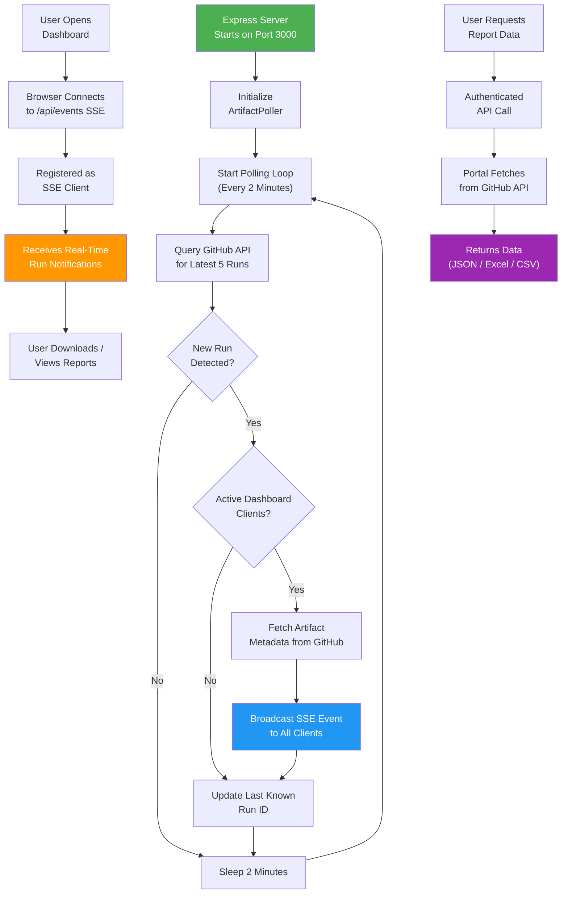
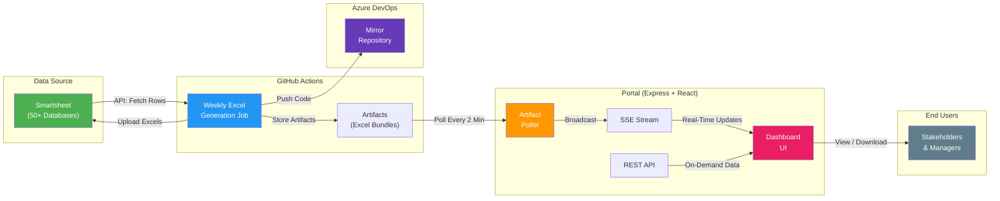

# Sync Job Run Logs

> **Generated**: March 14, 2026  
> **Repository**: Generate-Weekly-PDFs-DSR-Resiliency  
> **Purpose**: Non-technical documentation of all automated sync jobs in this codebase

---

## Table of Contents

1. [Weekly Excel Billing Report Generator](#1-weekly-excel-billing-report-generator)
2. [GitHub → Azure DevOps Repository Sync](#2-github--azure-devops-repository-sync)
3. [Artifact Poller & Real-Time Dashboard Service](#3-artifact-poller--real-time-dashboard-service)

---

## 1. Weekly Excel Billing Report Generator

### Sync Job Name

`weekly-excel-generation` (GitHub Actions Workflow + Python Script)

### Primary Purpose

This is the core billing automation job. It connects to **Smartsheet** (a cloud-based spreadsheet platform where field teams log their daily work), pulls all relevant work data, and automatically generates **formatted Excel billing reports** — one per Work Request per billing week. These reports are then uploaded back to Smartsheet as attachments and stored as downloadable artifacts in GitHub. This eliminates manual report creation, reduces billing errors, and ensures reports are consistently formatted for stakeholders.

### How It Works (Step-by-Step)

1. **Trigger**: The job runs automatically on a schedule:
   - **Weekdays** (Mon–Fri): Every 2 hours from 8 AM to 8 PM Central Time (plus an overnight run)
   - **Weekends** (Sat–Sun): Three times a day (10 AM, 2 PM, 6 PM Central)
   - **Monday morning**: A special weekly comprehensive run at midnight
   - **Manual**: Operators can trigger it on demand with custom settings (test mode, debug logging, specific Work Request filters, etc.)

2. **Environment Setup**: A clean Ubuntu virtual machine is provisioned in GitHub's cloud. Python 3.12 is installed along with all required libraries (Smartsheet SDK, Excel generation tools, error tracking via Sentry).

3. **Execution Type Detection**: The system determines what kind of run this is — frequent production, weekend maintenance, weekly comprehensive, or manual — which influences logging detail and processing scope.

4. **Connect to Smartsheet**: The script authenticates with the Smartsheet API using a secure token and begins discovering data sources.

5. **Discover Source Sheets**: The system scans a preconfigured list of **50+ Smartsheet databases** (called "Resiliency Promax Databases" and "Intake Promax Databases"). For each sheet, it verifies the column structure — specifically looking for columns like "Weekly Reference Logged Date," "Work Request #," "Units Total Price," and "Units Completed?" A discovery cache speeds this up so the same sheet list isn't re-verified on every run within a 60-minute window.

6. **Fetch All Source Rows**: For each validated sheet, the system fetches every row of billing data. It maps columns to standardized field names (handling variations like "Qty" vs "Quantity" or "UOM" vs "Unit of Measure"). Special logic identifies **helper rows** — work done by assisting foremen — and tags them with metadata. Subcontractor pricing is reverted to original contract rates if applicable.

7. **Filter Rows**: Rows are only kept if they meet all of these criteria:
   - Have a valid Work Request number
   - Have a valid Weekly Reference Logged Date
   - The "Units Completed?" checkbox is checked
   - The total price is greater than zero

8. **Group by Work Request + Week**: Valid rows are grouped so that each group contains data for **exactly one Work Request** during **exactly one billing week**. Helper rows may form their own separate groups if helper mode is enabled.

9. **Change Detection (Smart Skip)**: Before generating a new Excel file, the system computes a data "fingerprint" (hash) of the group. If the data hasn't changed since the last run **and** the corresponding attachment still exists on Smartsheet, the group is skipped — saving time and API calls.

10. **Generate Excel Reports**: For each group that needs updating, a professionally formatted Excel workbook is created containing:
    - Company logo and header information
    - Work Request number, Foreman name, Scope ID, Job number
    - Week ending date
    - Detailed line items with CU codes, descriptions, quantities, unit prices
    - Calculated totals
    - Files are saved into week-specific subfolders (e.g., `generated_docs/2026-03-14/`)

11. **Upload to Smartsheet**: In production mode, each generated Excel file is uploaded as an attachment to the corresponding Work Request row on the target Smartsheet. Old attachments for the same week/variant are cleaned up first to prevent duplicates.

12. **Billing Audit**: An audit subsystem analyzes all financial data for anomalies, unusual pricing patterns, and data integrity issues. Results are logged with risk levels (e.g., LOW, MEDIUM, HIGH).

13. **Hash History Saved**: The system saves a record of every processed group's data fingerprint so future runs can skip unchanged data.

14. **Cleanup**: Stale Excel files from previous runs that no longer correspond to current data are deleted from both the local file system and Smartsheet attachments.

15. **Generate Artifact Manifest**: A comprehensive JSON manifest is created listing every generated Excel file with SHA256 checksums, file sizes, Work Request numbers, and week-ending dates.

16. **Organize & Upload Artifacts**: All generated files are organized into three downloadable bundles on GitHub:
    - **Complete Bundle**: All Excel reports with manifest and audit logs (retained 90 days)
    - **By Work Request**: Folders grouped by WR number
    - **By Week Ending**: Folders grouped by billing week
    - A **Manifest** artifact with the JSON index

17. **Summary Report**: A detailed summary is written to the GitHub Actions run page showing file counts, sizes, Work Request numbers, week endings, and retention policies.

### Visual Logic Map

### Expected Outcomes & Error Handling

**Successful Run:**
- Excel reports generated for every Work Request + Week group with changed data
- Files uploaded to Smartsheet as row attachments
- Downloadable artifacts available in GitHub Actions for 90 days (30 days in test mode)
- Audit summary shows LOW risk level
- Hash history updated for future change detection

**Error Handling:**
- **Sentry Monitoring**: All errors are captured and sent to Sentry with full context (Work Request number, group key, stack trace, runtime configuration). Normal 404 errors during attachment cleanup are filtered out.
- **Per-Group Resilience**: If one Work Request group fails, processing continues for the remaining groups. The error is logged and reported to Sentry.
- **Missing API Token**: The script raises an error immediately (unless in test mode, where it uses synthetic data).
- **Sheet Discovery Failures**: Individual sheet failures are logged as warnings; the system continues with successfully discovered sheets.
- **Upload Failures**: Failed Smartsheet uploads are logged but do not halt the workflow. Files remain available as GitHub artifacts.
- **Timeout**: The workflow has a 120-minute hard timeout. If exceeded, GitHub Actions terminates the run.

---

## 2. GitHub → Azure DevOps Repository Sync

### Sync Job Name

`Sync-GitHub-to-Azure-DevOps` (Azure Pipelines YAML)

### Primary Purpose

This job keeps a **mirror copy** of the codebase in Azure DevOps automatically synchronized with the GitHub repository. When developers push code changes to the `master` branch on GitHub, this pipeline ensures those same changes appear in the Azure DevOps repository within minutes. This is essential for organizations that use Azure DevOps for project management, CI/CD pipelines, or compliance tracking, while keeping GitHub as the primary source of truth.

### How It Works (Step-by-Step)

1. **Trigger**: The pipeline activates automatically whenever code is pushed to the `master` branch on GitHub. Changes to README files and the `.github/` folder are excluded (since those are GitHub-specific and not relevant to Azure DevOps).

2. **Checkout Full History**: The pipeline checks out the entire Git history (not a shallow clone) from GitHub. This is critical to avoid "missing object" errors when pushing to Azure DevOps.

3. **Configure Git Identity**: The pipeline sets up a bot identity ("Azure Pipeline Sync Bot") for any Git operations, ensuring that sync commits are clearly attributed to the automation system.

4. **Validate Credentials**: The pipeline checks that the Azure DevOps Personal Access Token (PAT) is properly configured. If the PAT is missing or wasn't replaced (indicating a configuration error), the pipeline safely exits without making changes.

5. **Add Azure DevOps Remote**: The Azure DevOps repository URL is registered as a Git "remote" — a destination where the code can be pushed. The URL points to the organization's Azure DevOps project (LinetecDevelopment / Resiliency - Development).

6. **Prepare Authentication Header**: The PAT is encoded into a secure HTTP Basic authentication header. This avoids embedding credentials directly in the repository URL (a security best practice). The header is stored in a temporary file with restricted permissions.

7. **Fetch Azure DevOps State**: Before pushing, the pipeline fetches the current state of the Azure DevOps repository. This "lease" snapshot ensures the push won't accidentally overwrite changes that someone else might have pushed directly to Azure DevOps.

8. **Push with Safety Guard**: The code is pushed using `--force-with-lease`, which is a safer version of force push. It will only succeed if the Azure DevOps branch hasn't been modified since the lease snapshot was taken. This prevents data loss from concurrent modifications.

9. **Verify Sync**: After pushing, the pipeline fetches from Azure DevOps again and compares the commit hashes. If GitHub's commit matches Azure DevOps's commit, the sync is verified as successful. A mismatch triggers a warning.

10. **Publish Sync Log**: The Git log is published as a build artifact for auditing and troubleshooting purposes.

### Visual Logic Map

### Expected Outcomes & Error Handling

**Successful Run:**
- The Azure DevOps `master` branch contains the exact same code as GitHub's `master` branch
- Commit hashes match between both repositories
- A sync log artifact is published for audit purposes

**Error Handling:**
- **Missing PAT Token**: The pipeline exits gracefully without attempting any sync operations. This is a safe default for environments where Azure DevOps integration hasn't been set up yet.
- **Concurrent Modifications**: The `--force-with-lease` flag prevents overwriting changes that were pushed directly to Azure DevOps. If a conflict is detected, the push fails and the verification step flags the mismatch.
- **Network Failures**: Standard Azure Pipelines retry logic applies. The sync log is always published regardless of success or failure (`condition: always()`).
- **Shallow Clone Issues**: The pipeline explicitly uses `fetchDepth: 0` and includes logic to unshallow clones if needed, preventing "object not found" errors.

---

## 3. Artifact Poller & Real-Time Dashboard Service

### Sync Job Name

`ArtifactPoller` (Node.js Express Portal Service)

### Primary Purpose

This is a **real-time monitoring service** that bridges the gap between GitHub Actions (where Excel reports are generated) and the Linetec Report Portal (where users view and download reports). It continuously checks GitHub for new workflow runs, and the moment a new report generation completes, it instantly notifies all connected dashboard users through a live data stream. This means stakeholders don't need to manually check GitHub — the portal dashboard updates automatically.

### How It Works (Step-by-Step)

1. **Server Startup**: When the Express.js portal server starts, it initializes the ArtifactPoller service (unless polling is explicitly disabled via configuration). The server runs on port 3000.

2. **Polling Loop**: Every 2 minutes (configurable between 1 second and 1 hour), the poller queries the GitHub API for the latest completed workflow runs of the `weekly-excel-generation.yml` workflow.

3. **Fetch Latest Runs**: The poller requests the 5 most recent completed workflow runs via the GitHub REST API, authenticating with a GitHub token for higher rate limits.

4. **New Run Detection**: The poller compares the latest run's ID against the last known run ID stored in memory. If a new run is detected **and** there are active dashboard clients connected, it proceeds to fetch more details.

5. **Fetch Artifact Metadata**: For the newly detected run, the poller retrieves the list of all artifacts (the Excel report bundles) from the GitHub API, capturing each artifact's name, size, creation time, and expiration status.

6. **Broadcast via SSE**: The poller constructs a notification payload containing the run details (run number, status, conclusion, event type, branch) and the artifact list, then broadcasts it to all connected clients using **Server-Sent Events (SSE)**. SSE is a one-way streaming protocol where the server pushes updates to the browser without the browser having to ask repeatedly.

7. **Client Connection Management**: When a user opens the dashboard, their browser connects to the `/api/events` endpoint. The server registers them as an SSE client and sends a keepalive signal every 30 seconds to prevent timeouts. When the user closes the tab, their connection is automatically cleaned up.

8. **Portal API Endpoints**: Beyond the real-time poller, the portal provides several API endpoints for on-demand access:
   - **`GET /api/runs`**: Browse paginated workflow run history
   - **`GET /api/latest`**: Get the most recent run with its artifacts
   - **`GET /api/runs/:runId/artifacts`**: List artifacts for a specific run
   - **`GET /api/artifacts/:id/download`**: Download a complete artifact ZIP
   - **`GET /api/artifacts/:id/view`**: Parse and display Excel contents in-browser
   - **`GET /api/artifacts/:id/files`**: List files within an artifact ZIP
   - **`GET /api/artifacts/:id/export`**: Export as XLSX or CSV
   - **`GET /api/poll`**: Manual poll for new runs since a given run ID
   - **`GET /api/poller-status`**: Check poller health (running, last poll time, connected clients, errors)

9. **Authentication & Security**: All API endpoints require authentication. The portal uses session-based auth with CSRF protection, Helmet security headers, and rate limiting (100 requests per 15-minute window).

### Visual Logic Map

### Expected Outcomes & Error Handling

**Successful Run:**
- Dashboard users see new workflow runs appear automatically within 2 minutes of completion
- Artifact metadata (names, sizes, status) is displayed without manual refresh
- Users can download, view, or export Excel reports directly from the dashboard

**Error Handling:**
- **GitHub API Errors**: Poll failures are caught and stored in the poller's status (`lastError`). The poller continues its schedule regardless — a single failed poll doesn't crash the service. Errors are logged to the server console.
- **Client Disconnections**: When a user closes their browser tab, the SSE connection is cleaned up automatically. Failed write attempts to disconnected clients are silently handled.
- **Rate Limiting**: The GitHub API has rate limits (5,000 requests/hour for authenticated users). The 2-minute polling interval with 5 runs per request uses approximately 720 requests/day, well within limits.
- **Poller Health Monitoring**: The `/api/poller-status` endpoint exposes the poller's current state — whether it's running, when it last polled, any recent errors, and how many clients are connected. This can be used for external health checks.
- **Authentication Failures**: Unauthenticated requests to any API endpoint are rejected before reaching GitHub, protecting both the portal and the API quota.

---

## System Architecture Overview

The following diagram shows how all three sync jobs work together as an integrated system:

### How the System Fits Together

1. **Smartsheet** is where field teams enter their daily work data (Work Requests, quantities, prices, etc.)
2. The **Weekly Excel Generation Job** pulls this data, generates formatted billing reports, uploads them back to Smartsheet, and stores copies as GitHub Artifacts
3. The **Azure DevOps Sync** ensures the codebase powering all of this is mirrored in the organization's Azure DevOps instance for compliance and project management
4. The **Artifact Poller** watches for new report generations and pushes real-time notifications to the **Dashboard**, where stakeholders can browse, view, and download reports without ever touching GitHub or Smartsheet directly

---

## Glossary

| Term | Definition |
|------|-----------|
| **Work Request (WR)** | A unique identifier for a unit of work or project in the Linetec/Resiliency system |
| **Week Ending Date** | The Sunday that marks the end of a billing week |
| **Smartsheet** | A cloud-based spreadsheet/project management platform used for field data entry |
| **GitHub Actions** | An automation platform built into GitHub that runs scheduled or triggered jobs |
| **Artifact** | A file or bundle of files produced by a GitHub Actions workflow run |
| **SSE (Server-Sent Events)** | A web technology for pushing real-time updates from server to browser |
| **Hash / Fingerprint** | A mathematical summary of data used to detect whether anything changed |
| **PAT (Personal Access Token)** | A secret key used to authenticate with Azure DevOps |
| **Sentry** | An error monitoring service that captures and alerts on application errors |
| **CU (Billable Unit Code)** | A code representing a specific type of billable work |
| **Helper Row** | A row representing work done by an assisting foreman, tracked separately |
| **Variant** | The type of Excel report — "primary" (standard) or "helper" (assisting foreman) |
