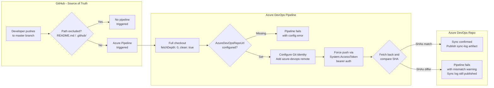
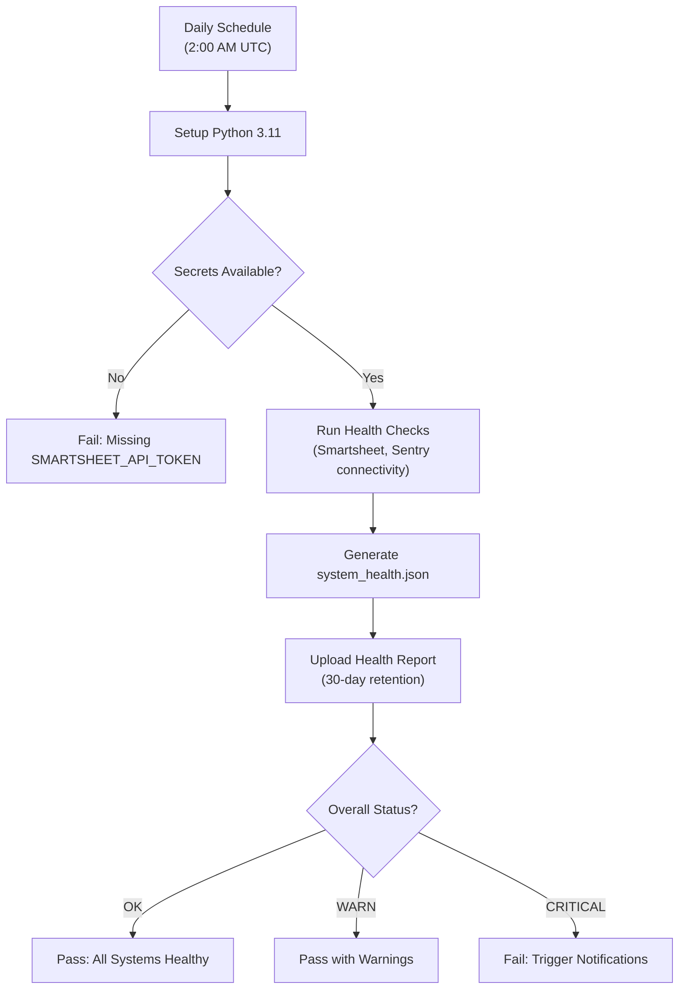
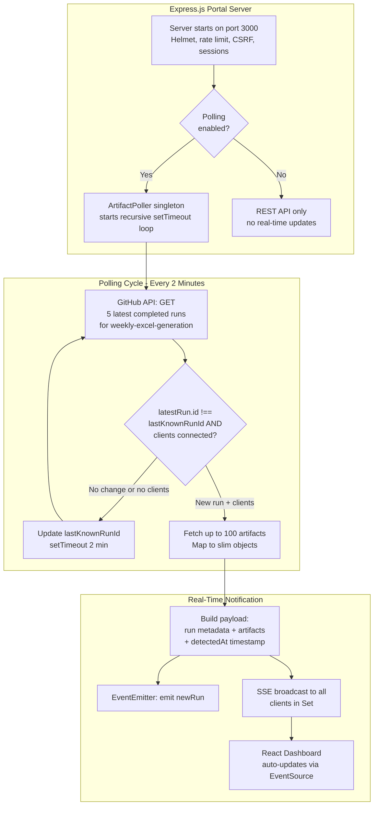
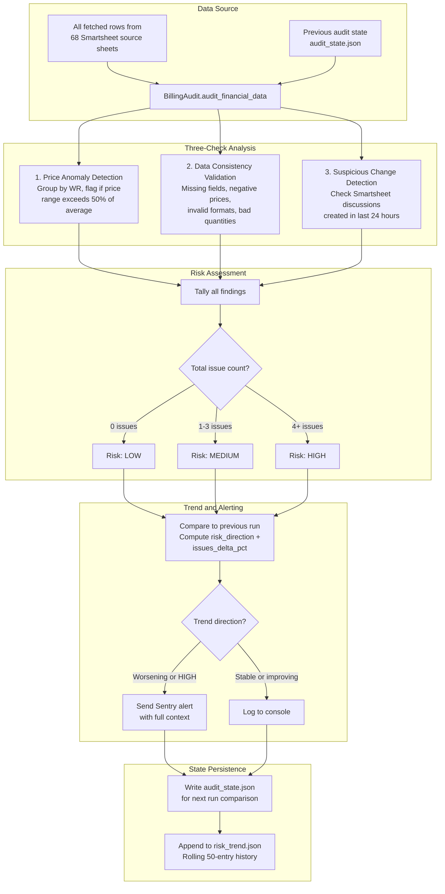
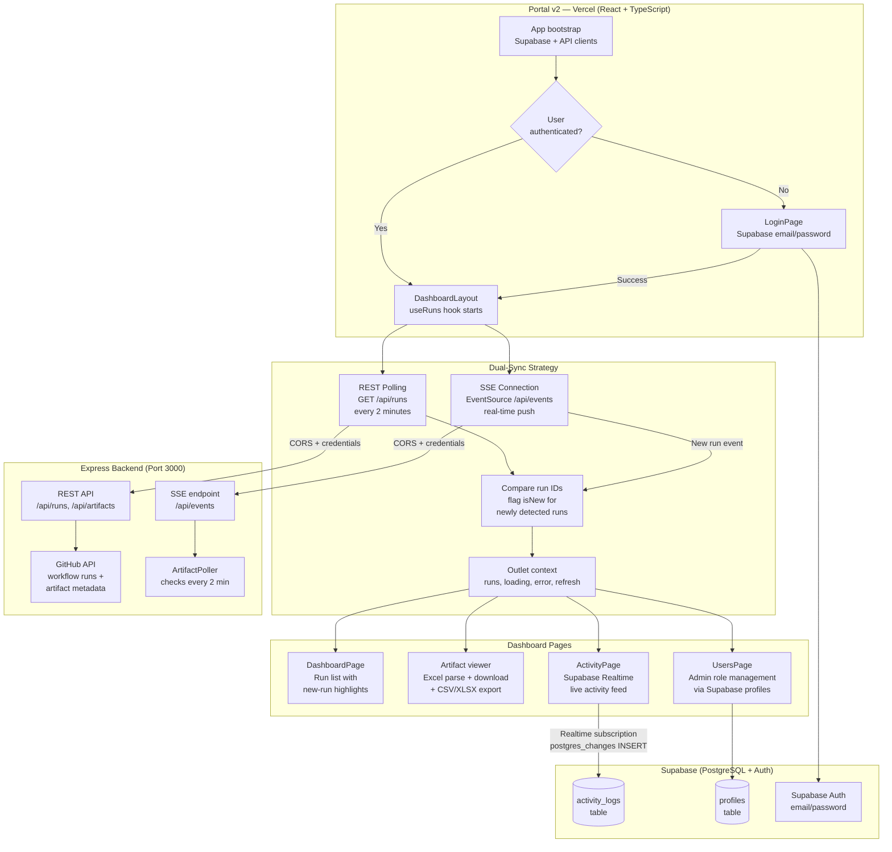
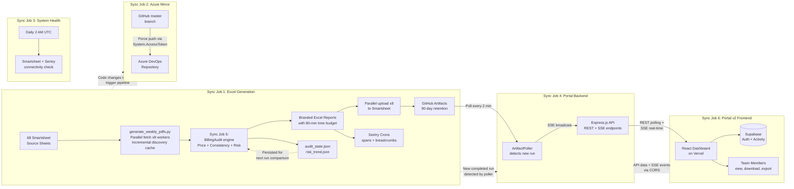

```mermaid
flowchart TB
    subgraph Trigger["1. Trigger"]
        CRON["Cron Schedule<br>Every 2hrs weekdays<br>3x weekends"] --> START
        MANUAL["Manual Dispatch<br>with 12+ config inputs"] --> START
        WEEKLY["Monday 11PM CT<br>Comprehensive run"] --> START
        START["GitHub Actions Runner<br>Ubuntu + Python 3.12<br>Sentry Cron check-in"]
    end
    subgraph Fetch["2. Data Collection - Parallel"]
        START --> RESTORE["Restore caches from<br>GitHub Actions cache<br>hash_history + discovery"]
        RESTORE --> AUTH["Authenticate with<br>Smartsheet API"]
        AUTH --> CACHE{"Discovery cache<br>valid? 7-day TTL"}
        CACHE -->|"Valid + no new IDs"| ROWS
        CACHE -->|"Expired or new IDs"| DISCOVER["Incremental discovery<br>68 base sheets<br>8 parallel workers"]
        DISCOVER --> ROWS["Parallel row fetch<br>ThreadPoolExecutor x8<br>column-specific queries"]
        ROWS --> PREFETCH["Pre-fetch attachment cache<br>bulk target sheet attachments"]
    end
    subgraph Process["3. Processing with Time Budget"]
        PREFETCH --> AUDIT["Run BillingAudit engine<br>Price anomalies + data integrity<br>Risk: LOW / MEDIUM / HIGH"]
        AUDIT --> GROUP["Group rows by<br>WR + Week + Variant<br>Handle helper crews"]
        GROUP --> BUDGET{"Time budget<br>80 min exceeded?"}
        BUDGET -->|"Yes"| STOP_EARLY["Stop new groups<br>proceed to upload"]
        BUDGET -->|"No"| HASH{"SHA-256 hash<br>changed since<br>last run?"}
        HASH -->|"No change + attachment exists"| SKIP["Skip group<br>save API calls"]
        HASH -->|"Changed, new, or forced"| GEN["Generate branded Excel<br>with Sentry span tracing<br>Logo, daily blocks, totals"]
    end
    subgraph Output["4. Parallel Upload + Delivery"]
        GEN --> COLLECT["Collect upload tasks"]
        STOP_EARLY --> PARALLEL
        COLLECT --> PARALLEL["Parallel upload phase<br>ThreadPoolExecutor x8<br>Delete old + upload new"]
        PARALLEL --> ORGANIZE["Organize into<br>by_wr/ and by_week/<br>folder structures"]
        ORGANIZE --> MANIFEST["Generate JSON manifest<br>file counts, sizes,<br>SHA-256 digests"]
        MANIFEST --> ARTIFACT["Upload 4 artifact bundles<br>to GitHub 90-day retention"]
    end
    subgraph Cleanup["5. Finalize - Always Runs"]
        PARALLEL --> CLEAN["Variant-aware cleanup<br>Prune stale files +<br>untracked attachments"]
        ARTIFACT --> CLEAN
        CLEAN --> SAVE["Save caches to GitHub<br>hash_history + discovery<br>even on timeout/failure"]
        SAVE --> SENTRY_DONE["Sentry cron check-in<br>OK or ERROR status"]
        SENTRY_DONE --> SUMMARY["Rich markdown summary<br>to GitHub Step Summary"]
    end
```

# Sync Job Run Logs — Linetec Report System

> **Last Updated:** 2026-04-01  
> **Notion Page:** [View in Notion](https://www.notion.so/31caa083d709818ab500d473b2e7704a)  
> **Repository:** `Generate-Weekly-PDFs-DSR-Resiliency`  
> **Branch:** `cursor/sync-job-run-logs-f272`

This document provides a complete, non-technical explanation of every automated sync job in the **Linetec Weekly Report System**. Each section translates the underlying code into plain English so that any stakeholder — technical or not — can understand what each job does, how it runs, and what to do when something goes wrong.

---

## Table of Contents

1. [Weekly Excel Report Generation](#1-weekly-excel-report-generation)
2. [GitHub-to-Azure DevOps Repository Mirror](#2-github-to-azure-devops-repository-mirror)
3. [System Health Check](#3-system-health-check)
4. [Portal Artifact Poller (Real-Time Sync)](#4-portal-artifact-poller-real-time-sync)
5. [Billing Audit Engine](#5-billing-audit-engine)
6. [Portal v2 — React Dashboard with Supabase](#6-portal-v2--react-dashboard-with-supabase)
7. [System Architecture Overview](#7-system-architecture-overview)
8. [Quick Reference](#8-quick-reference)

---

## 1. Weekly Excel Report Generation

**Sync Job Name:** `weekly-excel-generation.yml` + `generate_weekly_pdfs.py`

### Primary Purpose

This is the **core billing engine** of the entire system. It automatically pulls production data that field crews enter into Smartsheet, calculates pricing and hours for each Work Request, and produces formatted Excel billing reports — one per Work Request per week. These reports are uploaded back to Smartsheet as file attachments and stored as downloadable artifacts in GitHub. This ensures that billing data stays current without any manual spreadsheet work.

### How It Works (Step-by-Step)

1. **Schedule triggers the job** — The workflow runs automatically every 2 hours during business days (Mon–Fri, 7 AM–7 PM Central Time), three times on weekends (9 AM, 1 PM, 5 PM Central), and a comprehensive weekly run on Monday at 11 PM. It can also be triggered manually with 12+ custom inputs (test mode, debug logging, specific WR filters, force regeneration, hash resets, parallel worker counts, grouping mode, discovery cache bypass, etc.).
2. **Environment setup** — A fresh Ubuntu server is provisioned in GitHub Actions. Python 3.12 is installed with all dependencies (Smartsheet SDK, openpyxl for Excel, pandas, Sentry SDK 2.x for error tracking and cron monitoring). Hash history and discovery caches are **restored from GitHub Actions cache** using a split `restore`/`save` strategy — this means caches persist even if the job times out or fails.
3. **Execution type determination** — The system classifies the run as: `production_frequent` (weekday), `weekend_maintenance`, `weekly_comprehensive` (Monday night), or `manual` (user-triggered with custom parameters like `max_groups`, `regen_weeks`, `reset_wr_list`).
4. **Phase 1 — Sheet Discovery** — The system connects to Smartsheet using an API token and discovers all **68 base source sheets** (Resiliency Promax Databases 16–62, Promax Databases 31–36, Intake Promax 1–6, plus legacy sheets). It also scans configured **subcontractor** and **original contract** folders to auto-discover additional sheets. An **incremental discovery cache** (7-day TTL / 10,080 minutes) keeps validated sheet metadata — on cache hit, only newly-added sheet IDs are validated via the API. Folder scanning uses 8 parallel workers via `ThreadPoolExecutor`. Each sheet's columns are mapped using a synonym dictionary covering 40+ column name variants.
5. **Phase 2 — Data Fetching** — All rows from discovered sheets are pulled down in parallel using 8 concurrent workers, maximizing speed while respecting Smartsheet's rate limits (300 requests/minute). Column-specific fetching requests only mapped columns, reducing API payload by ~64%. Column names are normalized to a standard format (e.g., "Work Request #", "CU Code", "Units Total Price"). An **attachment pre-fetch cache** is built in bulk so row attachments don't need to be fetched individually later.
6. **Billing Audit** — Before generating reports, an integrated audit engine scans the data for financial anomalies, unusual pricing, missing fields, and data quality issues. Results are tagged with a risk level (LOW, MEDIUM, or HIGH). See [Billing Audit Engine](#5-billing-audit-engine) for full details.
7. **Data Grouping** — Rows are organized into groups by Work Request number and week-ending date (keys like `MMDDYY_WRNUMBER`). The grouping mode (`RES_GROUPING_MODE`) controls helper handling: `primary` keeps all rows in main groups, `helper` splits helper rows into separate groups per foreman, and `both` (default) does full separation. Group integrity is validated — each group must contain exactly one WR number.
8. **Change Detection** — For each group, a SHA-256 hash (fingerprint) is computed from the data. In extended mode (default), this includes 16+ fields: foreman, department numbers, scope ID, aggregated totals, unique dept list, row count, completion status, and variant metadata. If the hash matches the previous run AND the corresponding attachment still exists on Smartsheet, the group is **skipped** — saving processing time and API calls. The `FORCE_GENERATION` flag overrides this behavior.
9. **Excel Generation** — For changed or new groups, a branded `.xlsx` file is created using openpyxl with the Linetec logo, Report Summary (total billed, line items, billing period), Report Details (foreman, WR#, scope, work order), and Daily Data Blocks (rows grouped by date with pole#, CU code, work type, UOM, quantity, pricing). For subcontractor sheets, prices are automatically **reverted to 100% original contract rates** via dual-CSV rate lookup (Corpus North & South + Arrowhead Contract).
10. **Parallel Upload** — All generated files are uploaded in a **parallel upload phase** using 8 workers. For each upload: old attachments matching the same WR/week/variant identity are deleted, then the new file is attached to the target Smartsheet row. This parallel strategy provides an ~8x speedup over serial uploads.
11. **Time Budget** — An 80-minute graceful time budget prevents the GitHub Actions runner from hard-killing the job at the 90-minute timeout. When the budget is exceeded, the script stops processing new groups but still completes the upload phase, artifact preservation, and cache saves. Remaining groups are picked up on the next run.
12. **Artifact Preservation** — All generated Excel files are organized into `by_wr/WR_<num>/` and `by_week/Week_<date>/` folder structures. A JSON manifest is generated with file counts, sizes, WR numbers, week endings, and SHA-256 digests. Four artifact bundles are uploaded to GitHub: Complete Bundle, By-Work-Request, By-Week-Ending, and Manifest. Production runs are retained for 90 days; test runs for 30 days.
13. **Cleanup** — Variant-aware local file cleanup removes stale files. Untracked Smartsheet attachments from previous runs are pruned. The hash history JSON is atomically persisted (via tmp + `os.replace()`) for the next run's change detection.
14. **Cache Saving** — Hash history and discovery caches are saved **even if the job fails or times out** so the next run can pick up where this one left off.
15. **Summary** — A rich markdown summary is written to the GitHub Actions run page showing execution type, file counts, total sizes, Work Request numbers, week endings, and retention policy.

### Visual Logic Map

### Expected Outcomes & Error Handling

- **Successful Run:** Excel reports are generated for all changed Work Requests, uploaded to Smartsheet, and preserved as GitHub artifacts with a 90-day retention policy. Step summary shows file counts and WR numbers.
- **No Data Changes:** All groups are skipped. No new files are created. This is normal and expected during quiet periods.
- **Missing API token:** In test mode, synthetic data is generated for validation. In production, the job fails immediately with a clear error.
- **Smartsheet API failure:** Exception is captured by Sentry with full context (WR number, row count, stack trace). The failed group is skipped and remaining groups continue processing.
- **Individual group failure:** Error is logged, Sentry alert sent with group details, and processing continues with the next group. One bad Work Request does not block others.
- **Time budget exceeded (80 min soft / 90 min hard):** The script stops processing new groups gracefully. Upload phase, artifact preservation, and cache saves still complete. The split `cache/restore` + `cache/save` strategy ensures hash history and discovery caches are preserved even on timeout.
- **Critical errors:** Captured by Sentry with full context, fingerprinted for grouping, and sent as alerts.

---

## 2. GitHub-to-Azure DevOps Repository Mirror

**Sync Job Name:** `.github/workflows/azure-pipelines.yml` (Azure DevOps Pipeline)

### Primary Purpose

This sync job keeps a **mirror copy** of the entire codebase in Azure DevOps. Whenever code is pushed to the `master` branch on GitHub, this pipeline automatically copies those changes to Azure DevOps. This ensures the organization has a backup in their corporate infrastructure and any Azure-based CI/CD pipelines always have the latest code. It is a one-way mirror — GitHub is authoritative.

### How It Works (Step-by-Step)

1. **Trigger** — The pipeline runs automatically whenever a commit is pushed to `master` on GitHub. Documentation-only changes (`README.md` and `.github/` files) are excluded via path filters to avoid unnecessary syncs. Pull request triggers are explicitly disabled (`pr: none`).
2. **Full checkout** — Checks out the complete repository with full history (`fetchDepth: 0`, `clean: true`). This is critical — shallow clones cause errors when pushing to another remote because Git cannot resolve all object references.
3. **Git configuration** — Sets up a Git identity ("Azure Pipeline Sync Bot" / `pipeline-sync@azure-devops.com`) and logs diagnostics: Git version, current branch, and the last 5 commits for traceability.
4. **Validate configuration** — Before attempting the push, the pipeline validates that the `AzureDevOpsRepoUrl` pipeline variable is set. If missing, the pipeline fails immediately with a clear error message — no partial work is done.
5. **Add Azure DevOps remote** — Registers the Azure DevOps repository as a second Git remote named `azure-devops`. The target URL comes from the user-defined pipeline variable (e.g., `https://dev.azure.com/LinetecDevelopment/Resiliency%20-%20Development/_git/Generate-Weekly-PDFs-DSR-Resiliency`).
6. **Authenticate and force push** — Using Azure DevOps' built-in OAuth token (`System.AccessToken`) passed as a bearer token via `http.extraheader`, the pipeline force-pushes HEAD to `refs/heads/master` on the Azure DevOps remote. All scripts use `set -euo pipefail` for strict error handling.
7. **Verify the sync** — After pushing, the pipeline fetches back from `azure-devops` remote and compares the local HEAD SHA against `azure-devops/master`. If they match, the sync is confirmed successful. If they differ, the pipeline exits with code 1 and a mismatch warning.
8. **Publish sync log** — The Git HEAD log is published as a build artifact named `sync-log` with `condition: always()` — preserved even if earlier steps fail, enabling post-mortem debugging.

### Visual Logic Map

### Expected Outcomes & Error Handling

- **Successful sync:** Azure DevOps `master` branch matches GitHub `master` exactly. Sync log artifact is published.
- **Commit mismatch after push:** Verification step exits with code 1, failing the pipeline. The `sync-log` artifact is still published for post-mortem analysis.
- **Missing AzureDevOpsRepoUrl:** Pipeline fails immediately at validation with a clear error message. No push is attempted.
- **OAuth token expired or insufficient:** Git push fails with an authentication error. Fix: Ensure "Allow scripts to access the OAuth token" is enabled in Azure DevOps Project Settings, and the Build Service account has Contribute + Force Push permissions.
- **Documentation-only changes:** Pipeline is NOT triggered (README.md and .github/ are excluded from path filters).

---

## 3. System Health Check

**Sync Job Name:** `system-health-check.yml` + `validate_system_health.py`

### Primary Purpose

A **daily diagnostic check** that verifies all external services (Smartsheet, Sentry) are reachable and credentials are valid. Runs before the next day's report generation begins, providing early warning if something is broken.

### How It Works (Step-by-Step)

1. **Schedule** — Runs daily at 2:00 AM UTC. Can also be triggered manually via `workflow_dispatch`.
2. **Environment setup** — Python 3.11 is installed with project dependencies on an Ubuntu runner. Job timeout is set to 10 minutes.
3. **Secret verification** — Verifies `SMARTSHEET_API_TOKEN` is available. If missing, the job fails immediately with a clear error. `SENTRY_DSN` is checked but is optional.
4. **Health check execution** — Runs `validate_system_health.py` which tests connectivity to Smartsheet and Sentry services.
5. **Report generation** — Results are written to `generated_docs/system_health.json`.
6. **Report upload** — The JSON report is uploaded as a GitHub artifact with 30-day retention.
7. **Status evaluation** — The `overall_status` field is read from the JSON report: **OK** (all systems healthy), **WARN** (pass with warnings), or **CRITICAL** (fail with notifications).

### Visual Logic Map

### Expected Outcomes & Error Handling

- **Successful Run:** `system_health.json` shows "OK" status. All services reachable.
- **Missing secrets:** Fails immediately, alerting the team via GitHub Notifications.
- **Smartsheet unreachable:** CRITICAL status, job fails, triggering notifications.
- **Sentry unavailable:** Logged as a warning (non-critical). The check continues.

---

## 4. Portal Artifact Poller (Real-Time Sync)

**Sync Job Name:** `portal/services/poller.js` + `portal/services/github.js`

### Primary Purpose

Runs **continuously** inside the Report Portal (Express.js server). Every 2 minutes, it checks GitHub for new completed workflow runs and pushes updates to connected browsers via Server-Sent Events (SSE). Users see new reports appear in real-time without refreshing the page.

### How It Works (Step-by-Step)

1. **Portal startup** — When the Express.js server boots on port 3000, it sets up security middleware (Helmet CSP, rate limiting at 100 req/15 min, CSRF protection), session management (8-hour cookies with `httpOnly` + `secure`), and starts the `ArtifactPoller` singleton.
2. **Polling loop** — Every 2 minutes (configurable via `POLL_INTERVAL_MS`, clamped between 1 second and 1 hour), the poller calls the GitHub API to check the 5 most recent completed runs of the `weekly-excel-generation` workflow. The loop uses recursive `setTimeout` (not `setInterval`) to prevent overlapping polls.
3. **New run detection** — Compares the latest run's ID against `lastKnownRunId` stored in memory. If they differ AND there are SSE clients connected, a new run has been detected.
4. **Artifact fetching** — For new runs, fetches the full list of artifacts (up to 100) from the GitHub API. Each artifact is mapped to a slim object with `id`, `name`, `sizeInBytes`, `expired`, and `createdAt`.
5. **Real-time broadcast** — A payload containing run metadata, full artifact list, and `detectedAt` timestamp is broadcast to all connected browser clients via SSE. The payload is also emitted as a `'newRun'` event on the Node.js EventEmitter.
6. **API endpoints** — The portal exposes REST endpoints behind session-based authentication (`requireAuth` middleware):
   - `/api/runs` — List paginated workflow runs (10 per page)
   - `/api/runs/:runId/artifacts` — List artifacts for a specific run
   - `/api/artifacts/:id/download` — Download artifact as raw ZIP
   - `/api/artifacts/:id/view` — Parse Excel in-browser (adm-zip + exceljs)
   - `/api/artifacts/:id/export?format=xlsx|csv` — Export in XLSX or CSV
   - `/api/artifacts/:id/files` — List files inside an artifact ZIP
   - `/api/latest` — Most recent completed run with artifacts
   - `/api/poll?lastRunId=X` — REST-based polling alternative
   - `/api/events` — SSE stream endpoint
   - `/api/poller-status` — Diagnostic snapshot (running, lastPollTime, connectedClients, etc.)
7. **Client connection management** — The poller maintains a `Set` of SSE response objects. Disconnected clients are automatically removed. A keepalive comment is sent every 30 seconds to keep connections alive through proxies. Failed writes silently remove the client.
8. **Error resilience** — Failed polls are logged to `lastError`; the poller continues on the next cycle. All REST API errors return HTTP 502 with a generic JSON error message. GitHub API requests have a 30-second timeout.

### Visual Logic Map

### Expected Outcomes & Error Handling

- **Normal Operation:** New reports appear in portal within 2 minutes of workflow completion. SSE keeps dashboards live.
- **GitHub API rate limit:** Poll error is logged. `lastError` updated. Next cycle retries automatically. Rate limit is 5,000 req/hr with token, 60 req/hr without.
- **Missing token:** API calls use unauthenticated access (60 req/hr limit). Portal still works but rate limits will hit sooner.
- **Client disconnects:** SSE client automatically removed from broadcast Set. No resource leak.
- **Portal restart:** Poller resets `lastKnownRunId` to null. First poll establishes a baseline without broadcasting. Session secret must be set in production.
- **Request timeout:** 30-second timeout; `req.destroy()` is called and error captured in `lastError`.

---

## 5. Billing Audit Engine

**Sync Job Name:** Integrated inside `generate_weekly_pdfs.py` (Sync Job 1) via `audit_billing_changes.py`

### Primary Purpose

An automated **financial watchdog** that runs inside the Weekly Excel Generation pipeline. Its job is to catch problems with billing data before reports are generated — things like unusually high or low prices, missing required fields, and suspicious recent changes. It computes a risk level for each run and tracks whether data quality is improving or degrading over time.

### How It Works (Step-by-Step)

1. **Initialization** — The audit engine receives the Smartsheet API client from the parent pipeline and loads the previous run's state from `generated_docs/audit_state.json`.
2. **Price Anomaly Detection** — All rows are grouped by Work Request number. For each WR, the system parses every `Units Total Price` value and calculates the price range. If the range exceeds 50% of the average price for that WR, it is flagged as a pricing anomaly with `medium` severity.
3. **Data Consistency Validation** — Every row is checked for: missing required fields (Work Request #, Units Total Price, Quantity, CU code), negative price values, invalid price formats, and zero or negative quantities.
4. **Suspicious Change Detection** — When enabled, the system checks Smartsheet discussions created within the last 24 hours. Currently skipped in CI for performance (`SKIP_CELL_HISTORY=true`).
5. **Risk Level Calculation** — All findings are tallied. The total determines risk level: **LOW** (0 issues), **MEDIUM** (1–3 issues), or **HIGH** (4+ issues).
6. **Trend Analysis** — Current results are compared against the previous run's summary. The system computes risk direction (worsening / improving / stable / baseline), risk level delta, and percentage change.
7. **Alerting** — If risk is HIGH or the trend is worsening, a Sentry alert is sent with full context tags. Console logging captures all findings regardless.
8. **State Persistence** — Updated audit state is written to `audit_state.json`. A risk history entry is appended to `risk_trend.json` (rolling 50-entry window).

### Visual Logic Map

### Expected Outcomes & Error Handling

- **Clean run (LOW risk):** No anomalies found. State persisted for trend tracking. Report generation proceeds normally.
- **MEDIUM risk (1–3 issues):** Issues logged with recommendations. Report generation continues — the audit is advisory, not blocking.
- **HIGH risk (4+ issues):** Sentry alert sent with full context (risk level, issue counts, affected WRs). Reports still generated — audit never blocks output.
- **Worsening trend:** Sentry alert sent even at MEDIUM level to flag degrading data quality.
- **Audit engine itself fails:** Wrapped in `try/except`. Failure captured by Sentry but **never** stops report generation.

---

## 6. Portal v2 — React Dashboard with Supabase

**Sync Job Name:** `portal-v2/` (React + TypeScript + Vite + Supabase)

### Primary Purpose

Portal v2 is a modern React-based replacement for the original server-rendered portal. It provides a faster, more polished user experience for viewing, downloading, and exporting billing reports. It connects to the Express backend (Sync Job 4) for workflow run data via both REST polling and SSE, and uses Supabase for authentication, user management, and real-time activity monitoring. Deployed on **Vercel** as a static single-page application.

### How It Works (Step-by-Step)

1. **Application bootstrap** — React 18 + TypeScript built with Vite, styled with Tailwind CSS, animated with Framer Motion. On startup, it initializes Supabase client (for auth and activity tracking) and Express backend API connection.
2. **Authentication via Supabase** — Email/password authentication via Supabase Auth. On signup, a PostgreSQL trigger (`handle_new_user()`) creates a `profiles` row with `role = 'viewer'`. `AuthGuard` component redirects unauthenticated users to login.
3. **Dual-sync strategy** — The `useRuns` custom hook employs two parallel data-fetching mechanisms:
   - **REST Polling:** Every 2 minutes, calls `GET /api/runs` on the Express backend. Uses `setTimeout` to prevent overlapping requests. A countdown timer displays in the Navbar.
   - **SSE Real-Time:** An `EventSource` connection to `GET /api/events` provides instant updates when the backend's ArtifactPoller detects a new run, bypassing the 2-minute wait.
4. **New run detection** — Incoming run IDs are compared against current state. Newly detected runs are flagged with `isNew: true` for visual highlights on the dashboard.
5. **Dashboard display** — Main page shows all workflow runs in a list. Click to see artifacts, then view, download, or export individual Excel reports. The artifact viewer uses the Express backend's parse endpoint for server-side Excel rendering.
6. **Activity feed via Supabase Realtime** — Admin Activity page subscribes to Supabase Realtime's `postgres_changes` channel on the `activity_logs` table. Actions appear instantly for all admin clients.
7. **User management** — Admins view all users and update roles via the `profiles` table in Supabase. Changes take effect immediately.
8. **Deployment** — Vercel with SPA rewrite rules (`vercel.json`). Express backend CORS-enabled for cross-origin requests from the Vercel domain. Vite dev proxy routes `/api`, `/auth`, `/csrf-token`, `/health` to `localhost:3000`.

### Visual Logic Map

### Expected Outcomes & Error Handling

- **Normal operation:** Dashboard shows workflow runs with 2-minute polling. SSE provides instant updates. Activity feed updates in real-time for admins.
- **SSE connection lost:** Navbar indicator shows disconnected. REST polling continues on its 2-minute cycle. EventSource auto-reconnects per browser retry logic.
- **Express backend unreachable:** REST polling fails with error. Supabase features (auth, activity, users) continue independently.
- **Supabase unreachable:** Authentication fails. Workflow run data from Express continues normally.
- **CORS misconfiguration:** API calls fail with CORS errors. Fix: Ensure Express CORS middleware includes Vercel domain with `credentials: true`.

---

## 7. System Architecture Overview

---

## 8. Quick Reference

| Sync Job | Frequency | Duration | Key Systems | Alert Channel |
|---|---|---|---|---|
| Weekly Excel Generation | Every 2h (weekdays), 3x (weekends) | Up to 80 min | Smartsheet, GitHub Artifacts, Sentry | Sentry Crons + GitHub Notifications |
| Azure DevOps Mirror | On every push to master | Under 2 min | GitHub, Azure DevOps | Azure Pipeline Notifications |
| System Health Check | Daily at 2:00 AM UTC | Under 10 min | Smartsheet, Sentry | GitHub Notifications |
| Portal Artifact Poller | Every 2 minutes (continuous) | Seconds per poll | GitHub API, SSE Clients | Console Logs |
| Billing Audit Engine | Runs inside Weekly Excel job | Seconds | Smartsheet data, Sentry | Sentry Alerts |
| Portal v2 Dashboard | Continuous (Vercel + Express) | N/A (always-on) | Supabase, Express API | Browser UI |

### Key Configuration Reference

| Setting | Value | Purpose |
|---|---|---|
| `SMARTSHEET_API_TOKEN` | Secret | Authentication for Smartsheet API |
| `SENTRY_DSN` | Secret | Error monitoring + cron monitoring + performance tracing |
| `PARALLEL_WORKERS` | 8 (default) | Concurrent data fetch + upload workers |
| `PARALLEL_WORKERS_DISCOVERY` | 8 (default) | Folder discovery workers |
| `TIME_BUDGET_MINUTES` | 80 (CI default) | Graceful stop before Actions hard-kill at 90 min |
| `DISCOVERY_CACHE_TTL_MIN` | 10,080 (7 days) | How long discovery cache is valid |
| `EXTENDED_CHANGE_DETECTION` | true (default) | 16+ field SHA-256 hash for change detection |
| `RES_GROUPING_MODE` | both (default) | primary / helper / both Excel variants |
| `POLL_INTERVAL_MS` | 120,000 (2 min) | Portal poller frequency (clamped 1s–1hr) |
| Source sheet count | 68 base sheets | Plus auto-discovered folder sheets |
| Workflow timeout | 90 min | Combined with 80-min time budget |
| Artifact retention | 90 days (prod) / 30 days (test) | GitHub artifact retention policy |

### Current Run Health (April 1, 2026)

- **Last 15 runs:** 15/15 succeeded (100% success rate)
- **Open PRs:** #128 (Retry mechanism), #126 (Portal v2 RBAC), #125 (Dependabot: brace-expansion), #124 (Dependabot: npm bumps), #93 (Folder sync service draft), #91 (Code quality draft)
- **Last code change to master:** March 26 — incremental discovery optimization

---

> *Auto-generated from codebase analysis on April 1, 2026. Source: `Generate-Weekly-PDFs-DSR-Resiliency` repository, branch `cursor/sync-job-run-logs-f272`. Cron-triggered daily refresh.*
