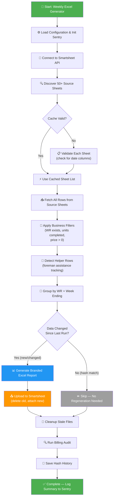
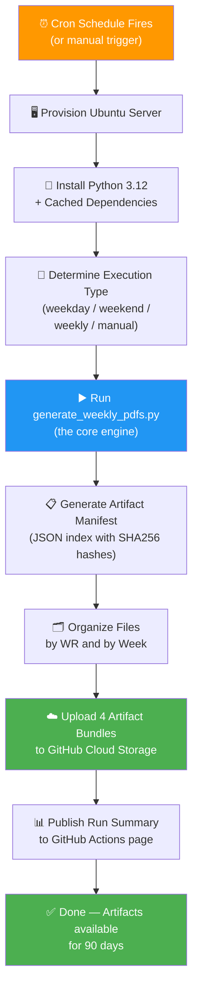
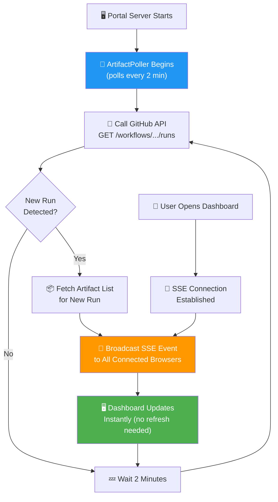
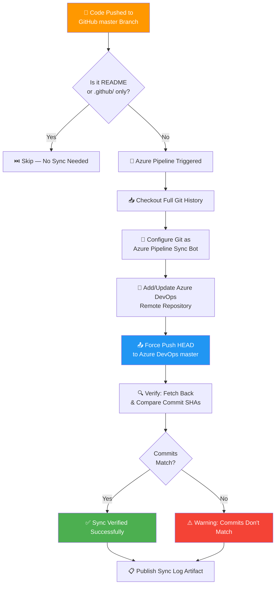
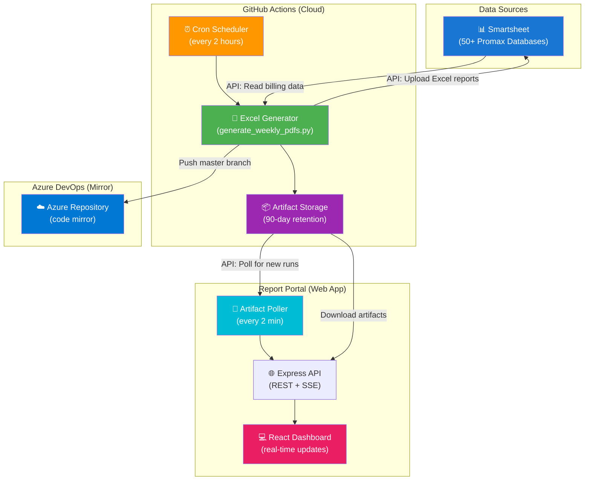

# Sync Job Run Logs

> **Generated**: March 16, 2026  
> **Repository**: Generate-Weekly-PDFs-DSR-Resiliency  
> **Audience**: Non-technical stakeholders, project managers, and operations teams

This document describes every automated sync job in the system, explaining what each one does, how it works, and what to expect when it runs.

---

## Table of Contents

1. [Weekly Excel Report Generator](#1-weekly-excel-report-generator)
2. [GitHub Actions Scheduler (Cron Orchestrator)](#2-github-actions-scheduler-cron-orchestrator)
3. [Artifact Poller (Real-Time Dashboard Updates)](#3-artifact-poller-real-time-dashboard-updates)
4. [GitHub-to-Azure DevOps Code Sync](#4-github-to-azure-devops-code-sync)

---

## 1. Weekly Excel Report Generator

### Sync Job Name
`generate_weekly_pdfs.py` — Weekly Excel Billing Report Generator

### Primary Purpose
This is the core engine of the entire system. It automatically pulls billing data from dozens of Smartsheet databases (50+ source sheets), organizes that data by **Work Request number** and **billing week**, and produces professional, branded Excel reports. These reports are then uploaded back to Smartsheet as file attachments so field teams and project managers can review weekly billing totals without manual data entry.

In plain terms: **it reads raw field work data from Smartsheet, turns it into polished billing spreadsheets, and delivers them back to Smartsheet — all automatically.**

### How It Works (Step-by-Step)

1. **Startup & Configuration** — The system reads environment settings (API keys, mode flags, performance tuning). It initializes error monitoring via Sentry.io so any failures are immediately reported.

2. **Connect to Smartsheet** — Using a secure API token, the system establishes a connection to the Smartsheet platform where all field data lives.

3. **Discover Source Sheets** — The system checks a curated list of 50+ Smartsheet database IDs (called "Resiliency Promax Databases" and "Intake Promax" sheets). For each sheet, it verifies that a "Weekly Reference Logged Date" column exists — this is the key date column that determines which billing week each row belongs to. Sheets missing this column are skipped. Discovery results are cached for up to 60 minutes to speed up subsequent runs.

4. **Fetch All Source Data** — For every valid source sheet, the system downloads all rows and maps each cell to a known field name (Work Request #, Foreman, CU code, Quantity, Price, etc.). It uses an efficient column-ID-based lookup instead of downloading entire sheets, reducing API payload by ~64%.

5. **Apply Business Rules & Filters** — Each row is filtered through business logic:
   - Rows without a Work Request number are excluded
   - Rows without a "Weekly Reference Logged Date" are excluded
   - Rows where "Units Completed?" is not checked are excluded
   - Rows with zero or missing prices are excluded
   - For subcontractor sheets, prices are reverted to original 100% contract rates

6. **Detect Helper Rows** — The system identifies "helper" rows — situations where one foreman assists another's crew. These are detected by checking the "Foreman Helping?" and "Helping Foreman Completed Unit?" columns. Helper rows generate separate Excel files so billing is properly attributed.

7. **Group Data** — Accepted rows are grouped by a compound key: `{WeekEnding}_{WorkRequestNumber}`. Each group represents one Excel file to generate.

8. **Change Detection (Smart Skip)** — For each group, a data hash (digital fingerprint) is calculated. If the hash matches a previously stored value AND the corresponding file attachment still exists on Smartsheet, the group is skipped — saving time and API calls. This ensures the system only regenerates files when underlying data has actually changed.

9. **Generate Excel Files** — For each group that needs processing, a formatted Excel workbook is created with:
   - Company logo and branding (LineTec Services)
   - Report title "WEEKLY UNITS COMPLETED PER SCOPE ID"
   - Summary section with total billed amount, line item count, and billing period
   - Header block with Work Request #, Foreman, Scope ID, Job #, Department, and Area
   - Daily data blocks showing line items broken down by Snapshot Date
   - Proper currency formatting, column widths, and print layout (landscape A4)

10. **Upload to Smartsheet** — Each generated Excel file is attached to the corresponding Work Request row on the target Smartsheet. Old attachments for the same week/variant are deleted first to prevent duplicates.

11. **Cleanup & Audit** — Stale local files are removed. A billing audit system checks for anomalies in financial data. Hash history is saved for next run's change detection.

12. **Session Summary** — The system logs final statistics: files generated, duration, mode (test/production), and audit risk level. All metrics are sent to Sentry for dashboard monitoring.

### Visual Logic Map

### Expected Outcomes & Error Handling

**Successful Run:**
- One Excel file per Work Request per billing week (plus helper variants if applicable)
- Files saved locally under `generated_docs/{YYYY-MM-DD}/` organized by week-ending date
- Files uploaded as attachments to the target Smartsheet
- Hash history updated for future change detection
- Session summary logged with file counts and duration

**Error Scenarios:**
- **Missing API Token** — Job halts immediately with a clear error. In test mode, synthetic data is used instead.
- **Smartsheet API Errors** — Individual sheet failures are logged and skipped; the job continues with remaining sheets.
- **Excel Generation Failure** — The failing group is logged with full context (WR number, row count, error type) and reported to Sentry. Other groups continue processing.
- **Upload Failure** — Logged as an error with the filename; the local file is preserved for manual upload.
- **All errors** are captured by Sentry.io with rich context (work request, variant, row count, error type) and sent to the monitoring dashboard for immediate alerting.

---

## 2. GitHub Actions Scheduler (Cron Orchestrator)

### Sync Job Name
`weekly-excel-generation.yml` — GitHub Actions Cron Scheduler

### Primary Purpose
This is the **scheduling system** that automatically triggers the Excel Report Generator on a fixed timetable. It ensures reports are regenerated throughout the day without anyone needing to press a button. It also organizes the output files into downloadable artifact bundles so they can be accessed from the GitHub web interface.

In plain terms: **it's the automated alarm clock that tells the report generator when to run, and it packages the results for easy download.**

### How It Works (Step-by-Step)

1. **Schedule Triggers** — The system runs on three schedules (all times in Central Time):
   - **Weekdays (Mon–Fri)**: Every 2 hours from 7 AM to 7 PM (plus 1 AM for overnight catch-up)
   - **Weekends (Sat–Sun)**: Three times per day (9 AM, 1 PM, 5 PM)
   - **Monday Morning**: A comprehensive weekly run at 11 PM Sunday / early Monday

2. **Manual Override** — Authorized users can trigger the job manually from GitHub with configurable options:
   - Test mode (dry run without uploads)
   - Force regeneration (ignore change detection)
   - Debug logging (verbose output for troubleshooting)
   - Work Request filters (process only specific WRs)
   - Grouping mode (primary only, helper only, or both)

3. **Environment Setup** — GitHub Actions provisions a fresh Ubuntu server, installs Python 3.12, and caches dependencies for speed.

4. **Determine Execution Type** — The system classifies each run:
   - `manual` — User-triggered
   - `production_frequent` — Weekday automated run
   - `weekend_maintenance` — Weekend automated run
   - `weekly_comprehensive` — Monday comprehensive run

5. **Run the Generator** — The core Python script (`generate_weekly_pdfs.py`) is executed with all environment variables configured (Smartsheet token, Sentry DSN, feature flags).

6. **Generate Artifact Manifest** — A JSON manifest is created listing every generated Excel file with metadata (file size, SHA256 hash, work request number, week ending date).

7. **Organize Artifacts** — Files are copied into organized folder structures:
   - **By Work Request**: `by_wr/WR_12345/` — all files for a specific WR
   - **By Week Ending**: `by_week/Week_031626/` — all files for a specific billing week

8. **Upload Artifact Bundles** — Four artifact packages are uploaded to GitHub:
   - **Complete Bundle** — All Excel reports + manifest + audit logs
   - **Manifest Only** — JSON index for programmatic access
   - **By Work Request** — Organized WR folders
   - **By Week Ending** — Organized weekly folders

9. **Publish Summary** — A detailed summary is written to the GitHub Actions run page showing file counts, sizes, WR numbers processed, and retention policy.

### Visual Logic Map

### Expected Outcomes & Error Handling

**Successful Run:**
- All artifacts uploaded to GitHub with organized folder structures
- Summary page shows file counts, total size in MB, WR numbers, and week endings
- Artifacts retained for 90 days (production) or 30 days (test mode)
- Accessible via the GitHub Actions "Artifacts" section at the bottom of each run

**Error Scenarios:**
- **Python Script Failure** — The artifact steps still run (using `if: always()`) to capture any partial output
- **No Files Generated** — Artifacts upload with a "warn" policy; the summary shows zero files
- **Timeout** — The job has a 120-minute timeout; if exceeded, the run is cancelled

---

## 3. Artifact Poller (Real-Time Dashboard Updates)

### Sync Job Name
`portal/services/poller.js` — ArtifactPoller (Real-Time Sync)

### Primary Purpose
This is the **real-time notification system** that keeps the Report Portal dashboard up to date. It continuously checks GitHub for new workflow runs and, when a new run is detected, instantly pushes updates to all connected browser sessions. This means users see new reports appear on their dashboard within 2 minutes of generation — without refreshing the page.

In plain terms: **it watches GitHub for new reports and instantly notifies the dashboard so users always see the latest data.**

### How It Works (Step-by-Step)

1. **Startup** — When the Portal server starts, the poller begins running in the background. It polls every 2 minutes (configurable via `POLL_INTERVAL_MS`).

2. **Poll GitHub API** — Every 2 minutes, the poller calls the GitHub API to fetch the 5 most recent completed workflow runs for the `weekly-excel-generation.yml` workflow.

3. **Detect New Runs** — The poller compares the latest run ID against the last known run ID. If they differ, a new run has completed.

4. **Fetch Artifact Details** — When a new run is detected, the poller fetches the artifact list for that run (file names, sizes, timestamps).

5. **Broadcast via SSE** — The poller sends a Server-Sent Events (SSE) message to all connected browser clients. The message includes:
   - Run ID, number, status, and conclusion
   - Artifact details (names, sizes, timestamps)
   - Detection timestamp

6. **Client-Side Reaction** — The Portal frontend (React app) listens for SSE events. When a `newRun` event arrives, it refreshes the run list, highlighting new entries. A countdown timer shows when the next poll will occur.

7. **Status Endpoint** — The `/api/poller-status` endpoint exposes the poller's health: whether it's running, when it last polled, the last known run ID, any errors, and how many clients are connected.

### Visual Logic Map

### Expected Outcomes & Error Handling

**Successful Operation:**
- Dashboard updates within 2 minutes of a new workflow run completing
- Connected users see new runs highlighted automatically
- Poller status available at `/api/poller-status`

**Error Scenarios:**
- **GitHub API Error** — The error is logged and stored in `lastError`. The poller continues on the next cycle. If no error listeners are registered, errors print to console.
- **SSE Connection Drop** — Dead client connections are automatically cleaned up when writes fail.
- **No GitHub Token** — API calls may be rate-limited (60 requests/hour for unauthenticated). With a token, the limit is 5,000/hour.

---

## 4. GitHub-to-Azure DevOps Code Sync

### Sync Job Name
`azure-pipelines.yml` — GitHub-to-Azure DevOps Repository Sync

### Primary Purpose
This pipeline keeps a **mirror copy** of the codebase in Azure DevOps. Every time code is pushed to the `master` branch on GitHub, this pipeline automatically replicates that exact commit to the Azure DevOps repository. This ensures both platforms always have identical code, which is essential for organizations that use Azure DevOps for build/release management while developing on GitHub.

In plain terms: **it automatically copies every code change from GitHub to Azure DevOps so both systems stay in sync.**

### How It Works (Step-by-Step)

1. **Trigger** — The pipeline runs automatically whenever code is pushed to the `master` branch on GitHub. It ignores changes to README files and `.github/` folder (since those are GitHub-specific).

2. **Checkout Full History** — The pipeline checks out the complete git history (`fetchDepth: 0`) to ensure accurate commit references.

3. **Configure Git Identity** — Sets the git user to "Azure Pipeline Sync Bot" for any logged operations.

4. **Add Azure DevOps Remote** — The pipeline adds (or updates) a git remote pointing to the Azure DevOps repository URL, authenticated via the system's OAuth token.

5. **Force Push to Azure DevOps** — The current HEAD commit is force-pushed to the `master` branch on Azure DevOps. Force push ensures Azure DevOps always matches GitHub exactly, even after history rewrites.

6. **Verify Sync** — The pipeline fetches back from Azure DevOps and compares commit SHAs. If the GitHub commit and Azure DevOps commit match, verification passes. If they don't match, the pipeline fails with a warning.

7. **Publish Sync Log** — The git HEAD log is published as a build artifact for audit purposes, regardless of whether the sync succeeded or failed.

### Visual Logic Map

### Expected Outcomes & Error Handling

**Successful Run:**
- Azure DevOps `master` branch contains the exact same commit as GitHub `master`
- Sync log artifact is published for audit trail
- Verification confirms matching commit SHAs on both platforms

**Error Scenarios:**
- **Missing Repository URL** — Pipeline fails immediately with clear instructions to set the `AzureDevOpsRepoUrl` variable.
- **Authentication Failure** — The pipeline uses the system OAuth token (`System.AccessToken`). If permissions aren't configured (Project Settings → Pipelines → "Allow scripts to access the OAuth token"), the push will fail.
- **Commit Mismatch** — If Azure DevOps has additional commits or the push was blocked, the verification step fails with exit code 1. The sync log is still published for debugging.
- **All failures** publish the sync log artifact regardless, ensuring there's always an audit trail.

---

## System Architecture Overview

The following diagram shows how all four sync jobs interact as a complete system:

### Key Interactions

| From | To | What Happens |
|------|-----|-------------|
| Cron Scheduler | Excel Generator | Triggers report generation on a fixed schedule |
| Excel Generator | Smartsheet | Reads raw data, uploads finished Excel reports |
| Excel Generator | GitHub Artifacts | Saves organized file bundles for 90 days |
| Artifact Poller | GitHub API | Checks for new runs every 2 minutes |
| Artifact Poller | Browser Dashboard | Pushes real-time updates via SSE |
| GitHub Push | Azure DevOps | Mirrors code changes on every commit to master |

---

## Glossary

| Term | Meaning |
|------|---------|
| **Work Request (WR)** | A unique project/job identifier in the Smartsheet system |
| **Week Ending** | The billing week's end date (typically Sunday), formatted as MMDDYY |
| **Helper Row** | A data row where one foreman assists another crew; generates a separate report |
| **Hash History** | A record of data fingerprints used to detect changes between runs |
| **Artifact** | A file package stored in GitHub's cloud, downloadable for 90 days |
| **SSE** | Server-Sent Events — a web technology for pushing real-time updates to browsers |
| **Sentry** | An error monitoring platform that captures and alerts on failures |
| **CU Code** | Construction Unit code — identifies a specific type of billable work |
| **Discovery Cache** | A saved list of valid source sheets, refreshed every 60 minutes |
