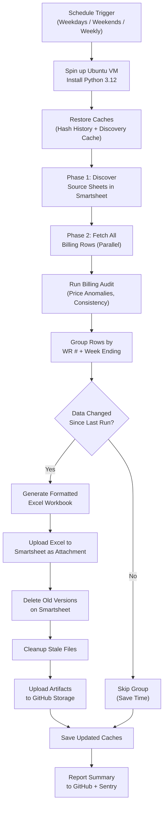
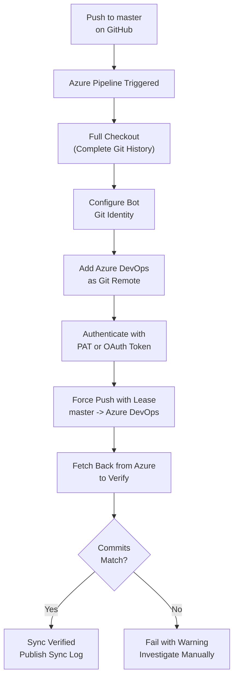
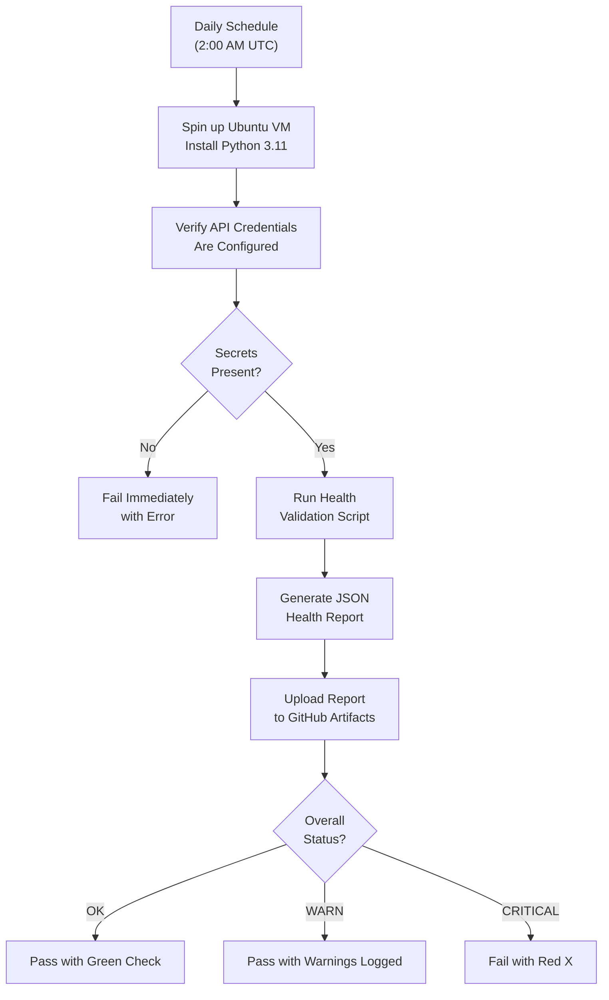
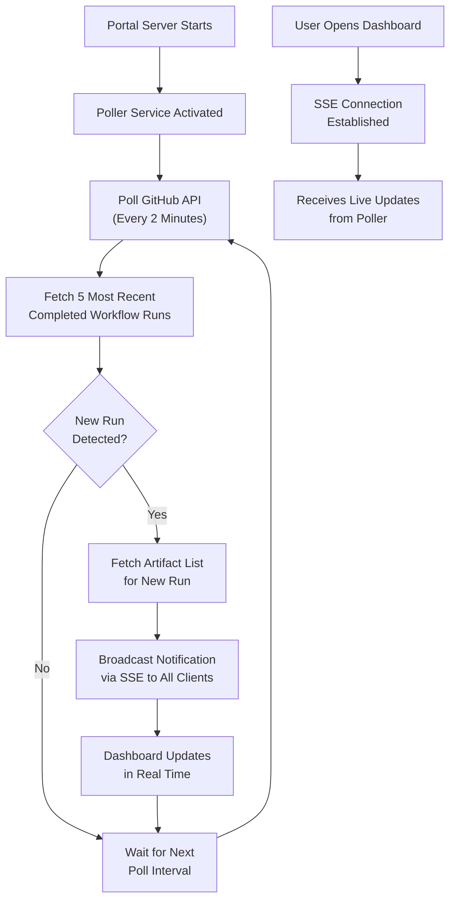
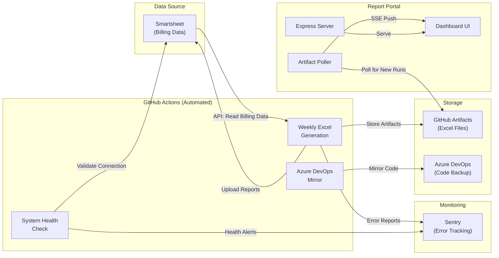

# Sync Job Run Logs

> A non-technical reference guide for every automated job in this repository.
> Each section explains **what** the job does, **how** it works step-by-step,
> includes a visual logic map (Mermaid diagram), and describes expected outcomes
> and error handling.

---

## Table of Contents

1. [Weekly Excel Report Generation](#1-weekly-excel-report-generation)
2. [GitHub → Azure DevOps Repository Mirror](#2-github--azure-devops-repository-mirror)
3. [System Health Check](#3-system-health-check)
4. [Report Portal Artifact Poller](#4-report-portal-artifact-poller)

---

## 1. Weekly Excel Report Generation

**Sync Job Name:** `Weekly Excel Generation with Sentry Monitoring`
**Workflow File:** `.github/workflows/weekly-excel-generation.yml`
**Core Script:** `generate_weekly_pdfs.py`

### Primary Purpose

This is the most important job in the system. It automatically pulls live billing
data from Smartsheet (a cloud spreadsheet platform where field crews log their
work), transforms that data into professional Excel reports organized by Work
Request number and billing week, and uploads those reports back to Smartsheet as
attachments. These Excel files are used by project managers and accounting teams
to review and approve weekly billing.

### How It Works (Step-by-Step)

1. **Trigger:** The job runs automatically on a schedule:
   - **Weekdays (Mon–Fri):** Every 2 hours during business hours (8 AM – 6 PM Central).
   - **Weekends (Sat–Sun):** Three times per day (10 AM, 2 PM, 6 PM Central).
   - **Weekly Deep Run:** Monday at midnight Central for a comprehensive pass.
   - **Manual:** An operator can trigger it at any time from the GitHub Actions UI with custom options (test mode, debug mode, filters, etc.).

2. **Environment Setup:** A fresh Ubuntu virtual machine spins up, installs Python 3.12, and restores two cached files from the previous run:
   - **Hash History** — a record of what data looked like last time, so unchanged reports can be skipped.
   - **Discovery Cache** — a remembered list of which Smartsheet sheets contain relevant data, so the system doesn't have to re-scan every time.

3. **Phase 1 — Sheet Discovery:** The script connects to Smartsheet using a secure API token and scans configured folders (Subcontractor folders and Original Contract folders) to find all sheets that contain billing data. Results are cached for up to 7 days.

4. **Phase 2 — Data Fetch:** For each discovered sheet, the script reads every row of billing data in parallel (up to 8 concurrent connections). This includes fields like Work Request number, week ending date, unit prices, quantities, foreman names, pole numbers, and more.

5. **Billing Audit:** Before generating any reports, the system runs an automated audit that checks for:
   - Unauthorized price changes or suspicious modifications.
   - Data consistency issues (e.g., mismatched totals, missing required fields).
   - The audit assigns a risk level (OK, WARN, or CRITICAL) to the dataset.

6. **Grouping:** All fetched rows are organized into groups by Work Request number and week ending date. Each group becomes one Excel report. A "helper" variant may also be created when additional grouping criteria (helper foreman, department, job) are present.

7. **Change Detection:** For each group, a data fingerprint (hash) is calculated. If the fingerprint matches the stored history **and** the existing attachment is still present on Smartsheet, the group is skipped — saving time and API calls.

8. **Excel Generation:** For groups that are new or have changed, a formatted Excel workbook is created with:
   - Company logo header.
   - Work Request details (number, scope, foreman).
   - Line-item billing data with proper formatting (currency, dates, alignment).
   - Summary totals.

9. **Upload to Smartsheet:** Generated Excel files are uploaded as attachments to the corresponding Work Request row in a target Smartsheet. Old versions of the same report are deleted first. Uploads run in parallel for speed.

10. **Cleanup:** Stale local files and orphaned Smartsheet attachments that no longer correspond to any current data are removed.

11. **Artifact Preservation:** All generated Excel files are packaged and uploaded to GitHub's cloud storage, organized three ways:
    - **Complete Bundle** — everything in one download.
    - **By Work Request** — one folder per WR number.
    - **By Week Ending** — one folder per billing week.
    - A JSON **manifest** with SHA-256 checksums is also stored for validation.

12. **Cache Save:** The updated hash history and discovery cache are saved so the next run can skip unchanged data.

13. **Time Budget:** If the job approaches its 90-minute limit, it gracefully stops processing new groups (at the 80-minute mark) and saves all progress so remaining groups are picked up on the next scheduled run.

### Visual Logic Map

### Expected Outcomes & Error Handling

**Successful Run:**
- All groups with changed data have new Excel files generated and uploaded.
- Unchanged groups are skipped (logged as "Skip — unchanged + attachment exists").
- A summary appears in the GitHub Actions UI showing total files, sizes, and WR counts.
- Sentry receives a "cron check-in OK" signal.
- Artifacts are downloadable from the GitHub Actions run page for 90 days (30 days in test mode).

**Failure Scenarios:**
- **Missing API Token:** Job fails immediately with a clear error message.
- **Smartsheet API Rate Limit:** The Smartsheet SDK automatically retries with backoff (300 requests/minute limit).
- **Individual Group Failure:** If one Excel report fails, the error is logged and the job continues with the next group. Sentry captures the exception with full context (WR number, week, row count, traceback).
- **Time Budget Exceeded:** The job stops gracefully at 80 minutes, saves all progress, and logs which groups remain. They will be processed on the next scheduled run.
- **Audit CRITICAL:** The audit flags high-risk anomalies which are logged and sent to Sentry, but report generation still proceeds.
- **All Errors:** Sentry receives detailed error reports with custom tags, context blocks, and breadcrumbs for debugging. The GitHub Actions step summary shows the failure.

---

## 2. GitHub → Azure DevOps Repository Mirror

**Sync Job Name:** `Sync-GitHub-to-Azure-DevOps`
**Pipeline Files:** `azure-pipelines.yml` (root) and `.github/workflows/azure-pipelines.yml`

### Primary Purpose

This job keeps a backup copy of the entire codebase in Azure DevOps (Microsoft's
code hosting platform). Every time a change is pushed to the `master` branch on
GitHub, this job automatically copies (mirrors) that exact change to the Azure
DevOps repository. This ensures the organization has a second copy of the code in
a different cloud provider for redundancy and compliance purposes.

### How It Works (Step-by-Step)

1. **Trigger:** Runs automatically whenever code is pushed to the `master` branch on GitHub. It ignores changes to documentation files (`README.md`) and GitHub-specific configuration (`.github/` folder).

2. **Full Checkout:** The pipeline downloads the complete repository with full Git history (not just the latest snapshot). This prevents "shallow clone" errors when pushing to Azure.

3. **Configure Git Identity:** Sets up a bot identity ("Azure Pipeline Sync Bot") so the sync operations are clearly attributed in logs.

4. **Add Azure Remote:** Adds the Azure DevOps repository as a secondary Git remote. The target is the `LinetecDevelopment` organization's `Resiliency - Development` project.

5. **Authenticate:** Uses either a Personal Access Token (PAT) or Azure DevOps OAuth system token, encoded as an HTTP authorization header. The credentials are never stored in the repository — they come from secure pipeline variables.

6. **Push to Azure:** The current `master` branch is force-pushed to the Azure DevOps repository using `--force-with-lease`, which is safer than a regular force push because it checks that nobody else has pushed changes to Azure since the last sync.

7. **Verify:** After pushing, the pipeline fetches the Azure copy back and compares commit SHAs. If the GitHub commit and Azure commit match, the sync is verified. If they don't match, the job fails with a warning.

8. **Publish Sync Log:** The Git reflog is saved as a build artifact for auditing purposes.

### Visual Logic Map

### Expected Outcomes & Error Handling

**Successful Run:**
- The Azure DevOps repository's `master` branch is an exact mirror of GitHub's `master`.
- The verification step confirms matching commit SHAs.
- A sync log artifact is published for audit trail.

**Failure Scenarios:**
- **Missing Credentials:** If `AZDO_PAT` or `AzureDevOpsRepoUrl` is not configured, the pipeline skips the sync steps gracefully with a warning message instead of crashing.
- **Concurrent Changes on Azure:** The `--force-with-lease` flag prevents overwriting changes made directly on Azure. If someone committed directly to Azure DevOps, the push is rejected and the job fails so a human can investigate.
- **Network Failure:** Standard Azure Pipelines retry logic applies. The job can be re-run manually.
- **Shallow Clone Error:** Prevented by `fetchDepth: 0` configuration which always fetches full history.

---

## 3. System Health Check

**Sync Job Name:** `System Health Check`
**Workflow File:** `.github/workflows/system-health-check.yml`
**Core Script:** `validate_system_health.py`

### Primary Purpose

This job runs a daily diagnostic check to make sure all the components the Excel
generation system depends on are working correctly. Think of it as an automated
"pre-flight checklist" that verifies the Smartsheet connection, API credentials,
and data integrity before any issues affect the billing reports.

### How It Works (Step-by-Step)

1. **Trigger:** Runs automatically every day at 2:00 AM UTC, or can be triggered manually at any time.

2. **Environment Setup:** A fresh Ubuntu VM installs Python 3.11 and all required dependencies.

3. **Verify Secrets:** Before running any checks, the job confirms that the required API credentials (Smartsheet API token) are properly configured. If missing, the job fails immediately with a clear error.

4. **Run Health Validation:** The `validate_system_health.py` script performs a series of checks against the Smartsheet API and other system dependencies. It produces a JSON report with an overall status.

5. **Evaluate Results:** The health report is parsed and the overall status is evaluated:
   - **OK** — All systems are healthy. The job passes with a green checkmark.
   - **WARN** — Some non-critical issues detected (e.g., approaching API rate limits). The job passes but logs warnings.
   - **CRITICAL** — A major issue detected (e.g., API token expired, critical sheet missing). The job fails with a red X.

6. **Upload Report:** The JSON health report is uploaded as a GitHub Actions artifact, retained for 30 days.

### Visual Logic Map

### Expected Outcomes & Error Handling

**Successful Run:**
- A `system_health.json` file is generated and uploaded as an artifact.
- The overall status is `OK` — all dependencies are reachable and functioning.
- The workflow completes with a success status.

**Failure Scenarios:**
- **Missing Smartsheet Token:** The job fails at the "Verify secrets" step with a clear message telling the administrator to configure the secret.
- **Sentry DSN Missing:** This is non-blocking — the job continues without error monitoring.
- **Health Check CRITICAL:** The job exits with code 1 (failure), which triggers GitHub's notification system. Repository watchers are alerted via email or their configured notification channel.
- **Script Not Found:** If `validate_system_health.py` is missing or renamed, the job fails at the execution step.
- **Timeout:** The job has a 10-minute timeout. If the health check hangs (e.g., unresponsive API), it is killed and marked as failed.

---

## 4. Report Portal Artifact Poller

**Sync Job Name:** `Artifact Poller Service`
**Service Files:** `portal/services/poller.js`, `portal/services/github.js`
**Entry Point:** `portal/server.js`

### Primary Purpose

The Report Portal is a web dashboard where team members can view and download
the generated billing Excel reports. The Artifact Poller is a background service
running inside the portal that continuously checks GitHub for new workflow runs.
When a new batch of reports is generated, the poller detects it in real time and
pushes a notification to any user who has the dashboard open — no page refresh
needed.

### How It Works (Step-by-Step)

1. **Startup:** When the Express.js web server starts, the poller is automatically activated (unless disabled via configuration). It begins its polling loop immediately.

2. **Polling Cycle:** Every 2 minutes (configurable from 1 second to 1 hour), the poller:
   - Calls the GitHub API to fetch the 5 most recent completed runs of the "Weekly Excel Generation" workflow.
   - Compares the latest run ID against the last known run ID.

3. **New Run Detected:** If a new workflow run is found:
   - The poller fetches the list of artifacts (downloadable files) from that run.
   - It packages the run details (run number, status, conclusion, branch, timestamps) and artifact details (names, sizes, expiry status) into a notification payload.

4. **Real-Time Notification:** The notification is broadcast to all connected dashboard users via Server-Sent Events (SSE). This means the browser updates automatically — no polling or page refresh required on the client side.

5. **Status Tracking:** The poller maintains its internal state:
   - Whether it's running.
   - When it last polled.
   - The last known run ID.
   - Any recent errors.
   - How many browser clients are connected.

6. **Artifact Organization:** When users browse the dashboard, the portal's API can:
   - List all recent workflow runs with their artifacts.
   - Organize artifacts by Work Request number.
   - Download individual artifact ZIP files directly through the portal.
   - Parse and preview Excel file contents in the browser.

### Visual Logic Map

### Expected Outcomes & Error Handling

**Successful Operation:**
- The poller runs continuously in the background while the portal is online.
- When new reports are generated, dashboard users see them appear within 2 minutes.
- The `/health` endpoint on the portal reports the poller status (running, last poll time, connected clients).

**Failure Scenarios:**
- **GitHub Token Missing:** API calls fail with authentication errors. The poller logs the error and retries on the next cycle.
- **GitHub API Rate Limit:** The poller makes at most ~720 API calls per day (one every 2 minutes). GitHub's rate limit of 5,000/hour is far above this. If limits are hit, errors are logged and retries happen naturally on the next poll.
- **Network Error:** Individual poll failures are caught and logged. The poller continues its cycle — it doesn't crash on a single failure.
- **SSE Disconnection:** If a browser tab is closed or the connection drops, the client is automatically removed from the broadcast list. No stale connections accumulate.
- **No Connected Clients:** If nobody is viewing the dashboard, the poller still runs but skips the artifact fetch for new runs (it only fetches artifact details when there are active clients). This saves unnecessary API calls.

---

## Appendix: System Architecture Overview

---

## Glossary

| Term | Meaning |
|------|---------|
| **WR (Work Request)** | A unique identifier for a specific job or project in the field. Each WR has its own billing data. |
| **Week Ending** | The Saturday date that marks the end of a billing week. Reports are grouped by this date. |
| **Hash History** | A stored record of data fingerprints. Used to detect whether billing data has changed since the last report generation. |
| **Discovery Cache** | A cached list of which Smartsheet sheets contain billing data, so the system doesn't re-scan every run. |
| **Artifact** | A file (or group of files) stored in GitHub's cloud after a workflow run. Can be downloaded later. |
| **SSE (Server-Sent Events)** | A web technology that allows the server to push real-time updates to the browser without the browser having to ask. |
| **Sentry** | A cloud-based error tracking service that receives alerts and diagnostics when something goes wrong. |
| **Force-with-Lease** | A safer version of Git's force push that checks no one else has made changes before overwriting. |
| **PAT (Personal Access Token)** | A secure credential (like a password) used to authenticate with Azure DevOps. |
| **Manifest** | A JSON file that lists every generated Excel file with its metadata (size, checksum, WR number, week). |

---

*Last updated: 2026-04-04 — Auto-generated by sync job analysis.*
