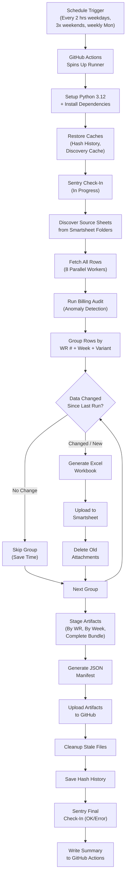
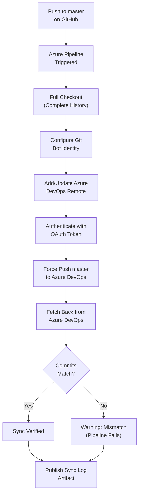
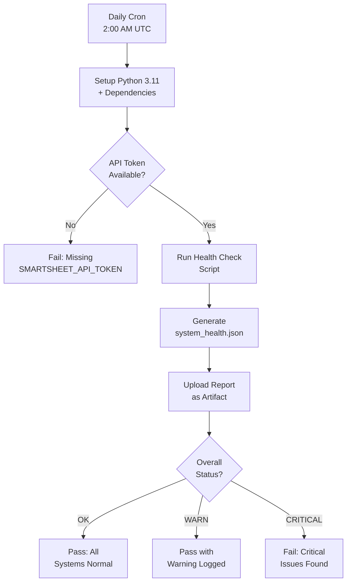
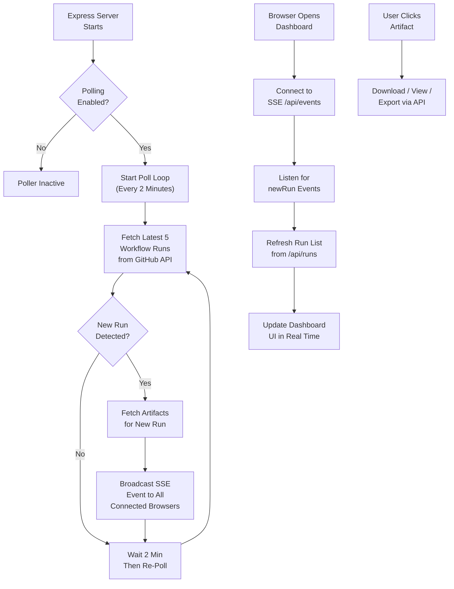
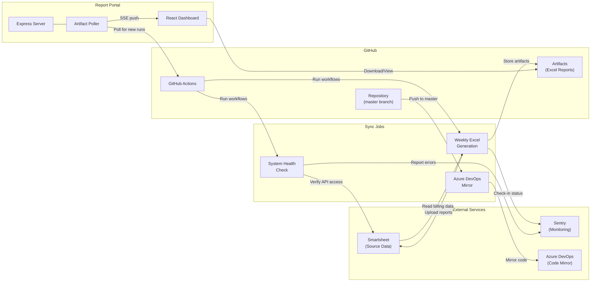

# Sync Job Run Logs

> **Generated:** 2026-03-25 | **Repository:** Generate-Weekly-PDFs-DSR-Resiliency  
> This document provides plain-English Run Logs for every automated sync job in the system. Each section explains what the job does, how it works step-by-step, and what to expect when it runs.

---

## Table of Contents

1. [Weekly Excel Report Generation](#1-weekly-excel-report-generation)
2. [GitHub → Azure DevOps Repository Mirror](#2-github--azure-devops-repository-mirror)
3. [System Health Check](#3-system-health-check)
4. [Report Portal Artifact Poller](#4-report-portal-artifact-poller)

---

## 1. Weekly Excel Report Generation

### Sync Job Name
`weekly-excel-generation` (GitHub Actions Workflow + Python Pipeline)

### Primary Purpose
This is the core data pipeline of the system. It automatically pulls billing data from Smartsheet (a cloud spreadsheet platform used by field teams), transforms that data into organized Excel reports grouped by Work Request number and billing week, and uploads the finished reports back to Smartsheet as attachments. The generated reports are also preserved as downloadable artifacts in GitHub. This job ensures that billing stakeholders always have up-to-date, properly formatted weekly reports without manual spreadsheet work.

### How It Works (Step-by-Step)

1. **Trigger** — The job starts automatically on a schedule or when someone manually triggers it:
   - **Weekdays (Mon–Fri):** Runs every 2 hours from 8 AM to 8 PM Central Time (1 PM, 3 PM, 5 PM, 7 PM, 9 PM, 11 PM, 1 AM UTC).
   - **Weekends (Sat–Sun):** Runs 3 times at 10 AM, 2 PM, and 6 PM Central.
   - **Weekly Comprehensive:** A special full-processing run happens Monday at 6 PM Central.
   - **Manual Dispatch:** Anyone with access can start it on-demand from GitHub with custom options (test mode, specific Work Requests, debug logging, etc.).

2. **Environment Setup** — GitHub Actions spins up a fresh Ubuntu server, installs Python 3.12, and loads all required libraries (Smartsheet SDK, openpyxl for Excel creation, Sentry for error monitoring, pandas for data processing).

3. **Cache Restoration** — The system restores two cached datasets from previous runs to speed things up:
   - **Hash History** — A record of what data looked like last time, so unchanged reports can be skipped.
   - **Discovery Cache** — A saved list of which Smartsheet sheets contain relevant data, avoiding re-scanning every time.

4. **Sentry Monitoring Check-In** — The job registers an "in progress" check-in with Sentry (an error-monitoring service), which starts a timer. If the job doesn't report back within 2 hours, Sentry will flag it as failed.

5. **Sheet Discovery** — The Python script connects to Smartsheet using an API token and scans configured folders to find all source data sheets. It looks in both "Subcontractor" and "Original Contract" folders, identifying sheets by their folder IDs.

6. **Data Fetching** — Using up to 8 parallel workers (threads), the script pulls all rows from every discovered sheet simultaneously. This parallelism keeps the process fast despite Smartsheet's API rate limits (300 requests/minute). Each row represents a billing line item with fields like Work Request #, CU code, quantities, prices, dates, and foreman assignments.

7. **Billing Audit** — Before generating reports, an audit module scans the financial data for anomalies — unusual prices, missing fields, or suspicious patterns. The audit produces a risk level (OK, WARN, or CRITICAL) that gets logged and sent to Sentry.

8. **Data Grouping** — Rows are grouped by Work Request number, week-ending date, and variant type (primary vs. helper). Each group becomes one Excel report. The system supports three grouping modes:
   - **Both** (default): Generates standard reports AND helper-specific reports.
   - **Primary only**: Just the standard Work Request reports.
   - **Helper only**: Just the helper/resiliency-grouped reports.

9. **Change Detection** — For each group, the system calculates a data "fingerprint" (hash). If the fingerprint matches the last run AND the corresponding attachment still exists on Smartsheet, the group is skipped entirely. This prevents unnecessary regeneration and saves significant processing time.

10. **Excel Generation** — For each group that needs updating, the script creates a formatted Excel workbook using openpyxl. Reports include the company logo, structured billing data with proper column formatting, calculated totals, and metadata headers. Subcontractor pricing is automatically reverted to original contract rates when applicable.

11. **Upload to Smartsheet** — Each generated Excel file is uploaded back to Smartsheet as a row attachment on the target sheet. Before uploading, the system deletes any outdated attachments for the same Work Request/week combination to prevent duplicates.

12. **Artifact Staging & Upload** — All generated Excel files are organized into three directory structures for GitHub artifact storage:
    - **By Work Request** — One folder per WR number containing all its weekly reports.
    - **By Week Ending** — One folder per billing week containing all WR reports for that week.
    - **Complete Bundle** — Everything together with the manifest and audit logs.

13. **Manifest Generation** — A separate Python script (`generate_artifact_manifest.py`) creates a JSON manifest cataloging every generated file with its SHA256 hash, file size, Work Request number, week ending, and timestamps.

14. **Cleanup** — Stale local Excel files from previous runs that are no longer valid are removed. Untracked attachments on the Smartsheet target sheet are also cleaned up.

15. **Hash History Persistence** — The updated hash history (recording what was generated) is saved back to the cache so the next run can detect changes efficiently.

16. **Sentry Final Check-In** — The job reports its final status (OK or ERROR) to Sentry, completing the cron monitor cycle. Sentry will alert if 2+ consecutive runs fail.

17. **Summary Output** — A detailed summary is written to the GitHub Actions step summary showing total files generated, sizes, Work Request counts, week counts, and access instructions for downloading artifacts.

### Visual Logic Map

### Expected Outcomes & Error Handling

**Successful Run:**
- All eligible Work Request groups have up-to-date Excel reports generated and uploaded to Smartsheet.
- GitHub Actions artifacts are available for download (retained for 90 days in production, 30 days in test mode).
- A JSON manifest catalogs all files with SHA256 checksums for integrity validation.
- Sentry receives an OK check-in; no alerts are triggered.

**Failure Scenarios:**
- **Missing API Token:** If `SMARTSHEET_API_TOKEN` is not configured, the job fails immediately with a clear error unless running in test mode (which uses synthetic data).
- **No Source Sheets Found:** If sheet discovery returns no results, an exception is raised and logged.
- **Individual Group Failure:** If one WR group fails to process, the error is captured in Sentry with full context (WR number, row count, variant type), and processing continues with the remaining groups.
- **Upload Failure:** Failed Smartsheet uploads are logged but do not halt the entire pipeline.
- **Sentry Alerts:** If 2 or more consecutive runs produce errors, Sentry triggers an alert to the configured notification channel. The system auto-recovers after 1 successful run.
- **Timeout:** The workflow has a 120-minute timeout. If exceeded, GitHub Actions kills the job and Sentry's missing check-in triggers an alert.

---

## 2. GitHub → Azure DevOps Repository Mirror

### Sync Job Name
`Sync-GitHub-to-Azure-DevOps` (Azure Pipelines YAML)

### Primary Purpose
This job keeps a mirror copy of the codebase in Azure DevOps synchronized with the primary GitHub repository. Every time code is pushed to the `master` branch on GitHub, this pipeline automatically replicates those changes to Azure DevOps. This ensures that teams working in the Azure DevOps ecosystem have access to the latest code without any manual copy-paste or dual maintenance.

### How It Works (Step-by-Step)

1. **Trigger** — The pipeline activates automatically whenever a push is made to the `master` branch on GitHub. It ignores changes to documentation files (README.md) and GitHub-specific configuration (.github/ folder) to avoid unnecessary syncs.

2. **Full Checkout** — The pipeline checks out the complete repository with full history (`fetchDepth: 0`). This is critical because a shallow clone would cause errors when pushing to Azure DevOps — Git needs the full commit graph to properly synchronize.

3. **Configure Git Identity** — Git is configured with a bot identity ("Azure Pipeline Sync Bot") so that any merge commits or logs show a clear machine-originated author.

4. **Add Azure DevOps Remote** — The pipeline adds (or updates) a Git remote named `azure-devops` pointing to the target Azure DevOps repository URL. This URL is provided via a pipeline variable (`AzureDevOpsRepoUrl`).

5. **Authenticate & Push** — Using Azure DevOps' built-in OAuth token (`System.AccessToken`), the pipeline force-pushes the current `master` branch to the Azure DevOps remote. The `--force` flag ensures the Azure copy always matches GitHub exactly, even if history has been rewritten.

6. **Verify Sync** — After pushing, the pipeline fetches back from the Azure DevOps remote and compares the commit SHA on both sides. If the commits match, the sync is verified. If they don't match, the pipeline fails with a warning.

7. **Publish Sync Log** — The Git reflog is published as a build artifact (`sync-log`) for troubleshooting purposes, available regardless of whether the sync succeeded or failed.

### Visual Logic Map

### Expected Outcomes & Error Handling

**Successful Run:**
- The `master` branch on Azure DevOps is an exact mirror of GitHub's `master` branch.
- Commit SHAs match on both sides, confirmed by the verification step.
- A sync log artifact is published for audit trail purposes.

**Failure Scenarios:**
- **Missing Repo URL:** If the `AzureDevOpsRepoUrl` pipeline variable is not configured, the pipeline exits immediately with a descriptive error message explaining what needs to be set.
- **Authentication Failure:** If the `System.AccessToken` lacks push permissions, the Git push fails. Resolution: Enable "Allow scripts to access the OAuth token" in Azure DevOps Project Settings → Pipelines → Settings.
- **Commit Mismatch:** If the verification step finds different commits on GitHub vs. Azure DevOps, the pipeline fails with a warning. This could indicate concurrent changes on the Azure side or a push that was blocked by branch policies.
- **Network Errors:** Transient network failures during push or fetch will cause the pipeline step to fail, triggering Azure DevOps' built-in retry/notification mechanisms.

---

## 3. System Health Check

### Sync Job Name
`system-health-check` (GitHub Actions Workflow)

### Primary Purpose
This job runs a daily diagnostic check on the entire system to verify that all critical components are working correctly — primarily that the Smartsheet API connection is functional and that data sources are accessible. Think of it as a daily "heartbeat" test that catches problems before they affect the main report generation pipeline.

### How It Works (Step-by-Step)

1. **Trigger** — Runs automatically every day at 2:00 AM UTC. Can also be triggered manually at any time via the GitHub Actions UI.

2. **Environment Setup** — Spins up an Ubuntu runner with Python 3.11, installs dependencies, and restores the pip cache for faster setup.

3. **Secrets Verification** — Before running any checks, the job verifies that the `SMARTSHEET_API_TOKEN` secret is available. If it's missing, the job fails immediately with a clear error — there's no point running health checks without API access.

4. **Run Health Check Script** — Executes `validate_system_health.py`, which performs a series of diagnostic tests against the Smartsheet API and other system dependencies. The script produces a JSON report (`system_health.json`) with an overall status.

5. **Upload Health Report** — The JSON health report is uploaded as a GitHub Actions artifact (retained for 30 days) so team members can review historical health data.

6. **Evaluate Status** — The pipeline reads the `overall_status` field from the health report:
   - **OK** — All systems nominal; the job passes with a green checkmark.
   - **WARN** — Some non-critical issues detected; the job passes but logs a warning.
   - **CRITICAL** — Major problems found; the job fails, which triggers GitHub notifications to repository watchers.

### Visual Logic Map

### Expected Outcomes & Error Handling

**Successful Run:**
- A `system_health.json` artifact is generated and uploaded to GitHub Actions.
- Status is OK or WARN, confirming the system is operational.
- The report is available for 30 days for historical review.

**Failure Scenarios:**
- **Missing API Token:** The job fails at the secrets verification step before any API calls are made. Fix: Ensure `SMARTSHEET_API_TOKEN` is configured in the repository's GitHub Secrets.
- **CRITICAL Health Status:** The job exits with a non-zero code, marking the workflow run as failed. GitHub sends notifications to watchers. The health report artifact contains details about what specifically failed.
- **Script Not Found:** If `validate_system_health.py` is missing from the repository, the Python step fails. This is a deployment/code issue that needs to be resolved by ensuring the file exists.
- **Timeout:** The job has a 10-minute timeout — health checks should complete well within this window. A timeout suggests an API connectivity issue or an unresponsive external service.

---

## 4. Report Portal Artifact Poller

### Sync Job Name
`ArtifactPoller` (Node.js Express Server Background Service)

### Primary Purpose
The Report Portal is a web dashboard where team members can browse, preview, and download the Excel reports generated by the weekly pipeline. The Artifact Poller is a background service running inside the portal's Express server that continuously checks GitHub for new workflow runs and instantly notifies connected browsers when fresh reports are available. This eliminates the need for users to manually refresh the page — they get live updates as soon as new reports are generated.

### How It Works (Step-by-Step)

1. **Server Startup** — When the Express server starts, it checks the `POLLING_ENABLED` configuration (defaults to `true`). If enabled, the ArtifactPoller singleton begins its polling loop.

2. **Poll Cycle** — Every 2 minutes (configurable via `POLL_INTERVAL_MS`), the poller calls the GitHub Actions API to fetch the 5 most recent completed workflow runs for the `weekly-excel-generation.yml` workflow.

3. **New Run Detection** — The poller compares the latest run's ID with the last known run ID. If they differ, a new run has been detected.

4. **Artifact Enrichment** — When a new run is detected, the poller fetches the full artifact list for that run (report bundles, manifests, per-WR packages) and builds a notification payload containing the run metadata (status, conclusion, timestamp) and artifact details (names, sizes, expiry status).

5. **Real-Time Broadcast (SSE)** — The notification is broadcast to all connected browser clients via Server-Sent Events (SSE). Browsers maintain a persistent connection to the `/api/events` endpoint, and the poller pushes `newRun` events through this channel. A keepalive ping is sent every 30 seconds to maintain the connection.

6. **Client-Side Handling** — The React frontend (portal-v2) listens for `runs-updated` SSE events via the `useRuns` hook. When a new run event arrives, it immediately fetches fresh data from the `/api/runs` endpoint, updating the dashboard in real time. New runs are visually highlighted in the UI.

7. **Fallback Polling** — As a backup (in case SSE disconnects), the frontend also polls the API every 2 minutes on its own timer. This ensures the dashboard stays current even if the real-time connection drops.

8. **API Endpoints Served** — The portal exposes several REST endpoints for the frontend:
   - `GET /api/runs` — Paginated list of workflow runs.
   - `GET /api/latest` — The most recent run with its artifacts.
   - `GET /api/runs/:runId/artifacts` — Artifacts for a specific run.
   - `GET /api/artifacts/:id/download` — Download an artifact ZIP.
   - `GET /api/artifacts/:id/view` — Parse and preview an Excel file from an artifact.
   - `GET /api/artifacts/:id/export` — Export as XLSX or CSV.
   - `GET /api/events` — SSE stream for real-time updates.
   - `GET /api/poller-status` — Current poller state (running, last poll time, connected clients, errors).

### Visual Logic Map

### Expected Outcomes & Error Handling

**Successful Operation:**
- The portal dashboard shows the latest workflow runs within 2 minutes of completion.
- Connected browsers receive instant push notifications via SSE when new runs appear.
- Users can download, preview, and export Excel reports directly from the web interface.
- The poller status endpoint reports `running: true` with a recent `lastPollTime` and zero errors.

**Failure Scenarios:**
- **GitHub API Errors:** If the GitHub API returns an error (rate limit, auth failure, network issue), the poller logs the error to console and stores it in `lastError`. It continues retrying on the next poll cycle — a single failure does not stop the poller.
- **Missing GitHub Token:** Without a `GITHUB_TOKEN`, API requests may be rate-limited to 60/hour (unauthenticated). The portal will still function but may miss runs during busy periods. Fix: Set the `GITHUB_TOKEN` environment variable.
- **SSE Disconnection:** If a browser's SSE connection drops, the client-side fallback polling (every 2 minutes) ensures the dashboard stays updated. The browser automatically attempts to reconnect to SSE.
- **No Connected Clients:** If no browsers are connected, the poller still runs (to track the latest run ID) but skips the artifact enrichment step to save API calls.
- **Server Restart:** The poller has no persistent state beyond the last known run ID, which is held in memory. After a restart, the first poll re-establishes the baseline and subsequent polls detect changes normally.

---

## Architecture Overview

The following diagram shows how all four sync jobs relate to each other and to the external systems they interact with:

---

## Glossary

| Term | Meaning |
|------|---------|
| **Work Request (WR)** | A unique identifier for a billing unit of work. Each WR gets its own Excel report per billing week. |
| **Week Ending** | The date that marks the end of a billing week (typically a Sunday). Reports are grouped by this date. |
| **Hash History** | A JSON file that stores data fingerprints from previous runs, enabling the system to skip regenerating unchanged reports. |
| **Discovery Cache** | A cached list of Smartsheet sheet IDs to avoid re-scanning folders on every run. Expires after 60 minutes. |
| **Variant** | A report type — either "primary" (standard WR grouping) or "helper" (grouped by helper foreman/department/job). |
| **SSE (Server-Sent Events)** | A web technology that allows the server to push real-time updates to browsers over a persistent HTTP connection. |
| **Artifact** | A file or bundle of files produced by a GitHub Actions workflow run, stored in GitHub's cloud and downloadable via the API or UI. |
| **Sentry Cron Monitor** | A Sentry feature that tracks recurring jobs. It expects regular check-ins and alerts if a job misses its window or reports errors. |
| **PAT (Personal Access Token)** | A secret token used to authenticate Git operations against Azure DevOps. |
| **Force-with-Lease** | A safer version of Git force-push that only overwrites if the remote hasn't changed since the last fetch, preventing accidental data loss. |
