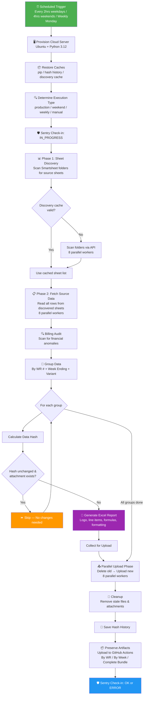
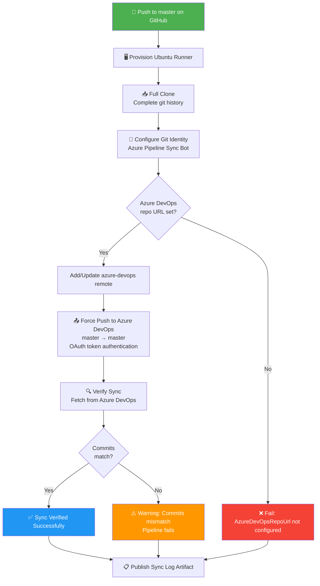
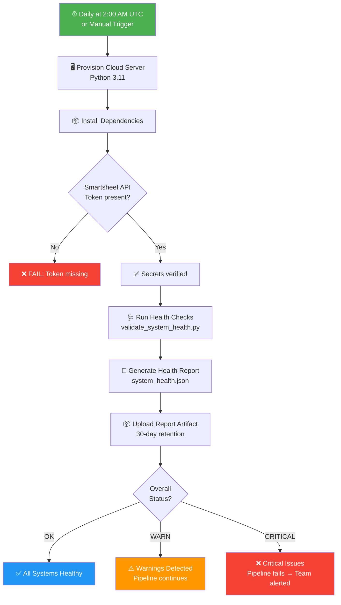
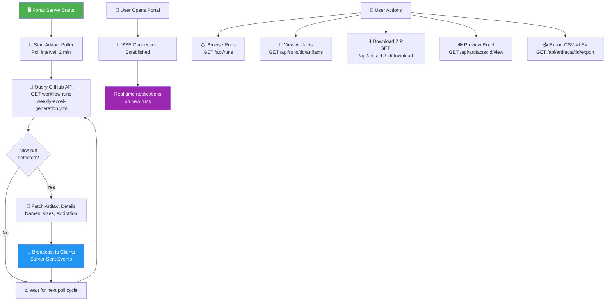
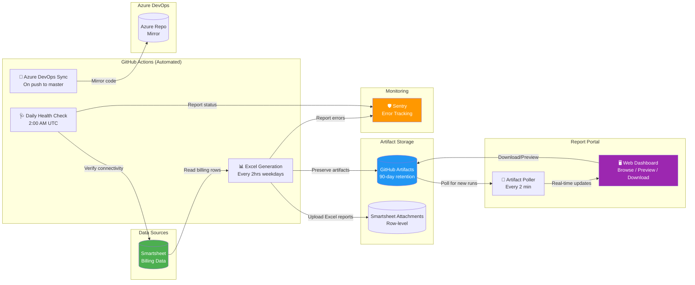

# Sync Job Run Logs

> **Generated**: March 26, 2026
> **Repository**: Generate-Weekly-PDFs-DSR-Resiliency
> **Purpose**: Non-technical run logs explaining how each automated job in this system works, what it produces, and how failures are handled.

---

## Table of Contents

1. [Weekly Excel Report Generation Pipeline](#1-weekly-excel-report-generation-pipeline)
2. [GitHub to Azure DevOps Repository Sync](#2-github-to-azure-devops-repository-sync)
3. [System Health Check](#3-system-health-check)
4. [Report Portal Artifact Poller](#4-report-portal-artifact-poller)

---

## 1. Weekly Excel Report Generation Pipeline

**Sync Job Name**: Weekly Excel Generation with Sentry Monitoring

**Primary Purpose**: This is the core production job. It automatically pulls billing data from Smartsheet (a cloud spreadsheet tool), transforms it into formatted Excel reports organized by Work Request number and billing week, and uploads the finished reports back to Smartsheet as attachments. These reports are used by field teams and billing departments to track weekly work completed by subcontractors and crew members.

### How It Works (Step-by-Step)

1. **Trigger**: The job runs automatically on a schedule — every 2 hours during weekday business hours (Mon–Fri), every 4 hours on weekends, and once weekly on Monday for a comprehensive run. It can also be triggered manually by a team member with custom options (test mode, debug logging, specific Work Request filters, etc.).

2. **Environment Setup**: A fresh cloud server (Ubuntu) is provisioned by GitHub Actions. Python 3.12 is installed, along with all required libraries (Smartsheet SDK, openpyxl for Excel, Sentry for error tracking, etc.). Previously cached data — like pip packages, hash history, and sheet discovery cache — is restored to speed things up.

3. **Execution Type Detection**: The system determines what kind of run this is based on the day/time: "production_frequent" (weekday), "weekend_maintenance" (Sat/Sun), "weekly_comprehensive" (Monday night), or "manual" (user-triggered). This affects how thorough the processing is.

4. **Sentry Monitoring Begins**: The job checks in with Sentry (an error-monitoring service) to signal "I'm starting now." If the job fails to complete, Sentry will automatically alert the team.

5. **Phase 1 — Sheet Discovery**: The system scans designated Smartsheet folders to find all source spreadsheets containing billing data. It looks in both "Subcontractor" and "Original Contract" folders. Results are cached locally (for up to 60 minutes) so the next run doesn't have to re-scan everything.

6. **Phase 2 — Data Fetching**: Using parallel workers (up to 8 simultaneous connections), the system reads every row from all discovered source sheets. Each row represents a billing line item with fields like Work Request number, week ending date, CU code, quantity, price, foreman, and completion status.

7. **Billing Audit**: An automated audit system scans all fetched data for financial anomalies — unusual prices, duplicate entries, or data inconsistencies. The audit assigns a risk level (OK, WARN, or CRITICAL) and logs any anomalies it finds.

8. **Data Grouping**: All rows are grouped by Work Request number, week ending date, and variant type (primary report vs. helper/crew-specific report). This determines how many Excel files need to be generated.

9. **Change Detection (Smart Skip)**: For each group, a data hash (fingerprint) is calculated. If the data hasn't changed since the last run AND the corresponding attachment still exists on the target sheet, the group is skipped entirely. This dramatically reduces processing time on routine runs.

10. **Excel Generation**: For each group that needs processing, a formatted Excel workbook is created. Each report includes the company logo, work request details, line-item billing rows, formulas for totals, and proper formatting (currency, alignment, column widths). Subcontractor prices are reverted to original contract rates when applicable.

11. **Parallel Upload**: All generated Excel files are uploaded back to Smartsheet as row attachments, replacing any older versions. Old attachments for the same WR/week combination are deleted first. Uploads run in parallel (up to 8 workers) for speed.

12. **Cleanup**: Stale local files and untracked remote attachments are removed. Hash history is saved so the next run can perform smart-skip detection.

13. **Artifact Preservation**: Generated Excel files are uploaded to GitHub Actions as downloadable artifacts, organized three ways — as a complete bundle, by Work Request number, and by week ending date. A JSON manifest with file metadata and SHA256 checksums is also created. Production artifacts are retained for 90 days; test artifacts for 30 days.

14. **Sentry Check-in Complete**: The job reports its final status back to Sentry — either "OK" (success) or "ERROR" (failures occurred). All pending error events are flushed to ensure nothing is lost.

### Visual Logic Map

### Expected Outcomes & Error Handling

**Successful Run**: All Work Request groups are processed (generated or skipped if unchanged). Excel reports are uploaded to Smartsheet and preserved as GitHub artifacts. Sentry receives an "OK" check-in. The GitHub Actions summary page shows file counts, sizes, and WR numbers.

**Failure Scenarios**:
- **Missing Smartsheet API Token**: The job fails immediately with a clear error. Sentry is notified.
- **No source sheets found**: Raises an exception; Sentry captures the error with full context (working directory, configuration, etc.).
- **Individual group failure**: The group is skipped with an error log, but the rest of the groups continue processing. Sentry receives detailed context about the failed group (WR number, row count, error type, traceback).
- **Upload failure**: Individual upload errors are logged and counted. The hash history is still saved so the file can be retried on the next run.
- **Session-level crash**: Sentry captures the full exception with session duration, groups attempted vs. completed, and a complete stack trace. The cron monitor reports "ERROR" status, triggering alerts after 2 consecutive failures.

---

## 2. GitHub to Azure DevOps Repository Sync

**Sync Job Name**: Sync-GitHub-to-Azure-DevOps (Repository Mirror)

**Primary Purpose**: This job keeps the Azure DevOps repository perfectly in sync with the GitHub repository. Whenever code is pushed to the `master` branch on GitHub, this job automatically copies those changes over to Azure DevOps. This ensures teams working in Azure DevOps always have the latest code without manual intervention.

### How It Works (Step-by-Step)

1. **Trigger**: The job runs automatically whenever code is pushed to the `master` branch on GitHub. It ignores changes to README files and GitHub-specific configuration (`.github/` folder) since those are only relevant to GitHub.

2. **Full Code Checkout**: The entire code history is checked out (not just the latest version). This full history is required to avoid errors when pushing to Azure DevOps.

3. **Git Identity Configuration**: The system sets up a "bot" identity (`Azure Pipeline Sync Bot`) so that sync operations are clearly identified in Git logs as automated rather than from a human.

4. **Add Azure DevOps Remote**: The system registers the Azure DevOps repository as a push target (called "azure-devops"). The target URL is provided via a secure pipeline variable, not hard-coded.

5. **Push to Azure DevOps**: The current `master` branch is force-pushed to the Azure DevOps repository using a secure OAuth token for authentication. This overwrites the Azure DevOps `master` branch to exactly match GitHub.

6. **Verification**: After the push, the system fetches back from Azure DevOps and compares commit hashes. If the GitHub commit matches the Azure DevOps commit, the sync is confirmed successful. If they don't match, the pipeline fails with a warning.

7. **Publish Sync Log**: Regardless of success or failure, the Git operation log is published as a build artifact for troubleshooting.

### Visual Logic Map

### Expected Outcomes & Error Handling

**Successful Run**: The Azure DevOps repository's `master` branch is an exact mirror of GitHub's `master` branch. The verification step confirms both repositories are at the same commit.

**Failure Scenarios**:
- **Missing Repository URL**: If the `AzureDevOpsRepoUrl` pipeline variable is not set, the job fails immediately with clear instructions on how to set it.
- **Missing PAT (Personal Access Token)**: If `AZDO_PAT` is not configured or not replaced, each step gracefully skips with a warning message instead of crashing.
- **Authentication Failure**: If the OAuth token is expired or insufficient, the `git push` command fails and the error is captured in the sync log artifact.
- **Commit Mismatch**: If Azure DevOps has concurrent changes that conflict, the verification step catches this and fails the pipeline so a human can investigate.

---

## 3. System Health Check

**Sync Job Name**: System Health Check

**Primary Purpose**: This is a daily diagnostic job that verifies all critical systems are functioning correctly — Smartsheet API connectivity, secret availability, and overall system readiness. Think of it as an automated "morning check" that catches problems before they affect the main Excel generation pipeline.

### How It Works (Step-by-Step)

1. **Trigger**: Runs automatically every day at 2:00 AM UTC. Can also be triggered manually at any time.

2. **Environment Setup**: A cloud server is provisioned with Python 3.11 and all project dependencies are installed.

3. **Secret Verification**: Before running any checks, the job verifies that critical secrets are available — specifically the Smartsheet API token (required) and the Sentry DSN (optional). If the Smartsheet token is missing, the job fails immediately.

4. **Run Health Checks**: The `validate_system_health.py` script runs a comprehensive health check suite. This tests API connectivity, token validity, and system configuration.

5. **Generate Health Report**: Results are written to a JSON file (`system_health.json`) containing an overall status (OK, WARN, or CRITICAL) plus detailed check results.

6. **Upload Report**: The health report JSON is uploaded as a GitHub Actions artifact and retained for 30 days.

7. **Evaluate Status**: The job reads the health report and takes action based on the overall status:
   - **OK**: Logs a success message. No further action needed.
   - **WARN**: Logs a warning. The pipeline continues but the issue is visible in the run summary.
   - **CRITICAL**: Logs a critical error and fails the pipeline, which triggers GitHub notifications to the team.

### Visual Logic Map

### Expected Outcomes & Error Handling

**Successful Run**: A health report is generated showing "OK" status. The team has confidence that the next scheduled Excel generation run will succeed.

**Failure Scenarios**:
- **Missing Smartsheet Token**: The job fails at the secret verification step. GitHub sends a notification to repository watchers.
- **API Connectivity Issues**: The health check script detects connectivity problems and reports a WARN or CRITICAL status.
- **CRITICAL Status**: The pipeline exits with a non-zero code, which marks the GitHub Actions run as failed. This is visible in the repository's Actions tab and triggers any configured notifications (email, Slack, etc.).
- **No Report Generated**: If the health check script crashes before writing its report, the "Evaluate health status" step detects the missing file and fails the pipeline.

---

## 4. Report Portal Artifact Poller

**Sync Job Name**: Report Portal Real-Time Artifact Poller

**Primary Purpose**: The Report Portal is a web application where team members can browse, view, and download the Excel reports generated by the Weekly Excel pipeline. The Artifact Poller is a background service inside the portal that continuously checks GitHub for new workflow runs and immediately notifies connected users when fresh reports are available — no page refresh needed.

### How It Works (Step-by-Step)

1. **Startup**: When the Report Portal server starts, the Artifact Poller begins running in the background. It polls the GitHub Actions API at a configurable interval (default: every 2 minutes).

2. **Poll for New Runs**: Every polling cycle, the system queries the GitHub API for the 5 most recent completed runs of the `weekly-excel-generation.yml` workflow.

3. **Detect New Runs**: The poller compares the latest run ID against the last known run ID. If they differ, a new run has been detected.

4. **Fetch Artifact Details**: When a new run is detected, the poller immediately fetches the list of artifacts attached to that run (Excel bundles, manifests, etc.) including names, sizes, and expiration dates.

5. **Broadcast via Server-Sent Events (SSE)**: The new run details and artifact list are broadcast to all connected browser clients through an SSE connection. Users see a real-time notification that new reports are available without refreshing the page.

6. **User Interactions**: Through the portal, users can:
   - **Browse runs**: View a paginated list of all completed workflow runs with status, date, and trigger type.
   - **View artifacts**: See all artifacts for a specific run, organized by Work Request or week ending.
   - **Download**: Download individual artifact ZIP files directly.
   - **Preview**: View Excel contents in-browser without downloading (the server parses the Excel and returns structured data).
   - **Export**: Download individual Excel files or convert them to CSV format.

7. **Polling Status**: The portal exposes a status endpoint showing whether the poller is active, when it last polled, how many clients are connected, and any recent errors.

### Visual Logic Map

### Expected Outcomes & Error Handling

**Successful Operation**: The poller runs continuously in the background. Users see new reports appear in the portal within 2 minutes of the Excel generation pipeline completing. Download, preview, and export all function seamlessly.

**Failure Scenarios**:
- **GitHub API Errors**: If the GitHub API returns an error (rate limit, authentication failure, network issue), the error is logged to the console. The poller continues running and retries on the next cycle — it does not crash.
- **Client Disconnection**: When a user closes their browser tab, their SSE connection is automatically cleaned up. The poller tracks connected clients and only broadcasts when at least one client is listening.
- **Artifact Download Failure**: If downloading an artifact fails (expired, permissions, etc.), the portal returns a clear 502 error to the user with a "Failed to download artifact" message.
- **Excel Parse Failure**: If an artifact cannot be parsed for preview, the portal returns the error details so the user can fall back to downloading the raw file.
- **Missing GitHub Token**: Without a valid `GITHUB_TOKEN`, all API calls fail. The poller logs errors each cycle but continues running so it can recover once the token is configured.

---

## System Architecture Overview

The following diagram shows how all four sync jobs relate to each other and form the complete data pipeline:

---

## Schedule Summary

| Job | Schedule | Duration | Produces |
|-----|----------|----------|----------|
| Weekly Excel Generation | Every 2hrs weekdays, 4hrs weekends, weekly Monday | ~5–30 min depending on changes | Excel reports, Smartsheet attachments, GitHub artifacts |
| Azure DevOps Sync | On every push to `master` | ~1–2 min | Mirrored repository |
| System Health Check | Daily at 2:00 AM UTC | ~2–5 min | Health report JSON |
| Artifact Poller | Continuous (every 2 min) | Always running | Real-time browser notifications |

---

## Glossary

| Term | Meaning |
|------|---------|
| **Work Request (WR)** | A numbered project or job tracking unit in the billing system |
| **Week Ending** | The Saturday date that marks the end of a billing week |
| **CU (Construction Unit)** | A code representing a specific type of work performed |
| **Hash History** | A local record of data fingerprints used to detect changes between runs |
| **Discovery Cache** | A temporary list of known Smartsheet source sheets to avoid re-scanning |
| **SSE (Server-Sent Events)** | A web technology that lets the server push real-time updates to the browser |
| **Sentry** | A cloud service that monitors for errors and sends alerts when things go wrong |
| **Artifact** | A file produced by a workflow run, stored temporarily in GitHub for download |
| **PAT (Personal Access Token)** | A secret credential used to authenticate with Azure DevOps |
