# Smartsheet Weekly PDF Generator - Visual Documentation

> **Quick Navigation:** [Architecture](#system-architecture) | [Data Flow](#data-flow-diagram) | [Filtering Logic](#data-filtering-logic) | [Helper Detection](#helper-row-detection) | [Change Detection](#change-detection-flow) | [GitHub Actions](#github-actions-workflow)

---

## System Architecture

```mermaid
graph TB
    subgraph "Data Sources"
        SS[(Smartsheet<br/>34+ Source Sheets)]
    end

    subgraph "Processing Pipeline"
        DISC[🔍 Sheet Discovery<br/>discover_source_sheets]
        FETCH[📥 Data Extraction<br/>get_all_source_rows]
        GROUP[📂 Grouping<br/>group_source_rows]
        EXCEL[📊 Excel Generation<br/>generate_excel]
    end

    subgraph "Output"
        LOCAL[📁 Local Files<br/>generated_docs/]
        ATTACH[📎 Smartsheet<br/>Row Attachments]
    end

    subgraph "Support Systems"
        AUDIT[🔍 Audit System<br/>BillingAudit]
        HASH[🔐 Hash History<br/>Change Detection]
        CACHE[⚡ Discovery Cache<br/>Performance]
    end

    SS --> DISC
    DISC --> FETCH
    FETCH --> GROUP
    GROUP --> EXCEL
    EXCEL --> LOCAL
    LOCAL --> ATTACH
    
    FETCH -.-> AUDIT
    GROUP -.-> HASH
    DISC -.-> CACHE

    style SS fill:#4285f4,color:#fff
    style EXCEL fill:#34a853,color:#fff
    style AUDIT fill:#fbbc04,color:#000
    style HASH fill:#ea4335,color:#fff
```



---

## Data Flow Diagram

```mermaid
flowchart LR
    subgraph Input
        A[("🗄️ Smartsheet<br/>Source Sheets")]
    end

    subgraph "Phase 1: Discovery"
        B["🔍 Discover Sheets<br/><small>Validate columns exist</small>"]
    end

    subgraph "Phase 2: Extract"
        C["📥 Fetch Rows<br/><small>Apply filters</small>"]
    end

    subgraph "Phase 3: Group"
        D["📂 Group Data<br/><small>By WR + Week</small>"]
        D1["Primary Groups<br/><small>MMDDYY_WR#</small>"]
        D2["Helper Groups<br/><small>MMDDYY_WR#_HELPER_name</small>"]
    end

    subgraph "Phase 4: Generate"
        E["📊 Create Excel<br/><small>Format & brand</small>"]
    end

    subgraph Output
        F[("💾 Local Files<br/>generated_docs/")]
        G[("📎 Smartsheet<br/>Attachments")]
    end

    A --> B --> C --> D
    D --> D1 & D2
    D1 & D2 --> E
    E --> F --> G

    style A fill:#4285f4,color:#fff
    style E fill:#34a853,color:#fff
    style F fill:#673ab7,color:#fff
    style G fill:#673ab7,color:#fff
```



---

## Data Filtering Logic

```mermaid
flowchart TD
    START([📄 Incoming Row]) --> WR{Work Request #<br/>exists?}
    
    WR -->|❌ No| REJECT1[🚫 REJECT<br/>Missing WR#]
    WR -->|✅ Yes| DATE{Weekly Reference<br/>Logged Date exists?}
    
    DATE -->|❌ No| REJECT2[🚫 REJECT<br/>Missing Date]
    DATE -->|✅ Yes| COMPLETED{Units Completed?<br/>= true/checked?}
    
    COMPLETED -->|❌ No| REJECT3[🚫 REJECT<br/>Not Completed]
    COMPLETED -->|✅ Yes| PRICE{Units Total Price<br/>> $0?}
    
    PRICE -->|❌ No| REJECT4[🚫 REJECT<br/>No/Zero Price]
    PRICE -->|✅ Yes| CU{CU code NOT<br/>"NO MATCH"?}
    
    CU -->|❌ No| REJECT5[🚫 REJECT<br/>CU Placeholder]
    CU -->|✅ Yes| ACCEPT[✅ ACCEPT<br/>Include in Output]

    style START fill:#2196f3,color:#fff
    style ACCEPT fill:#4caf50,color:#fff
    style REJECT1 fill:#f44336,color:#fff
    style REJECT2 fill:#f44336,color:#fff
    style REJECT3 fill:#f44336,color:#fff
    style REJECT4 fill:#f44336,color:#fff
    style REJECT5 fill:#f44336,color:#fff
```

---

## Helper Row Detection

```mermaid
flowchart TD
    START([📄 Accepted Row]) --> HELPING{Foreman Helping?<br/>has a value?}
    
    HELPING -->|❌ No| PRIMARY[📊 Primary Excel<br/>Standard WR grouping]
    HELPING -->|✅ Yes| CHECKBOX{Helping Foreman<br/>Completed Unit?<br/>checked?}
    
    CHECKBOX -->|❌ No| PRIMARY
    CHECKBOX -->|✅ Yes| FIELDS{Helper Dept # AND<br/>Helper Job #<br/>present?}
    
    FIELDS -->|❌ No| PRIMARY2[📊 Primary Excel<br/><small>⚠️ Warning logged</small>]
    FIELDS -->|✅ Yes| HELPER[📊 Helper Excel<br/>Separate file created]

    subgraph "Output Files"
        PRIMARY
        PRIMARY2
        HELPER
    end

    style START fill:#2196f3,color:#fff
    style PRIMARY fill:#4caf50,color:#fff
    style PRIMARY2 fill:#ff9800,color:#fff
    style HELPER fill:#9c27b0,color:#fff
```



---

## Change Detection Flow

```mermaid
flowchart TD
    START([📂 Process Group]) --> HASH[🔐 Calculate<br/>Data Hash<br/><small>SHA256 truncated to 16 chars</small>]
    
    HASH --> CHECK{Hash in<br/>history?}
    
    CHECK -->|❌ No| GENERATE[📊 Generate Excel]
    CHECK -->|✅ Yes| MATCH{Hash<br/>matches?}
    
    MATCH -->|❌ No| GENERATE
    MATCH -->|✅ Yes| ATTACH{Attachment<br/>exists?}
    
    ATTACH -->|❌ No| GENERATE
    ATTACH -->|✅ Yes| FORCE{FORCE_GENERATION<br/>= true?}
    
    FORCE -->|✅ Yes| GENERATE
    FORCE -->|❌ No| SKIP[⏩ SKIP<br/>No changes detected]
    
    GENERATE --> UPLOAD[📎 Upload to<br/>Smartsheet]
    UPLOAD --> UPDATE[📝 Update<br/>Hash History]

    style START fill:#2196f3,color:#fff
    style SKIP fill:#9e9e9e,color:#fff
    style GENERATE fill:#4caf50,color:#fff
    style UPDATE fill:#ff9800,color:#fff
```



---

## Excel File Structure

```mermaid
graph TD
    subgraph "Excel Report Structure"
        LOGO["🏢 Company Logo<br/><small>LinetecServices_Logo.png</small>"]
        TITLE["📋 Report Title<br/><small>WEEKLY UNITS COMPLETED PER SCOPE ID</small>"]
        
        subgraph "Summary Section"
            SUM1["💰 Total Billed Amount"]
            SUM2["📊 Total Line Items"]
            SUM3["📅 Billing Period"]
        end
        
        subgraph "Details Section"
            DET1["👤 Foreman"]
            DET2["📝 Work Request #"]
            DET3["🎯 Scope ID #"]
            DET4["📋 Work Order #"]
            DET5["🏢 Customer"]
            DET6["💼 Job #"]
        end
        
        subgraph "Daily Data Blocks"
            MON["📆 Monday<br/><small>Table of work items</small>"]
            TUE["📆 Tuesday<br/><small>Table of work items</small>"]
            WED["📆 Wednesday<br/><small>Table of work items</small>"]
            THU["📆 Thursday<br/><small>Table of work items</small>"]
            FRI["📆 Friday<br/><small>Table of work items</small>"]
            SAT["📆 Saturday<br/><small>Table of work items</small>"]
            SUN["📆 Sunday<br/><small>Table of work items</small>"]
        end
    end

    LOGO --> TITLE
    TITLE --> SUM1 & SUM2 & SUM3
    SUM1 --> DET1
    DET1 --> DET2 --> DET3 --> DET4 --> DET5 --> DET6
    DET6 --> MON --> TUE --> WED --> THU --> FRI --> SAT --> SUN

    style LOGO fill:#c62828,color:#fff
    style TITLE fill:#1565c0,color:#fff
```



---

## GitHub Actions Workflow

```mermaid
flowchart LR
    subgraph "Triggers"
        SCHED["⏰ Schedule<br/><small>Every 2 hours weekdays</small>"]
        MANUAL["👆 Manual<br/><small>workflow_dispatch</small>"]
    end

    subgraph "Execution"
        CHECKOUT["📥 Checkout"]
        SETUP["🐍 Setup Python"]
        DEPS["📦 Install Dependencies"]
        RUN["▶️ Run Generator"]
    end

    subgraph "Artifacts"
        MANIFEST["📋 Generate Manifest"]
        ORGANIZE["🗂️ Organize by WR/Week"]
        UPLOAD["☁️ Upload Artifacts"]
    end

    SCHED & MANUAL --> CHECKOUT
    CHECKOUT --> SETUP --> DEPS --> RUN
    RUN --> MANIFEST --> ORGANIZE --> UPLOAD

    style SCHED fill:#ff9800,color:#fff
    style MANUAL fill:#2196f3,color:#fff
    style UPLOAD fill:#4caf50,color:#fff
```



---

## Environment Configuration


---

## Quick Reference

### Key Files

| File | Purpose |
|------|---------|
| `generate_weekly_pdfs.py` | Main production script |
| `audit_billing_changes.py` | Billing audit system |
| `RUNBOOK.md` | Complete technical documentation |

### Filename Format

```
Primary:  WR_{WR#}_WeekEnding_{MMDDYY}_{HHMMSS}_{hash}.xlsx
Helper:   WR_{WR#}_WeekEnding_{MMDDYY}_{HHMMSS}_Helper_{name}_{hash}.xlsx
```

### Common Commands

```bash
# Production run
python generate_weekly_pdfs.py

# Test mode (no uploads)
TEST_MODE=true python generate_weekly_pdfs.py

# Force regenerate all
FORCE_GENERATION=true python generate_weekly_pdfs.py

# Process specific WRs
WR_FILTER="90093002,89954686" python generate_weekly_pdfs.py
```

---

<div align="center">

📖 **Full Documentation:** [RUNBOOK.md](../RUNBOOK.md)

</div>
