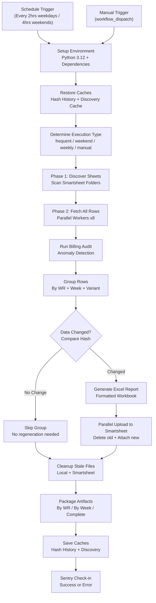
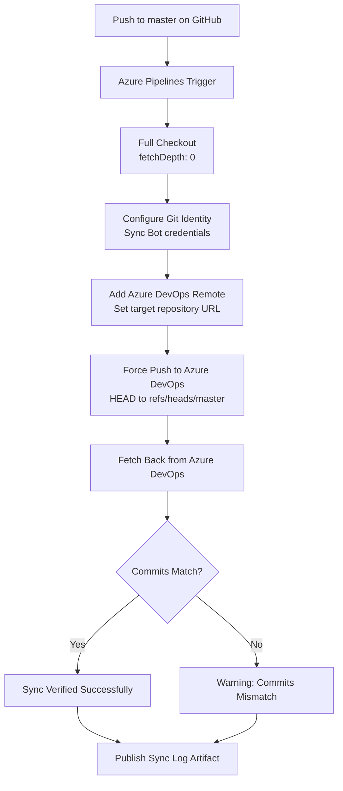
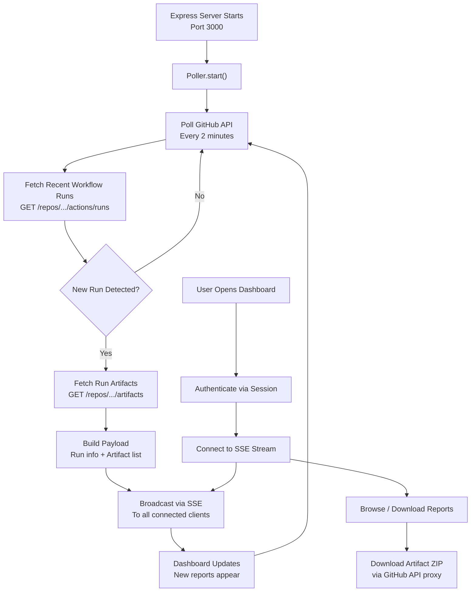
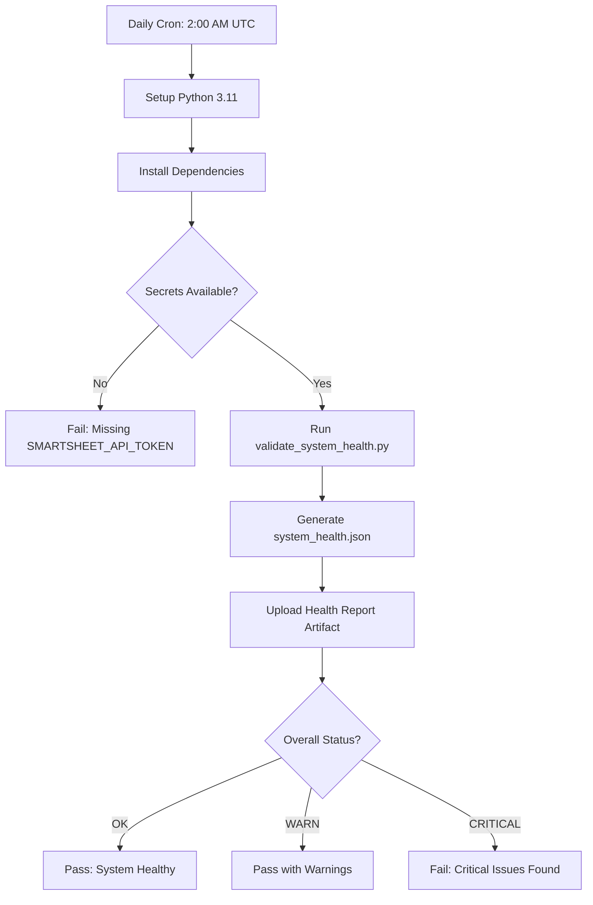
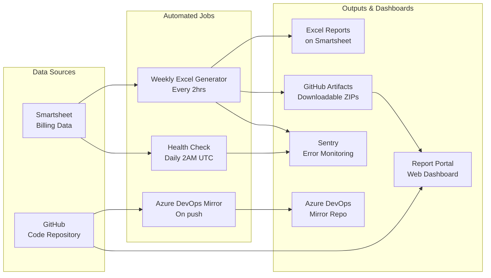

# Sync Job Run Logs — Technical Documentation

> Non-technical explanations of each automated sync job in the **Generate-Weekly-PDFs-DSR-Resiliency** repository. Each section includes a plain-English summary, step-by-step walkthrough, Mermaid.js visual logic map, and error-handling details.

*Last updated: March 29, 2026*

---

## 1. Weekly Excel Billing Report Generator

### Sync Job Name

`weekly-excel-generation.yml` → `generate_weekly_pdfs.py`

### Primary Purpose

This is the **core production job**. It automatically pulls billing data from Smartsheet (a cloud spreadsheet platform), processes thousands of line-item rows, and generates formatted Excel reports organized by Work Request number and billing week. These reports are then uploaded back to Smartsheet and stored as downloadable artifacts in GitHub. This ensures that billing teams always have up-to-date, accurate weekly reports without any manual spreadsheet work.

### How It Works (Step-by-Step)

1. **Trigger**: The job runs on an automatic schedule — every 2 hours on weekdays (8 AM to 6 PM CT and again at midnight), every 4 hours on weekends, and once on Monday mornings for a comprehensive weekly run. It can also be started manually with custom options.
2. **Environment Setup**: A fresh Linux server is provisioned. Python 3.12 is installed, and all required libraries (Smartsheet SDK, pandas, openpyxl, Sentry) are loaded from a cached dependency list.
3. **Cache Restoration**: The system restores two cached files from previous runs — the **hash history** (a record of what data looked like last time) and the **discovery cache** (a map of which Smartsheet sheets to read). This avoids redundant work.
4. **Execution Type Detection**: The system checks what day and time it is to determine the run type: `production_frequent` (weekday), `weekend_maintenance`, `weekly_comprehensive` (Monday night), or `manual`.
5. **Phase 1 — Sheet Discovery**: The script connects to Smartsheet using a secure API token and discovers all relevant source sheets by scanning configured folder IDs. It identifies which sheets contain subcontractor data vs. original contract data. Results are cached for 7 days.
6. **Phase 2 — Data Fetch**: All rows are pulled from the discovered sheets using parallel workers (8 simultaneous connections) to speed up the process. Each row contains billing fields like Work Request number, CU codes, quantities, prices, dates, and foreman assignments.
7. **Billing Audit**: An automated audit system scans the fetched data for anomalies — unusual prices, missing fields, or suspicious patterns. It assigns a risk level (LOW, MEDIUM, HIGH, CRITICAL) for monitoring.
8. **Data Grouping**: Rows are organized into groups by Work Request number, week-ending date, and variant type (primary report or helper-specific report). Each group will become one Excel file.
9. **Change Detection**: For each group, the system calculates a data "fingerprint" (SHA-256 hash). If the fingerprint matches the last run AND the Excel file is still attached to Smartsheet, that group is **skipped** — no need to regenerate an identical report. This saves significant processing time.
10. **Excel Generation**: For groups with changed data, the system generates professionally formatted Excel workbooks. Each includes the company logo, structured billing line items, formulas for totals, and proper formatting (currency, dates, alignment).
11. **Parallel Upload**: Generated Excel files are uploaded back to their corresponding Work Request rows in the target Smartsheet. Old versions of the same report are deleted first. Uploads happen in parallel (8 workers) for speed.
12. **Cleanup**: Stale local files and orphaned Smartsheet attachments are removed to keep things tidy.
13. **Artifact Packaging**: All generated Excel files are organized into downloadable bundles — by Work Request, by Week Ending, and as a complete set — and uploaded to GitHub as workflow artifacts with a JSON manifest.
14. **Cache Persistence**: The hash history and discovery cache are saved back to GitHub's cache so the next run can use them, even if the job fails or times out.
15. **Monitoring Check-in**: Sentry (error monitoring service) is notified whether the run succeeded or failed, enabling alerting and performance tracking.

### Visual Logic Map

### Expected Outcomes & Error Handling

- **Successful Run**: All changed groups produce new Excel files, uploads complete, artifacts are packaged, and Sentry receives an "OK" check-in. The GitHub Actions summary shows file counts, sizes, and Work Request numbers.
- **Partial Success**: If the 80-minute time budget is exceeded, the job stops processing new groups but **preserves all caches and already-generated files**. Remaining groups are picked up on the next scheduled run.
- **Failure Handling**: Errors in individual groups do not stop the entire job — the system logs the error, reports it to Sentry with full context (WR number, row count, stack trace), and continues with the next group.
- **Alerts**: Sentry monitors the cron schedule. If 2 consecutive runs fail, a failure alert is triggered. Recovery is detected after 1 successful run.
- **Smartsheet API Errors**: The Smartsheet SDK automatically retries on rate-limit (HTTP 429) responses with exponential backoff. 404 errors during attachment cleanup are filtered from Sentry alerts as they are normal operations.

---

## 2. GitHub to Azure DevOps Repository Mirror

### Sync Job Name

`azure-pipelines.yml` (Azure Pipelines) — `Sync-GitHub-to-Azure-DevOps`

### Primary Purpose

This job keeps a **mirror copy** of the codebase in Azure DevOps, ensuring the team has a backup of the repository on a second platform. Every time code is pushed to the `master` branch on GitHub, this pipeline automatically copies those changes to an identical repository in Azure DevOps. This provides redundancy and enables teams who work primarily in Azure DevOps to access the latest code.

### How It Works (Step-by-Step)

1. **Trigger**: Automatically runs whenever new code is pushed to the `master` branch on GitHub. Documentation-only changes (README, `.github/` folder) are excluded to avoid unnecessary syncs.
2. **Full Checkout**: The Azure Pipelines agent checks out the complete repository history (not a shallow clone) to ensure all commits can be pushed accurately.
3. **Git Configuration**: The agent sets up a bot identity ("Azure Pipeline Sync Bot") for any git operations and logs the current commit details.
4. **Add Azure Remote**: The agent registers the Azure DevOps repository as a secondary git remote, using the URL provided via a pipeline variable.
5. **Push to Azure**: The current `master` branch is force-pushed to the Azure DevOps repository using an OAuth bearer token for authentication. This ensures Azure DevOps has an exact copy of GitHub's master branch.
6. **Verification**: The agent fetches back from Azure DevOps and compares commit SHAs. If the GitHub commit matches the Azure DevOps commit, the sync is verified. If they don't match, the pipeline reports a warning.
7. **Publish Sync Log**: The git log is published as a build artifact for auditing purposes.

### Visual Logic Map

### Expected Outcomes & Error Handling

- **Successful Run**: The Azure DevOps repository is updated to match the latest GitHub master branch. The sync log artifact confirms the matching commit SHA.
- **Authentication Failure**: If the `AzureDevOpsRepoUrl` variable is not set, the pipeline exits immediately with a clear error message instructing the user to configure it.
- **Push Rejection**: If Azure DevOps has received independent commits (not from this sync), the force push will overwrite them. The verification step catches any discrepancy.
- **Sync Log**: Always published regardless of success or failure for audit trail purposes.

---

## 3. Report Portal — Artifact Polling Service

### Sync Job Name

`portal/services/poller.js` + `portal/services/github.js` — Linetec Report Portal

### Primary Purpose

The Report Portal is a **web dashboard** that lets team members browse, search, and download the Excel billing reports generated by the Weekly Excel Generation job. The polling service acts as the "live update engine" — it periodically checks GitHub for new workflow runs and instantly notifies any connected dashboard users when fresh reports are available. This means users see new reports appear in real time without refreshing the page.

### How It Works (Step-by-Step)

1. **Server Startup**: When the Express.js web server starts, the Artifact Poller automatically begins running if polling is enabled in the configuration.
2. **Polling Loop**: Every 2 minutes (configurable), the poller calls the GitHub REST API to fetch the 5 most recent completed workflow runs for the `weekly-excel-generation.yml` workflow.
3. **New Run Detection**: The poller tracks the most recent run ID it has seen. If a new run appears (different ID from the last known one), it triggers the update process.
4. **Artifact Enumeration**: For the new run, the poller fetches the list of artifacts (the Excel report bundles) from GitHub, extracting names, sizes, and creation dates.
5. **Real-Time Broadcast (SSE)**: The update payload — containing run details and artifact list — is broadcast to all connected dashboard clients using Server-Sent Events (SSE). This is a persistent connection that pushes data to browsers instantly.
6. **Error Resilience**: If a GitHub API call fails, the error is logged but the polling continues. The poller tracks its last error state for health monitoring.
7. **Client Management**: The poller tracks connected SSE clients. When a browser tab closes, the client is automatically removed from the broadcast list.
8. **Dashboard Display**: The portal frontend (served as static HTML/JS) displays workflow runs with their status, creation date, and downloadable artifact links. Users can authenticate, browse by Work Request, and download specific Excel files.

### Visual Logic Map

### Expected Outcomes & Error Handling

- **Successful Operation**: The dashboard shows fresh reports within 2 minutes of a workflow completing. Connected users see updates automatically via SSE push.
- **GitHub API Failure**: The poller catches errors, logs them, and retries on the next poll cycle. The `lastError` field is exposed via the health status endpoint.
- **No Connected Clients**: The poller still runs but skips broadcasting (no SSE clients to notify). It continues tracking the latest run ID.
- **Rate Limiting**: GitHub API rate limits (5,000 requests/hour for authenticated tokens) are respected. With a 2-minute interval and light API usage, the portal stays well under limits.
- **Health Monitoring**: The `/health` endpoint exposes poller status including whether it's running, last poll time, last error, and number of connected clients.

---

## 4. Daily System Health Check

### Sync Job Name

`system-health-check.yml` → `validate_system_health.py`

### Primary Purpose

This job runs a **daily diagnostic scan** of the entire system to verify that all critical components are working correctly. It checks that the Smartsheet API connection is valid, that required secrets are configured, and that the system is ready to run the weekly billing reports. Think of it as a daily "wellness check" that catches problems before they affect production reports.

### How It Works (Step-by-Step)

1. **Trigger**: Runs automatically every day at 2:00 AM UTC. Can also be triggered manually at any time.
2. **Environment Setup**: Python 3.11 is installed with all project dependencies.
3. **Secrets Verification**: Before running the health check script, the workflow verifies that the `SMARTSHEET_API_TOKEN` secret is available. If missing, the job fails immediately with a clear error.
4. **Health Check Execution**: The `validate_system_health.py` script runs a series of diagnostic tests — connectivity checks, API token validation, configuration verification, and dependency audits.
5. **Report Generation**: Results are written to a JSON file (`system_health.json`) with an overall status: `OK`, `WARN`, or `CRITICAL`.
6. **Report Upload**: The health report JSON is uploaded as a GitHub Actions artifact retained for 30 days.
7. **Status Evaluation**: The workflow reads the overall status from the JSON report. If the status is `CRITICAL`, the workflow fails (exit code 1), which triggers GitHub notifications. If `WARN`, the workflow succeeds but logs the warning.

### Visual Logic Map

### Expected Outcomes & Error Handling

- **Healthy System (OK)**: All checks pass. The workflow completes with a green checkmark. No action needed.
- **Warnings (WARN)**: Non-critical issues detected (e.g., approaching API limits, optional configs missing). The workflow still passes but logs warnings for review.
- **Critical Failure**: The workflow exits with an error, which triggers GitHub's built-in notification system (email, Slack integration, etc.) to alert the team that immediate attention is required.
- **Missing Health Script**: If `validate_system_health.py` does not exist or fails to run, the health report won't be generated, and the evaluation step will fail.

---

## Architecture Overview

---

## Quick Reference

| Job Name | Schedule | Source | Destination | Key Metric |
|----------|----------|--------|-------------|------------|
| Weekly Excel Generator | Every 2hrs weekdays, 4hrs weekends | Smartsheet folders | Smartsheet attachments + GitHub artifacts | Files generated per run |
| Azure DevOps Mirror | On push to master | GitHub repository | Azure DevOps repository | Commit SHA match |
| Portal Artifact Poller | Every 2 minutes (while server running) | GitHub Actions API | Web dashboard via SSE | Connected clients count |
| System Health Check | Daily at 2:00 AM UTC | Smartsheet API + Config | GitHub artifact + workflow status | Overall health status |
