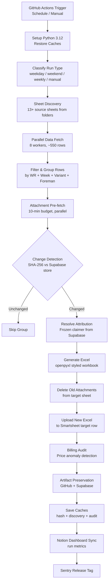
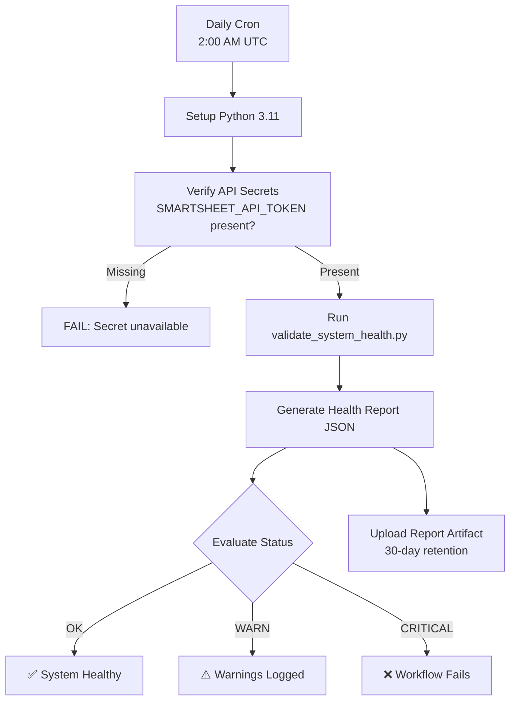
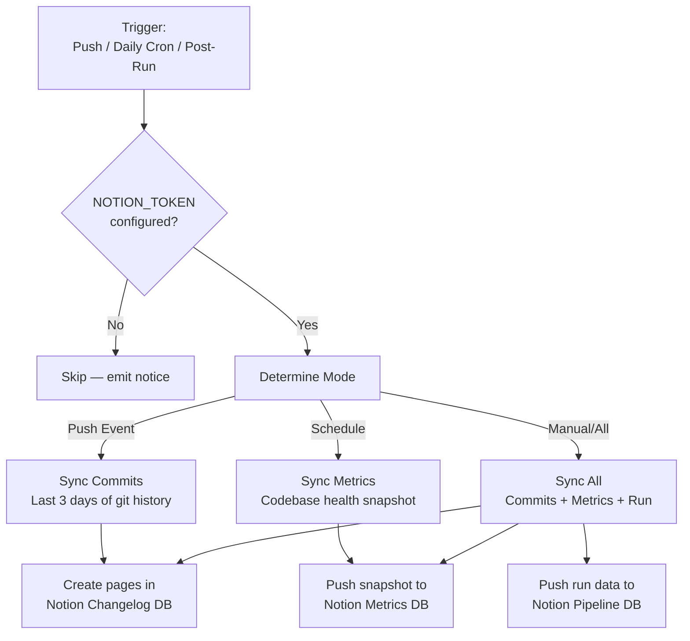
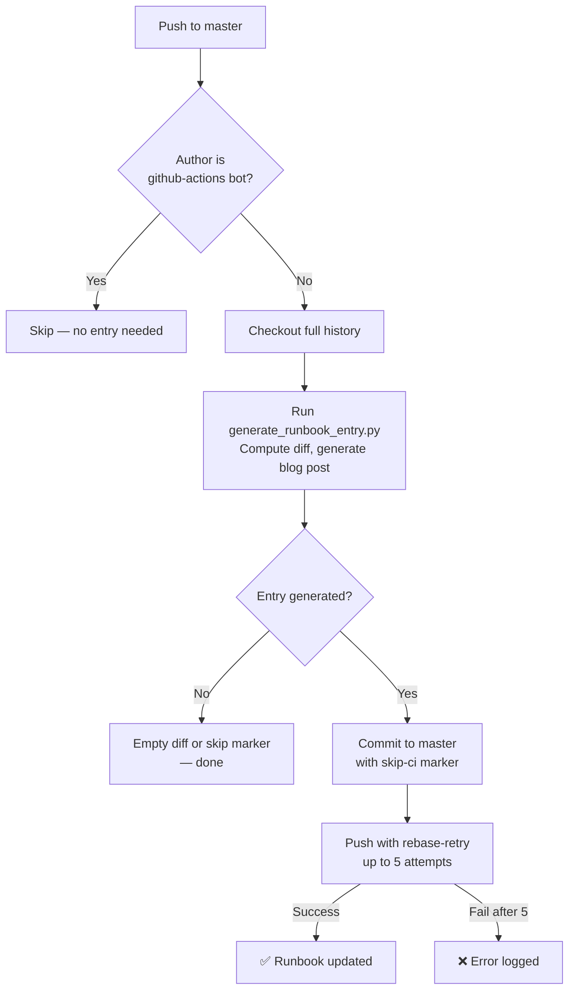
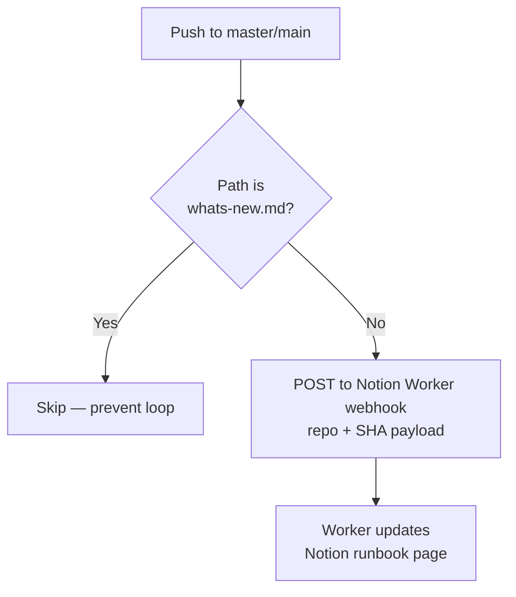
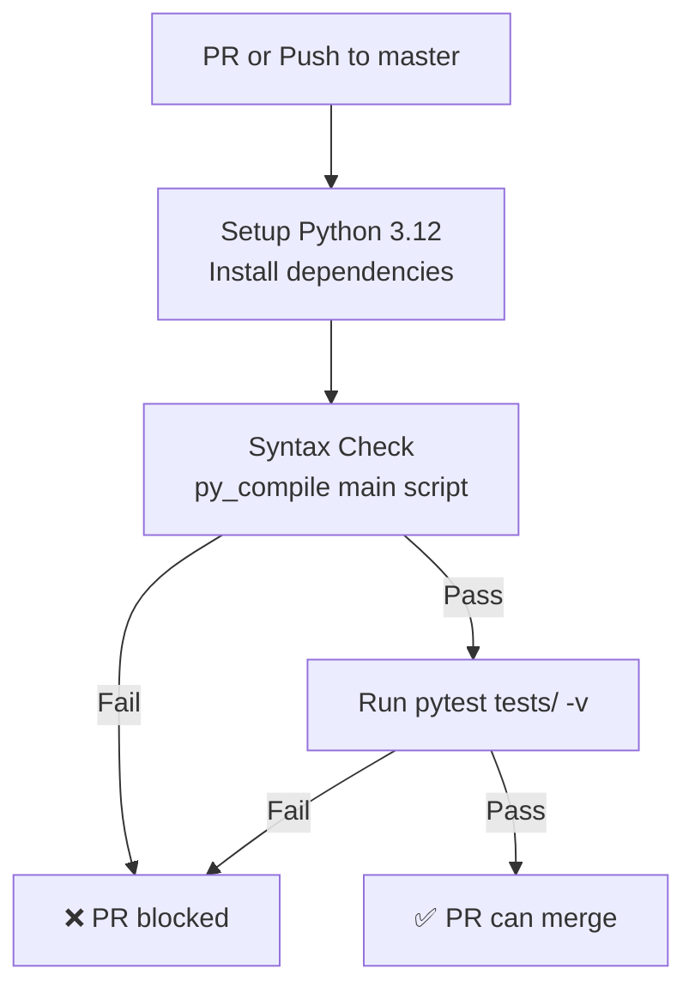
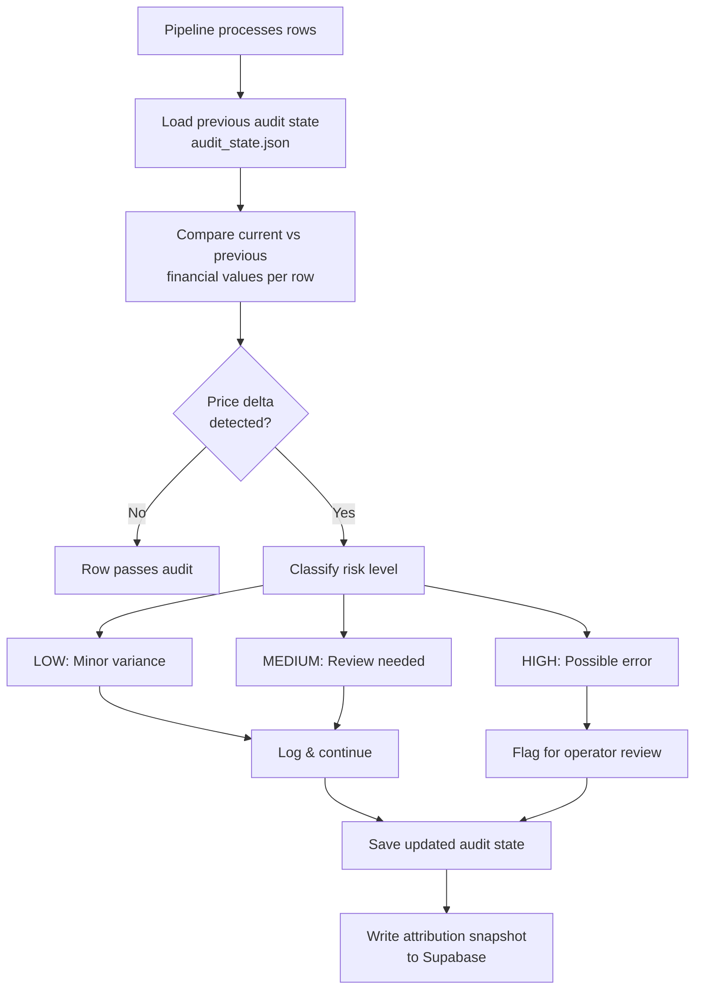
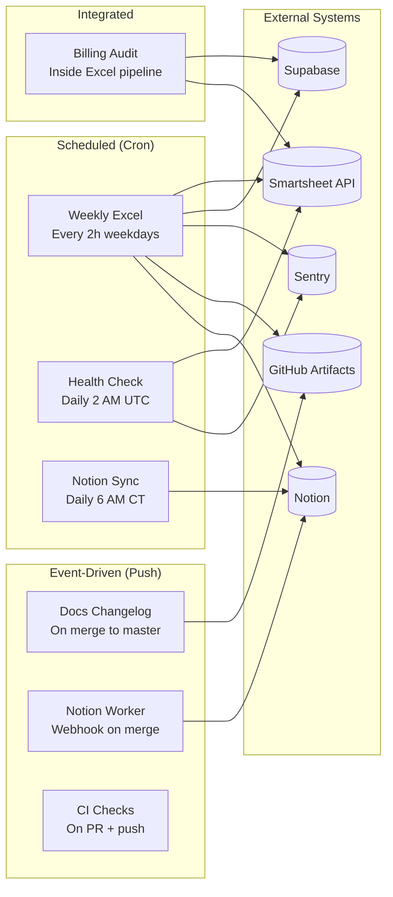

# Sync Job Run Logs — Technical Documentation

> **Last Updated**: 2026-08-12 16:00 UTC (automated daily cron)
>
> **Repository**: `JFlo21/Generate-Weekly-PDFs-DSR-Resiliency`
>
> **Run Health (Aug 12)**: 19/20 recent runs succeeded — 95% success rate

---

## Table of Contents

1. [Weekly Excel Generation (Billing Pipeline)](#1-weekly-excel-generation-billing-pipeline)
2. [System Health Check](#2-system-health-check)
3. [Notion Dashboard Sync](#3-notion-dashboard-sync)
4. [Docs Runbook Changelog](#4-docs-runbook-changelog)
5. [Notify Notion Runbook Worker](#5-notify-notion-runbook-worker)
6. [CI Checks (Pull Request Gate)](#6-ci-checks-pull-request-gate)
7. [Billing Audit Engine (Integrated)](#7-billing-audit-engine-integrated)

---

## 1. Weekly Excel Generation (Billing Pipeline)

### Sync Job Name
**Weekly Excel Generation with Sentry Monitoring**

### Primary Purpose
This is the core production billing pipeline. It automatically generates Excel billing reports from field crew timesheet data stored in Smartsheet, then uploads those reports back to Smartsheet as attachments for project managers and billing teams to review. It runs every 2 hours on weekdays and handles approximately 550 data rows across 13+ source sheets each cycle.

### How It Works (Step-by-Step)

1. **Trigger**: GitHub Actions fires on a schedule (every 2 hours on weekdays, 3 times daily on weekends, plus a weekly deep run on Monday mornings). Can also be triggered manually.
2. **Environment Setup**: The runner installs Python 3.12, restores cached data from previous runs (hash history, discovery cache, billing audit row cache).
3. **Execution Type Classification**: Determines if this is a weekday production run, weekend maintenance run, weekly comprehensive run, or manual dispatch.
4. **Sheet Discovery**: Connects to the Smartsheet API and auto-discovers all source sheets from configured folder IDs (subcontractor folders, original contract folders, vac crew folders). Uses a 7-day cached discovery to avoid redundant API calls.
5. **Data Fetch**: Pulls all rows from discovered sheets using 8 parallel workers. Each sheet's columns are validated against known synonyms (e.g., "Job #", "Job Number", "Job#" all map to the same field).
6. **Row Filtering & Grouping**: Filters rows by eligibility criteria, then groups them by Work Request number + week ending date + variant type (primary, helper, or vac crew) + foreman + department + job number.
7. **Attachment Pre-fetch**: Pre-fetches existing target-row attachments in parallel (budget-limited to 10 minutes) to avoid redundant API calls later.
8. **Change Detection**: Computes a SHA-256 hash for each group. Compares against the durable Supabase hash store (authoritative) and local JSON cache. Unchanged groups are skipped entirely.
9. **Attribution Resolution**: For each group, resolves the "frozen claimer" (the foreman who originally claimed the work) from the Supabase billing_audit.attribution_snapshot table. This ensures billing files are partitioned by the correct historical owner, not the current assignment.
10. **Excel Generation**: Creates styled Excel workbooks using openpyxl — includes company logo, formatted headers, data rows, and financial totals. Filenames encode the WR, week ending, and claimer identity.
11. **Old Attachment Cleanup**: Deletes outdated Excel attachments from the target Smartsheet sheet before uploading replacements.
12. **Upload**: Uploads the newly generated Excel files as attachments to the corresponding rows on the target Smartsheet sheet using parallel workers.
13. **Billing Audit**: Runs a price anomaly detection pass, flagging any suspicious changes as LOW/MEDIUM/HIGH risk.
14. **Artifact Preservation**: Organizes generated files by Work Request and week ending, generates a manifest, publishes to Supabase, and uploads to GitHub Actions artifacts (90-day retention).
15. **Cache Save**: Persists hash history, discovery cache, and billing audit row cache for the next run.
16. **Notion Sync**: Pushes run metrics (files generated, duration, error counts) to the Notion dashboard.
17. **Sentry Release**: Creates a tagged release in Sentry for error tracking correlation.

### Visual Logic Map

```mermaid
graph TD
    A[GitHub Actions Trigger<br/>Schedule / Manual] --> B[Setup Python 3.12<br/>Restore Caches]
    B --> C[Classify Run Type<br/>weekday / weekend / weekly / manual]
    C --> D[Sheet Discovery<br/>13+ source sheets from folders]
    D --> E[Parallel Data Fetch<br/>8 workers, ~550 rows]
    E --> F[Filter & Group Rows<br/>by WR + Week + Variant + Foreman]
    F --> G[Attachment Pre-fetch<br/>10-min budget, parallel]
    G --> H{Change Detection<br/>SHA-256 vs Supabase store}
    H -->|Unchanged| I[Skip Group]
    H -->|Changed| J[Resolve Attribution<br/>Frozen claimer from Supabase]
    J --> K[Generate Excel<br/>openpyxl styled workbook]
    K --> L[Delete Old Attachments<br/>from target sheet]
    L --> M[Upload New Excel<br/>to Smartsheet target row]
    M --> N[Billing Audit<br/>Price anomaly detection]
    N --> O[Artifact Preservation<br/>GitHub + Supabase]
    O --> P[Save Caches<br/>hash + discovery + audit]
    P --> Q[Notion Dashboard Sync<br/>run metrics]
    Q --> R[Sentry Release Tag]
```

### Expected Outcomes & Error Handling

**Successful Run**: All changed groups generate fresh Excel files, uploads complete without errors, hash history is updated, and the Notion dashboard reflects the run metrics. Average duration: ~48 minutes. A clean run with no data changes may complete in under 10 minutes.

**Error Handling**:
- **Time Budget**: A 165-minute graceful stop budget prevents the runner from being hard-killed (180-min ceiling). The script stops processing new groups when the budget is exhausted.
- **Rate Limits**: Smartsheet API is capped at 300 req/min; the SDK handles 429 retries automatically. Parallel workers capped at 8.
- **Sentry Alerts**: All unhandled exceptions and critical billing anomalies are sent to Sentry with full context (WR number, week ending, foreman).
- **Concurrency Protection**: Only one run executes per branch at a time (queue mode, not cancel mode) to prevent mid-upload interruption.
- **Graceful Degradation**: If Supabase is unavailable, attribution falls back to current foreman data. If the attachment pre-fetch times out, individual rows fall back to on-demand API calls.

---

## 2. System Health Check

### Sync Job Name
**System Health Check (Daily Diagnostic)**

### Primary Purpose
A daily automated diagnostic that verifies the entire billing system is operational — checks that API credentials are valid, Smartsheet is reachable, and all subsystems respond correctly. Think of it as a daily "pulse check" for the billing infrastructure.

### How It Works (Step-by-Step)

1. **Trigger**: Runs daily at 2:00 AM UTC via cron schedule. Can also be triggered manually.
2. **Setup**: Installs Python 3.11 and project dependencies.
3. **Secret Verification**: Confirms that the `SMARTSHEET_API_TOKEN` secret is present and accessible.
4. **Health Validation**: Runs `validate_system_health.py` which tests API connectivity, sheet accessibility, column mapping validity, and configuration integrity.
5. **Report Generation**: Produces a JSON health report at `generated_docs/system_health.json`.
6. **Status Evaluation**: Parses the report for overall status (OK / WARN / CRITICAL). CRITICAL status fails the workflow.
7. **Artifact Upload**: Uploads the health report as a GitHub Actions artifact (30-day retention).

### Visual Logic Map

```mermaid
graph TD
    A[Daily Cron<br/>2:00 AM UTC] --> B[Setup Python 3.11]
    B --> C[Verify API Secrets<br/>SMARTSHEET_API_TOKEN present?]
    C -->|Missing| D[FAIL: Secret unavailable]
    C -->|Present| E[Run validate_system_health.py]
    E --> F[Generate Health Report JSON]
    F --> G{Evaluate Status}
    G -->|OK| H[✅ System Healthy]
    G -->|WARN| I[⚠️ Warnings Logged]
    G -->|CRITICAL| J[❌ Workflow Fails]
    F --> K[Upload Report Artifact<br/>30-day retention]
```

### Expected Outcomes & Error Handling

**Successful Run**: Health report shows "OK" status, all API endpoints are reachable, and column mappings are valid. Duration: ~25 seconds.

**Current Status**: The health check workflow is currently failing (all recent runs show failure). This indicates a missing `validate_system_health.py` script or a systemic issue that needs investigation. The billing pipeline itself continues to run successfully regardless.

**Error Handling**: The workflow captures the health report even on failure (via `if: always()`) so operators can diagnose the issue from the artifact.

---

## 3. Notion Dashboard Sync

### Sync Job Name
**Notion Dashboard Sync**

### Primary Purpose
Keeps a Notion-based operational dashboard up to date with pipeline run data, recent code commits, and codebase health metrics. This gives stakeholders a single pane of glass to see how the billing system is performing without needing to check GitHub Actions directly.

### How It Works (Step-by-Step)

1. **Trigger**: Fires on every push to master (syncs commits), daily at 6 AM CT (syncs metrics), and after each billing pipeline run (syncs run data). Can also be triggered manually with mode selection.
2. **Gate Check**: Skips entirely if `NOTION_TOKEN` secret is not configured, or if `NOTION_ENABLED` is explicitly set to `false`.
3. **Mode Selection**:
   - **Push events** → sync commits only (last 3 days)
   - **Scheduled** → sync metrics only
   - **Manual/All** → sync commits + metrics + run data
4. **Commit Sync**: Reads git history, extracts commit messages, authors, and timestamps, then creates pages in the Notion Changelog database.
5. **Metrics Sync**: Computes codebase statistics (line counts, test counts, dependency counts) and pushes a snapshot to the Notion Metrics database.
6. **Run Sync**: After each billing pipeline run, pushes run-level metrics (files generated, duration, error count, audit risk level) to the Notion Pipeline Runs database.

### Visual Logic Map

```mermaid
graph TD
    A[Trigger:<br/>Push / Daily Cron / Post-Run] --> B{NOTION_TOKEN<br/>configured?}
    B -->|No| C[Skip — emit notice]
    B -->|Yes| D[Determine Mode]
    D -->|Push Event| E[Sync Commits<br/>Last 3 days of git history]
    D -->|Schedule| F[Sync Metrics<br/>Codebase health snapshot]
    D -->|Manual/All| G[Sync All<br/>Commits + Metrics + Run]
    E --> H[Create pages in<br/>Notion Changelog DB]
    F --> I[Push snapshot to<br/>Notion Metrics DB]
    G --> H
    G --> I
    G --> J[Push run data to<br/>Notion Pipeline DB]
```

### Expected Outcomes & Error Handling

**Successful Run**: Notion databases are updated with fresh data. Duration: 5–17 seconds.

**Current Status**: Running successfully. Daily cron and push-triggered runs complete in under 20 seconds.

**Error Handling**: If the Notion token is missing, the workflow emits a notice and exits cleanly (no failure). Individual sync modes are independent — a failure in one doesn't block others.

---

## 4. Docs Runbook Changelog

### Sync Job Name
**Docs — Runbook Changelog**

### Primary Purpose
Automatically generates a human-readable changelog entry in the Docusaurus runbook site every time code is merged to master. This creates a living audit trail of all production changes without any manual documentation effort.

### How It Works (Step-by-Step)

1. **Trigger**: Fires on every push to the `master` branch. Skips if the push was authored by `github-actions[bot]` (prevents infinite loops).
2. **Checkout**: Clones the full git history (needed to compute diffs).
3. **Generate Entry**: Runs `scripts/generate_runbook_entry.py` which:
   - Compares the current commit against the previous one
   - Extracts meaningful changes (ignores bot-maintained files)
   - Generates a Docusaurus blog post (Markdown) describing the change
4. **Commit**: If an entry was generated, commits it directly to master with a `[skip ci]` marker.
5. **Push with Retry**: Pushes to master with a rebase-retry loop (up to 5 attempts) to handle concurrent pushes gracefully.

### Visual Logic Map

```mermaid
graph TD
    A[Push to master] --> B{Author is<br/>github-actions bot?}
    B -->|Yes| C[Skip — no entry needed]
    B -->|No| D[Checkout full history]
    D --> E[Run generate_runbook_entry.py<br/>Compute diff, generate blog post]
    E --> F{Entry generated?}
    F -->|No| G[Empty diff or skip marker<br/>— done]
    F -->|Yes| H[Commit to master<br/>with skip-ci marker]
    H --> I[Push with rebase-retry<br/>up to 5 attempts]
    I -->|Success| J[✅ Runbook updated]
    I -->|Fail after 5| K[❌ Error logged]
```

### Expected Outcomes & Error Handling

**Successful Run**: A new blog post appears in `website/blog/` describing the latest production change. Duration: 12–21 seconds.

**Current Status**: Running successfully daily (triggered by Notion Worker push events).

**Error Handling**:
- Loop protection via actor check (`github-actions[bot]` commits don't re-trigger).
- Rebase-retry handles concurrent push conflicts (each entry is a unique new file, so rebases never conflict).
- `[skip ci]` marker prevents the generated commit from triggering other workflows.

---

## 5. Notify Notion Runbook Worker

### Sync Job Name
**Notify Notion Runbook Worker**

### Primary Purpose
Sends a webhook notification to a Notion Worker service whenever code lands on the master branch. This triggers the external Notion Worker to update a "What's New" runbook page in real time, keeping the Notion documentation current without waiting for a weekly sync.

### How It Works (Step-by-Step)

1. **Trigger**: Fires on every push to `master` or `main`, except for changes to the auto-generated `website/docs/runbook/whats-new.md` (prevents loops).
2. **Webhook POST**: Sends a JSON payload to the configured `NOTION_WORKER_WEBHOOK_URL` containing the repository name and commit SHA.
3. **Authentication**: Includes a shared secret header (`X-Webhook-Secret`) for verification by the receiving worker.

### Visual Logic Map

```mermaid
graph TD
    A[Push to master/main] --> B{Path is<br/>whats-new.md?}
    B -->|Yes| C[Skip — prevent loop]
    B -->|No| D[POST to Notion Worker webhook<br/>repo + SHA payload]
    D --> E[Worker updates<br/>Notion runbook page]
```

### Expected Outcomes & Error Handling

**Successful Run**: The Notion Worker receives the webhook and updates the runbook page. Duration: <5 seconds.

**Error Handling**: Uses `curl --fail` which will fail the step on HTTP errors (4xx/5xx). The workflow has no retry logic — if the webhook endpoint is temporarily down, the update will be picked up by the next push.

---

## 6. CI Checks (Pull Request Gate)

### Sync Job Name
**CI Checks — Compile and Test**

### Primary Purpose
A fast-failing quality gate that prevents broken code from reaching the production billing pipeline. Every pull request and push to master must pass syntax compilation and the full test suite before it can merge.

### How It Works (Step-by-Step)

1. **Trigger**: Fires on every pull request targeting `master` and every push to `master`.
2. **Setup**: Installs Python 3.12 with pip caching for fast dependency resolution.
3. **Syntax Check**: Runs `python -m py_compile generate_weekly_pdfs.py` to catch syntax errors immediately.
4. **Test Suite**: Runs `pytest tests/ -v --tb=short` — the full test suite that validates billing logic, pricing calculations, grouping rules, and Excel generation.

### Visual Logic Map

```mermaid
graph TD
    A[PR or Push to master] --> B[Setup Python 3.12<br/>Install dependencies]
    B --> C[Syntax Check<br/>py_compile main script]
    C -->|Fail| D[❌ PR blocked]
    C -->|Pass| E[Run pytest tests/ -v]
    E -->|Fail| D
    E -->|Pass| F[✅ PR can merge]
```

### Expected Outcomes & Error Handling

**Successful Run**: Both compilation and tests pass. Duration: ~2–5 minutes (depending on dependency cache).

**Error Handling**: Any failure blocks the PR from merging (when branch protection is configured). Short traceback format (`--tb=short`) keeps error output readable in the Actions log.

---

## 7. Billing Audit Engine (Integrated)

### Sync Job Name
**Billing Audit Engine**

### Primary Purpose
An integrated subsystem within the main billing pipeline that monitors for unauthorized or unexpected changes to financial data. It flags price anomalies with risk levels (LOW / MEDIUM / HIGH) so operators can investigate potential billing errors before they propagate to invoices.

### How It Works (Step-by-Step)

1. **Initialization**: Loaded at startup of the main billing pipeline. Reads previous audit state from `generated_docs/audit_state.json`.
2. **Financial Data Audit**: For each batch of processed rows, compares current financial values against the previous audit state.
3. **Anomaly Detection**: Identifies price changes that exceed configurable thresholds:
   - **LOW**: Minor price adjustments within expected variance
   - **MEDIUM**: Significant price changes that warrant review
   - **HIGH**: Large or unexpected financial changes that may indicate errors
4. **Cell History (Optional)**: When `SKIP_CELL_HISTORY=false`, enriches audit with Smartsheet cell modification history to identify who made the change.
5. **State Persistence**: Saves the updated audit state for comparison in the next run.
6. **Attribution Snapshot**: Writes frozen row-to-claimer mappings to Supabase (`billing_audit.attribution_snapshot`) for durable claim-history tracking.

### Visual Logic Map

```mermaid
graph TD
    A[Pipeline processes rows] --> B[Load previous audit state<br/>audit_state.json]
    B --> C[Compare current vs previous<br/>financial values per row]
    C --> D{Price delta<br/>detected?}
    D -->|No| E[Row passes audit]
    D -->|Yes| F[Classify risk level]
    F --> G[LOW: Minor variance]
    F --> H[MEDIUM: Review needed]
    F --> I[HIGH: Possible error]
    G --> J[Log & continue]
    H --> J
    I --> K[Flag for operator review]
    J --> L[Save updated audit state]
    K --> L
    L --> M[Write attribution snapshot<br/>to Supabase]
```

### Expected Outcomes & Error Handling

**Successful Run**: Audit completes silently for most rows. Any flagged anomalies appear in the run summary and are visible in the Notion dashboard.

**Error Handling**:
- If the audit system fails to import, the pipeline continues without auditing (graceful degradation).
- Cell history is skipped in CI (`SKIP_CELL_HISTORY=true`) for performance — it adds ~2 API calls per row.
- Audit state file corruption is handled by falling back to an empty state (all rows treated as new).

---

## Architecture Overview — All Sync Jobs

```mermaid
graph LR
    subgraph "Scheduled (Cron)"
        WE[Weekly Excel<br/>Every 2h weekdays]
        HC[Health Check<br/>Daily 2 AM UTC]
        NS[Notion Sync<br/>Daily 6 AM CT]
    end

    subgraph "Event-Driven (Push)"
        DC[Docs Changelog<br/>On merge to master]
        NW[Notion Worker<br/>Webhook on merge]
        CI[CI Checks<br/>On PR + push]
    end

    subgraph "Integrated"
        BA[Billing Audit<br/>Inside Excel pipeline]
    end

    subgraph "External Systems"
        SS[(Smartsheet API)]
        SB[(Supabase)]
        SE[(Sentry)]
        NO[(Notion)]
        GH[(GitHub Artifacts)]
    end

    WE --> SS
    WE --> SB
    WE --> SE
    WE --> GH
    WE --> NO
    HC --> SS
    HC --> SE
    NS --> NO
    DC --> GH
    NW --> NO
    BA --> SB
    BA --> SS
```

---

## Run Metrics Summary (August 12, 2026)

| Sync Job | Schedule | Last Status | Avg Duration | Notes |
|----------|----------|-------------|--------------|-------|
| Weekly Excel Generation | Every 2h weekdays | ✅ Success | ~48 min | 95% success rate (last 20) |
| System Health Check | Daily 2 AM UTC | ❌ Failing | ~26s | Missing validation script |
| Notion Dashboard Sync | Daily + on push | ✅ Success | ~10s | Requires NOTION_TOKEN |
| Docs Runbook Changelog | On push to master | ✅ Success | ~17s | Triggered by Notion Worker |
| Notify Notion Worker | On push to master | ✅ Success | <5s | Webhook to external service |
| CI Checks | On PR + push | ✅ Success | ~3 min | Required status check |
| Billing Audit | Integrated | ✅ Success | (part of Excel) | Supabase-backed attribution |

---

## Configuration Quick Reference

| Variable | Default | Used By |
|----------|---------|---------|
| `SMARTSHEET_API_TOKEN` | (required) | Excel Generation, Health Check |
| `TIME_BUDGET_MINUTES` | `165` | Excel Generation (CI only) |
| `PARALLEL_WORKERS` | `8` | Excel Generation |
| `DISCOVERY_CACHE_TTL_MIN` | `10080` (7 days) | Excel Generation |
| `RES_GROUPING_MODE` | `both` | Excel Generation |
| `NOTION_TOKEN` | (optional) | Notion Sync |
| `SUPABASE_URL` | (optional) | Billing Audit, Hash Store |
| `SENTRY_DSN` | (optional) | All Python jobs |
| `NOTION_WORKER_WEBHOOK_URL` | (secret) | Notify Worker |

---

*This document is auto-generated daily by the sync-job-run-logs automation. Source: `docs/sync-job-run-logs.md`*
