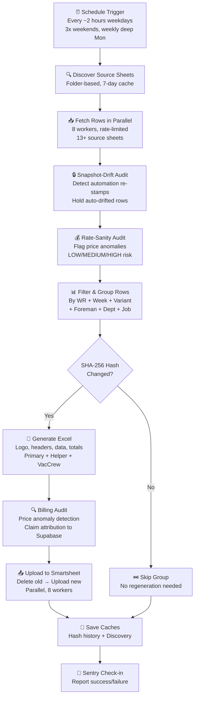
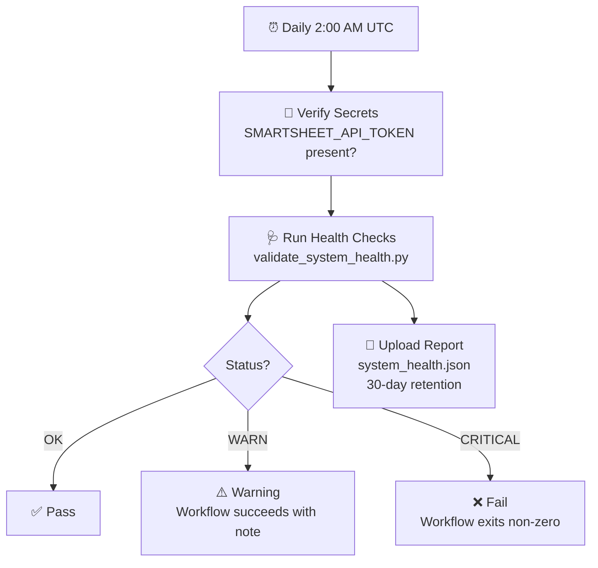
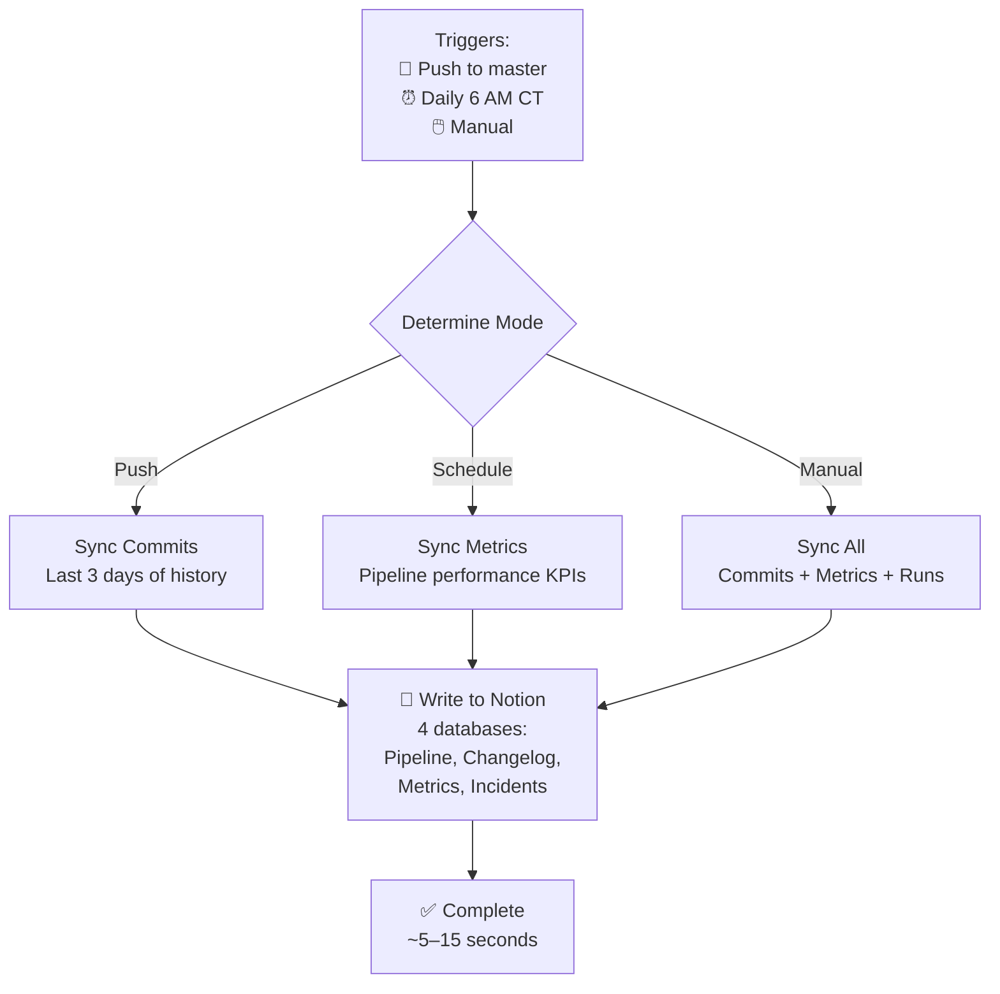
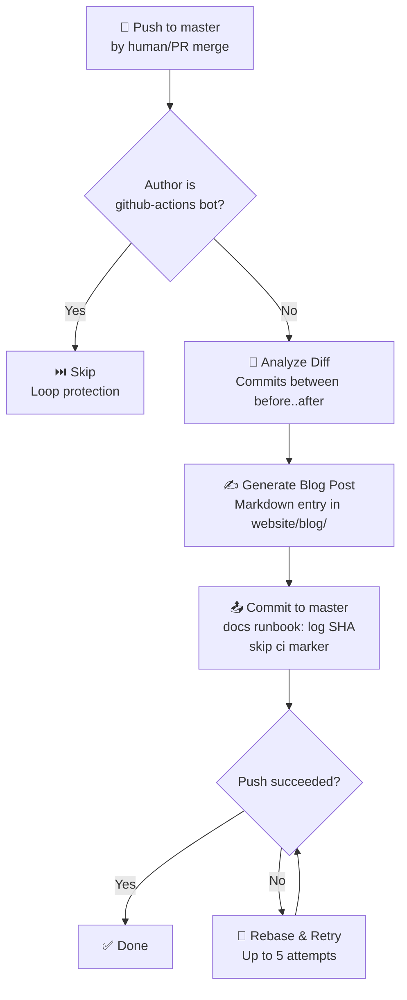
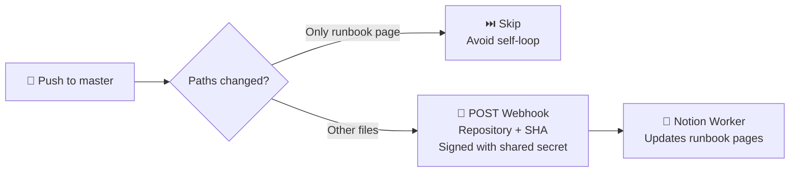
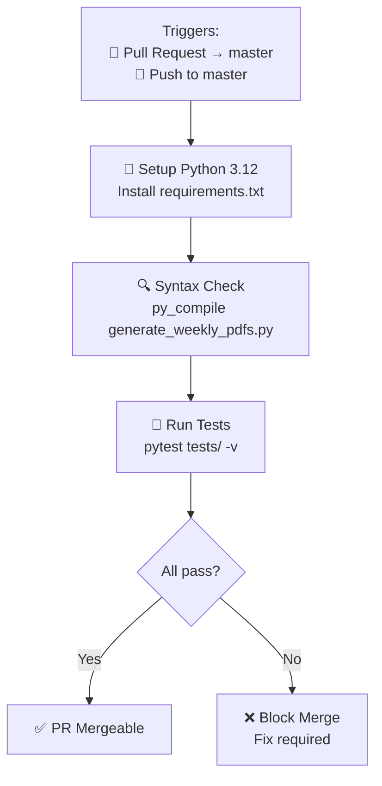
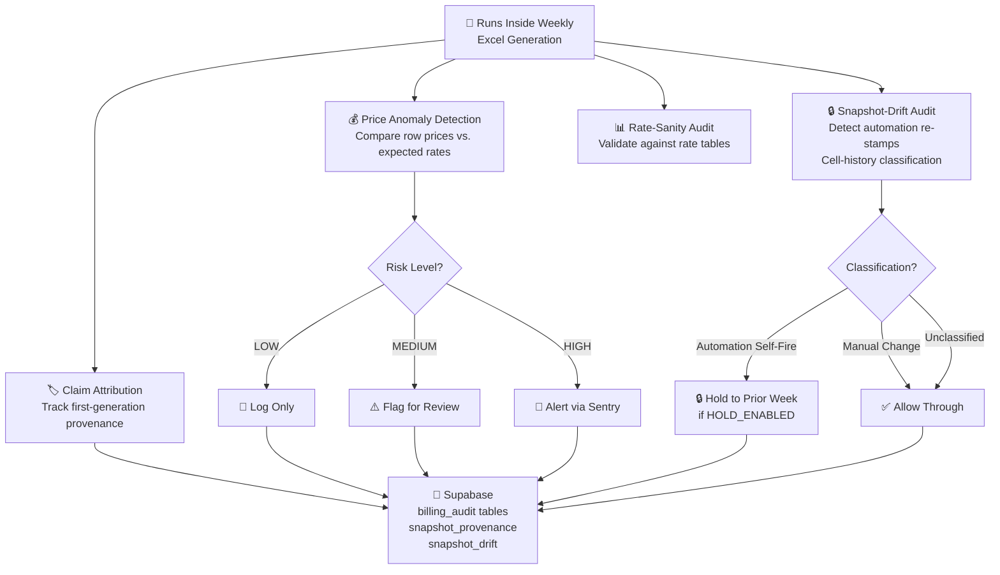
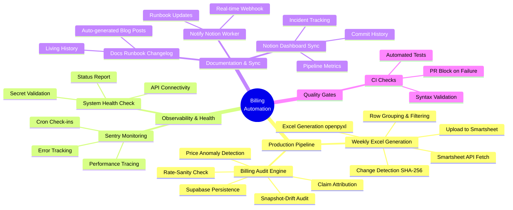

# Sync Job Run Logs

> **Last Updated:** 2026-08-13 16:14 UTC (Daily Cron)
>
> **Repository:** `JFlo21/Generate-Weekly-PDFs-DSR-Resiliency`
>
> **Run Health Summary (Aug 13, 2026):**
> | Job | Status | Last 20 Runs |
> |-----|--------|--------------|
> | Weekly Excel Generation | ✅ Healthy | 19/20 success (1 in-progress) |
> | Notion Dashboard Sync | ✅ Healthy | 10/10 success |
> | Docs Runbook Changelog | ✅ Healthy | 10/10 success |
> | Notify Notion Worker | ✅ Healthy | 5/5 success |
> | CI Checks | ✅ Healthy | 5/5 success |
> | System Health Check | ❌ Failing | 0/10 success (missing `validate_system_health.py`) |
> | Snyk Security | ⚠️ Stale | Last ran Oct 2025 (all failed) |

---

## 1. Weekly Excel Generation (Billing Pipeline)

### Sync Job Name
**Weekly Excel Generation with Sentry Monitoring** (`weekly-excel-generation.yml` → `generate_weekly_pdfs.py`)

### Primary Purpose
This is the core production billing engine. It automatically pulls timesheet data from Smartsheet (13+ source spreadsheets), groups that data by Work Request and billing week, generates professionally-formatted Excel workbooks for each group, and uploads those workbooks back to Smartsheet as attachments. This is how field crews' weekly billing documents are created — without it, billing stops.

### How It Works (Step-by-Step)

1. **Trigger fires** — GitHub Actions runs this job on a schedule: every ~2 hours on weekdays (7 times/day), 3 times on weekends, plus a deep weekly run Monday at midnight Central. It can also be triggered manually.
2. **Classify execution type** — The system determines whether this is a weekday frequent run, weekend maintenance, weekly comprehensive, or manual dispatch. This affects logging verbosity and scope.
3. **Discover source sheets** — Using folder IDs configured in the workflow, the system auto-discovers all source Smartsheet sheets (subcontractor sheets, original contract sheets, VAC crew sheets). Results are cached for 7 days to avoid redundant API calls.
4. **Fetch all rows in parallel** — Up to 8 parallel workers pull row data from each discovered source sheet via the Smartsheet API (respecting the 300 requests/minute rate limit).
5. **Snapshot-drift audit** *(new Aug 13, 2026)* — Before grouping, the system checks whether any row's billing week has silently drifted due to Smartsheet automation re-stamping the Snapshot Date. Automation-caused drifts can be held to their prior billing week (preventing double-billing); manual changes flow through normally.
6. **Rate-sanity audit** *(new Aug 12, 2026)* — Flags price anomalies where a row's unit price deviates significantly from expected rates, classifying findings by LOW/MEDIUM/HIGH risk.
7. **Filter and group rows** — Rows are grouped by Work Request number, week-ending date, variant type (primary/helper/VacCrew), foreman, department, and job number.
8. **Change detection** — A SHA-256 hash is computed for each group. If the hash matches a previously-generated file, the group is skipped (no regeneration needed). This saves significant time on routine runs.
9. **Pre-fetch target attachments** — Before generating files, the system bulk-reads existing attachments on the target sheet to know which files already exist. This has a 10-minute sub-budget and 45-second per-request timeout to prevent stalls.
10. **Generate Excel workbooks** — For each changed group, a styled Excel workbook is created using `openpyxl`: company logo, formatted headers, data rows, calculated totals. Helper files and VacCrew variants get separate workbooks.
11. **Billing audit & attribution** — Each generated file is audited for price anomalies. Primary claim attribution tracks which run first created each file (for accountability). Results are stored in Supabase.
12. **Upload to Smartsheet** — Generated Excel files are uploaded back to the target Smartsheet sheet as row-level attachments. Old versions of the same file are deleted first to prevent duplicates.
13. **Save caches** — Hash history and discovery caches are saved to GitHub Actions cache for the next run.
14. **Sentry monitoring** — The entire run is wrapped in Sentry check-in monitoring. Errors, performance data, and run health are reported to Sentry for real-time alerting.

### Visual Logic Map

```mermaid
graph TD
    A[⏰ Schedule Trigger<br/>Every ~2 hours weekdays<br/>3x weekends, weekly deep Mon] --> B[🔍 Discover Source Sheets<br/>Folder-based, 7-day cache]
    B --> C[📥 Fetch Rows in Parallel<br/>8 workers, rate-limited<br/>13+ source sheets]
    C --> D[🔒 Snapshot-Drift Audit<br/>Detect automation re-stamps<br/>Hold auto-drifted rows]
    D --> E[💰 Rate-Sanity Audit<br/>Flag price anomalies<br/>LOW/MEDIUM/HIGH risk]
    E --> F[📊 Filter & Group Rows<br/>By WR + Week + Variant<br/>+ Foreman + Dept + Job]
    F --> G{SHA-256 Hash<br/>Changed?}
    G -- No --> H[⏭️ Skip Group<br/>No regeneration needed]
    G -- Yes --> I[📄 Generate Excel<br/>Logo, headers, data, totals<br/>Primary + Helper + VacCrew]
    I --> J[🔍 Billing Audit<br/>Price anomaly detection<br/>Claim attribution to Supabase]
    J --> K[📤 Upload to Smartsheet<br/>Delete old → Upload new<br/>Parallel, 8 workers]
    K --> L[💾 Save Caches<br/>Hash history + Discovery]
    L --> M[📡 Sentry Check-in<br/>Report success/failure]
    H --> L
```

### Expected Outcomes & Error Handling

**Successful run:** All changed groups have their Excel files regenerated and uploaded. Hash history is updated. Sentry receives an OK check-in. Typical duration: 25–80 minutes depending on how many groups changed.

**Failure modes:**
- **Time budget exceeded (165 min):** The Python process gracefully stops, saves progress, and exits. Remaining groups will be processed on the next scheduled run.
- **Smartsheet API errors (403/429):** Retried automatically with exponential backoff. Persistent failures logged to Sentry.
- **Sentry alerting:** Any uncaught exception triggers a Sentry error event. The Sentry cron monitor marks the run as failed if it doesn't check in within the expected window.
- **Concurrency protection:** If a previous run is still in progress, the new run queues (never cancels a near-complete billing run).

---

## 2. System Health Check

### Sync Job Name
**System Health Check** (`system-health-check.yml` → `validate_system_health.py`)

### Primary Purpose
A daily automated check to verify that all critical systems (Smartsheet API connectivity, secrets, pipeline dependencies) are healthy and operational. Think of it as a "morning wellness check" for the billing infrastructure.

### How It Works (Step-by-Step)

1. **Trigger fires** — Runs daily at 2:00 AM UTC via GitHub Actions cron.
2. **Install dependencies** — Sets up Python 3.11 and installs project requirements.
3. **Verify secrets** — Confirms the Smartsheet API token is present and valid.
4. **Run health validation** — Executes `validate_system_health.py` which checks API connectivity, column mappings, and system readiness.
5. **Generate report** — Produces a JSON health report with overall status (OK/WARN/CRITICAL).
6. **Upload artifact** — Saves the report as a GitHub Actions artifact (retained 30 days).
7. **Evaluate status** — If CRITICAL, the workflow fails with an error annotation.

### Visual Logic Map

```mermaid
graph TD
    A[⏰ Daily 2:00 AM UTC] --> B[🔐 Verify Secrets<br/>SMARTSHEET_API_TOKEN present?]
    B --> C[🩺 Run Health Checks<br/>validate_system_health.py]
    C --> D{Status?}
    D -- OK --> E[✅ Pass]
    D -- WARN --> F[⚠️ Warning<br/>Workflow succeeds with note]
    D -- CRITICAL --> G[❌ Fail<br/>Workflow exits non-zero]
    C --> H[📄 Upload Report<br/>system_health.json<br/>30-day retention]
```

### Expected Outcomes & Error Handling

**Current status: CONSISTENTLY FAILING** — The script `validate_system_health.py` does not exist in the repository, causing every run to fail with a "file not found" error. This is a known issue; the workflow was created before the validation script was implemented.

**When fixed:** A successful run would produce a JSON report indicating all systems are healthy. A CRITICAL status would signal that the billing pipeline's next run may fail (e.g., expired API token, unreachable Smartsheet API).

---

## 3. Notion Dashboard Sync

### Sync Job Name
**Notion Dashboard Sync** (`notion-sync.yml` → `scripts/notion_sync.py`)

### Primary Purpose
Keeps the team's Notion workspace up-to-date with the latest repository activity. It syncs commit history, pipeline run metrics, and project health data into dedicated Notion databases so stakeholders can see billing pipeline status without leaving Notion.

### How It Works (Step-by-Step)

1. **Trigger fires** — Runs on every push to `master`, daily at 6 AM Central (11:00 UTC), or manually.
2. **Determine sync mode** — Push events sync commits only (last 3 days). Scheduled runs sync metrics only. Manual runs can sync all data or a specific subset.
3. **Install Notion SDK** — Installs the `notion-client` Python package.
4. **Execute sync** — `scripts/notion_sync.py` connects to 4 Notion databases:
   - Pipeline runs database (execution history)
   - Changelog database (commit messages)
   - Metrics database (performance KPIs)
   - Incidents database (failures and alerts)
5. **Write to Notion** — Creates or updates pages in the appropriate databases with structured metadata (timestamps, authors, status, durations).

### Visual Logic Map

```mermaid
graph TD
    A[Triggers:<br/>📨 Push to master<br/>⏰ Daily 6 AM CT<br/>🖱️ Manual] --> B{Determine Mode}
    B -- Push --> C[Sync Commits<br/>Last 3 days of history]
    B -- Schedule --> D[Sync Metrics<br/>Pipeline performance KPIs]
    B -- Manual --> E[Sync All<br/>Commits + Metrics + Runs]
    C --> F[📝 Write to Notion<br/>4 databases:<br/>Pipeline, Changelog,<br/>Metrics, Incidents]
    D --> F
    E --> F
    F --> G[✅ Complete<br/>~5–15 seconds]
```

### Expected Outcomes & Error Handling

**Successful run:** Notion databases are updated with the latest data. Runs complete in 5–15 seconds.

**Failure modes:**
- **Missing NOTION_TOKEN secret:** The job emits a notice and skips all steps gracefully.
- **Kill switch:** Setting `NOTION_ENABLED=false` as a repository variable pauses all syncing.
- **Timeout:** 5-minute hard limit prevents hangs.

---

## 4. Docs Runbook Changelog

### Sync Job Name
**Docs — Runbook Changelog** (`docs-changelog.yml` → `scripts/generate_runbook_entry.py`)

### Primary Purpose
Automatically generates a human-readable changelog entry for every code change that lands on `master`. These entries are published to the Docusaurus runbook website, creating a living history of what changed, when, and why — without anyone having to manually write release notes.

### How It Works (Step-by-Step)

1. **Trigger fires** — Runs on every push to `master` (except commits authored by `github-actions[bot]`, to prevent infinite loops).
2. **Checkout with full history** — Fetches the complete git history so it can analyze what changed between the previous and current commit.
3. **Generate entry** — `scripts/generate_runbook_entry.py` analyzes the diff, extracts the commit message, author, and changed files, then writes a Markdown blog post to `website/blog/`.
4. **Commit directly to master** — The generated entry is committed with the message `docs(runbook): log <short-sha> [skip ci]`. The `[skip ci]` marker prevents CI from re-running on this documentation commit.
5. **Push with retry** — If a concurrent push happened, it rebases and retries up to 5 times (blog entries are unique new files, so rebases never conflict).

### Visual Logic Map

```mermaid
graph TD
    A[📨 Push to master<br/>by human/PR merge] --> B{Author is<br/>github-actions bot?}
    B -- Yes --> C[⏭️ Skip<br/>Loop protection]
    B -- No --> D[📖 Analyze Diff<br/>Commits between before..after]
    D --> E[✍️ Generate Blog Post<br/>Markdown entry in website/blog/]
    E --> F[📤 Commit to master<br/>docs runbook: log SHA<br/>skip ci marker]
    F --> G{Push succeeded?}
    G -- Yes --> H[✅ Done]
    G -- No --> I[🔄 Rebase & Retry<br/>Up to 5 attempts]
    I --> G
```

### Expected Outcomes & Error Handling

**Successful run:** A new Markdown file appears in `website/blog/` documenting the change. Completes in ~15 seconds.

**Failure modes:**
- **Loop protection:** Bot-authored commits are skipped to prevent infinite trigger chains.
- **Empty diff:** If the push only modified `website/blog/` (e.g., another changelog entry), no new entry is generated.
- **Push conflicts:** Retried up to 5 times with automatic rebase.
- **Concurrency:** Only one changelog run at a time (queued, not cancelled).

---

## 5. Notify Notion Runbook Worker

### Sync Job Name
**Notify Notion Runbook Worker** (`notify-notion-worker.yml`)

### Primary Purpose
Sends a real-time webhook notification to an external Notion Worker service whenever code lands on `master`. This worker updates Notion's runbook documentation in near-real-time, so the team's knowledge base stays current without waiting for a periodic sync.

### How It Works (Step-by-Step)

1. **Trigger fires** — Runs on every push to `master` or `main`, except changes to the generated runbook page (prevents self-triggering loops).
2. **POST to webhook** — Sends a signed HTTP POST to the Notion Worker endpoint with the repository name and commit SHA.
3. **Worker processes** — The external Notion Worker (deployed separately) receives the notification, reads the latest repository state, and updates the relevant Notion pages.

### Visual Logic Map

```mermaid
graph LR
    A[📨 Push to master] --> B{Paths changed?}
    B -- Only runbook page --> C[⏭️ Skip<br/>Avoid self-loop]
    B -- Other files --> D[🔔 POST Webhook<br/>Repository + SHA<br/>Signed with shared secret]
    D --> E[🤖 Notion Worker<br/>Updates runbook pages]
```

### Expected Outcomes & Error Handling

**Successful run:** Webhook fires in ~6 seconds. The downstream Notion Worker then updates documentation asynchronously (its own execution takes 10–30 seconds).

**Failure modes:**
- **Missing secrets:** If `NOTION_WORKER_WEBHOOK_URL` or `NOTION_WORKER_SECRET` are not configured, `curl --fail` exits non-zero.
- **Path filter:** Changes to `website/docs/runbook/whats-new.md` are excluded to prevent the worker from re-triggering itself.

---

## 6. CI Checks (Pull Request Gate)

### Sync Job Name
**CI Checks** (`ci-checks.yml`)

### Primary Purpose
A lightweight, fast-failing quality gate that runs on every pull request and push to `master`. It ensures no broken code reaches the production billing pipeline by validating that the main script compiles and all tests pass.

### How It Works (Step-by-Step)

1. **Trigger fires** — Runs on every PR targeting `master` and every push to `master`.
2. **Syntax check** — Runs `python -m py_compile generate_weekly_pdfs.py` to catch syntax errors that would crash the billing pipeline.
3. **Test suite** — Runs `pytest tests/ -v --tb=short` — the full automated test suite covering pricing logic, grouping, change detection, helper detection, and more.

### Visual Logic Map

```mermaid
graph TD
    A[Triggers:<br/>🔀 Pull Request → master<br/>📨 Push to master] --> B[🐍 Setup Python 3.12<br/>Install requirements.txt]
    B --> C[🔍 Syntax Check<br/>py_compile generate_weekly_pdfs.py]
    C --> D[🧪 Run Tests<br/>pytest tests/ -v]
    D --> E{All pass?}
    E -- Yes --> F[✅ PR Mergeable]
    E -- No --> G[❌ Block Merge<br/>Fix required]
```

### Expected Outcomes & Error Handling

**Successful run:** Both compilation and all tests pass in ~35 seconds. The PR is cleared for merge.

**Failure modes:**
- **Syntax error:** `py_compile` catches missing imports, typos, and other parse failures immediately.
- **Test failure:** Failing tests block the PR from being merged. The short traceback (`--tb=short`) makes it easy to identify the failing assertion.
- **Timeout:** 15-minute hard limit prevents stuck tests from blocking the queue.

---

## 7. Billing Audit Engine (Integrated)

### Sync Job Name
**Billing Audit Engine** (integrated within Weekly Excel Generation via `audit_billing_changes.py` + `pipeline/attribution.py` + `pipeline/snapshot_drift.py`)

### Primary Purpose
Provides a multi-layered financial integrity system that runs alongside every billing pipeline execution. It detects price anomalies, tracks who first generated each billing document (claim attribution), audits for snapshot-date drift (automation re-stamps), and validates rate sanity — all to prevent billing errors from reaching clients.

### How It Works (Step-by-Step)

1. **Price anomaly detection** — For each generated Excel group, compares row-level unit prices against expected rates. Deviations are classified as LOW (minor rounding), MEDIUM (rate mismatch), or HIGH (order-of-magnitude error).
2. **Claim attribution** — Records which pipeline run first created each billing document in Supabase. This creates an audit trail for accountability: if a billing dispute arises, the system can trace exactly when and how a file was generated.
3. **Snapshot-drift detection** *(new Aug 13, 2026)* — Smartsheet automations can silently re-stamp a row's Snapshot Date when any change occurs, moving an already-billed unit into the current week. This audit catches those drifts, classifies them as automation-caused vs. manual, and optionally holds automation drifts to their original billing week.
4. **Rate-sanity audit** *(new Aug 12, 2026)* — Cross-references unit prices against known rate tables and flags rows where pricing deviates beyond acceptable thresholds.
5. **Supabase persistence** — All audit findings (drift events, price anomalies, claim records, provenance baselines) are stored in Supabase tables for historical analysis and dispute resolution.
6. **Delta tracking** — Compares current audit findings against previous runs to identify NEW anomalies vs. previously-flagged issues.

### Visual Logic Map

```mermaid
graph TD
    A[🔄 Runs Inside Weekly<br/>Excel Generation] --> B[💰 Price Anomaly Detection<br/>Compare row prices vs. expected rates]
    A --> C[🔒 Snapshot-Drift Audit<br/>Detect automation re-stamps<br/>Cell-history classification]
    A --> D[📊 Rate-Sanity Audit<br/>Validate against rate tables]
    A --> E[🏷️ Claim Attribution<br/>Track first-generation provenance]
    
    B --> F{Risk Level?}
    F -- LOW --> G[📝 Log Only]
    F -- MEDIUM --> H[⚠️ Flag for Review]
    F -- HIGH --> I[🚨 Alert via Sentry]
    
    C --> J{Classification?}
    J -- Automation Self-Fire --> K[🔒 Hold to Prior Week<br/>if HOLD_ENABLED]
    J -- Manual Change --> L[✅ Allow Through]
    J -- Unclassified --> L
    
    E --> M[💾 Supabase<br/>billing_audit tables<br/>snapshot_provenance<br/>snapshot_drift]
    G --> M
    H --> M
    I --> M
    K --> M
    L --> M
```

### Expected Outcomes & Error Handling

**Successful audit:** All price anomalies are classified and logged. Claim attribution is recorded. Drift candidates are identified and (when enabled) held. No audit failure ever blocks a billing run.

**Failure modes (all fail-safe):**
- **Supabase unavailable:** Audit degrades to no-op. Billing continues unaffected.
- **Cell-history API budget exhausted:** Remaining candidates are marked "unclassified" and re-attempted next run.
- **Rate table missing:** Rate-sanity audit skips with a log warning.
- **Design principle:** The audit system is explicitly designed to NEVER block billing. Every error path degrades gracefully.

---

## Architecture Overview — All Jobs Together

```mermaid
mindmap
  root((Billing<br/>Automation))
    Production Pipeline
      Weekly Excel Generation
        Smartsheet API Fetch
        Row Grouping & Filtering
        Excel Generation openpyxl
        Upload to Smartsheet
        Change Detection SHA-256
      Billing Audit Engine
        Price Anomaly Detection
        Claim Attribution
        Snapshot-Drift Audit
        Rate-Sanity Check
        Supabase Persistence
    Observability & Health
      System Health Check
        API Connectivity
        Secret Validation
        Status Report
      Sentry Monitoring
        Error Tracking
        Cron Check-ins
        Performance Tracing
    Documentation & Sync
      Notion Dashboard Sync
        Commit History
        Pipeline Metrics
        Incident Tracking
      Docs Runbook Changelog
        Auto-generated Blog Posts
        Living History
      Notify Notion Worker
        Real-time Webhook
        Runbook Updates
    Quality Gates
      CI Checks
        Syntax Validation
        Automated Tests
        PR Block on Failure
```

---

## Recent Changes (Since Aug 12, 2026)

| Date | PR | Change | Impact |
|------|-----|--------|--------|
| Aug 13 | [#330](https://github.com/JFlo21/Generate-Weekly-PDFs-DSR-Resiliency/pull/330) | Snapshot-date drift audit with optional hold gate | New `pipeline/snapshot_drift.py` module; detects automation re-stamps, classifies via cell-history, can hold drifted rows to prior week |
| Aug 12 | [#329](https://github.com/JFlo21/Generate-Weekly-PDFs-DSR-Resiliency/pull/329) | Rate-sanity audit check | New audit layer validates unit prices against expected rates with LOW/MEDIUM/HIGH risk classification |

---

## Schedule Reference (UTC)

| Job | Schedule | Timezone | Notes |
|-----|----------|----------|-------|
| Weekly Excel Generation | `0 13,15,17,19,21,23,1 * * 1-5` (weekdays) | America/Chicago | ~Every 2 hours during US business hours |
| Weekly Excel Generation | `0 15,19,23 * * 0,6` (weekends) | America/Chicago | 3 runs/day |
| Weekly Excel Generation | `0 5 * * 1` (weekly deep) | America/Chicago | Monday 00:00 CDT comprehensive run |
| System Health Check | `0 2 * * *` | UTC | Daily at 2 AM |
| Notion Dashboard Sync | `0 11 * * *` | America/Chicago | Daily at 6 AM CT + on every push |
| Docs Changelog | On push to master | — | Event-driven |
| Notify Notion Worker | On push to master | — | Event-driven |
| CI Checks | On PR + push to master | — | Event-driven |

---

## Key Metrics (Aug 11–13, 2026)

- **Weekly Excel avg duration:** ~38 minutes (range: 27 min – 1h34m)
- **Success rate (last 20 runs):** 95% (19/20 — 1 currently in-progress)
- **Longest run:** 1h34m (Aug 12, 5:22 PM CT — likely large data changeset)
- **Shortest run:** 27 min (routine runs with few changes)
- **Notion sync duration:** ~5–15 seconds
- **CI checks duration:** ~35 seconds
- **Docs changelog duration:** ~15 seconds
