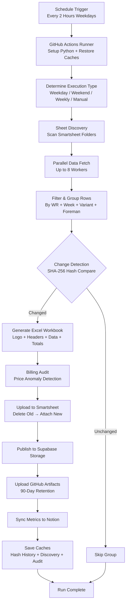
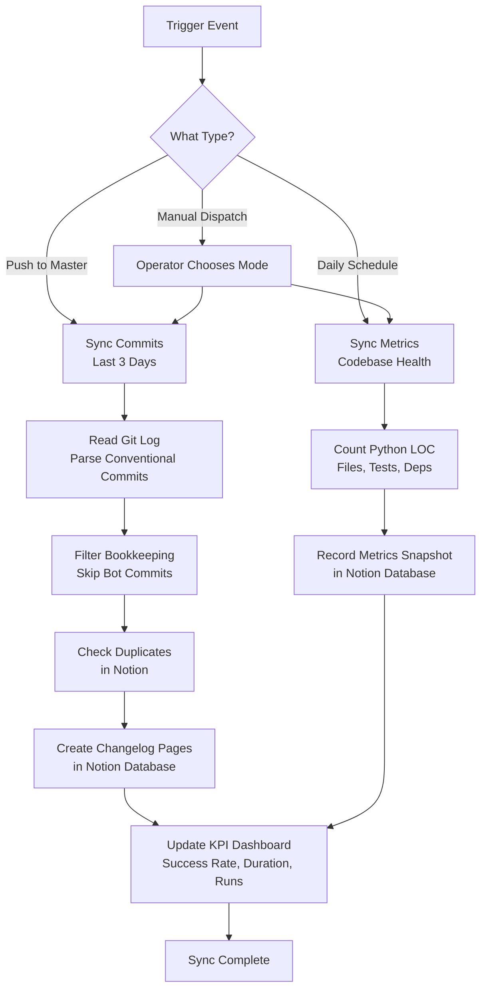
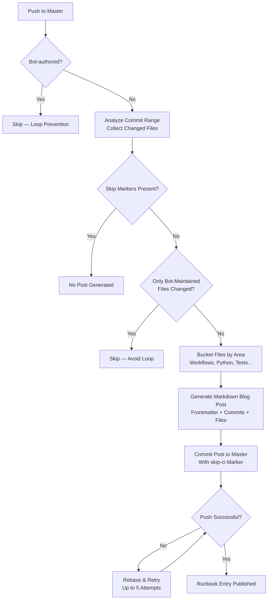
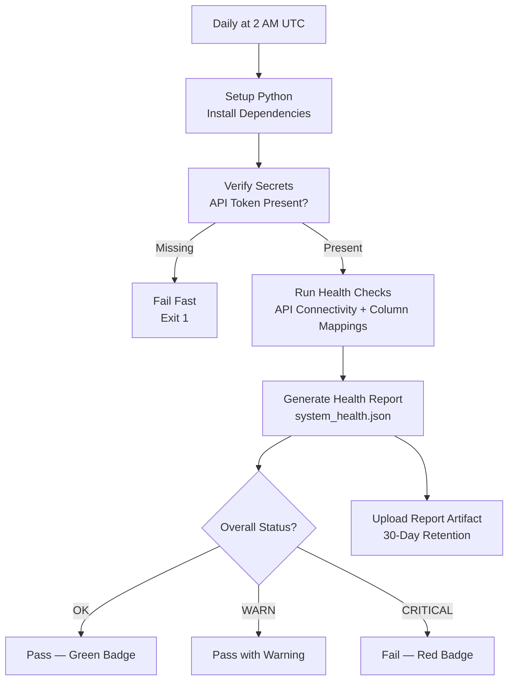
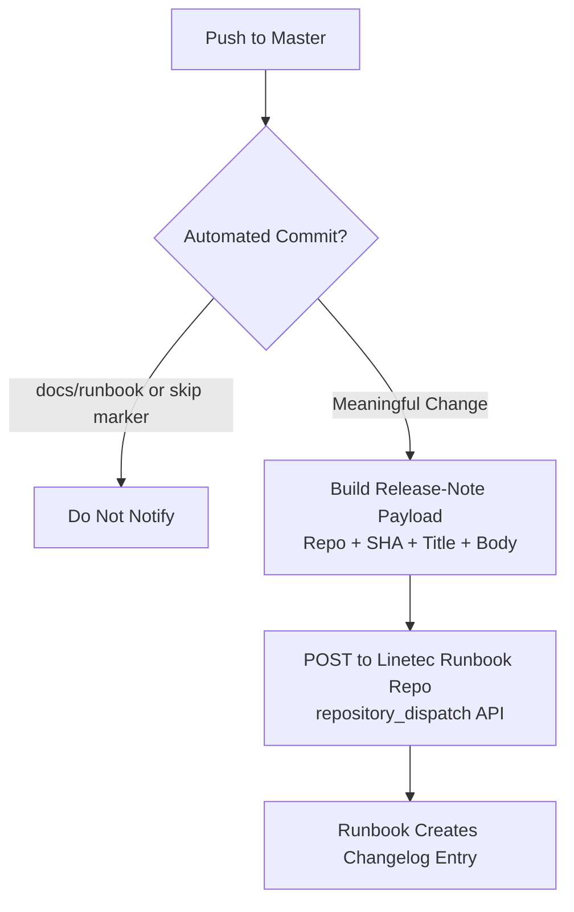
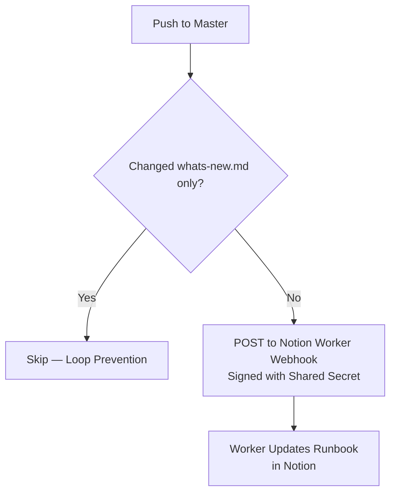
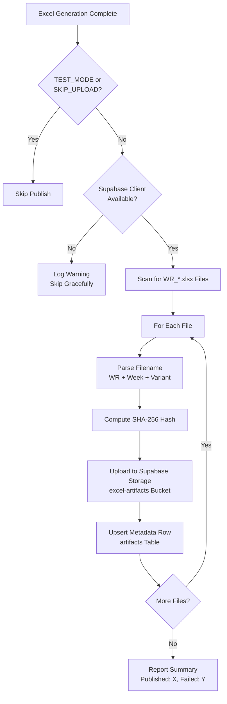
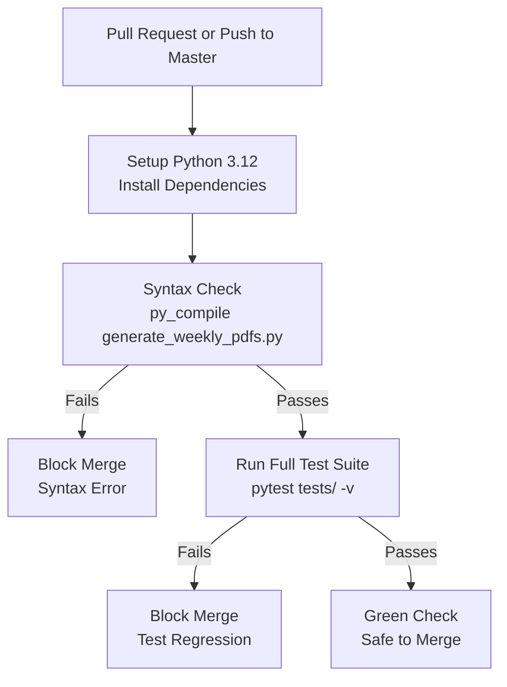
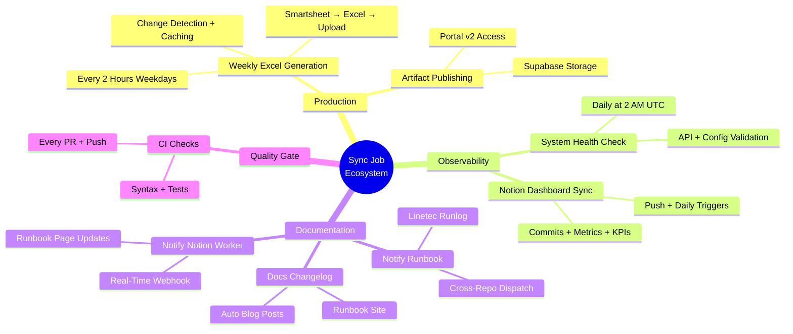

# Sync Job Run Logs

> Generated: 2026-08-11  
> Repository: Generate-Weekly-PDFs-DSR-Resiliency  
> Purpose: Plain-English documentation of all automated sync jobs in this repository.

---

## Table of Contents

1. [Weekly Excel Generation (Billing Pipeline)](#1-weekly-excel-generation-billing-pipeline)
2. [Notion Dashboard Sync](#2-notion-dashboard-sync)
3. [Docs Changelog (Runbook Entry Generator)](#3-docs-changelog-runbook-entry-generator)
4. [System Health Check](#4-system-health-check)
5. [Notify Runbook (Cross-Repo Dispatch)](#5-notify-runbook-cross-repo-dispatch)
6. [Notify Notion Worker](#6-notify-notion-worker)
7. [Artifact Publishing to Supabase](#7-artifact-publishing-to-supabase)
8. [CI Checks (Pull Request Gate)](#8-ci-checks-pull-request-gate)

---

## 1. Weekly Excel Generation (Billing Pipeline)

**Sync Job Name:** `weekly-excel-generation.yml` / `generate_weekly_pdfs.py`

### Primary Purpose

This is the core production job. It automatically pulls crew billing data from Smartsheet every two hours during business days, calculates what has changed since the last run, generates formatted Excel spreadsheets for each Work Request and billing week, and uploads those spreadsheets back to Smartsheet as attachments. This ensures field supervisors and billing staff always have up-to-date Excel reports without manual effort.

### How It Works (Step-by-Step)

1. **Trigger:** The job runs automatically on a schedule — every 2 hours on weekdays (7 AM to 7 PM Central), 3 times on weekends, and once weekly on Monday at midnight Central for a comprehensive deep run. It can also be triggered manually by an operator.

2. **Environment Setup:** GitHub Actions spins up a fresh Linux machine, installs Python 3.12 and all required libraries. It restores previously saved caches (hash history, discovery cache, billing audit rows) to avoid re-processing unchanged data.

3. **Determine Execution Type:** The system identifies whether this is a weekday production run, a weekend maintenance run, a weekly comprehensive run, or a manual dispatch — each type may behave slightly differently.

4. **Sheet Discovery:** The pipeline connects to Smartsheet using a secure API token and discovers all relevant source sheets by scanning designated folders (Subcontractor folders, Original Contract folders, Vac Crew folders). Results are cached for 7 days to reduce API calls.

5. **Data Fetch:** Rows are fetched in parallel (up to 8 workers) from all discovered source sheets. The system validates column names against known synonyms (e.g., "Job #", "Job#", "Job Number" are all recognized).

6. **Filter and Group:** Rows are filtered for eligibility and grouped by Work Request number, week ending date, variant type (primary, helper, vac crew, subcontractor), foreman, department, and job number.

7. **Change Detection:** A SHA-256 hash is computed for each group. If the hash matches the previously stored value, that group is skipped — no need to regenerate an unchanged report. This saves significant time on routine runs.

8. **Excel Generation:** For each changed group, a styled Excel workbook is created using the company logo, formatted headers, itemized rows, and calculated totals. The system uses overlap-safe cell merging to prevent file corruption.

9. **Billing Audit:** The audit module scans for price anomalies, flags changes at LOW/MEDIUM/HIGH risk levels, and records attribution data (which foreman "claimed" each set of rows).

10. **Upload to Smartsheet:** Generated Excel files are uploaded as attachments to the target Smartsheet sheet. Old versions of the same report are deleted first to prevent clutter.

11. **Artifact Preservation:** All generated files are organized by Work Request and by Week Ending, then uploaded to GitHub Actions as downloadable artifacts (retained for 90 days in production, 30 days for test runs).

12. **Publish to Supabase:** Excel artifacts are also uploaded to Supabase cloud storage with metadata rows for the Portal v2 frontend to display.

13. **Notion Sync:** Run metrics (files generated, duration, errors, risk level) are pushed to a Notion database for operational dashboards.

14. **Cache Save:** Hash history, discovery cache, and billing audit row caches are saved so the next run can pick up where this one left off.

### Visual Logic Map

```mermaid
graph TD
    A[Schedule Trigger<br/>Every 2 Hours Weekdays] --> B[GitHub Actions Runner<br/>Setup Python + Restore Caches]
    B --> C[Determine Execution Type<br/>Weekday / Weekend / Weekly / Manual]
    C --> D[Sheet Discovery<br/>Scan Smartsheet Folders]
    D --> E[Parallel Data Fetch<br/>Up to 8 Workers]
    E --> F[Filter & Group Rows<br/>By WR + Week + Variant + Foreman]
    F --> G{Change Detection<br/>SHA-256 Hash Compare}
    G -->|Unchanged| H[Skip Group]
    G -->|Changed| I[Generate Excel Workbook<br/>Logo + Headers + Data + Totals]
    I --> J[Billing Audit<br/>Price Anomaly Detection]
    J --> K[Upload to Smartsheet<br/>Delete Old → Attach New]
    K --> L[Publish to Supabase Storage]
    L --> M[Upload GitHub Artifacts<br/>90-Day Retention]
    M --> N[Sync Metrics to Notion]
    N --> O[Save Caches<br/>Hash History + Discovery + Audit]
    O --> P[Run Complete]
    H --> P
```

### Expected Outcomes & Error Handling

- **Success:** All changed Work Request groups have fresh Excel files generated and uploaded to Smartsheet. Artifacts are available in GitHub Actions and Supabase. Notion dashboard shows a green "Success" status.
- **Partial Success:** Some groups may error individually without failing the entire run. Errors are logged, counted in the run summary, and reported to Sentry.
- **Failure:** If the run fails entirely, Notion automatically creates an "Incident" entry with severity level. Sentry receives the exception. The next scheduled run will retry. Operators can manually dispatch with adjusted settings.
- **Time Budget:** The job has a 165-minute soft budget. If time runs out, it stops gracefully and saves progress (caches, partial artifacts) so the next run continues from where it left off.
- **Alerts:** Sentry (real-time error tracking), Notion Incidents database (automated incident creation on failure), GitHub Actions UI (step summaries with metrics).

---

## 2. Notion Dashboard Sync

**Sync Job Name:** `notion-sync.yml` / `scripts/notion_sync.py`

### Primary Purpose

This job keeps the team's Notion workspace in sync with the repository's activity. It pushes recent git commits to a Changelog database, takes daily snapshots of codebase health metrics, and updates a live KPI dashboard — all so stakeholders can track development velocity and system health without opening GitHub.

### How It Works (Step-by-Step)

1. **Trigger:** Runs on every push to the master branch (syncs recent commits), daily at 6 AM Central (snapshots codebase metrics), or manually on demand.

2. **Mode Selection:** Based on the trigger, the system chooses what to sync:
   - Push events → sync commits only (last 3 days of history)
   - Scheduled daily run → sync metrics only
   - Manual dispatch → operator chooses: commits, metrics, or all

3. **Commit Sync:** Reads the git log, parses each commit's message using Conventional Commit format (feat, fix, refactor, etc.), extracts file change statistics, and creates a page in the Notion Changelog database for each meaningful commit. Automation "bookkeeping" commits (e.g., bot-generated docs updates) are automatically filtered out.

4. **Metrics Snapshot:** Counts Python lines of code, total files, test files, dependencies, source sheets, and workflow steps. Records a daily snapshot in the Notion Metrics database for trend analysis.

5. **KPI Dashboard Update:** Queries all Pipeline Run entries in Notion, computes aggregate statistics (success rate, average duration, total runs, last run status), and updates four live KPI callout blocks on the Notion dashboard with color-coded indicators.

6. **Duplicate Detection:** Before creating any page, the system checks if it already exists (by title match) to ensure idempotent reruns.

### Visual Logic Map

```mermaid
graph TD
    A[Trigger Event] --> B{What Type?}
    B -->|Push to Master| C[Sync Commits<br/>Last 3 Days]
    B -->|Daily Schedule| D[Sync Metrics<br/>Codebase Health]
    B -->|Manual Dispatch| E[Operator Chooses Mode]
    
    C --> F[Read Git Log<br/>Parse Conventional Commits]
    F --> G[Filter Bookkeeping<br/>Skip Bot Commits]
    G --> H[Check Duplicates<br/>in Notion]
    H --> I[Create Changelog Pages<br/>in Notion Database]
    
    D --> J[Count Python LOC<br/>Files, Tests, Deps]
    J --> K[Record Metrics Snapshot<br/>in Notion Database]
    
    E --> C
    E --> D
    
    I --> L[Update KPI Dashboard<br/>Success Rate, Duration, Runs]
    K --> L
    L --> M[Sync Complete]
```

### Expected Outcomes & Error Handling

- **Success:** Notion databases are updated with the latest commits and/or metrics. Dashboard KPIs reflect current state.
- **Failure:** The job is non-critical — failures do not affect billing. If NOTION_TOKEN is not configured, the job skips gracefully with a notice. The workflow has a 5-minute timeout. Individual Notion API errors are caught and logged without crashing the sync.
- **Kill Switch:** Setting the repository variable `NOTION_ENABLED=false` pauses all syncing without removing secrets.

---

## 3. Docs Changelog (Runbook Entry Generator)

**Sync Job Name:** `docs-changelog.yml` / `scripts/generate_runbook_entry.py`

### Primary Purpose

Every time code is pushed to the master branch, this job automatically writes a blog post to the project's Docusaurus runbook site. It documents what changed, who made the change, and which files were affected — creating a living historical record of the project's evolution without any manual documentation effort.

### How It Works (Step-by-Step)

1. **Trigger:** Fires on every push to the master branch, or manually via workflow dispatch. Skips if the push was authored by the bot itself (loop prevention).

2. **Commit Analysis:** The script examines the commit range (before → after SHA), collects all changed files, and reads commit messages.

3. **Skip Detection:** If any commit contains `[skip docs]` or `[docs skip]`, no post is generated. If only bot-maintained paths changed (e.g., the blog folder itself, or the Notion Worker's whats-new page), the run is also skipped to prevent infinite loops.

4. **File Bucketing:** Changed files are categorized into areas: Workflows & CI, Python entry points, Tests, Portal, Portal v2, Docs site, Configuration, etc.

5. **Blog Post Generation:** A Markdown file is written under `website/blog/` with frontmatter (slug, title, tags, date), commit links, and an organized list of changed files grouped by area.

6. **Commit and Push:** The generated blog post is committed directly to master with a `[skip ci]` marker (to prevent re-triggering) and pushed. A retry mechanism handles concurrent pushes with automatic rebase.

### Visual Logic Map

```mermaid
graph TD
    A[Push to Master] --> B{Bot-authored?}
    B -->|Yes| C[Skip — Loop Prevention]
    B -->|No| D[Analyze Commit Range<br/>Collect Changed Files]
    D --> E{Skip Markers Present?}
    E -->|Yes| F[No Post Generated]
    E -->|No| G{Only Bot-Maintained<br/>Files Changed?}
    G -->|Yes| H[Skip — Avoid Loop]
    G -->|No| I[Bucket Files by Area<br/>Workflows, Python, Tests...]
    I --> J[Generate Markdown Blog Post<br/>Frontmatter + Commits + Files]
    J --> K[Commit Post to Master<br/>With skip-ci Marker]
    K --> L{Push Successful?}
    L -->|No| M[Rebase & Retry<br/>Up to 5 Attempts]
    M --> L
    L -->|Yes| N[Runbook Entry Published]
```

### Expected Outcomes & Error Handling

- **Success:** A new blog post appears on the Docusaurus runbook site documenting the push.
- **No Post:** If the diff is empty, only touches bot files, or contains skip markers — the job exits cleanly with no output.
- **Push Conflicts:** Up to 5 automatic rebase-and-retry attempts handle concurrent pushes. If all fail, the workflow errors but does not affect production.
- **Concurrency:** Only one instance runs at a time (queue mode, not cancel) to prevent conflicting commits.

---

## 4. System Health Check

**Sync Job Name:** `system-health-check.yml` / `validate_system_health.py`

### Primary Purpose

A daily diagnostic that verifies the billing system's infrastructure is healthy — checking that the Smartsheet API is reachable, that required secrets are configured, and that key integrations are functioning. Think of it as a morning wellness check for the automated billing pipeline.

### How It Works (Step-by-Step)

1. **Trigger:** Runs daily at 2:00 AM UTC (8:00 PM Central), or manually on demand.

2. **Secret Verification:** Confirms that the SMARTSHEET_API_TOKEN is present and valid. Checks for optional secrets like SENTRY_DSN.

3. **Health Validation:** Runs `validate_system_health.py` which tests connectivity to Smartsheet, verifies column mappings, checks that source sheets are accessible, and validates the overall system configuration.

4. **Report Generation:** Produces a JSON health report (`generated_docs/system_health.json`) with an overall status of OK, WARN, or CRITICAL.

5. **Status Evaluation:** The workflow reads the JSON report and sets the job exit code accordingly — CRITICAL fails the workflow (red badge), WARN passes with a warning, OK passes cleanly.

6. **Artifact Upload:** The health report JSON is uploaded as a GitHub Actions artifact (30-day retention) for historical reference.

### Visual Logic Map

```mermaid
graph TD
    A[Daily at 2 AM UTC] --> B[Setup Python<br/>Install Dependencies]
    B --> C[Verify Secrets<br/>API Token Present?]
    C -->|Missing| D[Fail Fast<br/>Exit 1]
    C -->|Present| E[Run Health Checks<br/>API Connectivity + Column Mappings]
    E --> F[Generate Health Report<br/>system_health.json]
    F --> G{Overall Status?}
    G -->|OK| H[Pass — Green Badge]
    G -->|WARN| I[Pass with Warning]
    G -->|CRITICAL| J[Fail — Red Badge]
    F --> K[Upload Report Artifact<br/>30-Day Retention]
```

### Expected Outcomes & Error Handling

- **Success (OK):** All systems healthy. Smartsheet API is reachable, secrets are valid, source sheets are accessible.
- **Warning (WARN):** Some non-critical issues detected (e.g., a sheet has unexpected columns). Pipeline can still run but may need attention.
- **Critical (CRITICAL):** Fundamental infrastructure problem. The Smartsheet API may be unreachable, or required secrets are missing. The workflow fails, drawing operator attention.
- **Artifact:** The health report is always uploaded regardless of outcome, providing an audit trail.

---

## 5. Notify Runbook (Cross-Repo Dispatch)

**Sync Job Name:** `github_workflows_notify.runbook_Version2.yml`

### Primary Purpose

When meaningful code changes land on the master branch, this job sends a notification to the Linetec company-wide runbook repository. This keeps the organization's central runbook automatically updated with the latest changes from the billing pipeline — no manual cross-referencing needed.

### How It Works (Step-by-Step)

1. **Trigger:** Fires on every push to the master branch. Ignores pushes that only modify automated docs (the Notion Worker's page or blog posts) and skips commits tagged with `[skip ci]` or `[skip runlog]`.

2. **Message Filtering:** The job checks the head commit message. If it starts with `docs(runbook):` or `chore(notion):`, or contains skip markers, the job does not fire — these are automation housekeeping, not meaningful changes.

3. **Payload Construction:** Builds a JSON payload containing the repository name, commit SHA, commit message (as title and body), and a comparison URL.

4. **Cross-Repo Dispatch:** Sends an HTTP POST (using a fine-grained Personal Access Token) to the Linetec runbook repository's `repository_dispatch` endpoint with an event type of "release-note". The receiving repo's workflow creates a tagged changelog entry.

### Visual Logic Map

```mermaid
graph TD
    A[Push to Master] --> B{Automated Commit?}
    B -->|docs/runbook or skip marker| C[Do Not Notify]
    B -->|Meaningful Change| D[Build Release-Note Payload<br/>Repo + SHA + Title + Body]
    D --> E[POST to Linetec Runbook Repo<br/>repository_dispatch API]
    E --> F[Runbook Creates Changelog Entry]
```

### Expected Outcomes & Error Handling

- **Success:** The Linetec runbook receives the release note and generates a changelog entry.
- **Missing Secret:** If `RUNBOOK_DISPATCH_PAT` is not configured, the job fails fast with a clear error message instead of a cryptic 401.
- **Network Failure:** The `curl --fail` flag ensures HTTP errors are surfaced. The push to master is never blocked by a runbook notification failure.

---

## 6. Notify Notion Worker

**Sync Job Name:** `notify-notion-worker.yml`

### Primary Purpose

Provides real-time notification to the Notion Runbook Worker whenever code lands on the master branch. Instead of waiting for the worker's periodic poll, this webhook tells the worker immediately that new content is available — keeping the runbook current within seconds of a push.

### How It Works (Step-by-Step)

1. **Trigger:** Fires on every push to master. Ignores changes to `website/docs/runbook/whats-new.md` (which the worker itself writes) to prevent a self-triggering feedback loop.

2. **Webhook POST:** Sends a signed HTTP POST to the Notion Worker's webhook endpoint with the repository name and commit SHA.

3. **Worker Reaction:** The Notion Worker (a separate deployed service) receives the webhook, fetches the latest repository state, and updates the runbook page in Notion accordingly.

### Visual Logic Map

```mermaid
graph TD
    A[Push to Master] --> B{Changed whats-new.md only?}
    B -->|Yes| C[Skip — Loop Prevention]
    B -->|No| D[POST to Notion Worker Webhook<br/>Signed with Shared Secret]
    D --> E[Worker Updates Runbook<br/>in Notion]
```

### Expected Outcomes & Error Handling

- **Success:** The Notion Worker is notified and updates the runbook page.
- **Loop Prevention:** Changes to the worker's own output file are explicitly ignored to prevent an infinite notification → update → push → notification cycle.
- **Missing Secrets:** If `NOTION_WORKER_WEBHOOK_URL` or `NOTION_WORKER_SECRET` are not set, the curl command will fail, but this does not affect the push or billing pipeline.

---

## 7. Artifact Publishing to Supabase

**Sync Job Name:** `scripts/publish_artifacts_to_supabase.py` (step within Weekly Excel Generation)

### Primary Purpose

After Excel reports are generated, this step uploads them to Supabase cloud storage and records metadata in a database table. This makes the reports accessible through the Portal v2 web interface, where team members can browse and download billing reports without needing direct access to GitHub Actions or Smartsheet.

### How It Works (Step-by-Step)

1. **Guard Checks:** Skips entirely if TEST_MODE or SKIP_UPLOAD is active (dry runs), or if Supabase credentials are not configured.

2. **File Collection:** Scans the `generated_docs/` folder (including date-based subfolders) for all `WR_*.xlsx` files.

3. **Per-File Processing:** For each Excel file:
   - Parses the filename to extract Work Request number and week ending date.
   - Determines the variant type (primary, helper, vac_crew, aep_billable, reduced_sub, etc.).
   - Computes a SHA-256 hash of the file contents.
   - Converts the MMDDYY week ending to ISO date format.

4. **Storage Upload:** Uploads the file to Supabase Storage in the `excel-artifacts` bucket, organized by week ending date. Uses upsert mode so re-runs overwrite previous versions.

5. **Metadata Upsert:** Inserts or updates a row in the `artifacts` database table with the work request, week ending, variant, filename, storage path, file size, SHA-256 hash, and run ID. The upsert key is the SHA-256 hash, making it idempotent.

6. **Error Isolation:** Each file is processed independently. If one file fails, the loop continues with the next. Failures are counted and reported to both the GitHub Step Summary and Sentry, but never crash the billing run.

### Visual Logic Map

```mermaid
graph TD
    A[Excel Generation Complete] --> B{TEST_MODE or<br/>SKIP_UPLOAD?}
    B -->|Yes| C[Skip Publish]
    B -->|No| D{Supabase Client<br/>Available?}
    D -->|No| E[Log Warning<br/>Skip Gracefully]
    D -->|Yes| F[Scan for WR_*.xlsx Files]
    F --> G[For Each File]
    G --> H[Parse Filename<br/>WR + Week + Variant]
    H --> I[Compute SHA-256 Hash]
    I --> J[Upload to Supabase Storage<br/>excel-artifacts Bucket]
    J --> K[Upsert Metadata Row<br/>artifacts Table]
    K --> L{More Files?}
    L -->|Yes| G
    L -->|No| M[Report Summary<br/>Published: X, Failed: Y]
```

### Expected Outcomes & Error Handling

- **Success:** All Excel files are available in Supabase Storage and queryable via the artifacts table. Portal v2 users can browse and download reports.
- **Partial Failure:** Individual file failures are logged but do not stop the batch. The summary reports the count of published vs. failed files.
- **Non-Fatal Design:** This entire step runs with `continue-on-error: true` in the workflow. A Supabase outage NEVER fails the billing run — reports are still generated, uploaded to Smartsheet, and preserved as GitHub artifacts.
- **Security:** The Supabase service role key is never logged. File-level error messages redact filenames to prevent PII leakage into Sentry.

---

## 8. CI Checks (Pull Request Gate)

**Sync Job Name:** `ci-checks.yml`

### Primary Purpose

A lightweight quality gate that runs on every pull request and push to master. It ensures that the billing pipeline's code compiles without syntax errors and that all automated tests pass — preventing broken code from reaching the production schedule that processes real billing data every 2 hours.

### How It Works (Step-by-Step)

1. **Trigger:** Runs on every pull request targeting master, and every push to master.

2. **Syntax Validation:** Runs `python -m py_compile generate_weekly_pdfs.py` to catch syntax errors in the main entry point before anything else.

3. **Test Suite:** Executes the full pytest test suite (`pytest tests/ -v --tb=short`) which validates business logic, data processing rules, pricing calculations, and change detection behavior.

4. **Pass/Fail:** If either step fails, the PR cannot be merged (when branch protection is configured). If both pass, the code is safe to deploy.

### Visual Logic Map

```mermaid
graph TD
    A[Pull Request or Push to Master] --> B[Setup Python 3.12<br/>Install Dependencies]
    B --> C[Syntax Check<br/>py_compile generate_weekly_pdfs.py]
    C -->|Fails| D[Block Merge<br/>Syntax Error]
    C -->|Passes| E[Run Full Test Suite<br/>pytest tests/ -v]
    E -->|Fails| F[Block Merge<br/>Test Regression]
    E -->|Passes| G[Green Check<br/>Safe to Merge]
```

### Expected Outcomes & Error Handling

- **Success:** Green check on the PR — code compiles and all tests pass. Safe to merge.
- **Syntax Failure:** The billing engine has a syntax error that would crash the next scheduled run. Merge is blocked until fixed.
- **Test Failure:** A behavioral regression was detected. The change breaks expected billing logic. Merge is blocked until tests are fixed.
- **Timeout:** The workflow has a 15-minute hard limit. If tests hang, the job fails.

---

## Summary: Complete Sync Job Ecosystem

```mermaid
mindmap
  root((Sync Job<br/>Ecosystem))
    Production
      Weekly Excel Generation
        Every 2 Hours Weekdays
        Smartsheet → Excel → Upload
        Change Detection + Caching
      Artifact Publishing
        Supabase Storage
        Portal v2 Access
    Observability
      System Health Check
        Daily at 2 AM UTC
        API + Config Validation
      Notion Dashboard Sync
        Commits + Metrics + KPIs
        Push + Daily Triggers
    Documentation
      Docs Changelog
        Auto Blog Posts
        Runbook Site
      Notify Runbook
        Cross-Repo Dispatch
        Linetec Runlog
      Notify Notion Worker
        Real-Time Webhook
        Runbook Page Updates
    Quality Gate
      CI Checks
        Every PR + Push
        Syntax + Tests
```

---

## Quick Reference: Schedules

| Job | Schedule | Timezone |
|-----|----------|----------|
| Weekly Excel Generation | Every 2h weekdays; 3x weekends; Monday 00:00 deep run | Central (America/Chicago) |
| Notion Dashboard Sync | Every push + daily 6 AM | Central |
| Docs Changelog | Every push to master | UTC |
| System Health Check | Daily 2:00 AM | UTC |
| Notify Runbook | Every push to master | UTC |
| Notify Notion Worker | Every push to master | UTC |
| CI Checks | Every PR + push to master | UTC |
| Artifact Publishing | Part of Excel Generation run | Central |
