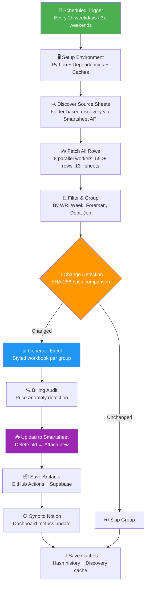
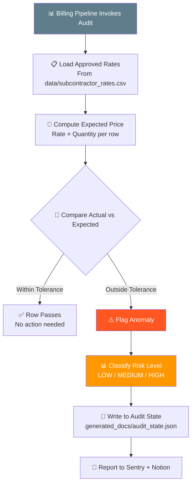
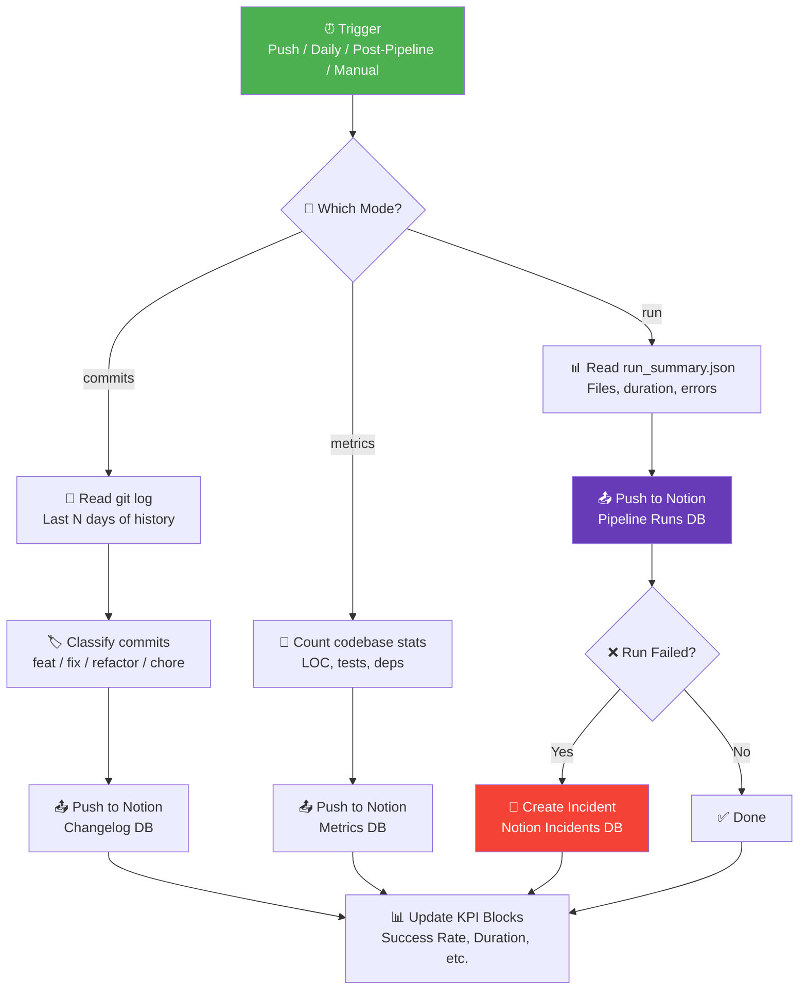
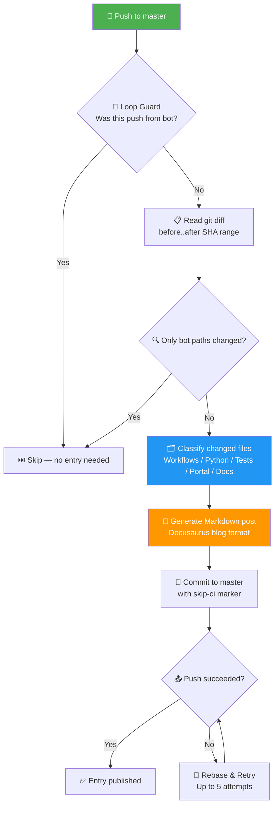
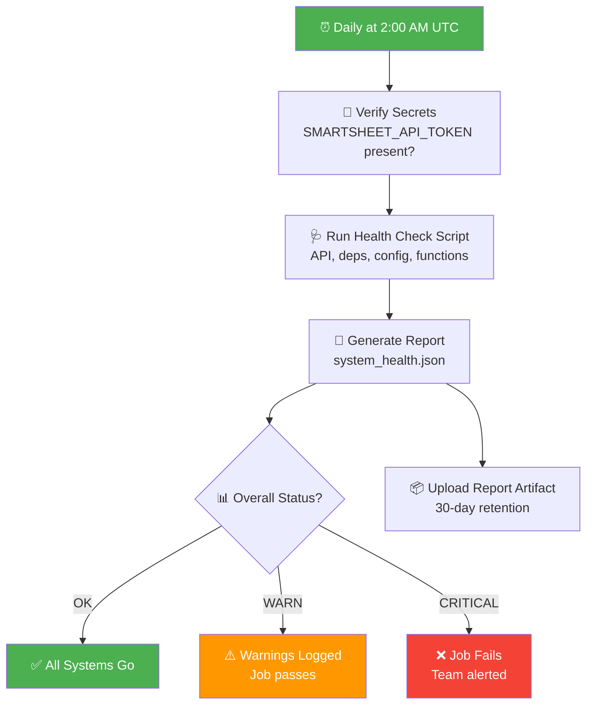
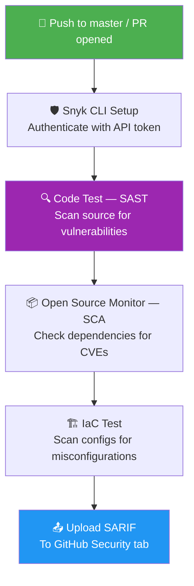
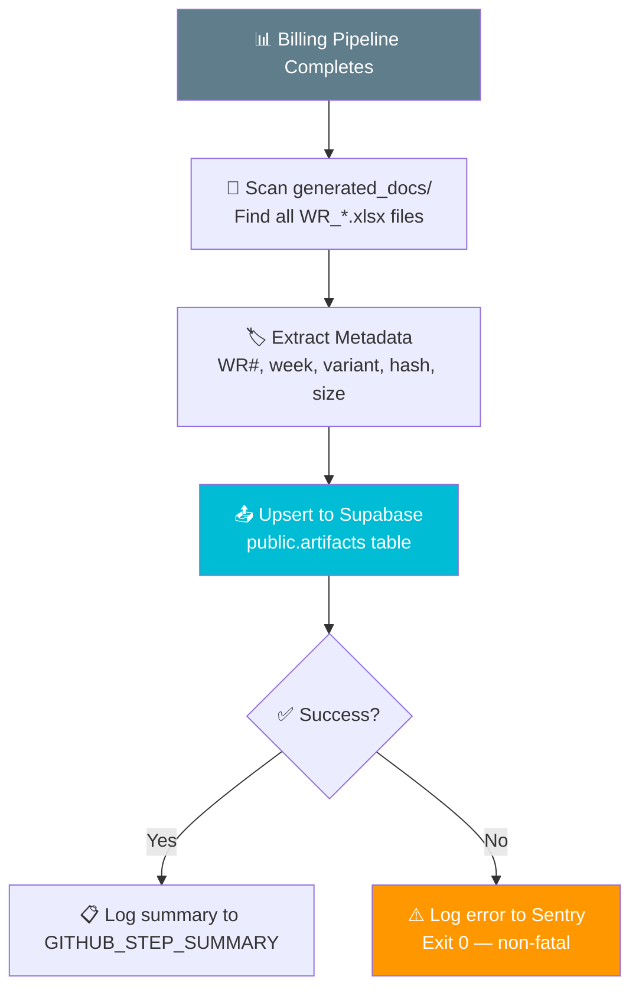
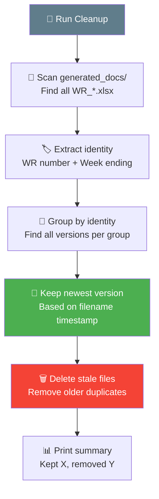
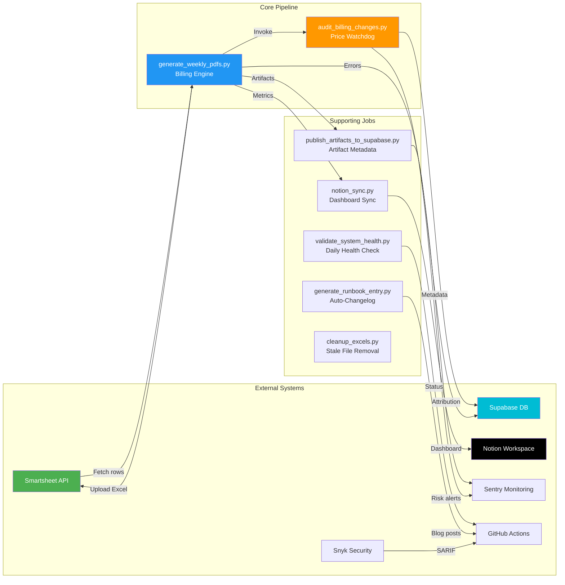

# Sync Job Run Logs

> **Generated**: 2026-08-14  
> **Repository**: Generate-Weekly-PDFs-DSR-Resiliency  
> **Purpose**: Non-technical documentation of all automated sync jobs in this repository.

---

## Table of Contents

1. [Weekly Excel Generation (Billing Pipeline)](#1-weekly-excel-generation-billing-pipeline)
2. [Billing Audit System](#2-billing-audit-system)
3. [Notion Dashboard Sync](#3-notion-dashboard-sync)
4. [Docs Changelog (Runbook Auto-Update)](#4-docs-changelog-runbook-auto-update)
5. [System Health Check](#5-system-health-check)
6. [Snyk Security Scan](#6-snyk-security-scan)
7. [Artifact Publishing to Supabase](#7-artifact-publishing-to-supabase)
8. [Excel Cleanup](#8-excel-cleanup)

---

## 1. Weekly Excel Generation (Billing Pipeline)

**Sync Job Name:** `weekly-excel-generation.yml` / `generate_weekly_pdfs.py`

### Primary Purpose

This is the core production job. It automatically pulls billing data from
Smartsheet (a cloud spreadsheet platform), groups that data by Work Request
and billing week, generates formatted Excel reports for each group, and
uploads the finished files back to Smartsheet as attachments. This replaces
what would otherwise be hours of manual spreadsheet creation for the billing
team every day.

### How It Works (Step-by-Step)

1. **Trigger**: The job runs automatically on a schedule — every 2 hours on
   weekdays during US business hours, 3 times per day on weekends, and a
   comprehensive deep run every Monday at midnight (Central Time). It can
   also be triggered manually from GitHub.

2. **Environment Setup**: GitHub Actions spins up a fresh server, installs
   Python and all required libraries, and restores cached data from previous
   runs (hash history, discovery cache, billing audit rows).

3. **Sheet Discovery**: The system connects to Smartsheet and automatically
   discovers which source spreadsheets to read. It checks preconfigured
   folder IDs (for subcontractor and original contract data) and caches the
   list for up to 7 days to avoid redundant API calls.

4. **Data Fetch**: Using up to 8 parallel workers, it downloads all rows
   from the discovered source sheets (typically 550+ rows across 13+
   sheets). Column names are validated against known synonyms to handle
   naming inconsistencies.

5. **Filtering & Grouping**: Rows are filtered for relevance, then grouped
   by Work Request number, billing week ending date, foreman, department,
   and job number. Each group becomes one Excel file.

6. **Change Detection**: A SHA-256 hash of each group's data is compared
   against the hash from the last run. If nothing changed, that group is
   skipped — avoiding unnecessary regeneration and upload.

7. **Attachment Pre-Fetch**: Before generating files, the system checks
   which target rows already have attachments (to avoid duplicates). This
   runs in parallel with a safety timeout of 10 minutes.

8. **Excel Generation**: For each changed group, a styled Excel workbook is
   created using the `openpyxl` library. Each file includes a company logo,
   formatted headers, billing line items, and calculated totals.

9. **Billing Audit**: The audit system checks for price anomalies —
   unexpected changes in billing amounts that could indicate errors.
   Anomalies are flagged as LOW, MEDIUM, or HIGH risk.

10. **Upload to Smartsheet**: The finished Excel files are uploaded as
    attachments to the appropriate rows on the target Smartsheet. Old
    versions are deleted first to avoid duplicates.

11. **Artifact Preservation**: All generated files are uploaded to GitHub
    Actions as downloadable artifacts (organized by Work Request and by
    week), with a JSON manifest for indexing.

12. **Notion Sync**: If configured, a summary of the run (files generated,
    duration, errors) is pushed to a Notion dashboard for visibility.

13. **Cache Save**: Hash history, discovery cache, and billing audit data
    are saved so the next run can pick up where this one left off.

### Visual Logic Map

```mermaid
graph TD
    A[⏰ Scheduled Trigger<br>Every 2h weekdays / 3x weekends] --> B[🖥️ Setup Environment<br>Python + Dependencies + Caches]
    B --> C[🔍 Discover Source Sheets<br>Folder-based discovery via Smartsheet API]
    C --> D[📥 Fetch All Rows<br>8 parallel workers, 550+ rows, 13+ sheets]
    D --> E[🔀 Filter & Group<br>By WR, Week, Foreman, Dept, Job]
    E --> F{🔎 Change Detection<br>SHA-256 hash comparison}
    F -->|Changed| G[📊 Generate Excel<br>Styled workbook per group]
    F -->|Unchanged| H[⏭️ Skip Group]
    G --> I[🔍 Billing Audit<br>Price anomaly detection]
    I --> J[📤 Upload to Smartsheet<br>Delete old → Attach new]
    J --> K[📦 Save Artifacts<br>GitHub Actions + Supabase]
    K --> L[📋 Sync to Notion<br>Dashboard metrics update]
    L --> M[💾 Save Caches<br>Hash history + Discovery cache]
    H --> M

    style A fill:#4CAF50,color:#fff
    style F fill:#FF9800,color:#fff
    style G fill:#2196F3,color:#fff
    style J fill:#9C27B0,color:#fff
```

### Expected Outcomes & Error Handling

**Successful Run:**
- All changed groups are regenerated and uploaded to Smartsheet.
- Run summary shows zero errors and a reasonable duration (typically 15–45
  minutes for normal runs, up to 2.5 hours for deep Monday runs).
- Artifacts are available in GitHub Actions for 90 days.

**Failure Handling:**
- **Time Budget**: The job has a 165-minute graceful stop budget. If
  processing takes too long, it saves progress and exits cleanly before
  GitHub's 180-minute hard timeout.
- **Sentry Alerts**: All errors are reported to Sentry for real-time
  monitoring and alerting.
- **Notion Incidents**: Failed runs automatically create an incident entry
  in the Notion Incidents database.
- **Concurrency Protection**: Only one run processes at a time per branch.
  If a new trigger fires while one is running, it queues (never cancels the
  in-progress run).
- **Rate Limiting**: Workers are capped at 8 to stay within Smartsheet's
  300 requests/minute limit.

---

## 2. Billing Audit System

**Sync Job Name:** `audit_billing_changes.py`

### Primary Purpose

This is a financial watchdog that runs alongside the billing pipeline. It
monitors for unauthorized or unexpected changes in billing amounts — like a
sudden price spike on a Work Request that nobody authorized. It flags
anomalies by severity (LOW/MEDIUM/HIGH) so the billing team can investigate
before incorrect invoices go out.

### How It Works (Step-by-Step)

1. **Triggered by Main Pipeline**: The audit system is imported and invoked
   by the main billing pipeline during each run — it does not run
   independently.

2. **Rate Sanity Check**: For each row, the system computes what the
   expected price should be (rate × quantity from the approved rates CSV)
   and compares it to the actual "Units Total Price" in Smartsheet.

3. **Tolerance Thresholds**: Small rounding differences (less than $0.02 or
   0.5% of expected price) are ignored. Only meaningful deviations trigger
   a flag.

4. **Risk Classification**: The audit assigns one risk level to the
   whole run, derived from the **combined count** of flagged issues
   (unauthorized changes + data issues + rate-sanity mismatches, plus
   any snapshot-drift holds folded in afterwards) — it is NOT a
   per-anomaly rating and does not weigh dollar-delta size
   (`_risk_level_for` in `audit_billing_changes.py`):
   - **LOW**: zero issues counted.
   - **MEDIUM**: one to three issues.
   - **HIGH**: more than three issues.

   Legacy price-variance anomalies are **report-only by default**
   (excluded from this count since 2026-08-14; opt back in with
   `PRICE_VARIANCE_IN_RISK=true`). They still appear in the
   informational "Total Issues" figures, so a run can show hundreds
   of anomalies yet report risk LOW.

5. **Attribution Tracking**: The system tracks which foreman or crew is
   responsible for each billing group via frozen attribution snapshots
   stored in Supabase.

6. **Report Generation**: Results are included in the run summary and
   reported to Notion as the "Audit Risk" level.

### Visual Logic Map

```mermaid
graph TD
    A[📊 Billing Pipeline Invokes Audit] --> B[📋 Load Approved Rates<br>From data/subcontractor_rates.csv]
    B --> C[🔢 Compute Expected Price<br>Rate × Quantity per row]
    C --> D{🔎 Compare Actual vs Expected}
    D -->|Within Tolerance| E[✅ Row Passes<br>No action needed]
    D -->|Outside Tolerance| F[⚠️ Flag Anomaly]
    F --> G[📊 Classify Risk Level<br>LOW / MEDIUM / HIGH]
    G --> H[📝 Write to Audit State<br>generated_docs/audit_state.json]
    H --> I[📡 Report to Sentry + Notion]

    style A fill:#607D8B,color:#fff
    style F fill:#FF5722,color:#fff
    style G fill:#FF9800,color:#fff
```

### Expected Outcomes & Error Handling

**Successful Run:**
- All rows are evaluated; any deviations are logged with severity.
- The run summary includes the overall audit risk level.

**Failure Handling:**
- The audit system is designed to be non-fatal — if it errors, the main
  billing pipeline continues unaffected.
- Errors are captured by Sentry for post-mortem analysis.

---

## 3. Notion Dashboard Sync

**Sync Job Name:** `notion-sync.yml` / `scripts/notion_sync.py`

### Primary Purpose

This job keeps the team's Notion workspace up to date with pipeline
activity. It pushes three types of data: pipeline run results (how many
files were generated, errors, duration), recent code commits (as a
changelog), and codebase health metrics (lines of code, dependencies,
test coverage). This gives stakeholders a single dashboard to monitor
system health without checking GitHub directly.

### How It Works (Step-by-Step)

1. **Trigger**: Runs in three situations:
   - After every push to `master` (syncs recent commits).
   - Daily at 6 AM Central (syncs codebase metrics snapshot).
   - After each billing pipeline run (syncs run results).
   - Can be triggered manually with configurable mode.

2. **Run Sync** (`--mode run`): Reads the run summary JSON (files
   generated, uploaded, skipped, duration, errors) and creates a new entry
   in the Notion "Pipeline Runs" database. If the run failed, it
   automatically creates an incident entry.

3. **Commit Sync** (`--mode commits`): Reads git history for the last N
   days, classifies each commit by type (feat, fix, refactor, etc.), and
   pushes them to the Notion "Changelog" database. Automation-only commits
   (like this script's own runbook updates) are filtered out to avoid noise.

4. **Metrics Sync** (`--mode metrics`): Counts Python lines of code, test
   files, dependencies, source sheets, and workflow steps — then creates a
   daily snapshot in the Notion "Metrics" database for trend tracking.

5. **KPI Dashboard Update**: After any sync, the script updates 4 KPI
   callout blocks on the Notion dashboard: Last Run status, Success Rate,
   Total Runs, and Average Duration.

6. **Duplicate Detection**: Before creating any entry, it checks whether a
   page with the same title already exists, ensuring idempotent runs.

### Visual Logic Map

```mermaid
graph TD
    A[⏰ Trigger<br>Push / Daily / Post-Pipeline / Manual] --> B{🔀 Which Mode?}
    B -->|run| C[📊 Read run_summary.json<br>Files, duration, errors]
    B -->|commits| D[📝 Read git log<br>Last N days of history]
    B -->|metrics| E[📐 Count codebase stats<br>LOC, tests, deps]
    
    C --> F[📤 Push to Notion<br>Pipeline Runs DB]
    F --> G{❌ Run Failed?}
    G -->|Yes| H[🚨 Create Incident<br>Notion Incidents DB]
    G -->|No| I[✅ Done]
    
    D --> J[🏷️ Classify commits<br>feat / fix / refactor / chore]
    J --> K[📤 Push to Notion<br>Changelog DB]
    
    E --> L[📤 Push to Notion<br>Metrics DB]
    
    K --> M[📊 Update KPI Blocks<br>Success Rate, Duration, etc.]
    L --> M
    H --> M
    I --> M

    style A fill:#4CAF50,color:#fff
    style F fill:#673AB7,color:#fff
    style H fill:#F44336,color:#fff
```

### Expected Outcomes & Error Handling

**Successful Run:**
- New entries appear in the appropriate Notion databases.
- KPI dashboard blocks show current, accurate numbers.
- No duplicate entries are created.

**Failure Handling:**
- The Notion sync step in the billing workflow uses `continue-on-error:
  true` — a Notion outage never fails the billing pipeline.
- Missing `NOTION_TOKEN` or database IDs are logged as warnings and the
  sync is skipped gracefully.
- The `NOTION_ENABLED` variable acts as a kill-switch to pause syncing.

---

## 4. Docs Changelog (Runbook Auto-Update)

**Sync Job Name:** `docs-changelog.yml` / `scripts/generate_runbook_entry.py`

### Primary Purpose

Every time code is pushed to the main branch, this job automatically writes
a new entry in the team's Docusaurus documentation site (the "living
runbook"). It summarizes which files changed, groups them by area (Python
core, workflows, portal, tests, etc.), and publishes the entry so the
runbook always reflects the latest state of the system. Think of it as an
auto-generated changelog that keeps documentation current without manual
effort.

### How It Works (Step-by-Step)

1. **Trigger**: Fires on every push to the `master` branch. Also runs on
   manual dispatch.

2. **Loop Protection**: Skips if the push was made by the `github-
   actions[bot]` itself (to prevent infinite commit loops). Also skips if
   the push only touches bot-maintained paths (`website/blog/`).

3. **Diff Analysis**: Reads the git diff between the previous and current
   commit SHAs. Identifies which files changed.

4. **Bucket Classification**: Changed files are grouped into categories:
   - Workflows & CI
   - Python entry points
   - Tests
   - Portal (Express backend)
   - Portal v2 (React frontend)
   - Docs site
   - Configuration files
   - Data files

5. **Markdown Generation**: A Docusaurus-format blog post is generated with
   the commit subjects, file categories, and links to the run.

6. **Commit & Push**: The generated post is committed directly to `master`
   with a `[skip ci]` marker (so it doesn't retrigger itself), using a
   retry-with-rebase strategy to handle concurrent pushes gracefully.

### Visual Logic Map

```mermaid
graph TD
    A[🔀 Push to master] --> B{🤖 Loop Guard<br>Was this push from bot?}
    B -->|Yes| C[⏭️ Skip — no entry needed]
    B -->|No| D[📋 Read git diff<br>before..after SHA range]
    D --> E{🔍 Only bot paths changed?}
    E -->|Yes| C
    E -->|No| F[🗂️ Classify changed files<br>Workflows / Python / Tests / Portal / Docs]
    F --> G[📝 Generate Markdown post<br>Docusaurus blog format]
    G --> H[💾 Commit to master<br>with skip-ci marker]
    H --> I{📤 Push succeeded?}
    I -->|Yes| J[✅ Entry published]
    I -->|No| K[🔄 Rebase & Retry<br>Up to 5 attempts]
    K --> I

    style A fill:#4CAF50,color:#fff
    style F fill:#2196F3,color:#fff
    style G fill:#FF9800,color:#fff
```

### Expected Outcomes & Error Handling

**Successful Run:**
- A new blog post appears under `website/blog/` documenting the push.
- The Docusaurus site rebuilds automatically with the new entry.

**Failure Handling:**
- If push fails due to a concurrent commit, the job retries up to 5 times
  with rebase.
- Empty diffs or skip markers result in a clean exit with no entry (not an
  error).

---

## 5. System Health Check

**Sync Job Name:** `system-health-check.yml` / `validate_system_health.py`

> ⚠️ **KNOWN BROKEN (as of 2026-08-14):** the workflow invokes
> `python validate_system_health.py`, but that script does **not exist
> in the repository**. Every scheduled run fails at the "Run system
> health check" step, no `system_health.json` is produced, and the
> "Evaluate health status" step then fails with "No health report
> generated". A red ❌ on this workflow therefore means "entry point
> missing", not "billing system unhealthy" — do not page anyone off it
> until the script is added (or the workflow is repointed at a real
> command; workflow changes need Juan's approval). The rest of this
> section describes the **intended** design.

### Primary Purpose

A daily diagnostic that verifies the entire billing system is healthy and
ready to process data. It checks that the Smartsheet API connection works,
required secrets are present, and core system components are functional.
Think of it as a doctor's checkup for the billing infrastructure.

### How It Works (Step-by-Step, as designed)

1. **Trigger**: Runs daily at 2:00 AM UTC. Can also be triggered manually.

2. **Secret Verification**: Confirms that the `SMARTSHEET_API_TOKEN` secret
   is available and properly injected into the environment.

3. **System Validation**: Runs a comprehensive health check script that
   tests:
   - Smartsheet API connectivity and authentication.
   - Required Python dependencies are importable.
   - Configuration values are valid.
   - Core functions can be invoked without error.

4. **Report Generation**: Produces a `system_health.json` report with an
   overall status: OK, WARN, or CRITICAL.

5. **Status Evaluation**: The workflow reads the report and:
   - **OK** → Job passes with a green checkmark.
   - **WARN** → Job passes but logs a warning.
   - **CRITICAL** → Job fails, alerting the team.

6. **Report Upload**: The health report is uploaded as a GitHub Actions
   artifact (retained 30 days) for historical reference.

### Visual Logic Map

```mermaid
graph TD
    A[⏰ Daily at 2:00 AM UTC] --> B[🔑 Verify Secrets<br>SMARTSHEET_API_TOKEN present?]
    B --> C[🩺 Run Health Check Script<br>API, deps, config, functions]
    C --> D[📄 Generate Report<br>system_health.json]
    D --> E{📊 Overall Status?}
    E -->|OK| F[✅ All Systems Go]
    E -->|WARN| G[⚠️ Warnings Logged<br>Job passes]
    E -->|CRITICAL| H[❌ Job Fails<br>Team alerted]
    D --> I[📦 Upload Report Artifact<br>30-day retention]

    style A fill:#4CAF50,color:#fff
    style F fill:#4CAF50,color:#fff
    style G fill:#FF9800,color:#fff
    style H fill:#F44336,color:#fff
```

### Expected Outcomes & Error Handling

**Successful Run:**
- Health report shows "OK" status.
- All API connections verified working.
- Artifact available for audit trail.

**Failure Handling:**
- **Current reality: the run fails every night** because
  `validate_system_health.py` is missing (see the warning at the top
  of this section) — the failure notification fires before any
  diagnostics run.
- As designed, a CRITICAL status causes the workflow to fail, which
  triggers GitHub notifications to repository maintainers.
- Sentry DSN absence is non-fatal (logged as informational).
- The 10-minute timeout prevents the check from hanging indefinitely.

---

## 6. Snyk Security Scan

**Sync Job Name:** `snyk-security.yml`

### Primary Purpose

Scans the codebase for known security vulnerabilities — in both the code
itself (SAST) and the third-party libraries used (SCA). Results appear in
GitHub's Security tab so the team can prioritize and remediate
vulnerabilities before they reach production.

### How It Works (Step-by-Step)

1. **Trigger**: Runs on every push to `master` and on every pull request
   targeting `master`.

2. **Code Analysis (SAST)**: Snyk scans the source code for security
   anti-patterns (hardcoded secrets, SQL injection vectors, etc.) and
   produces a SARIF report.

3. **Dependency Monitoring (SCA)**: Snyk checks all project dependencies
   against its vulnerability database and reports known CVEs.

4. **Infrastructure as Code (IaC)**: Scans YAML/configuration files for
   security misconfigurations.

5. **Results Upload**: The SARIF report is uploaded to GitHub's Code
   Scanning tab, where findings appear as actionable security alerts.

### Visual Logic Map

```mermaid
graph TD
    A[🔀 Push to master / PR opened] --> B[🛡️ Snyk CLI Setup<br>Authenticate with API token]
    B --> C[🔍 Code Test — SAST<br>Scan source for vulnerabilities]
    C --> D[📦 Open Source Monitor — SCA<br>Check dependencies for CVEs]
    D --> E[🏗️ IaC Test<br>Scan configs for misconfigurations]
    E --> F[📤 Upload SARIF<br>To GitHub Security tab]

    style A fill:#4CAF50,color:#fff
    style C fill:#9C27B0,color:#fff
    style F fill:#2196F3,color:#fff
```

### Expected Outcomes & Error Handling

**Successful Run:**
- Security findings (if any) appear in GitHub's Security → Code Scanning.
- Dependencies are monitored in the Snyk dashboard.

**Failure Handling:**
- Only the two *test* steps are non-blocking: `snyk code test` and
  `snyk iac test` carry `|| true`, so findings from those are reported
  without failing the build.
- `snyk monitor --all-projects` and the SARIF upload step have **no**
  such guard — a monitoring error or upload failure fails the whole
  workflow run.
- There is **no** `if:` condition skipping the job when `SNYK_TOKEN`
  is absent. With a missing/invalid token the CLI's auth failures are
  swallowed on the guarded test steps, but `snyk monitor` fails and
  the run goes red — the workflow is NOT silently skipped.

---

## 7. Artifact Publishing to Supabase

**Sync Job Name:** `scripts/publish_artifacts_to_supabase.py`

### Primary Purpose

After the billing pipeline generates Excel files, this step publishes
metadata about those files to a Supabase database. This enables the Portal
v2 web interface to display, search, and download generated reports without
needing direct access to GitHub Actions artifacts.

### How It Works (Step-by-Step)

1. **Triggered by Main Pipeline**: Runs as a post-generation step within
   the billing workflow (after Excel files are created).

2. **File Discovery**: Scans the `generated_docs/` directory for all
   generated `WR_*.xlsx` files.

3. **Metadata Extraction**: For each file, extracts:
   - Work Request number
   - Week ending date
   - Variant type (primary, helper, VacCrew, etc.)
   - File hash (SHA-256)
   - File size

4. **Database Upsert**: Inserts or updates records in the Supabase
   `public.artifacts` table with the extracted metadata and a reference to
   the GitHub run ID.

5. **Non-Fatal Design**: All exceptions are caught and reported to Sentry.
   The script always exits 0 — a Supabase outage cannot break the billing
   pipeline.

### Visual Logic Map

```mermaid
graph TD
    A[📊 Billing Pipeline Completes] --> B[📂 Scan generated_docs/<br>Find all WR_*.xlsx files]
    B --> C[🏷️ Extract Metadata<br>WR#, week, variant, hash, size]
    C --> D[📤 Upsert to Supabase<br>public.artifacts table]
    D --> E{✅ Success?}
    E -->|Yes| F[📋 Log summary to GITHUB_STEP_SUMMARY]
    E -->|No| G[⚠️ Log error to Sentry<br>Exit 0 — non-fatal]

    style A fill:#607D8B,color:#fff
    style D fill:#00BCD4,color:#fff
    style G fill:#FF9800,color:#fff
```

### Expected Outcomes & Error Handling

**Successful Run:**
- All generated artifacts have metadata records in Supabase.
- Portal v2 can display the latest reports to end users.

**Failure Handling:**
- `continue-on-error: true` in the workflow ensures the billing pipeline is
  never blocked by this step.
- Errors are reported to Sentry but the script exits cleanly.
- If `SUPABASE_URL` or `SUPABASE_SERVICE_ROLE_KEY` is unset, the step
  skips silently.

---

## 8. Excel Cleanup

**Sync Job Name:** `cleanup_excels.py`

### Primary Purpose

A housekeeping utility that removes stale Excel files from the output
directory. When the billing pipeline regenerates a report (because data
changed), both the old and new versions briefly coexist. This script
identifies duplicates (same Work Request + same week) and keeps only the
most recent version, freeing disk space and preventing confusion.

### How It Works (Step-by-Step)

1. **Scan Output Directory**: Reads all `WR_*.xlsx` files in the
   `generated_docs/` folder.

2. **Identity Extraction**: For each file, extracts the Work Request number
   and week ending date from the filename.

3. **Latest Selection**: Groups files by (WR, Week) identity and identifies
   the most recent version (using the timestamp embedded in the filename).

4. **Stale Removal**: Deletes all older versions, keeping only the latest
   for each identity.

5. **Summary**: Prints how many files were kept and how many were removed.

### Visual Logic Map

```mermaid
graph TD
    A[🧹 Run Cleanup] --> B[📂 Scan generated_docs/<br>Find all WR_*.xlsx]
    B --> C[🏷️ Extract identity<br>WR number + Week ending]
    C --> D[🔄 Group by identity<br>Find all versions per group]
    D --> E[📅 Keep newest version<br>Based on filename timestamp]
    E --> F[🗑️ Delete stale files<br>Remove older duplicates]
    F --> G[📊 Print summary<br>Kept X, removed Y]

    style A fill:#607D8B,color:#fff
    style E fill:#4CAF50,color:#fff
    style F fill:#F44336,color:#fff
```

### Expected Outcomes & Error Handling

**Successful Run:**
- Only the most current version of each report remains.
- Disk space is reclaimed from outdated versions.

**Failure Handling:**
- If the `generated_docs/` directory doesn't exist, the script exits
  cleanly with a message.
- Individual file deletion failures are logged but don't stop the rest of
  the cleanup.

---

## System-Wide Architecture Overview

The following diagram shows how all sync jobs relate to each other and to
external systems:

```mermaid
graph LR
    subgraph "External Systems"
        SS[Smartsheet API]
        SB[Supabase DB]
        NT[Notion Workspace]
        SN[Sentry Monitoring]
        GH[GitHub Actions]
        SK[Snyk Security]
    end

    subgraph "Core Pipeline"
        GEN[generate_weekly_pdfs.py<br>Billing Engine]
        AUD[audit_billing_changes.py<br>Price Watchdog]
    end

    subgraph "Supporting Jobs"
        NOT[notion_sync.py<br>Dashboard Sync]
        DOC[generate_runbook_entry.py<br>Auto-Changelog]
        HLT[validate_system_health.py<br>Daily Health Check]
        PUB[publish_artifacts_to_supabase.py<br>Artifact Metadata]
        CLN[cleanup_excels.py<br>Stale File Removal]
    end

    SS -->|Fetch rows| GEN
    GEN -->|Upload Excel| SS
    GEN -->|Invoke| AUD
    GEN -->|Metrics| NOT
    GEN -->|Artifacts| PUB
    GEN -->|Errors| SN

    AUD -->|Risk alerts| SN
    AUD -->|Attribution| SB

    NOT -->|Dashboard| NT
    PUB -->|Metadata| SB
    HLT -->|Status| GH
    DOC -->|Blog posts| GH

    SK -->|SARIF| GH

    style GEN fill:#2196F3,color:#fff
    style AUD fill:#FF9800,color:#fff
    style SS fill:#4CAF50,color:#fff
    style SB fill:#00BCD4,color:#fff
    style NT fill:#000,color:#fff
```

---

## Schedule Summary

| Job | Schedule | Duration |
|-----|----------|----------|
| Weekly Excel Generation | Every 2h weekdays, 3x weekends, weekly deep run Mon midnight | 15–165 min |
| Billing Audit | Runs within billing pipeline | Seconds |
| Notion Dashboard Sync | Every push + daily 6 AM CT + post-pipeline | < 1 min |
| Docs Changelog | Every push to master | < 1 min |
| System Health Check | Daily 2:00 AM UTC | < 5 min |
| Snyk Security | Every push + every PR | 2–5 min |
| Artifact Publishing | Post-pipeline step | < 2 min |
| Excel Cleanup | On-demand / pre-pipeline | Seconds |

---

## Glossary

| Term | Meaning |
|------|---------|
| **WR (Work Request)** | A unique billing job identifier in Smartsheet |
| **Week Ending** | The Saturday that closes each billing period |
| **Foreman** | The field supervisor responsible for a crew's work |
| **Hash History** | A record of data fingerprints used to detect changes |
| **Discovery Cache** | A saved list of which Smartsheet sheets to read |
| **Variant** | Different Excel file types: primary, helper, VacCrew, subcontractor |
| **Attribution** | Tracking which foreman "owns" a billing group |
| **SAST** | Static Application Security Testing (code scanning) |
| **SCA** | Software Composition Analysis (dependency scanning) |
| **SARIF** | Standard format for security scan results |
