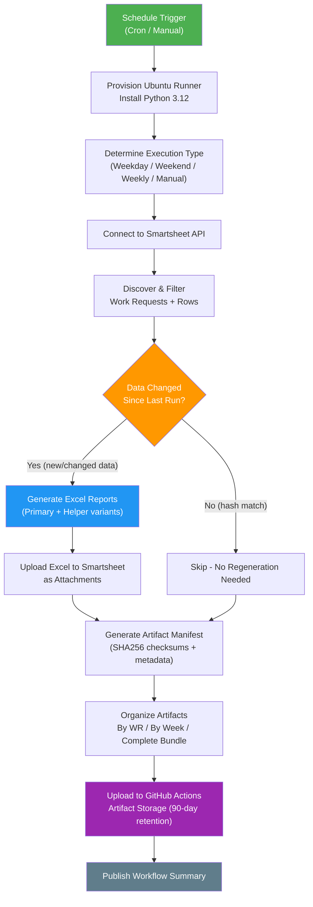
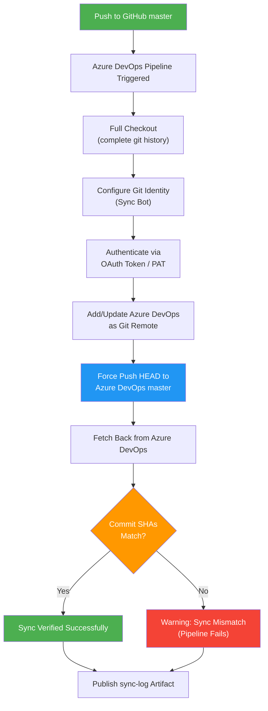
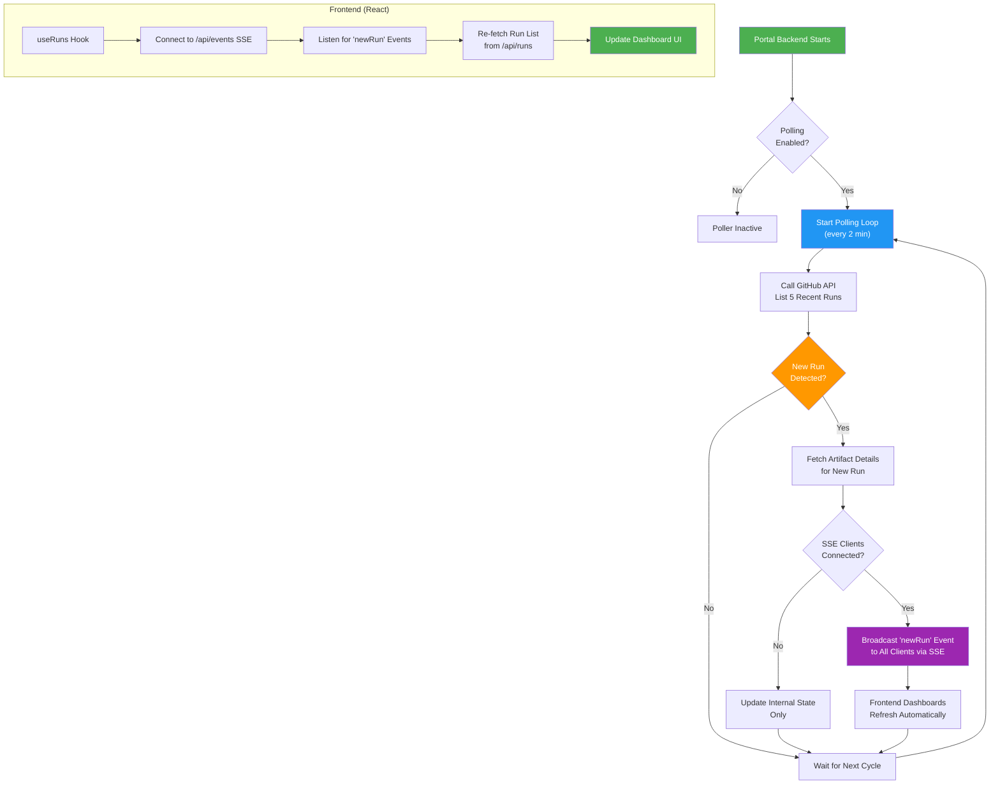
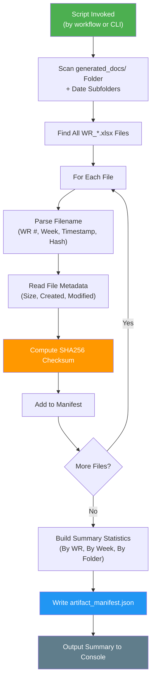
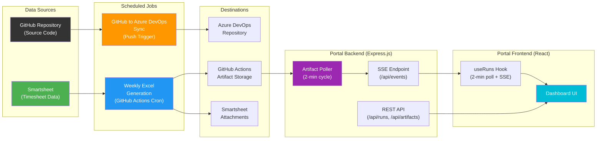

# Sync Job Run Logs

> Auto-generated documentation for all sync jobs in the **Generate-Weekly-PDFs-DSR-Resiliency** repository.
> Last updated: 2026-03-21

---

## Table of Contents

1. [Weekly Excel Generation Job](#1-weekly-excel-generation-job)
2. [GitHub → Azure DevOps Repository Sync](#2-github--azure-devops-repository-sync)
3. [Workflow Run Poller (Portal Backend)](#3-workflow-run-poller-portal-backend)
4. [Artifact Manifest Generator](#4-artifact-manifest-generator)

---

## 1. Weekly Excel Generation Job

### Sync Job Name
**Weekly Excel Generation with Sentry Monitoring (Every 2 Hours + Weekly)**

### Primary Purpose
This job automatically creates weekly billing Excel reports from Smartsheet project data. It pulls live timesheet and work-request data from Smartsheet, groups it by Work Request number and billing-week period, generates formatted Excel spreadsheets, and uploads them as downloadable artifacts. This ensures that billing teams always have up-to-date, organized reports without manual data entry.

### How It Works (Step-by-Step)

1. **Trigger**: The job starts automatically on a schedule (every 2 hours on weekdays, 3 times daily on weekends, and once on Monday mornings for a weekly comprehensive run). It can also be started manually with custom options like test mode, specific Work Request filters, or debug logging.

2. **Environment Setup**: A fresh Ubuntu server is provisioned in GitHub Actions. Python 3.12 is installed, and all required libraries (Smartsheet SDK, openpyxl for Excel, pandas, Sentry for error tracking) are loaded from `requirements.txt`.

3. **Execution Type Detection**: The system determines what kind of run this is based on the day, time, and trigger. Options include `production_frequent` (standard weekday), `weekend_maintenance`, `weekly_comprehensive` (Monday deep run), or `manual` (user-triggered).

4. **Connect to Smartsheet**: The script authenticates with the Smartsheet API using a secure token, then reads the target project sheet containing all timesheet rows, work requests, helper assignments, department numbers, and billing data.

5. **Data Discovery & Filtering**: The script scans all rows in the Smartsheet, identifies active Work Requests, and groups the data by WR number and week-ending date. It applies any user-specified filters (include only certain WRs, exclude others). A discovery cache speeds up repeated runs within 60 minutes.

6. **Change Detection**: For each WR/Week group, the system computes a data hash that includes financial totals, foreman assignments, department numbers, and row counts. If the hash matches a previously stored value and the Excel file still exists, the group is skipped—saving processing time. Extended change detection covers additional business fields like scope ID and aggregated totals.

7. **Excel Report Generation**: For each WR/Week group that has changed, a formatted Excel workbook is created. Each report includes the Linetec Services logo, structured columns for employee names, hours, rates, and billing totals, plus proper formatting (currency, fonts, column widths). Reports can be generated in three modes: primary-only, helper-only, or both (default).

8. **Upload to Smartsheet**: Generated Excel files are uploaded back to the target Smartsheet row as attachments, making them accessible to billing staff directly from within Smartsheet.

9. **Artifact Manifest Generation**: A Python script (`scripts/generate_artifact_manifest.py`) scans all generated Excel files, computes SHA256 checksums for integrity, and produces a JSON manifest summarizing total files, sizes, Work Requests covered, and week endings.

10. **Artifact Organization & Upload**: Excel files are organized into three views—by Work Request, by Week Ending, and as a complete bundle—then uploaded to GitHub Actions artifact storage with 90-day retention (30 days for test runs).

11. **Summary Report**: A detailed summary is written to the GitHub Actions workflow summary page, listing execution type, file counts, sizes, WR numbers, week endings, and access instructions.

### Visual Logic Map

### Expected Outcomes & Error Handling

**Successful Run:**
- One or more Excel files are generated (named `WR_{number}_WeekEnding_{MMDDYY}_{timestamp}_{hash}.xlsx`)
- Files are uploaded to both Smartsheet (as attachments) and GitHub Actions (as artifacts)
- A JSON manifest with SHA256 validation hashes is produced
- The workflow summary shows file counts, sizes, and WR coverage

**Error Handling:**
- **Sentry Integration**: All errors are captured by Sentry with rich context (WR number, week, execution type) for real-time alerting and debugging
- **Hash History**: If a run fails partway, the hash history ensures only changed data is reprocessed on the next run
- **Graceful Degradation**: If the billing audit system is unavailable, the script continues without audit logging
- **Timeout Protection**: The job has a 120-minute timeout to prevent runaway processes
- **Artifact Preservation**: Artifact upload steps run with `if: always()`, so even partially completed runs preserve whatever files were generated

---

## 2. GitHub → Azure DevOps Repository Sync

### Sync Job Name
**Sync-GitHub-to-Azure-DevOps**

### Primary Purpose
This job keeps the Azure DevOps repository in perfect sync with the GitHub `master` branch. Whenever a developer pushes code to GitHub, this pipeline automatically mirrors those changes to Azure DevOps. This ensures both platforms always have identical code, which is essential when teams use Azure DevOps for CI/CD pipelines or project management while GitHub serves as the primary source of truth.

### How It Works (Step-by-Step)

1. **Trigger**: The pipeline fires automatically whenever code is pushed to the `master` branch on GitHub. Changes to `README.md` and `.github/**` files are excluded since they are GitHub-specific and not needed in Azure DevOps.

2. **Full Checkout**: The pipeline checks out the repository with complete history (`fetchDepth: 0`) to avoid "shallow clone" errors that can occur when pushing to a separate remote.

3. **Configure Git Identity**: Git is configured with a bot identity ("Azure Pipeline Sync Bot") so that any metadata in the sync process is traceable.

4. **Authenticate with Azure DevOps**: The pipeline uses Azure DevOps OAuth tokens (via `System.AccessToken`) or a Personal Access Token (PAT) to authenticate with the target Azure DevOps repository. The PAT is passed as an HTTP Basic auth header—never embedded in the URL.

5. **Add Azure DevOps Remote**: The Azure DevOps repository URL is added as a Git remote named `azure-devops` (or `azure`). If the remote already exists, its URL is updated.

6. **Push to Azure DevOps**: The current HEAD (latest commit on `master`) is force-pushed to the `master` branch on Azure DevOps. The `--force-with-lease` variant is used in the root pipeline to prevent overwriting concurrent changes.

7. **Verify Sync**: After pushing, the pipeline fetches the Azure DevOps branch back and compares commit SHAs. If the GitHub commit and Azure DevOps commit match, the sync is verified as successful.

8. **Publish Sync Log**: The Git HEAD log (`.git/logs/HEAD`) is published as a build artifact named `sync-log` for auditability.

### Visual Logic Map

### Expected Outcomes & Error Handling

**Successful Run:**
- The Azure DevOps `master` branch contains the exact same commit as GitHub `master`
- A `sync-log` artifact is published for audit purposes
- Commit SHA verification passes

**Error Handling:**
- **Missing PAT**: If the `AZDO_PAT` variable is not set or is unreplaced, the pipeline gracefully skips sync steps and logs a warning instead of crashing
- **Commit Mismatch**: If the post-push verification shows different commits, the pipeline exits with a non-zero code, flagging the issue in Azure DevOps
- **Force-with-Lease Safety**: The root `azure-pipelines.yml` uses `--force-with-lease` to prevent overwriting changes that may have been pushed directly to Azure DevOps
- **Sync Log Preservation**: The sync log artifact is always published (`condition: always()`) regardless of success or failure

---

## 3. Workflow Run Poller (Portal Backend)

### Sync Job Name
**Artifact Poller — Real-Time Workflow Run Monitor**

### Primary Purpose
This background service runs inside the Report Portal backend, continuously checking GitHub for new completed workflow runs. When it detects a new run, it instantly notifies all connected frontend users via Server-Sent Events (SSE), so the dashboard updates in real time without users needing to manually refresh.

### How It Works (Step-by-Step)

1. **Startup**: When the Portal backend server starts (and `POLLING_ENABLED` is not set to `false`), the `ArtifactPoller` service begins running. It polls every 2 minutes by default (configurable via `POLL_INTERVAL_MS`).

2. **Poll GitHub API**: On each cycle, the poller calls the GitHub API to fetch the 5 most recent completed workflow runs for the `weekly-excel-generation.yml` workflow. It uses a GitHub token for authentication and respects API rate limits.

3. **Detect New Runs**: The poller compares the latest run's ID against the last known run ID stored in memory. If they differ, a new workflow run has been detected.

4. **Fetch Artifact Details**: When a new run is detected (and at least one SSE client is connected), the poller fetches the artifact list for that run, including artifact names, sizes, expiration status, and creation timestamps.

5. **Broadcast to Clients**: The poller broadcasts a `newRun` event to all connected SSE clients with a payload containing the run details (ID, status, conclusion, branch, event type) and its artifacts. The frontend `useRuns` hook listens for this event and immediately refreshes the dashboard.

6. **Client Management**: Each frontend client connects to the `/api/events` endpoint. The server maintains a set of active SSE connections, automatically cleaning up disconnected clients. A keepalive ping is sent every 30 seconds to prevent timeouts.

7. **Status Reporting**: The `/api/poller-status` endpoint exposes the poller's current state: whether it's running, the last poll time, the last known run ID, any recent errors, the number of connected clients, and the polling interval.

### Visual Logic Map

### Expected Outcomes & Error Handling

**Successful Operation:**
- The poller detects new workflow runs within ~2 minutes of completion
- Connected dashboard users see new runs appear in real time
- Poller status is always available at `/api/poller-status`

**Error Handling:**
- **API Errors**: If the GitHub API call fails (e.g., rate limit exceeded, network timeout), the error is logged and the poller retries on the next cycle. The `lastError` field in the status endpoint captures the most recent failure message.
- **Client Disconnections**: Broken SSE connections are automatically detected and removed from the client set. A `try/catch` around each broadcast prevents one failed client from affecting others.
- **Event Emitter Safety**: If no error listeners are attached, poll errors are logged to the console rather than crashing the process.
- **30-Second Request Timeout**: GitHub API requests have a 30-second timeout to prevent the poller from hanging indefinitely.

---

## 4. Artifact Manifest Generator

### Sync Job Name
**Artifact Manifest Generator (`generate_artifact_manifest.py`)**

### Primary Purpose
This utility creates a comprehensive JSON index of all generated Excel report files. It catalogs every report with its file size, SHA256 checksum, Work Request number, and week-ending date, making it easy to verify file integrity, discover specific reports, and audit the output of each generation run.

### How It Works (Step-by-Step)

1. **Trigger**: This script runs as a step within the Weekly Excel Generation workflow, immediately after Excel files are created. It can also be run manually from the command line.

2. **Scan Output Folder**: The script scans the `generated_docs/` folder and any date-named subfolders (e.g., `2026-03-21/`) for files matching the `WR_*.xlsx` naming pattern.

3. **Parse Filenames**: Each Excel filename is parsed to extract structured data: the Work Request number, week-ending date code (MMDDYY), generation timestamp, and data hash. The expected format is `WR_{wr}_WeekEnding_{MMDDYY}_{timestamp}_{hash}.xlsx`.

4. **Collect Metadata**: For each file, the script gathers the file size (in bytes and MB), creation time, modification time, and the relative folder path.

5. **Compute SHA256 Checksums**: A SHA256 hash is calculated for each file, enabling downstream consumers to verify that files have not been corrupted or tampered with.

6. **Build Summary Statistics**: The manifest aggregates data into multiple views:
   - **By Work Request**: Which files belong to each WR number
   - **By Week Ending**: Which files belong to each billing week
   - **By Folder**: Which files are in each subfolder
   - **Totals**: Overall file count, total size, unique WR count, unique week count

7. **Write JSON Manifest**: The complete manifest is written to `generated_docs/artifact_manifest.json`. This file is then uploaded alongside the Excel reports as a GitHub Actions artifact.

### Visual Logic Map

### Expected Outcomes & Error Handling

**Successful Run:**
- A `artifact_manifest.json` file is created in `generated_docs/`
- The manifest contains entries for every `WR_*.xlsx` file found
- Summary statistics show total files, total size in MB, unique Work Requests, and unique week endings
- SHA256 hashes are available for each file for integrity verification

**Error Handling:**
- **Missing Folder**: If `generated_docs/` does not exist, the script returns an empty manifest without crashing
- **Unreadable Files**: If a file cannot be hashed or read for metadata, a warning is printed and the file is included with partial data (null hash or missing metadata)
- **Unparseable Filenames**: Files that don't match the expected `WR_{wr}_WeekEnding_{MMDDYY}` format are still included in the manifest but without structured WR/week metadata

---

## System Architecture Overview

---

## Glossary

| Term | Meaning |
|------|---------|
| **WR** | Work Request — a unique project/job identifier used for billing |
| **Week Ending** | The Saturday date that marks the end of a weekly billing period (format: MMDDYY) |
| **Artifact** | A file produced by a GitHub Actions workflow run, stored in cloud storage |
| **SSE** | Server-Sent Events — a one-way real-time communication channel from server to browser |
| **Hash History** | A JSON file tracking data fingerprints to detect whether an Excel needs regeneration |
| **Discovery Cache** | A cached snapshot of Smartsheet data used to speed up repeated runs within 60 minutes |
| **Sentry** | An error-monitoring service that captures, alerts on, and helps debug production errors |
| **PAT** | Personal Access Token — a credential used to authenticate with Azure DevOps |
| **Manifest** | A JSON index listing all generated files with their metadata and integrity checksums |
