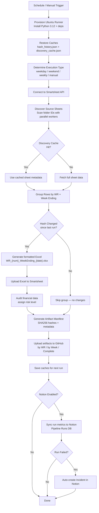
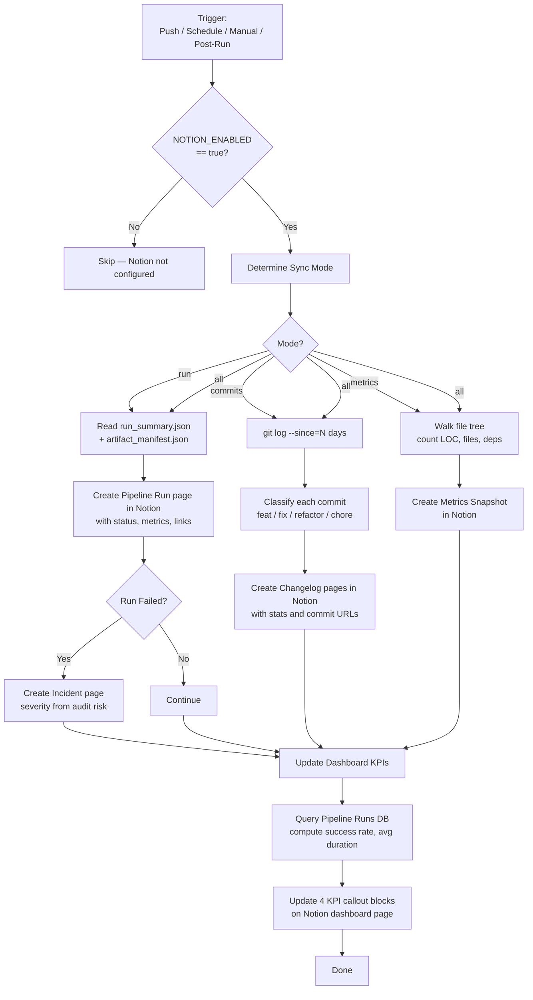
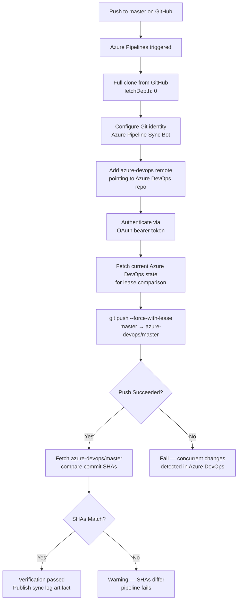
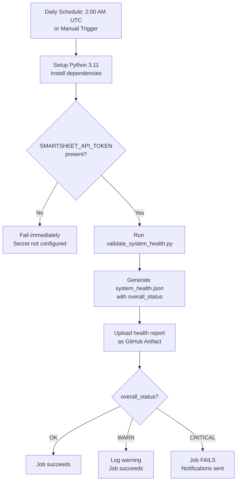
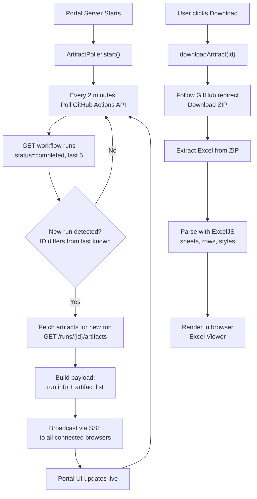
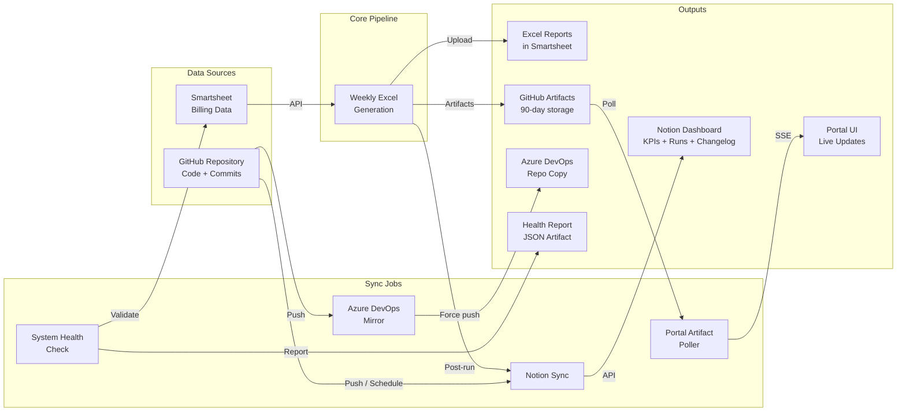
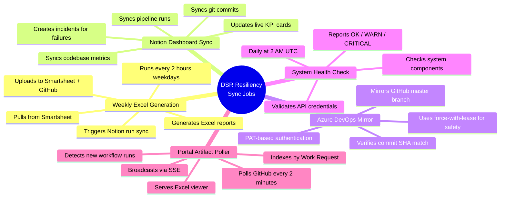

# Sync Job Run Logs

> **DSR Resiliency — Pipeline Operations Center**
>
> Auto-generated documentation of all automated sync jobs in the
> `Generate-Weekly-PDFs-DSR-Resiliency` repository. Written for non-technical
> stakeholders so anyone on the team can understand what each job does, when it
> runs, and what to do if something goes wrong.
>
> *Last updated: 2026-04-08*

---

## Table of Contents

1. [Weekly Excel Generation](#1-weekly-excel-generation)
2. [Notion Dashboard Sync](#2-notion-dashboard-sync)
3. [GitHub → Azure DevOps Repository Mirror](#3-github--azure-devops-repository-mirror)
4. [System Health Check](#4-system-health-check)
5. [Portal Artifact Poller](#5-portal-artifact-poller)
6. [End-to-End Data Flow](#6-end-to-end-data-flow)

---

## 1. Weekly Excel Generation

### Sync Job Name

`Weekly Excel Generation with Sentry Monitoring`
(Workflow file: `.github/workflows/weekly-excel-generation.yml` — Script: `generate_weekly_pdfs.py`)

### Primary Purpose

This is the **core production job** of the entire system. It automatically pulls
construction billing data from Smartsheet, groups the rows by Work Request and
billing week, generates formatted Excel reports for each group, and uploads the
finished files back to Smartsheet as attachments. Every Excel report represents a
weekly billing snapshot for a specific work order — the data that downstream
accounting and project-management teams rely on.

### How It Works (Step-by-Step)

1. **Trigger**: The workflow starts automatically on a schedule — every 2 hours
   during weekdays (Mon–Fri, 7 AM–7 PM CT), every 4 hours on weekends, and once
   at 11 PM on Mondays for a comprehensive weekly run. It can also be started
   manually from the GitHub Actions UI.
2. **Environment Setup**: A fresh Ubuntu runner is provisioned. Python 3.12 is
   installed and all dependencies (Smartsheet SDK, openpyxl, Sentry, pandas) are
   loaded from `requirements.txt`. Pip packages and two data caches (hash history
   and discovery cache) are restored from the GitHub Actions cache store.
3. **Execution Type Detection**: The job inspects the current day-of-week and
   time to classify the run as one of: `production_frequent` (weekday), 
   `weekend_maintenance`, `weekly_comprehensive` (Monday 11 PM), or `manual`.
4. **Smartsheet Data Fetch**: The Python script connects to the Smartsheet API
   using a secret token. It discovers all relevant source sheets by scanning
   configured Smartsheet folder IDs (subcontractor folders and original contract
   folders). Each sheet is read in full; rows and column metadata are fetched
   using parallel workers (default: 8 threads).
5. **Discovery Cache Check**: If a sheet was already discovered in a previous
   run (and the cache hasn't expired), the script skips re-fetching its metadata.
   This dramatically speeds up repeat runs.
6. **Row Grouping**: Rows are grouped by Work Request number and week-ending
   date. The grouping mode can be `primary` (one Excel per WR per week), 
   `helper` (one Excel per WR per week per helper), or `both` (default).
7. **Change Detection (Hash History)**: For each group, a content hash is
   computed. If the hash matches what was generated on the last run, the group
   is skipped — no Excel file is regenerated. This avoids wasting time on
   unchanged data.
8. **Excel Report Generation**: For groups that have changed (or for the first
   run), a formatted Excel workbook is created with styled headers, billing
   rows, and formulas. The output file is named following a structured pattern:
   `WR_{number}_WeekEnding_{MMDDYY}_{timestamp}_{hash}.xlsx`.
9. **Smartsheet Upload**: Each generated Excel file is uploaded as an attachment
   to a designated target sheet in Smartsheet.
10. **Sentry Monitoring**: The entire run is wrapped in Sentry error tracking
    and performance monitoring. The script reports a "check-in" to Sentry Crons
    at the start and end of the run, so the Sentry dashboard shows whether runs
    are healthy, late, or failing.
11. **Audit System**: If the billing audit module is available, financial data
    is audited for discrepancies and a risk level (LOW/MEDIUM/HIGH/CRITICAL) is
    assigned.
12. **Artifact Manifest Generation**: A JSON manifest
    (`artifact_manifest.json`) is created, cataloging every generated Excel file
    with its SHA256 hash, file size, Work Request number, and week ending.
13. **Artifact Organization & Upload**: Generated files are organized into
    folders by Work Request and by Week Ending, then uploaded to GitHub Actions
    artifact storage in four bundles: a complete bundle, a manifest-only
    artifact, a by-WR artifact, and a by-week artifact. Retention is 90 days
    for production runs and 30 days for test runs.
14. **Cache Save**: Hash history and discovery caches are saved back to the
    GitHub Actions cache store (even if the job failed or timed out).
15. **Notion Sync**: If Notion integration is enabled, the run's metrics
    (files generated, duration, errors, audit risk) are pushed to the Notion
    Pipeline Runs database. If the run failed, an incident is auto-created.

### Visual Logic Map

### Expected Outcomes & Error Handling

| Outcome | What It Means |
|---------|---------------|
| **Success** | All changed groups generated Excel files, uploaded to Smartsheet, and artifacts stored in GitHub. |
| **Partial Success** | Some groups errored but others succeeded. The `GROUPS_ERRORED` metric is > 0. Artifacts for successful groups are still uploaded. |
| **Failure** | The script crashed or timed out. Sentry captures the error with a full stack trace. An incident is auto-created in the Notion Incidents database. |
| **Timed Out** | The job hit its 80-minute time budget (or 90-minute hard limit). Caches are still saved so the next run picks up where this one left off. |

**Alerts**: Sentry Crons alerts the team if a scheduled run is late or fails. If
Notion integration is active, failed runs auto-create `🔥 Active` incidents with
severity based on the audit risk level.

---

## 2. Notion Dashboard Sync

### Sync Job Name

`Notion Dashboard Sync`
(Workflow file: `.github/workflows/notion-sync.yml` — Script: `scripts/notion_sync.py`)

### Primary Purpose

This job keeps a **Notion-based operations dashboard** up to date with live data
from the GitHub repository. It pushes three types of information: pipeline run
results, recent code commits, and codebase health metrics. The goal is to give
project managers and stakeholders a single place to see how the billing system is
performing without needing to navigate GitHub.

### How It Works (Step-by-Step)

1. **Trigger**: The job runs in three scenarios:
   - **On every push to `master`**: Syncs the last 3 days of commits.
   - **Daily at 6 AM CT (11:00 UTC)**: Takes a codebase metrics snapshot.
   - **Manual dispatch**: Can be run on-demand with configurable mode
     (`all`, `commits`, or `metrics`) and lookback window.
2. **Guard Check**: The workflow only runs if the repository variable
   `NOTION_ENABLED` is set to `true`. If Notion isn't configured, the job is
   skipped entirely.
3. **Mode Selection**: Depending on the trigger, a sync mode is chosen:
   - `commits` mode (on push)
   - `metrics` mode (on schedule)
   - `all` mode (manual, default)
   - `run` mode (called from the Weekly Excel workflow after generation)
4. **Run Sync** (`--mode run`): Reads the run summary from `run_summary.json`
   and the artifact manifest. Creates a page in the **Pipeline Runs** Notion
   database with: run number, status (Success/Failed/Skipped), trigger type,
   duration, files generated/uploaded/skipped, sheets discovered, rows fetched,
   audit risk level, and a link back to the GitHub Actions run. Duplicate
   detection prevents the same run from being synced twice.
5. **Commit Sync** (`--mode commits`): Runs `git log` to get commits from the
   last N days (default: 7). Each commit is classified using conventional commit
   prefixes (feat, fix, refactor, chore, docs, perf, security, test). A page is
   created in the **Changelog** Notion database with: short SHA, message,
   author, date, commit type, files changed, insertions, deletions, and whether
   it's a breaking change.
6. **Metrics Sync** (`--mode metrics`): Walks the repository file tree counting
   Python lines of code (excluding comments), total files, test files,
   dependencies from `requirements.txt`, source sheets from
   `generate_weekly_pdfs.py`, and workflow steps. A daily snapshot page is
   created in the **Codebase Metrics** Notion database.
7. **Dashboard KPI Update**: After syncing, the script queries the Pipeline Runs
   database to compute aggregate KPIs: last run status, success rate, total
   runs, and average duration. It then updates live KPI callout blocks on the
   Notion dashboard page (block IDs stored in `scripts/notion_config.json`).
8. **Incident Auto-Creation**: If a pipeline run failed, an incident page is
   automatically created in the **Incidents** Notion database with severity
   based on the audit risk level.

### Visual Logic Map

### Expected Outcomes & Error Handling

| Outcome | What It Means |
|---------|---------------|
| **Success** | All requested data (runs, commits, metrics) synced to Notion. KPI cards updated on the dashboard. |
| **Partial Skip** | Some database IDs not configured (e.g., `NOTION_METRICS_DB` missing). Those modes are skipped with a warning; other modes still execute. |
| **Duplicate Detected** | A run or commit already exists in Notion (matched by title). Safely skipped — the sync is idempotent. |
| **KPI Update Failure** | The KPI block update failed (non-fatal). A warning is logged but the sync still completes successfully. |

**Alerts**: The workflow has `continue-on-error: true` when called from the
Weekly Excel workflow, ensuring Notion sync failures never block report
generation.

---

## 3. GitHub → Azure DevOps Repository Mirror

### Sync Job Name

`Sync-GitHub-to-Azure-DevOps`
(Workflow files: `azure-pipelines.yml` (root) + `.github/workflows/azure-pipelines.yml`)

### Primary Purpose

This job keeps the **Azure DevOps repository** in perfect sync with the GitHub
repository. GitHub is the "source of truth" for all code. Azure DevOps is used by
certain teams or CI/CD pipelines within the Linetec organization. Every time code
is pushed to `master` on GitHub, it is automatically mirrored to the
corresponding Azure DevOps repo — ensuring both systems always have the latest
code.

### How It Works (Step-by-Step)

1. **Trigger**: Runs automatically whenever code is pushed to the `master` branch
   on GitHub. PR triggers are disabled. Changes to `README.md` and `.github/**`
   are excluded (they don't need to be mirrored).
2. **Full Checkout**: The runner performs a full clone (`fetchDepth: 0`) from
   GitHub to get complete commit history. This is critical — shallow clones
   cause errors when pushing to Azure DevOps.
3. **Git Identity Configuration**: Git is configured with a bot identity
   (`Azure Pipeline Sync Bot`) for consistency in Azure DevOps logs.
4. **Azure Remote Setup**: An `azure-devops` Git remote is added pointing to the
   Azure DevOps repository URL (provided via pipeline variable).
5. **Authentication**: An OAuth bearer token (`System.AccessToken` from Azure
   Pipelines) or a Personal Access Token (PAT) is used via an HTTP
   `Authorization` header — the token is never embedded in the URL for security.
6. **Force Push with Lease**: The `master` branch is pushed from GitHub to Azure
   DevOps using `--force-with-lease`. This ensures the push only succeeds if no
   one has made changes directly in Azure DevOps since the last sync. If someone
   did, the push fails safely rather than overwriting their work.
7. **Verification**: After pushing, the script fetches the Azure DevOps branch
   and compares the commit SHA with GitHub's HEAD. If they match, the sync is
   verified. If they don't match, the pipeline fails with a warning.
8. **Sync Log**: The Git HEAD log is published as a build artifact for auditing.

### Visual Logic Map

### Expected Outcomes & Error Handling

| Outcome | What It Means |
|---------|---------------|
| **Success** | GitHub `master` commit is now identical in Azure DevOps. Sync log published. |
| **Force-with-Lease Rejection** | Someone pushed directly to Azure DevOps. The sync aborts safely. Manual intervention needed to reconcile. |
| **PAT/Token Missing** | The `AZDO_PAT` or `AzureDevOpsRepoUrl` variable is not set. The job logs a warning and exits gracefully — no push is attempted. |
| **SHA Mismatch** | Post-push verification fails. The Azure branch may have additional commits or policies blocking the push. |

**Alerts**: Azure Pipelines provides built-in email notifications for failed
builds.

---

## 4. System Health Check

### Sync Job Name

`System Health Check`
(Workflow file: `.github/workflows/system-health-check.yml` — Script: `validate_system_health.py`)

### Primary Purpose

This job runs a **daily diagnostic** of the entire system — checking that the
Smartsheet API token is valid, Sentry monitoring is connected, and all critical
components are operational. Think of it as a daily "vital signs" check for the
billing pipeline. If something is broken (like an expired API key), this job
catches it before the next production run.

### How It Works (Step-by-Step)

1. **Trigger**: Runs daily at 2:00 AM UTC on a schedule. Can also be triggered
   manually.
2. **Environment Setup**: Python 3.11 is installed with all dependencies from
   `requirements.txt`.
3. **Secret Verification**: Before running any checks, the workflow verifies
   that the `SMARTSHEET_API_TOKEN` secret is available. If it's missing, the
   job fails immediately with a clear error.
4. **Health Validation Script**: Runs `validate_system_health.py`, which
   performs system-level checks (API connectivity, credential validity,
   dependency availability, file system integrity).
5. **Report Generation**: Results are written to
   `generated_docs/system_health.json` with an `overall_status` field
   (`OK`, `WARN`, or `CRITICAL`).
6. **Report Upload**: The health report JSON is uploaded as a GitHub Actions
   artifact with 30-day retention.
7. **Status Evaluation**: The workflow reads the `overall_status` from the
   report:
   - `OK` → Green check, job succeeds.
   - `WARN` → Warning logged, job still succeeds.
   - `CRITICAL` → Job fails with exit code 1, triggering notifications.

### Visual Logic Map

### Expected Outcomes & Error Handling

| Outcome | What It Means |
|---------|---------------|
| **OK** | All systems operational. Smartsheet API reachable, credentials valid, dependencies intact. |
| **WARN** | Non-critical issues detected (e.g., Sentry DSN not set, optional dependency missing). The pipeline can still run. |
| **CRITICAL** | A critical component is broken (e.g., Smartsheet API unreachable, expired token). Report generation will likely fail on the next run. |

**Alerts**: GitHub Actions can be configured to send email/Slack notifications on
workflow failure. A CRITICAL status triggers the fail condition.

---

## 5. Portal Artifact Poller

### Sync Job Name

`Linetec Report Portal — Artifact Poller`
(Files: `portal/services/poller.js` + `portal/services/github.js` + `portal/server.js`)

### Primary Purpose

This is a **real-time monitoring service** that runs inside the Express.js Report
Portal. It continuously polls the GitHub Actions API for new workflow runs and
immediately notifies connected browser clients (via Server-Sent Events) when
new Excel reports are available. This gives portal users live visibility into
report generation without refreshing the page.

### How It Works (Step-by-Step)

1. **Startup**: When the Express portal server starts, the `ArtifactPoller`
   singleton begins polling automatically (unless `POLLING_ENABLED` is `false`).
2. **Poll Interval**: Every 2 minutes (configurable via `POLL_INTERVAL_MS`),
   the poller calls the GitHub API endpoint for the
   `weekly-excel-generation.yml` workflow's completed runs.
3. **GitHub API Call**: The `github.js` service makes an authenticated HTTPS
   request to `GET /repos/{owner}/{repo}/actions/workflows/weekly-excel-generation.yml/runs`
   with the `completed` status filter, fetching the 5 most recent runs.
4. **New Run Detection**: The poller compares the latest run's ID against the
   last known run ID. If they differ, a new run has completed since the last
   poll.
5. **Artifact Enumeration**: For the new run, the poller fetches all artifacts
   via `GET /repos/{owner}/{repo}/actions/runs/{runId}/artifacts`. Each
   artifact's name, size, and expiration status are extracted.
6. **Real-Time Broadcast**: The new run data and its artifacts are broadcast to
   all connected browser clients via Server-Sent Events (SSE). The portal UI
   updates instantly — no page refresh needed.
7. **Artifact Download**: When a user clicks to download or view an Excel
   report, the portal calls `downloadArtifact()` which follows GitHub's
   redirect to download the artifact ZIP.
8. **Excel Parsing**: The `excel.js` service parses downloaded Excel files using
   ExcelJS, extracting sheet names, row data, cell styles, and merged cell
   ranges for the in-browser Excel viewer.
9. **Work Request Index**: The `getArtifactsByWorkRequest()` function scans the
   10 most recent runs and groups artifacts by Work Request number, providing
   a searchable index for the portal dashboard.

### Visual Logic Map

### Expected Outcomes & Error Handling

| Outcome | What It Means |
|---------|---------------|
| **New Run Detected** | A new workflow completed. Artifacts are broadcast to all portal clients in real time. |
| **No New Runs** | The poller records the poll time and waits for the next interval. No action needed. |
| **API Error** | The `lastError` field is set on the poller status object. Errors are logged but don't crash the server — polling continues on the next interval. |
| **SSE Client Disconnect** | When a browser tab closes, its connection is automatically cleaned up from the client set. |

**Alerts**: Errors are logged to the server console. The `/api/health` endpoint
and `poller.getStatus()` expose the last error and connection count for
monitoring.

---

## 6. End-to-End Data Flow

This diagram shows how all five sync jobs connect to form the complete system.

### How the Jobs Relate

---

## Glossary

| Term | Meaning |
|------|---------|
| **Work Request (WR)** | A numbered construction work order in the Smartsheet billing system. Each WR gets its own Excel report per billing week. |
| **Week Ending** | The last day of a billing week (Saturday). Reports are grouped by this date. |
| **Hash History** | A JSON file storing content hashes for each WR/week group. If data hasn't changed, the Excel isn't regenerated. |
| **Discovery Cache** | A JSON file storing Smartsheet sheet metadata. Avoids re-fetching sheet info on every run. |
| **SSE (Server-Sent Events)** | A web technology where the server pushes real-time updates to the browser without the browser asking for them. |
| **Force-with-Lease** | A safe version of `git push --force` that only overwrites the remote if no one else has pushed since your last fetch. |
| **Sentry Crons** | A monitoring feature that tracks whether scheduled jobs run on time and complete successfully. |
| **Conventional Commits** | A commit message convention (e.g., `feat:`, `fix:`, `chore:`) that allows automated classification. |
| **KPI (Key Performance Indicator)** | Summary metrics shown on the Notion dashboard: success rate, average duration, total runs, last run status. |
| **Artifact** | A file (or ZIP of files) uploaded to GitHub Actions storage after a workflow run, downloadable for 30–90 days. |

---

## Quick Reference: Schedules

| Job | Schedule | Timezone |
|-----|----------|----------|
| Weekly Excel Generation | Every 2 hours weekdays (7 AM–7 PM CT), every 4 hours weekends, Monday 11 PM comprehensive | America/Chicago |
| Notion Dashboard Sync | On push to master + daily 6 AM CT | America/Chicago |
| Azure DevOps Mirror | On push to master | N/A |
| System Health Check | Daily 2:00 AM UTC | UTC |
| Portal Artifact Poller | Every 2 minutes (continuous) | Server local |

---

*This document is maintained alongside the codebase. For the most current
workflow definitions, see `.github/workflows/` in the repository.*
