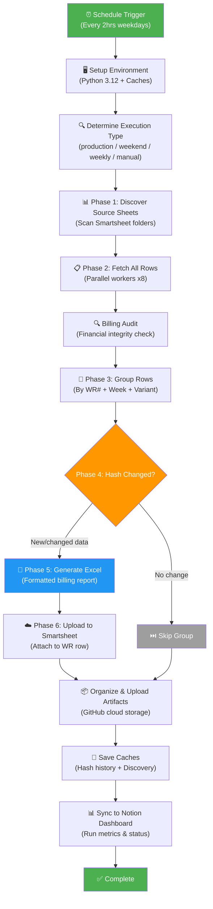
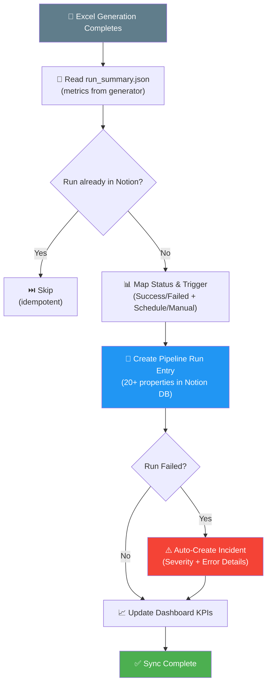
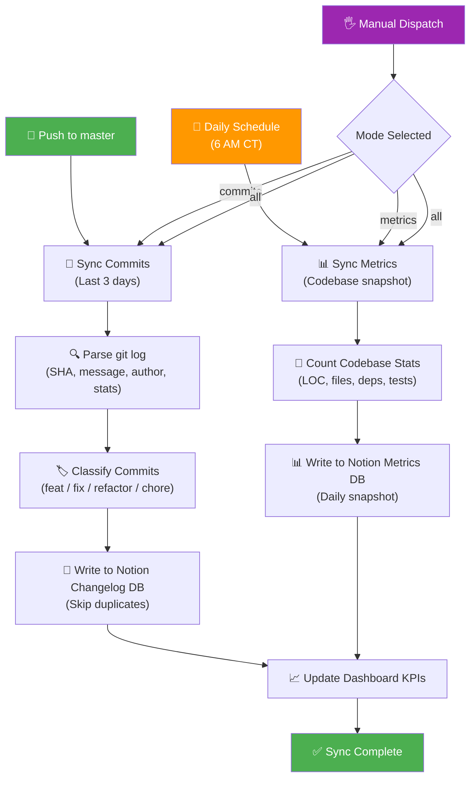
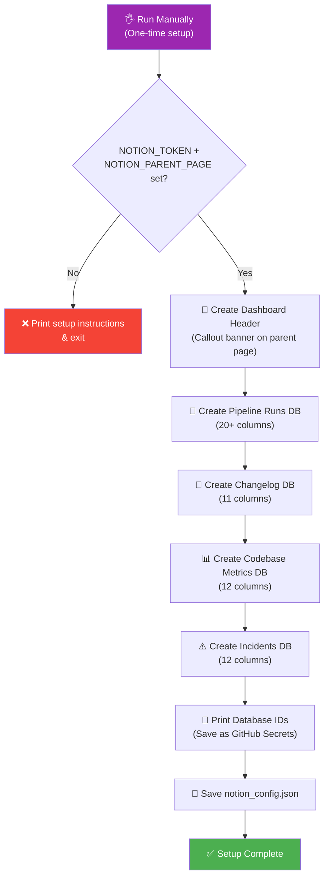
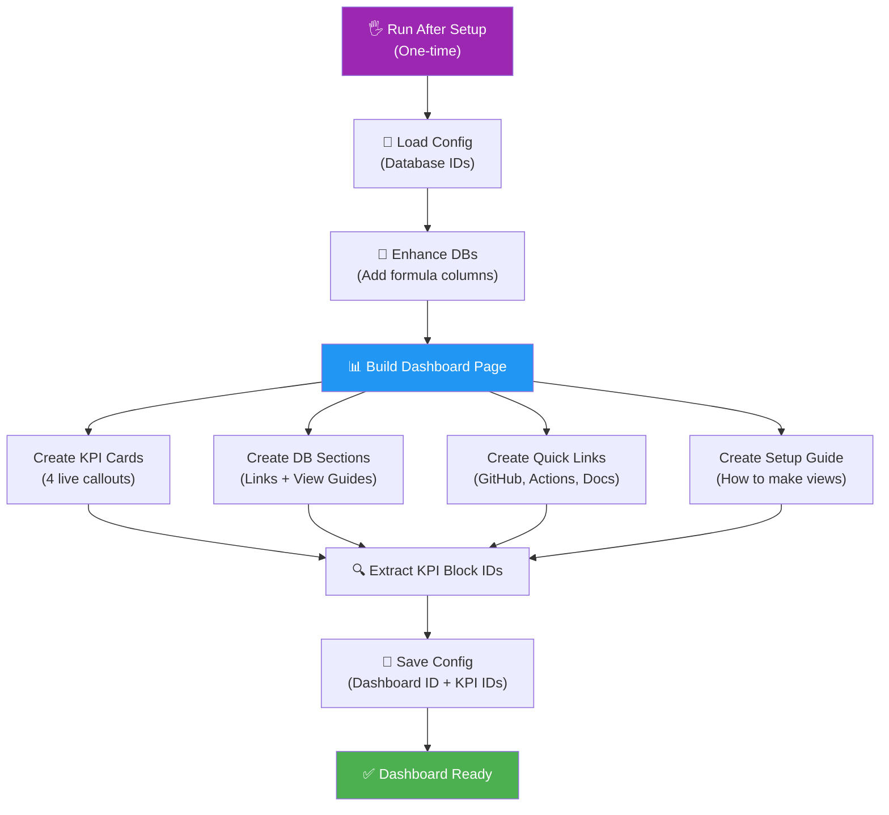
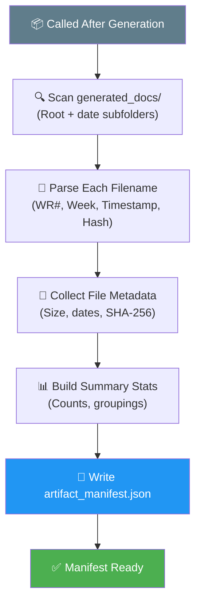
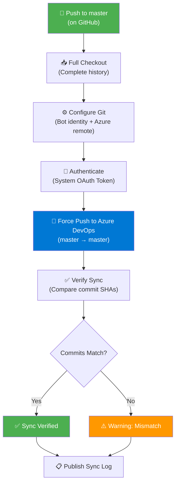
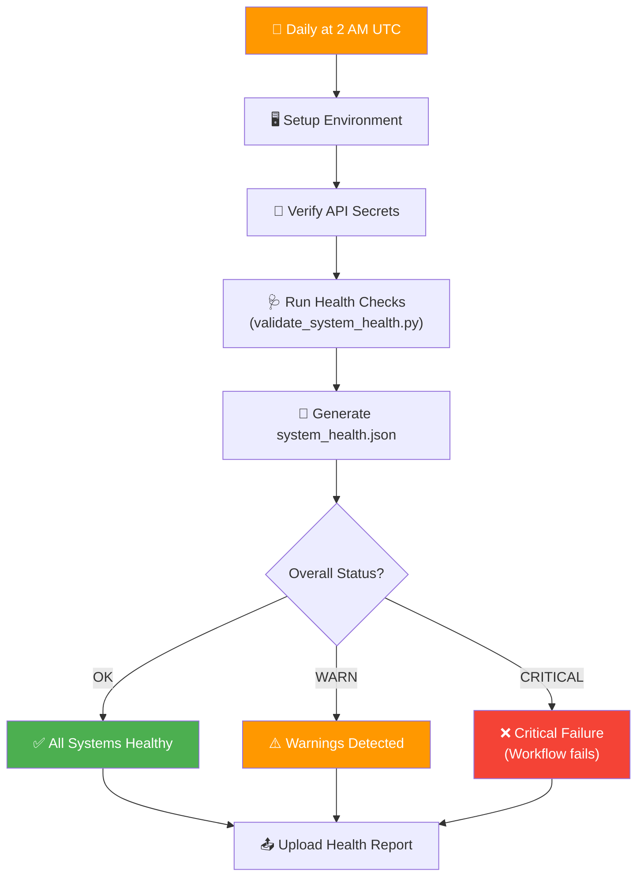
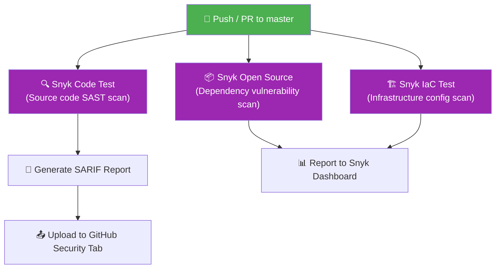
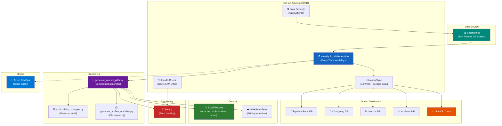

# Sync Job Run Logs — DSR Resiliency Pipeline

> **Generated**: April 12, 2026  
> **Repository**: `JFlo21/Generate-Weekly-PDFs-DSR-Resiliency`  
> **Branch**: `master`

This document provides clear, non-technical Run Logs for every sync job and automated workflow in the DSR Resiliency pipeline. Each section describes what the job does, how it works step by step, and what happens when things go right or wrong — all explained in plain English with visual diagrams.

---

## Table of Contents

1. [Weekly Excel Generation (Core Pipeline)](#1-weekly-excel-generation-core-pipeline)
2. [Notion Pipeline Sync (Run Logging)](#2-notion-pipeline-sync-run-logging)
3. [Notion Dashboard Sync (Commits & Metrics)](#3-notion-dashboard-sync-commits--metrics)
4. [Notion Workspace Setup (One-Time Bootstrap)](#4-notion-workspace-setup-one-time-bootstrap)
5. [Notion Dashboard Builder](#5-notion-dashboard-builder)
6. [Artifact Manifest Generator](#6-artifact-manifest-generator)
7. [GitHub → Azure DevOps Mirror Sync](#7-github--azure-devops-mirror-sync)
8. [System Health Check](#8-system-health-check)
9. [Snyk Security Scan](#9-snyk-security-scan)
10. [End-to-End Architecture Overview](#10-end-to-end-architecture-overview)

---

## 1. Weekly Excel Generation (Core Pipeline)

**Sync Job Name**: `Weekly Excel Generation with Sentry Monitoring`  
**File**: `.github/workflows/weekly-excel-generation.yml` → `generate_weekly_pdfs.py`

### Primary Purpose

This is the heart of the entire system. It automatically pulls daily status report (DSR) data from Smartsheet, groups that data by Work Request number and billing week, generates formatted Excel billing reports, and uploads them back to Smartsheet. Think of it as an automated accountant that reads time sheets, organizes them by project and pay period, creates professional invoices, and files them in the right place — every two hours on weekdays.

### How It Works (Step-by-Step)

1. **Trigger**: The workflow runs automatically on a schedule — every 2 hours on weekdays (Mon–Fri), every 4 hours on weekends, and a special comprehensive run on Monday at 11 PM CT. It can also be triggered manually with customizable options (test mode, debug logging, work request filters, etc.).

2. **Environment Setup**: GitHub Actions spins up a fresh Linux server, installs Python 3.12, restores cached dependency packages, and restores two critical cache files:
   - **Hash History** — remembers which reports have already been generated so unchanged data is not reprocessed.
   - **Discovery Cache** — remembers which Smartsheet sheets were found last time, avoiding repeated lookups.

3. **Execution Type Determination**: The system figures out what kind of run this is based on the current day/time:
   - *Weekday daytime* → `production_frequent` (standard 2-hour cycle)
   - *Weekend* → `weekend_maintenance` (less frequent, lighter processing)
   - *Monday 11 PM* → `weekly_comprehensive` (full deep processing)
   - *Manual trigger* → `manual`

4. **Phase 1 — Sheet Discovery**: The generator connects to Smartsheet and discovers all source data sheets by scanning configured folders (Subcontractor folders and Original Contract folders). It finds 20+ "Promax Database" sheets containing daily field reports. Results are cached for 7 days to reduce API calls.

5. **Phase 2 — Data Fetch**: For each discovered sheet, the system fetches all rows of billing data using parallel workers (8 concurrent connections by default). It pulls fields like Work Request #, foreman name, CU (Constructable Unit) codes, quantities, prices, and week-ending dates.

6. **Billing Audit**: Before generating any reports, the system runs a financial audit that checks for unauthorized changes to billing data, anomalous pricing, and data integrity issues. It assigns a risk level (LOW / MEDIUM / HIGH / CRITICAL) to the run.

7. **Phase 3 — Grouping**: All fetched rows are grouped by three dimensions:
   - **Work Request #** — the project identifier
   - **Week Ending Date** — the billing period
   - **Variant** — Primary (standard crew), Helper (assisting foreman), or VAC Crew (vacuum crew)

8. **Phase 4 — Change Detection**: For each group, the system calculates a SHA-256 hash of the data. If the hash matches the stored hash from a previous run AND the Excel attachment still exists on Smartsheet, the group is skipped (no regeneration needed). This saves significant processing time.

9. **Phase 5 — Excel Generation**: For groups with new or changed data, a formatted Excel workbook is created with:
   - Linetec Services branding and logo
   - Billing line items with CU pricing
   - Daily breakdowns and totals
   - Professional formatting (fonts, colors, column widths)

10. **Phase 6 — Upload**: Generated Excel files are uploaded as attachments to the corresponding Work Request row in a target Smartsheet. Old attachments for the same billing week are removed first to prevent duplicates.

11. **Artifact Preservation**: All generated Excel files are organized and uploaded to GitHub's secure cloud storage (GitHub Actions Artifacts), organized three ways:
    - Complete bundle (all files together)
    - By Work Request number
    - By billing week
    A JSON manifest with SHA-256 checksums is created for audit validation.

12. **Cache Save**: Hash history and discovery cache are saved back to GitHub's cache system so the next run can use them, even if the job timed out or failed.

13. **Notion Sync**: If Notion integration is enabled, the run's metrics (files generated, duration, status, error count) are synced to a Notion dashboard (see Sync Job #2 below).

### Visual Logic Map

### Expected Outcomes & Error Handling

- **Successful Run**: All groups with changed data produce new Excel files, uploaded to Smartsheet and preserved in GitHub Artifacts. Notion dashboard shows a green "Success" status with metrics (files generated, duration, rows processed).
- **Partial Success**: If some groups fail but others succeed, the job continues processing remaining groups. Failed groups are logged and counted in the `groups_errored` metric.
- **Time Budget**: The script has an 80-minute time budget. If processing takes too long, it stops accepting new groups gracefully, saves all caches and artifacts, leaving remaining groups for the next scheduled run.
- **Full Failure**: If critical errors occur (no API token, no source sheets found, no valid data), the Notion dashboard automatically creates an **Incident** entry with severity level (Critical/High/Medium) and error details. Sentry receives the error for developer alerting.
- **Monitoring**: Sentry receives real-time error tracking with rich context (which WR failed, what phase, stack traces). Sentry Cron Monitors detect if scheduled runs stop happening entirely.

---

## 2. Notion Pipeline Sync (Run Logging)

**Sync Job Name**: `Notion Sync — Run Mode`  
**File**: `scripts/notion_sync.py --mode run`

### Primary Purpose

After each Weekly Excel Generation run completes, this sync job takes the results (how many files were created, how long it took, whether it succeeded or failed) and records them in a Notion database called "Pipeline Runs." This creates a complete, searchable history of every automated run — like a flight log for the pipeline.

### How It Works (Step-by-Step)

1. **Trigger**: Called automatically at the end of the Weekly Excel Generation workflow (the final step), regardless of whether the main job succeeded or failed.

2. **Read Run Metrics**: The script reads a `run_summary.json` file produced by the Excel generator, extracting key numbers: files generated, files uploaded, files skipped, groups processed, groups with errors, sheets discovered, rows fetched, duration in minutes, API calls made, hash updates, and audit risk level.

3. **Duplicate Check**: Before writing anything, it queries the Notion "Pipeline Runs" database to see if this run number already exists. If so, it skips to avoid duplicate entries (the process is idempotent).

4. **Map Run Status**: The job's final status (`success`, `failure`, `cancelled`, `timed_out`) is mapped to a user-friendly label with emoji: ✅ Success, ❌ Failed, ⏭️ Skipped, ⏰ Timed Out.

5. **Map Trigger Type**: The event that started the run is classified: ⏰ Scheduled, 🖐️ Manual, 🔄 Push, 📋 Weekly, 🏖️ Weekend.

6. **Create Notion Page**: A new entry is created in the Pipeline Runs database with 20+ properties including run number, status, trigger type, start time, duration, all file/group counts, commit SHA, branch, direct link to the GitHub Actions run, execution type, audit risk level, and any error summary.

7. **Auto-Create Incident** (on failure): If the run failed, the system automatically creates a new entry in the Incidents database with severity level (based on audit risk), the error message, a link to the failed run, and an initial "Active" status for the operations team to investigate.

8. **Update Dashboard KPIs**: After recording the run, the script queries all historical runs in the Pipeline Runs database and updates four live KPI (Key Performance Indicator) cards on the Notion dashboard:
   - **Last Run** — status and date of the most recent run
   - **Success Rate** — percentage of successful runs (color-coded: green ≥ 90%, yellow ≥ 70%, red < 70%)
   - **Total Runs** — cumulative count since tracking began
   - **Average Duration** — mean run time across all timed runs

### Visual Logic Map

### Expected Outcomes & Error Handling

- **Successful Sync**: A new row appears in the Notion Pipeline Runs database within seconds, and the dashboard KPI cards refresh with updated statistics.
- **Failure**: This step runs with `continue-on-error: true` in the workflow, meaning a Notion sync failure will never cause the overall pipeline to fail. Errors are logged but do not block report generation.
- **Missing Credentials**: If the `NOTION_TOKEN` secret is not set, the script exits with a clear error message directing the user to run the setup script.

---

## 3. Notion Dashboard Sync (Commits & Metrics)

**Sync Job Name**: `Notion Dashboard Sync`  
**File**: `.github/workflows/notion-sync.yml` → `scripts/notion_sync.py`

### Primary Purpose

This is a standalone workflow that keeps two additional Notion databases up to date: the **Changelog** (a record of every code change made to the project) and **Codebase Metrics** (daily snapshots of how large and healthy the codebase is). It runs independently from the Excel generation pipeline, ensuring the Notion dashboard always has fresh data about the project's development activity.

### How It Works (Step-by-Step)

1. **Trigger**: Runs in three scenarios:
   - **On every push to master** — syncs the last 3 days of commits
   - **Daily at 6 AM CT (11:00 UTC)** — takes a daily metrics snapshot
   - **Manual dispatch** — allows choosing mode (all/commits/metrics) and lookback period

2. **Gate Check**: The workflow only runs if the repository variable `NOTION_ENABLED` is set to `true`. This provides an easy on/off switch.

3. **Commit Sync** (on push events):
   - Runs `git log` to get recent commits with stats (files changed, insertions, deletions).
   - Each commit message is classified using **conventional commit** parsing (e.g., `feat:` → Feature, `fix:` → Bug Fix, `refactor:` → Refactor). If the message doesn't follow the convention, a heuristic fallback detects keywords like "fix," "add," or "security."
   - For each commit not already in Notion, creates a Changelog entry with: short SHA, full message, author, date, commit type, scope, lines added/removed, and a direct link to the commit on GitHub.

4. **Metrics Sync** (on schedule):
   - Walks the entire codebase and counts: Python lines of code (excluding comments and blanks), total files, test files, number of dependencies in `requirements.txt`, number of Smartsheet source sheets configured, number of workflow steps, and the current discovery cache version.
   - Creates a daily "Snapshot" entry in the Codebase Metrics database.
   - Duplicate snapshots for the same date are automatically skipped.

5. **KPI Update**: After syncing, the dashboard KPI callout cards are refreshed (same as in Sync Job #2).

### Visual Logic Map

### Expected Outcomes & Error Handling

- **Successful Sync**: New commits appear in the Notion Changelog with color-coded type labels. A new metrics snapshot row appears in the Metrics database.
- **No New Data**: If no new commits exist in the lookback window, or today's metrics snapshot already exists, the sync completes cleanly with informational log messages.
- **Git Errors**: If the `git log` command fails (e.g., shallow clone with insufficient history), the commit sync is skipped gracefully and logged as a warning.
- **Timeout**: The entire workflow has a 5-minute timeout to prevent runaway executions.

---

## 4. Notion Workspace Setup (One-Time Bootstrap)

**Sync Job Name**: `Notion Workspace Setup`  
**File**: `scripts/notion_setup.py`

### Primary Purpose

This is a one-time setup script that creates the four Notion databases needed by the entire tracking system. It is like laying the foundation for a building — you run it once, and then all the other sync jobs have somewhere to put their data.

### How It Works (Step-by-Step)

1. **Prerequisites Check**: Verifies that two environment variables are set: `NOTION_TOKEN` (the API key) and `NOTION_PARENT_PAGE` (the Notion page ID where databases will be created). If either is missing, it prints detailed setup instructions.

2. **Dashboard Header**: Creates a professional callout banner on the parent page with the title "DSR Resiliency — Pipeline Operations Center" and a brief description.

3. **Create Four Databases**:
   - **🏃 Pipeline Runs** — 20+ columns for tracking every workflow execution (status, trigger, duration, file counts, audit risk, etc.)
   - **📝 Changelog** — 11 columns for recording commits (SHA, message, type, author, stats, breaking change flag)
   - **📊 Codebase Metrics** — 12 columns for daily health snapshots (LOC, file counts, test coverage, success rates)
   - **⚠️ Incidents** — 12 columns for tracking failures (severity, status, error type, resolution, impact)

4. **Output Credentials**: Prints the four generated database IDs that must be saved as GitHub repository secrets (`NOTION_PIPELINE_DB`, `NOTION_CHANGELOG_DB`, `NOTION_METRICS_DB`, `NOTION_INCIDENTS_DB`). Also provides copy-paste-ready `gh secret set` commands.

5. **Save Config**: Writes all IDs to `scripts/notion_config.json` for local reference.

### Visual Logic Map

### Expected Outcomes & Error Handling

- **Successful Setup**: Four databases appear under the parent Notion page, ready to receive data from the sync jobs.
- **Partial Failure**: If any database creation fails (e.g., permission denied), the script stops immediately with an error. You need to fix the issue and re-run.
- **Already Exists**: The script does not check for existing databases, so running it twice creates duplicate databases. It should only be run once.

---

## 5. Notion Dashboard Builder

**Sync Job Name**: `Notion Dashboard Builder`  
**File**: `scripts/notion_dashboard.py`

### Primary Purpose

After the databases are set up (Sync Job #4), this script creates a beautiful, interactive "Operations Dashboard" page in Notion. It includes live KPI cards that update automatically, links to all four databases, a quick-links section, and a comprehensive guide for creating Notion views. Think of it as building the control room display screen after the monitoring equipment has been installed.

### How It Works (Step-by-Step)

1. **Load Configuration**: Reads database IDs from `notion_config.json` or environment variables.

2. **Enhance Databases**: Adds computed formula columns to each database:
   - Pipeline Runs: "Duration Category" (Fast/Normal/Slow/Very Slow) and "Files per Minute" (throughput metric)
   - Changelog: "Impact" (total lines changed = insertions + deletions)
   - Codebase Metrics: "Test Ratio" (percentage of files that are tests)
   - Incidents: "Days Open" (how long since detection, auto-updates until resolved)

3. **Build Dashboard Page**: Creates a child page under the parent with rich content:
   - Table of contents
   - Hero banner with project description
   - Four live KPI callout cards in a column layout (Last Run, Success Rate, Total Runs, Avg Duration)
   - Four database sections, each with a description, a clickable @mention link to the database, and an expandable toggle with recommended view setup instructions
   - Quick links to GitHub, GitHub Actions, and Notion API docs
   - Comprehensive view setup guide (how to create Table, Board, Calendar, Gallery, and filtered views)

4. **Extract KPI Block IDs**: Walks the created page to find the four KPI callout blocks inside columns and records their Notion block IDs. These IDs are needed by the sync script to update the KPI values after each run.

5. **Save Configuration**: Merges the dashboard page ID and KPI block IDs into `notion_config.json`.

### Visual Logic Map

### Expected Outcomes & Error Handling

- **Successful Build**: A fully formatted dashboard page appears in Notion with live KPIs, database links, and setup instructions. KPI values start as placeholders and update after the first pipeline run.
- **Formula Errors**: If a formula property fails to create (e.g., syntax error), the script logs a warning but continues with the remaining enhancements. The dashboard still works; the computed column simply won't exist.
- **Block Limit**: Notion allows a maximum of 100 blocks per API call. The script batches content automatically.

---

## 6. Artifact Manifest Generator

**Sync Job Name**: `Artifact Manifest Generator`  
**File**: `scripts/generate_artifact_manifest.py`

### Primary Purpose

After Excel reports are generated, this script creates a detailed inventory (manifest) of every file produced. It is like a shipping manifest for a warehouse — it lists every item, its size, a unique fingerprint for verification, and which project and billing week it belongs to. This manifest is essential for auditing and validating that all expected files were created.

### How It Works (Step-by-Step)

1. **Scan Folders**: Searches the `generated_docs/` folder and all date-named subfolders (e.g., `2026-04-07/`) for Excel files matching the pattern `WR_*.xlsx`.

2. **Parse Filenames**: Each filename follows a structured format: `WR_{number}_WeekEnding_{MMDDYY}_{timestamp}_{hash}.xlsx`. The script extracts the Work Request number, week ending date, generation timestamp, and data hash from each filename.

3. **Collect Metadata**: For each file, gathers size (in bytes and MB), creation time, last modified time, and calculates a SHA-256 checksum for integrity verification.

4. **Build Summary Statistics**: Aggregates data into summary views:
   - Total file count and combined size
   - List of unique Work Request numbers
   - List of unique week ending dates
   - Files grouped by week, by WR number, and by source folder

5. **Write Manifest**: Outputs a `artifact_manifest.json` file with all artifact entries and summary statistics.

### Visual Logic Map

### Expected Outcomes & Error Handling

- **Successful Generation**: A JSON manifest file is created with complete metadata for every generated Excel file, ready for audit and validation.
- **No Files Found**: If the `generated_docs/` folder doesn't exist or contains no matching Excel files, the manifest is created with zero entries and a warning is logged.
- **File Access Errors**: If individual files cannot be read (e.g., permissions), warnings are logged and those files get null values for hash/metadata fields, but the manifest is still produced.

---

## 7. GitHub → Azure DevOps Mirror Sync

**Sync Job Name**: `Sync-GitHub-to-Azure-DevOps`  
**File**: `.github/workflows/azure-pipelines.yml`

### Primary Purpose

This pipeline keeps a copy of the codebase in Azure DevOps synchronized with the primary GitHub repository. Whenever code is pushed to the `master` branch on GitHub, this pipeline automatically pushes that same code to Azure DevOps. This ensures that team members who work in Azure DevOps always have the latest code, without any manual copy-paste or download steps. It is a one-way mirror: GitHub is the "source of truth," and Azure DevOps is the backup/mirror.

### How It Works (Step-by-Step)

1. **Trigger**: Automatically runs whenever code is pushed to the `master` branch on GitHub. Changes to documentation files (`README.md`) and GitHub-specific folders (`.github/`) are excluded to reduce unnecessary syncs.

2. **Full Checkout**: Clones the entire repository with full commit history (not a shallow clone) — this is critical for accurate syncing.

3. **Configure Git**: Sets up a bot identity ("Azure Pipeline Sync Bot") and adds the Azure DevOps repository as a Git remote.

4. **Authenticate**: Uses a System Access Token (OAuth) to authenticate with Azure DevOps. This token is provided automatically by Azure Pipelines.

5. **Push to Azure DevOps**: Force-pushes the current `master` branch to Azure DevOps using `git push --force`. This overwrites the Azure copy with the exact state of GitHub.

6. **Verify Sync**: Fetches the Azure DevOps branch back and compares commit SHAs to confirm the push succeeded. If the commits don't match, the step fails with a warning.

7. **Publish Sync Log**: Uploads the Git log as a build artifact for audit purposes.

### Visual Logic Map

### Expected Outcomes & Error Handling

- **Successful Sync**: The Azure DevOps repository is an exact mirror of GitHub's `master` branch. The verification step confirms matching commit SHAs.
- **Authentication Failure**: If `AzureDevOpsRepoUrl` is not configured or the access token is invalid, the pipeline logs an error and exits. No code is pushed.
- **Concurrent Changes**: The force push ensures GitHub always wins. If someone pushed directly to Azure DevOps, those changes would be overwritten.
- **Missing Variable**: If the Azure DevOps repo URL variable is not set, the sync step prints a clear error message explaining what needs to be configured.

---

## 8. System Health Check

**Sync Job Name**: `System Health Check`  
**File**: `.github/workflows/system-health-check.yml` → `validate_system_health.py`

### Primary Purpose

This is a daily diagnostic check that verifies all critical systems are working correctly — like a daily inspection of a factory before the shift starts. It checks that the Smartsheet API is reachable, credentials are valid, and core infrastructure is functioning.

### How It Works (Step-by-Step)

1. **Trigger**: Runs daily at 2:00 AM UTC on a schedule, or can be triggered manually.

2. **Setup**: Installs Python and all project dependencies.

3. **Verify Secrets**: Confirms that the `SMARTSHEET_API_TOKEN` secret is available to the workflow.

4. **Run Health Checks**: Executes `validate_system_health.py`, which tests connectivity and configuration, producing a `system_health.json` report.

5. **Evaluate Results**: Reads the report's `overall_status` field:
   - **OK** → ✅ All systems healthy
   - **WARN** → ⚠️ Some non-critical issues detected
   - **CRITICAL** → ❌ Major problems, workflow fails to alert the team

6. **Upload Report**: The JSON health report is uploaded as a GitHub Actions artifact (retained for 30 days).

### Visual Logic Map

### Expected Outcomes & Error Handling

- **Healthy**: The workflow completes successfully with status OK. No action needed.
- **Warnings**: Non-critical issues are noted (e.g., API response slower than expected). The workflow succeeds but logs the warnings.
- **Critical**: The workflow fails, which triggers GitHub's built-in notification system (email alerts to repository watchers). This indicates something needs immediate attention (e.g., expired API token, Smartsheet outage).

---

## 9. Snyk Security Scan

**Sync Job Name**: `Snyk Security`  
**File**: `.github/workflows/snyk-security.yml`

### Primary Purpose

This workflow scans the codebase for security vulnerabilities — like a security guard checking every door and window. It looks for known vulnerabilities in third-party packages (dependencies), scans the source code itself for security anti-patterns, and checks infrastructure configuration files.

### How It Works (Step-by-Step)

1. **Trigger**: Runs on every push to `master` and on every pull request targeting `master`.

2. **Code Analysis (SAST)**: Snyk scans the Python source code for security issues (e.g., SQL injection patterns, hardcoded secrets, insecure cryptography) and produces a SARIF report.

3. **Dependency Scan (SCA)**: Snyk monitors all third-party packages listed in `requirements.txt` for known vulnerabilities and reports them to the Snyk dashboard.

4. **Infrastructure Scan (IaC)**: Snyk checks infrastructure-as-code files (like workflow YAML files) for misconfigurations.

5. **Upload Results**: The SARIF report is uploaded to GitHub's Security tab (Code Scanning), where findings appear as security alerts.

### Visual Logic Map

### Expected Outcomes & Error Handling

- **Clean Scan**: No vulnerabilities found. The workflow completes successfully.
- **Vulnerabilities Found**: Issues appear in the GitHub Security tab under Code Scanning alerts. The workflow itself does not fail (uses `|| true`) to avoid blocking development, but findings should be reviewed.
- **Missing Token**: If `SNYK_TOKEN` is not configured, the Snyk CLI will fail to authenticate and the scan steps will error.

---

## 10. End-to-End Architecture Overview

This diagram shows how all the sync jobs and systems connect together:

### System Data Flow Summary

| Source | Process | Destination | Frequency |
|--------|---------|-------------|-----------|
| Smartsheet (20+ sheets) | Excel Generator | Smartsheet (attachments) + GitHub Artifacts | Every 2 hours (weekdays) |
| GitHub Actions run metrics | Notion Sync (run mode) | Notion Pipeline Runs DB + Incidents DB | After each Excel generation run |
| Git commit history | Notion Sync (commits mode) | Notion Changelog DB | On every push to master |
| Codebase file statistics | Notion Sync (metrics mode) | Notion Codebase Metrics DB | Daily at 6 AM CT |
| Pipeline Runs DB (aggregated) | KPI Updater | Notion Dashboard KPI Cards | After each sync |
| GitHub master branch | Azure Pipeline Sync | Azure DevOps repository | On every push to master |
| Full codebase | Snyk Scanner | GitHub Security Tab | On every push/PR to master |
| System connectivity | Health Check | GitHub Artifacts (JSON report) | Daily at 2 AM UTC |

---

*This document is auto-generated by the DSR Resiliency pipeline analysis system. For questions about specific sync jobs, refer to the source files listed in each section header.*
