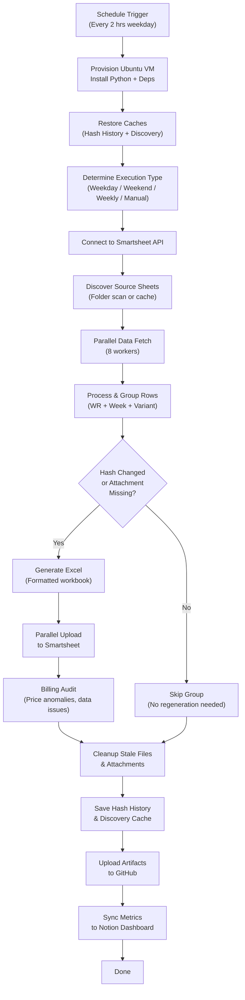
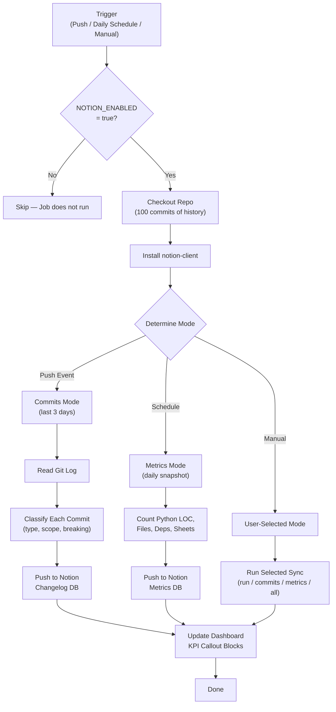
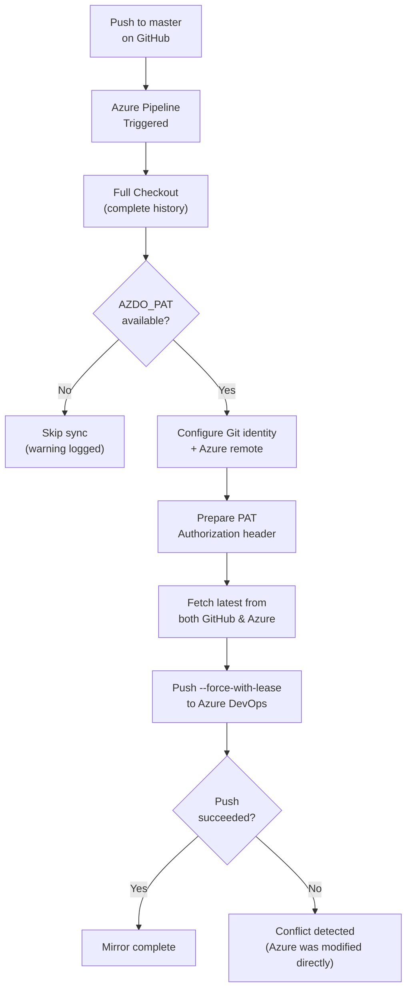
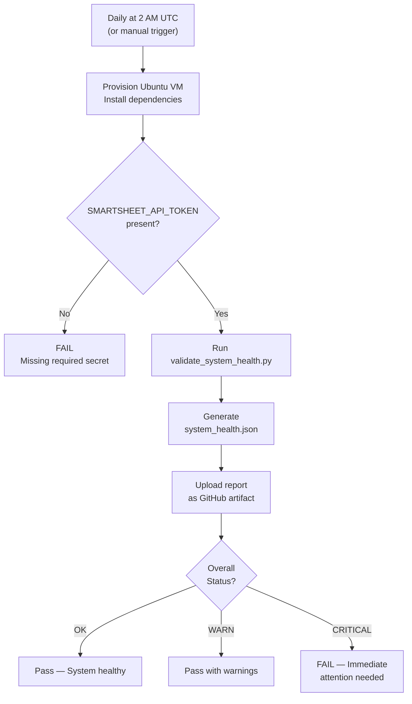
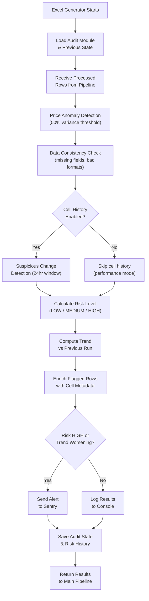
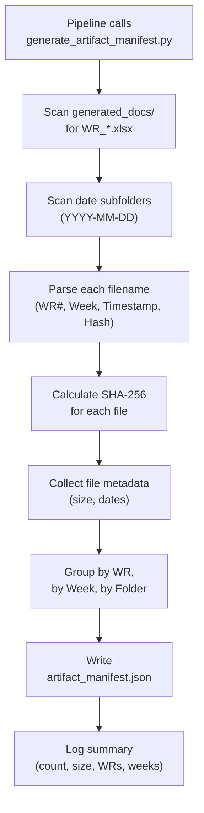
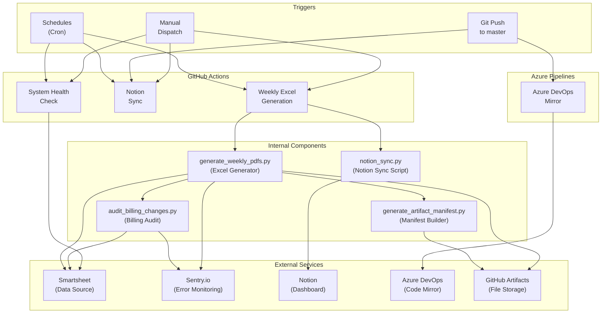

# Sync Job Run Logs

> **Generated**: 2026-04-10  
> **Repository**: Generate-Weekly-PDFs-DSR-Resiliency  
> **Maintainer**: Linetec Services — Billing Automation Team

This document provides plain-English Run Logs for every automated sync job in the repository. Each log explains what the job does, how it works step-by-step, a visual diagram, and what to expect when it runs.

---

## Table of Contents

1. [Weekly Excel Generation Pipeline](#1-weekly-excel-generation-pipeline)
2. [Notion Dashboard Sync](#2-notion-dashboard-sync)
3. [GitHub → Azure DevOps Mirror](#3-github--azure-devops-mirror)
4. [System Health Check](#4-system-health-check)
5. [Billing Audit System](#5-billing-audit-system)
6. [Artifact Manifest Generator](#6-artifact-manifest-generator)

---

## 1. Weekly Excel Generation Pipeline

### Sync Job Name
**Weekly Excel Generation with Sentry Monitoring** (`weekly-excel-generation.yml` → `generate_weekly_pdfs.py`)

### Primary Purpose
This is the core production job for the entire system. It automatically connects to Smartsheet (a cloud spreadsheet platform), pulls billing data for construction work requests, groups that data by work request number and billing week, generates formatted Excel reports for each group, and uploads those reports back to Smartsheet. Think of it as an automated billing clerk that runs every two hours during business days—fetching the latest field data and producing organized weekly billing spreadsheets ready for review.

### How It Works (Step-by-Step)

1. **Trigger**: The job runs automatically on a schedule:
   - **Weekdays (Mon–Fri)**: Every 2 hours from 8 AM to 8 PM Central Time (7 runs per day)
   - **Weekends (Sat–Sun)**: Three times per day (maintenance runs)
   - **Monday 12 AM CT**: A comprehensive weekly run that processes all data
   - **On demand**: Anyone can trigger it manually from GitHub with custom settings (test mode, specific work requests, debug logging, etc.)

2. **Environment Setup**: A fresh Ubuntu virtual machine is provisioned. Python 3.12 is installed along with all required libraries (Smartsheet SDK, openpyxl for Excel, Sentry for error tracking, etc.). Previously cached data (hash history and discovery cache) is restored to speed things up.

3. **Execution Type Detection**: The system determines what kind of run this is based on the day, time, and trigger:
   - `production_frequent` — normal weekday run
   - `weekend_maintenance` — Saturday/Sunday run
   - `weekly_comprehensive` — Monday night full sweep
   - `manual` — someone clicked "Run" in GitHub

4. **Smartsheet Connection & Sheet Discovery**: The script connects to the Smartsheet API using a secret token. It then discovers all relevant data sheets by scanning configured folder IDs (for both subcontractor and original contract sheets). A discovery cache (valid for 7 days) avoids re-scanning folders on every run.

5. **Data Fetch (Parallel)**: Using up to 8 parallel workers, the script fetches rows from all discovered Smartsheet sheets simultaneously. Each row represents a line item on a work request — including fields like Work Request #, Week Ending date, CU (Construction Unit) code, quantity, pricing, foreman, department, and more.

6. **Row Processing & Grouping**: Every row is processed, normalized, and grouped by a composite key of `(Week Ending + Work Request # + Variant)`. Three variant types exist:
   - **Primary** — the standard report for the work request
   - **Helper** — a separate report for helper/resiliency crews who assisted
   - **VAC Crew** — a report for vacation crew activity (auto-detected by column presence)

7. **Change Detection (Hash-Based)**: For each group, the system computes a data hash (SHA-256) of all the billing fields. If the hash matches the previously stored hash and the existing attachment is still present on Smartsheet, the group is **skipped** — no need to regenerate an identical report. This dramatically reduces processing time on routine runs.

8. **Excel Generation**: For each group that has new or changed data, a formatted Excel workbook is created with:
   - A company logo header
   - Work Request and Week Ending identification
   - A styled data table with all line items (CU codes, quantities, prices, etc.)
   - Calculated totals with proper currency formatting
   - Subcontractor price reversion (rows from subcontractor sheets get their prices recalculated to original contract rates)

9. **Parallel Upload to Smartsheet**: All generated Excel files are uploaded back to Smartsheet as row attachments, using up to 8 parallel workers. Before uploading, the old attachment for that same WR/week/variant is deleted to avoid duplicates. Rate limits (Smartsheet allows 300 requests/minute) are handled with automatic retry and exponential backoff.

10. **Billing Audit**: The audit system scans all processed rows for anomalies—unusual price variances, missing required fields, negative quantities, and suspicious change patterns. Results are logged and, if risk is HIGH, sent to Sentry for alerting.

11. **Cleanup**: Stale local Excel files and orphaned Smartsheet attachments (for work requests no longer in the source data) are removed.

12. **Hash History & Cache Save**: Updated hash history and discovery caches are saved to GitHub Actions cache so the next run can pick up where this one left off.

13. **Artifact Preservation**: All generated Excel files are uploaded to GitHub as downloadable artifacts, organized three ways:
    - **Complete Bundle** — everything in one download
    - **By Work Request** — one folder per WR number
    - **By Week Ending** — one folder per billing week

14. **Notion Sync**: If Notion integration is enabled, the run's metrics (files generated, duration, error count, etc.) are pushed to a Notion dashboard database. Failed runs automatically create an "Incident" entry.

15. **Time Budget Safety**: A configurable time budget (default 80 minutes) prevents the job from exceeding GitHub's 90-minute limit. If time runs out, the script stops processing new groups but still saves all caches and artifacts.

### Visual Logic Map

### Expected Outcomes & Error Handling

**Successful Run:**
- All eligible groups have current Excel reports attached to their Smartsheet rows
- Hash history is updated so unchanged data won't be reprocessed next time
- Artifacts are available for download in GitHub Actions for 90 days (30 days in test mode)
- Notion dashboard shows the run as "✅ Success" with file counts and duration

**Failure Handling:**
- **Sentry Alerts**: All unhandled exceptions and HIGH-risk audit findings are sent to Sentry.io for real-time alerting
- **Rate Limiting**: Smartsheet API rate limits trigger automatic retry with exponential backoff (up to 4 retries)
- **Transient Errors**: Network disconnects, SSL errors, and server timeouts are retried automatically
- **Time Budget Exceeded**: If the 80-minute budget runs out, the script stops gracefully — all already-generated files are saved and uploaded, caches are preserved
- **Notion Incident**: Failed runs automatically create an incident entry in the Notion Incidents database with severity level and error details
- **Caches Persisted on Failure**: Hash history and discovery caches are saved even when the job fails or times out, so progress is never lost

---

## 2. Notion Dashboard Sync

### Sync Job Name
**Notion Dashboard Sync** (`notion-sync.yml` → `scripts/notion_sync.py`)

### Primary Purpose
This job keeps the team's Notion workspace in sync with the repository's activity. It pushes three types of data to Notion: pipeline run results (how the Excel generator performed), recent code commits (what changed in the codebase), and codebase health metrics (lines of code, test files, dependencies). It also updates live KPI dashboard cards showing success rate, average duration, and last run status — giving stakeholders a single, always-current view of the system's health without needing to check GitHub.

### How It Works (Step-by-Step)

1. **Trigger**: The job runs in three scenarios:
   - **On every push to `master`**: Syncs the last 3 days of commits to the Changelog database
   - **Daily at 6 AM Central Time**: Takes a codebase metrics snapshot
   - **Manual dispatch**: Can run any mode (`all`, `commits`, or `metrics`) with a configurable lookback window

2. **Prerequisite Check**: The job only runs if the `NOTION_ENABLED` repository variable is set to `true`. This provides a kill switch without modifying code.

3. **Checkout & Setup**: The repository is checked out with the last 100 commits of history (needed for commit sync). Python 3.12 and the `notion-client` library are installed.

4. **Mode Selection**: Based on the trigger:
   - `push` event → `commits` mode (sync last 3 days of commits)
   - `schedule` event → `metrics` mode (daily snapshot)
   - `workflow_dispatch` → user-selected mode with custom lookback

5. **Run Sync** (`--mode run`): This mode is called by the main Excel generation workflow (not by this standalone job). It pushes a row to the **Pipeline Runs** database containing:
   - Run number, status (Success/Failed/Skipped), trigger type
   - Files generated, uploaded, skipped
   - Duration, API calls, hash updates
   - Commit SHA, branch, error summary
   - If the run failed, an **Incident** is automatically created in the Incidents database

6. **Commit Sync** (`--mode commits`): Reads the local Git log for the specified lookback period. For each commit:
   - Parses the conventional commit format (e.g., `feat(billing): add new CU codes`)
   - Classifies the commit type (feature, fix, refactor, chore, docs, security, etc.)
   - Extracts file change statistics (files changed, insertions, deletions)
   - Creates a row in the **Changelog** database with all metadata
   - Duplicate detection ensures the same commit is never synced twice

7. **Metrics Sync** (`--mode metrics`): Takes a snapshot of the codebase's current state:
   - Counts Python lines of code (excluding comments and blank lines)
   - Counts total files, test files, and dependencies from `requirements.txt`
   - Counts source Smartsheet IDs configured in the generator
   - Counts workflow steps in the main CI YAML
   - Reads the discovery cache version
   - Pushes all metrics to the **Codebase Metrics** database (one row per day)

8. **Dashboard KPI Update**: After any sync, the script queries all pipeline runs from the Pipeline Runs database and computes:
   - **Last Run** status with color-coded indicator (green/red/yellow)
   - **Success Rate** as a percentage
   - **Total Runs** count
   - **Average Duration** across all timed runs
   - These are written to specific Notion callout blocks on the dashboard page

### Visual Logic Map

### Expected Outcomes & Error Handling

**Successful Run:**
- Notion databases are up-to-date with the latest pipeline runs, commits, and/or metrics
- Dashboard KPI cards reflect current statistics
- No duplicate entries (idempotent sync with duplicate detection)

**Failure Handling:**
- **Missing Notion Token**: The script exits with a clear error message directing users to run the setup script
- **Missing Database IDs**: Each sync mode checks its required database ID and logs a warning if missing, then skips that mode
- **API Errors**: Notion API failures are caught and logged; the `continue-on-error: true` flag in the main workflow ensures a Notion failure never blocks the Excel generation pipeline
- **Duplicate Prevention**: Every entry is checked for existence before creation, making the sync safe to re-run

---

## 3. GitHub → Azure DevOps Mirror

### Sync Job Name
**GitHub → Azure DevOps Repository Mirror** (`azure-pipelines.yml`)

### Primary Purpose
This job keeps a copy of the repository synchronized in Azure DevOps (Microsoft's code hosting platform). It ensures that any code pushed to the `master` branch on GitHub is automatically mirrored to Azure DevOps, giving the Azure-based team members and CI/CD pipelines access to the same codebase. It uses a safe "force-with-lease" push that prevents accidentally overwriting changes someone made directly in Azure DevOps.

### How It Works (Step-by-Step)

1. **Trigger**: Runs automatically on Azure Pipelines whenever:
   - A commit is pushed to the `master` branch on GitHub
   - A pull request targets the `master` branch

2. **Full Checkout**: The repository is cloned with **complete history** (`fetchDepth: 0`). This is critical — a shallow clone would cause "object not found" errors when pushing to Azure DevOps.

3. **PAT Validation**: Before any sync action, the pipeline checks whether the Azure DevOps Personal Access Token (PAT) is available and properly substituted. If the token is missing or still contains the unresolved variable placeholder, all subsequent steps are safely skipped with a warning.

4. **Git Identity Configuration**: The Git user is set to "Azure Pipelines" with a build agent email, so mirrored commits are identifiable.

5. **Azure Remote Setup**: A Git remote named `azure` is added (or updated) pointing to the Azure DevOps repository URL: `https://dev.azure.com/LinetecDevelopment/Resiliency - Development/_git/Generate-Weekly-PDFs-DSR-Resiliency`

6. **PAT Header Preparation**: Instead of embedding the PAT in the URL (which would be visible in logs), the pipeline creates a Base64-encoded HTTP Authorization header stored in a secure temp file (`~/.azdo_header`).

7. **Branch Sync**: The pipeline:
   - Fetches the latest state from GitHub (`git fetch origin`)
   - Checks out and updates the local `master` branch
   - Converts shallow clones to full clones if needed
   - Fetches the current state of Azure DevOps (`git fetch azure master`) to establish the lease
   - Pushes with `--force-with-lease` to Azure DevOps — this only succeeds if no one else pushed to Azure since the fetch

8. **Optional Full Mirror** (currently commented out): A disabled section can mirror all branches and tags, not just `master`.

### Visual Logic Map

### Expected Outcomes & Error Handling

**Successful Run:**
- The `master` branch in Azure DevOps is an exact mirror of GitHub's `master`
- All commit history is preserved
- The push is safe — it won't overwrite concurrent Azure DevOps changes

**Failure Handling:**
- **Missing PAT**: Every step checks for the PAT before executing. If missing, the step prints a warning and exits cleanly (exit code 0), so the pipeline doesn't fail
- **Force-with-Lease Rejection**: If someone pushed directly to Azure DevOps between the fetch and push, `--force-with-lease` will reject the push. This is intentional safety — manual intervention is needed to reconcile the divergence
- **Shallow Clone Detection**: If a shallow clone is detected (`.git/shallow` file), the pipeline automatically runs `git fetch --unshallow` to convert it

---

## 4. System Health Check

### Sync Job Name
**System Health Check** (`system-health-check.yml` → `validate_system_health.py`)

### Primary Purpose
A daily automated checkup that verifies the entire system is working correctly — similar to a morning systems check before the business day starts. It validates that the Smartsheet API connection is alive, required secrets are present, and the overall system is in a healthy state. Results are saved as a JSON report and the workflow fails loudly if anything is critically wrong.

### How It Works (Step-by-Step)

1. **Trigger**: Runs daily at 2:00 AM UTC (8:00 PM Central Time the previous day), or on manual dispatch.

2. **Environment Setup**: A fresh Ubuntu VM with Python 3.11 is provisioned and dependencies are installed.

3. **Secrets Verification**: Before running any health checks, the workflow validates that `SMARTSHEET_API_TOKEN` is present and accessible. If missing, the job fails immediately with a clear error.

4. **Health Check Execution**: The `validate_system_health.py` script runs a comprehensive battery of checks (API connectivity, configuration validation, data source accessibility, etc.) and writes results to `generated_docs/system_health.json`.

5. **Report Upload**: The health report JSON file is uploaded as a GitHub artifact (retained for 30 days) for historical reference.

6. **Status Evaluation**: The workflow reads the `overall_status` field from the health report:
   - **OK** → Green light, everything is healthy
   - **WARN** → Some non-critical issues detected (job passes with warnings)
   - **CRITICAL** → Serious problems found (job fails with exit code 1, triggering notifications)

### Visual Logic Map

### Expected Outcomes & Error Handling

**Successful Run:**
- A `system_health.json` report is generated and archived
- The overall status is "OK" or "WARN"
- No intervention needed

**Failure Handling:**
- **CRITICAL Status**: The workflow exits with code 1, which triggers GitHub's built-in failure notifications (email, Slack integration, etc.)
- **Missing Secrets**: The job fails immediately with a clear message about which secret is missing
- **Script Not Found**: If `validate_system_health.py` doesn't exist, Python will report a `FileNotFoundError` and the job will fail
- **Timeout**: The job has a 10-minute timeout to prevent hanging on unresponsive API calls

---

## 5. Billing Audit System

### Sync Job Name
**Billing Audit System** (`audit_billing_changes.py` — integrated into the Weekly Excel Generation pipeline)

### Primary Purpose
A financial watchdog that runs inside every Excel generation cycle. It monitors all billing data flowing through the system for unauthorized price changes, data entry errors, missing fields, and suspicious patterns. Its purpose is to catch mistakes or tampering before they make it into final billing reports — protecting against incorrect invoices and financial discrepancies.

### How It Works (Step-by-Step)

1. **Initialization**: When the main Excel generator starts, it loads the Billing Audit module and connects it to the Smartsheet API client. Previous audit state (from `generated_docs/audit_state.json`) is loaded to enable trend analysis.

2. **Price Anomaly Detection**: The system groups all rows by Work Request # and analyzes the price distribution within each group. If the price range exceeds 50% of the average price for any work request, it flags a "price variance anomaly" — this could indicate a data entry error or unauthorized price change.

3. **Data Consistency Validation**: Every row is checked for:
   - Missing required fields (Work Request #, Units Total Price, Quantity, CU code)
   - Negative prices (which should never occur)
   - Invalid price or quantity formats (non-numeric values)
   - Zero or negative quantities

4. **Suspicious Change Detection** (when cell history is enabled): The system checks source sheets for recent discussion activity and modification patterns within the last 24 hours that might indicate unauthorized changes to financial columns.

5. **Risk Level Calculation**: Based on the total number of issues found:
   - **0 issues** → LOW risk ("Continue monitoring")
   - **1–3 issues** → MEDIUM risk ("Review flagged items")
   - **4+ issues** → HIGH risk ("Immediate review recommended")

6. **Trend Analysis**: The current audit results are compared against the previous run's results to determine if risk is improving, worsening, or stable. A rolling history of the last 50 audit results is maintained in `generated_docs/risk_trend.json`.

7. **Selective Cell History Enrichment**: For rows implicated in anomalies, the system records metadata about which Smartsheet cells have history available, enabling targeted deep-dives without excessive API usage.

8. **Alerting**: 
   - HIGH risk or worsening trends → Sent to Sentry.io with full context
   - Results logged to console with clear indicators
   - Optionally logged to a dedicated Smartsheet audit sheet

9. **State Persistence**: The audit state is saved to `audit_state.json` for the next run's trend comparison.

### Visual Logic Map

### Expected Outcomes & Error Handling

**Successful Run:**
- All rows are scanned and any anomalies are documented
- Risk level and trend are computed and logged
- `audit_state.json` and `risk_trend.json` are updated
- HIGH-risk findings appear in Sentry dashboard

**Failure Handling:**
- **Module Load Failure**: If the audit module can't be imported, a stub class is used that returns `risk_level: UNKNOWN` — the pipeline continues without auditing rather than failing
- **Individual Check Failures**: Each detection phase (price anomaly, consistency, suspicious changes) is wrapped in its own try/catch — one phase failing doesn't prevent the others from running
- **Sentry Unavailable**: Alerts are only sent if `SENTRY_DSN` is configured; otherwise, results are logged locally
- **State File Corruption**: If `audit_state.json` can't be loaded, the system starts fresh with default state
- **Non-Fatal by Design**: The entire audit system is designed to never crash the main pipeline — all errors are caught, logged, and the pipeline continues

---

## 6. Artifact Manifest Generator

### Sync Job Name
**Artifact Manifest Generator** (`scripts/generate_artifact_manifest.py` — called during the Weekly Excel Generation pipeline)

### Primary Purpose
After the Excel generator creates all the billing reports, this script creates a comprehensive inventory (manifest) of everything that was produced. It's like a shipping manifest for a warehouse — listing every file, its size, its unique fingerprint (SHA-256 hash), and which work request and billing week it belongs to. This manifest enables auditors to verify file integrity and gives the portal systems a machine-readable index of available reports.

### How It Works (Step-by-Step)

1. **Scan Root Folder**: The script scans `generated_docs/` for all files matching the pattern `WR_*.xlsx`.

2. **Scan Week Subfolders**: It also scans any date-named subfolders (e.g., `2026-01-10/`) for additional Excel files.

3. **Parse Filenames**: Each filename is parsed to extract structured metadata:
   - Work Request number
   - Week Ending code (MMDDYY format)
   - Generation timestamp
   - Data hash

4. **Compute File Hashes**: A SHA-256 hash is calculated for each file, providing a cryptographic fingerprint for integrity verification.

5. **Collect Metadata**: File size, creation time, and modification time are recorded.

6. **Build Summary**: The manifest aggregates:
   - Total file count and total size
   - List of unique Work Request numbers
   - List of unique Week Endings
   - Files grouped by WR, by week, and by folder

7. **Write Manifest**: The complete manifest is saved as `generated_docs/artifact_manifest.json`.

### Visual Logic Map

### Expected Outcomes & Error Handling

**Successful Run:**
- `artifact_manifest.json` is created with a complete inventory of all generated Excel files
- Summary statistics are printed to the CI log
- The manifest is uploaded as a separate GitHub artifact for easy access

**Failure Handling:**
- **Missing Folder**: If `generated_docs/` doesn't exist, the script returns an empty manifest without crashing
- **Unparseable Filenames**: Files that don't match the expected naming pattern are included with `null` parsed fields
- **Hash Failures**: If a file can't be hashed (permissions, corruption), the SHA-256 is set to `null` and a warning is printed
- **Zero Files**: The manifest is still generated (with `total_files: 0`), and the CI step reports this in the summary

---

## Master Architecture Overview

The following diagram shows how all sync jobs relate to each other and to the external systems they interact with:

---

## Glossary

| Term | Definition |
|------|-----------|
| **WR (Work Request)** | A numbered construction work order that billing data is organized around |
| **Week Ending** | The Saturday date that marks the end of a billing week (format: MMDDYY) |
| **CU (Construction Unit)** | A standardized code for a type of construction work, each with a set price |
| **Variant** | The type of Excel report: primary (standard), helper (resiliency crew), or vac\_crew (vacation crew) |
| **Hash History** | A record of data fingerprints from previous runs, used to skip unchanged groups |
| **Discovery Cache** | A stored list of Smartsheet sheet IDs and column mappings, valid for 7 days |
| **PAT** | Personal Access Token — a secret credential for authenticating with Azure DevOps |
| **Force-with-Lease** | A Git push mode that only succeeds if the remote hasn't changed since the last fetch |
| **Sentry** | A cloud service for real-time error tracking and alerting |
| **Notion** | A cloud workspace used as the team's operational dashboard |

---

*This document is auto-generated. For questions about specific sync jobs, refer to the source code or contact the Billing Automation Team.*
