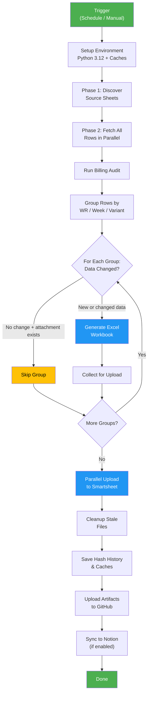
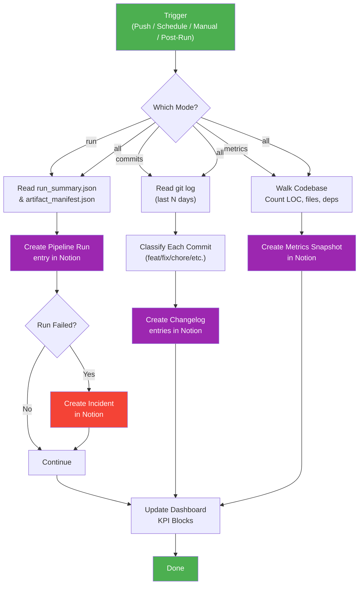
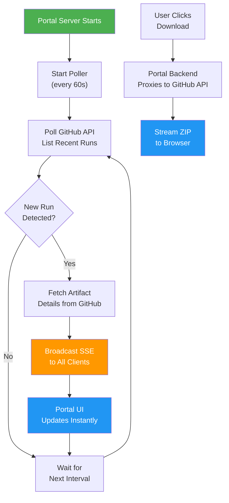
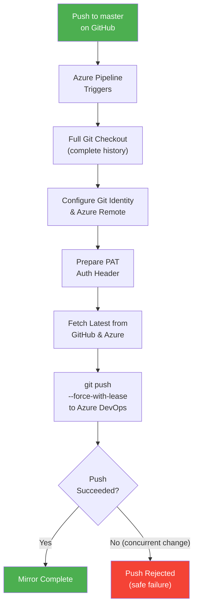
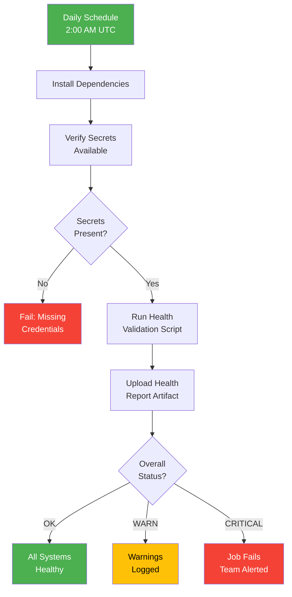
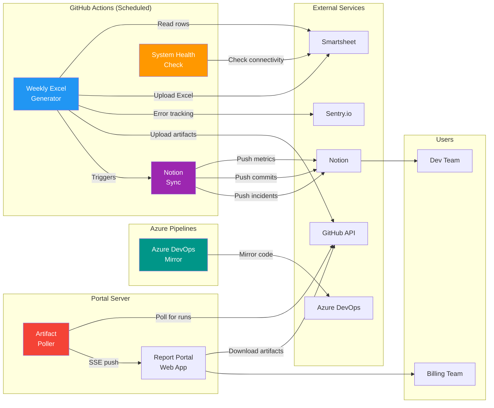

# Sync Job Run Logs

> **Last Updated:** 2026-04-16  
> **Repository:** Generate-Weekly-PDFs-DSR-Resiliency  
> **Generated by:** Automated codebase analysis

This document provides a plain-English breakdown of every automated sync job in the repository. Each section explains what a job does, how it works step by step, and includes a visual logic map for quick reference.

---

## Table of Contents

1. [Weekly Excel Report Generator](#1-weekly-excel-report-generator)
2. [Notion Dashboard Sync](#2-notion-dashboard-sync)
3. [Artifact Polling Service (Report Portal)](#3-artifact-polling-service-report-portal)
4. [GitHub-to-Azure DevOps Mirror](#4-github-to-azure-devops-mirror)
5. [System Health Check](#5-system-health-check)

---

## 1. Weekly Excel Report Generator

### Sync Job Name
`weekly-excel-generation` — Primary billing report pipeline

### Primary Purpose
This is the core automated job in the system. It connects to Smartsheet (a cloud spreadsheet platform where field crews log daily work), pulls all relevant billing data, and produces formatted Excel reports — one per Work Request per billing week. These reports are used by the billing team to invoice clients for completed utility construction work (DSR Resiliency project). The job runs multiple times per day on weekdays, less frequently on weekends, and can also be triggered manually.

### How It Works (Step-by-Step)

1. **Trigger & Scheduling:** GitHub Actions starts the job automatically on a fixed schedule — every 2 hours during weekday business hours (Mon–Fri, 8 AM to 6 PM Central), three times daily on weekends, and at midnight on Mondays for a comprehensive weekly run. A team member can also trigger it manually with custom options.

2. **Environment Setup:** The system spins up a fresh virtual machine, installs Python 3.12, and restores two important caches from previous runs: the **hash history** (a record of what data has already been processed) and the **discovery cache** (a list of known Smartsheet source sheets, so they don't need to be re-found every time).

3. **Execution Type Detection:** The job figures out what kind of run this is — a regular weekday production run, a weekend maintenance run, a Monday comprehensive weekly run, or a manual run — and labels itself accordingly.

4. **Phase 1 — Sheet Discovery:** The script connects to Smartsheet using an API key and discovers all source data sheets. It looks inside predefined folders (for both original-contract and subcontractor work) and finds every sheet containing billing data. The results are cached for up to 7 days to speed up future runs.

5. **Phase 2 — Data Fetch:** All rows are pulled from the discovered sheets in parallel (using up to 8 simultaneous connections). Each row represents one unit of work performed by a crew on a specific day — including details like the Work Request number, CU (Construction Unit) code, quantity, price, and snapshot date.

6. **Billing Audit:** Before generating reports, the system runs a financial audit on the raw data, checking for pricing anomalies, duplicate entries, and suspicious patterns. The audit produces a risk level (LOW / MEDIUM / HIGH / CRITICAL) that's logged with the run results.

7. **Data Grouping:** Rows are organized into groups by Work Request number, week-ending date, and variant type. There are three variant types:
   - **Primary:** The standard report for a Work Request/week
   - **Helper:** A separate report for helper crews (other teams assisting on the same Work Request)
   - **VAC Crew:** A report for vacuum crew work logged separately

8. **Change Detection (Hash Check):** For each group, the system calculates a fingerprint (hash) of the data. If the data hasn't changed since the last run and the corresponding Excel file is still attached in Smartsheet, the group is skipped — saving time and API calls.

9. **Excel Generation:** For groups that are new or changed, a formatted Excel workbook is created. Each report includes:
   - Company logo and header information
   - Work Request details (WR number, foreman, scope)
   - A day-by-day breakdown of work items with quantities and prices
   - Daily subtotals and a grand total
   - Rate versioning support (applying new or old contract rates based on a cutoff date)

10. **Parallel Upload:** All newly generated Excel files are uploaded back to Smartsheet as row attachments, using parallel workers. Old versions of the same report are deleted first to prevent duplicates. The system retries automatically on rate limits or transient network errors.

11. **Cleanup:** Stale Excel files — both locally and in Smartsheet — are removed to keep things tidy. Only reports for groups that exist in the current source data are kept.

12. **Hash History Save:** The updated hash history (recording what was generated and when) is persisted for the next run, and the caches are saved to GitHub Actions storage.

13. **Artifact Preservation:** All generated Excel reports are uploaded to GitHub as downloadable artifacts, organized three ways: as a complete bundle, by Work Request number, and by week-ending date. A JSON manifest with SHA256 checksums is also generated for integrity verification.

14. **Notion Sync (Optional):** If enabled, run metrics (files generated, duration, error count, audit risk level, etc.) are pushed to a Notion dashboard so the team can monitor pipeline health without looking at GitHub.

15. **Error Monitoring:** Throughout the entire process, Sentry.io tracks errors, performance metrics, and execution breadcrumbs. If the job takes too long (over 80 minutes), it gracefully stops processing new groups to ensure caches and artifacts are saved before the GitHub Actions hard timeout (90 minutes).

### Visual Logic Map

### Expected Outcomes & Error Handling

**Successful Run:**
- All eligible Work Request groups have up-to-date Excel reports attached in Smartsheet
- A `run_summary.json` file records files generated, groups processed/skipped/errored, duration, and audit risk level
- GitHub artifacts are available for download for 90 days (30 days in test mode)
- Hash history is updated so unchanged groups are skipped next time

**Failure Handling:**
- **Sentry.io** receives real-time error alerts with full stack traces and execution context
- **Notion Incidents database** automatically creates an incident entry for failed runs, with severity based on audit risk level
- **Graceful time budget:** If the job exceeds 80 minutes, it stops processing new groups but still saves caches and artifacts — preventing data loss from hard timeouts
- **Retry logic:** Smartsheet API rate limits (429 errors) and transient network errors are automatically retried with exponential backoff (up to 4 attempts)
- **Partial success:** Even if some groups fail, others continue processing. The error count is tracked in the run summary

---

## 2. Notion Dashboard Sync

### Sync Job Name
`notion-sync` — Pipeline metrics and changelog sync to Notion

### Primary Purpose
This job keeps a set of Notion databases up to date with pipeline run history, code changes, and codebase health metrics. It acts as the bridge between GitHub (where the code lives and runs) and Notion (where the team tracks project status). This means the team can see pipeline health, recent commits, and code statistics directly in their Notion workspace without ever opening GitHub.

### How It Works (Step-by-Step)

1. **Trigger:** Runs in three scenarios:
   - **On every push to `master`:** Syncs the latest commits (last 3 days)
   - **Daily at 6 AM Central:** Takes a snapshot of codebase metrics
   - **After each Weekly Excel Generation run:** Syncs the run's results (files generated, duration, errors)
   - **Manual trigger:** Allows syncing everything or specific modes with customizable lookback

2. **Authentication:** The script connects to the Notion API using an integration token stored as a GitHub secret.

3. **Mode: Run Sync** (called after each Excel generation)
   - Reads the `run_summary.json` and `artifact_manifest.json` files produced by the generator
   - Creates a new entry in the **Pipeline Runs** Notion database with: run number, status (Success/Failed/Timed Out), trigger type, duration, files generated/uploaded/skipped, groups processed, sheets discovered, rows fetched, audit risk level, commit SHA, and a link to the GitHub Actions run
   - If the run failed, automatically creates an entry in the **Incidents** database with severity, error details, and impact assessment
   - Duplicate detection prevents the same run from being logged twice

4. **Mode: Commit Sync** (called on push or manual)
   - Reads recent git commits using `git log` with stats (files changed, insertions, deletions)
   - Classifies each commit by type using conventional commit format (feat, fix, refactor, chore, docs, perf, security, test) or heuristic keyword matching
   - Creates entries in the **Changelog** Notion database with: commit SHA, message, author, date, type, scope, change stats, breaking change flag, and a link to the commit on GitHub
   - Skips commits already logged (idempotent)

5. **Mode: Metrics Sync** (called daily or manual)
   - Walks the codebase to count: Python lines of code, total files, test files, dependencies in requirements.txt, source sheet IDs hardcoded in the generator, workflow steps in CI, and discovery cache version
   - Creates a daily snapshot in the **Codebase Metrics** Notion database
   - One snapshot per day maximum (skips if today's already exists)

6. **Dashboard KPI Update:** After any sync mode completes, queries the Pipeline Runs database to compute aggregate statistics — success rate, total runs, average duration, last run status — and updates four KPI callout blocks on the Notion dashboard page in real time.

### Visual Logic Map

### Expected Outcomes & Error Handling

**Successful Run:**
- Notion databases are up to date with the latest pipeline runs, commits, and/or metrics
- Dashboard KPI blocks show current success rate, total runs, average duration, and last run status
- No duplicate entries (idempotent by design)

**Failure Handling:**
- The Notion sync step in the main workflow uses `continue-on-error: true` — if it fails, the Excel generation results are not affected
- Missing environment variables (e.g., NOTION_TOKEN) cause a graceful skip with a warning, not a crash
- Individual sync modes are independent — a failure in commit sync doesn't block metrics sync
- KPI update failures are caught and logged as non-fatal warnings

---

## 3. Artifact Polling Service (Report Portal)

### Sync Job Name
`portal-artifact-poller` — Real-time artifact detection for the Report Portal web app

### Primary Purpose
The Report Portal is a web application where billing team members can browse and download the Excel reports generated by the pipeline — without needing GitHub access. The Artifact Polling Service runs inside the portal's backend server and continuously checks GitHub for new workflow runs. When a new run completes, it instantly notifies all connected users via real-time push updates, so they see new reports appear without refreshing the page.

### How It Works (Step-by-Step)

1. **Startup:** When the portal server starts, the poller begins running on a configurable interval (default: every 60 seconds).

2. **Poll GitHub API:** On each tick, the poller calls the GitHub REST API to list the 5 most recent completed runs of the `weekly-excel-generation` workflow.

3. **Detect New Runs:** The poller remembers the ID of the last known run. If the most recent run has a different ID, a new run has been detected.

4. **Fetch Artifact Details:** For the new run, the poller fetches the list of artifacts (the uploaded Excel bundles, manifests, WR-organized files, and week-organized files) along with metadata like size and creation time.

5. **Real-Time Broadcast:** The poller sends a Server-Sent Event (SSE) to all connected browser clients with the run details and artifact list. The portal frontend receives this event and updates the UI immediately — no page refresh needed.

6. **Artifact Browsing & Download:** When a user clicks to download, the portal backend proxies the request through the GitHub API (handling authentication), fetches the artifact ZIP, and streams it to the user's browser. Users can browse artifacts organized by Work Request or by week.

### Visual Logic Map

### Expected Outcomes & Error Handling

**Successful Run:**
- Connected portal users see new reports appear in real time
- Artifacts are browsable by Work Request number or week-ending date
- Downloads are proxied securely through the portal (users don't need GitHub tokens)

**Failure Handling:**
- If a GitHub API call fails, the error is logged and the poller retries on the next interval — it doesn't crash the portal server
- If no clients are connected, new run detection still occurs (maintaining state) but no broadcast is sent
- API rate limiting is mitigated by the small poll frequency (5 runs per check) and GitHub token authentication

---

## 4. GitHub-to-Azure DevOps Mirror

### Sync Job Name
`azure-pipelines-mirror` — One-way repository mirror from GitHub to Azure DevOps

### Primary Purpose
This job keeps a copy of the codebase in Azure DevOps synchronized with the GitHub repository. The team uses GitHub as the primary source of truth, but Azure DevOps is used by certain organizational tools and stakeholders. This mirror ensures that every commit pushed to `master` on GitHub is automatically reflected in Azure DevOps — without any manual intervention.

### How It Works (Step-by-Step)

1. **Trigger:** Runs whenever code is pushed to the `master` branch on GitHub, or when a pull request targets `master`. The job runs inside Azure Pipelines (not GitHub Actions).

2. **Full Checkout:** The pipeline checks out the full Git history from GitHub (not a shallow clone), which is required to avoid "missing object" errors during the push to Azure DevOps.

3. **Configure Git & Remote:** Sets up a Git identity ("Azure Pipelines") and adds Azure DevOps as a remote named `azure`, pointing to the correct organization, project, and repository.

4. **Prepare Authentication:** A Personal Access Token (PAT) stored as an Azure Pipelines variable is base64-encoded into an HTTP Basic Authentication header, which is used for all Git operations against Azure DevOps. The PAT is never embedded in URLs for security.

5. **Fetch Current State:** The pipeline fetches the current state of `master` from both GitHub (`origin`) and Azure DevOps (`azure`) to establish a baseline for the safe push.

6. **Safe Force Push:** Uses `git push --force-with-lease` to update Azure DevOps. This is safer than a regular force push because it only succeeds if the remote branch hasn't been modified by someone else since the fetch — preventing accidental overwrites of concurrent changes.

### Visual Logic Map

### Expected Outcomes & Error Handling

**Successful Run:**
- Azure DevOps `master` branch is an exact mirror of GitHub `master`
- Full commit history is preserved (not squashed)

**Failure Handling:**
- If the Azure DevOps PAT is not configured or has expired, the pipeline skips all sync steps gracefully (with a warning) instead of failing
- `--force-with-lease` prevents overwriting concurrent changes — if someone pushed directly to Azure DevOps, the mirror push is rejected safely
- Shallow clone detection: if the checkout is unexpectedly shallow, the pipeline automatically converts it to a full clone before pushing

---

## 5. System Health Check

### Sync Job Name
`system-health-check` — Daily infrastructure validation

### Primary Purpose
This job runs once per day to verify that all the systems the pipeline depends on are healthy and properly configured. It checks things like Smartsheet API connectivity, secret availability, and overall system readiness — catching problems before they affect the next Excel generation run.

### How It Works (Step-by-Step)

1. **Trigger:** Runs daily at 2:00 AM UTC via a scheduled cron job, or can be triggered manually.

2. **Environment Setup:** Installs Python 3.11 and all project dependencies.

3. **Secret Verification:** Checks that critical secrets (`SMARTSHEET_API_TOKEN`, `SENTRY_DSN`) are available to the workflow. If the Smartsheet token is missing, the job fails immediately.

4. **Health Validation:** Runs `validate_system_health.py` which performs connectivity checks, configuration validation, and produces a structured health report.

5. **Report Upload:** The health report (`system_health.json`) is uploaded as a GitHub artifact with 30-day retention.

6. **Status Evaluation:** Parses the health report to determine overall status:
   - **OK:** All checks passed — the system is healthy
   - **WARN:** Some non-critical issues detected (job succeeds with a warning)
   - **CRITICAL:** Major problems found (job fails to alert the team)

### Visual Logic Map

### Expected Outcomes & Error Handling

**Successful Run:**
- A `system_health.json` artifact is produced confirming all systems are operational
- The GitHub Actions workflow shows a green check

**Failure Handling:**
- Missing secrets cause an immediate, clear failure message
- CRITICAL health status causes the workflow to exit with a non-zero code, which can trigger GitHub notification rules (email, Slack, etc.)
- The health report artifact is uploaded even when the check fails (`if: always()`), so the team can inspect what went wrong

> **Note:** The `validate_system_health.py` script referenced by this workflow is currently missing from the repository. The workflow will fail until this script is added.

---

## Cross-Job Architecture Overview

The following diagram shows how all five sync jobs relate to each other and the external systems they interact with.

---

*This document is auto-generated by analyzing the repository codebase. For the most current behavior, refer to the source code and GitHub Actions workflow definitions.*
