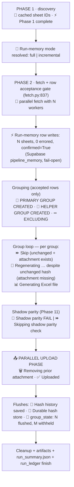

# Navigating, diagnosing and changing the pipeline

**Who this is for:** an engineer who has to read a failing run, trace why a
file came out a certain way, or make a change without breaking billing.
**Component owner:** the Python billing pipeline. The Notion sync
(`scripts/notion_sync.py`) and the `portal-v2` Supabase web app are separate
components and are not covered here.

## The shape of the code

`generate_weekly_pdfs.py` is the production entry point, but it is a thin
facade (~700 lines): configuration, Sentry wiring, and re-exports. The work
lives in the `pipeline/` package, plus two Supabase packages.

| Module | Lines | What it owns | Touch it when… |
| --- | --- | --- | --- |
| `pipeline/orchestrate.py` | ~5,300 | `main()` — the run, phase by phase; run-memory write/incremental/reconciliation helpers; the group loop (skip / regenerate / upload decisions) | you change *when* something happens in a run |
| `pipeline/discovery.py` | ~680 | Finds source sheets in the Smartsheet folders, validates column mappings, caches to `generated_docs/discovery_cache.json` | a sheet isn't being found, or a column is renamed |
| `pipeline/fetch.py` | ~1,300 | Parallel `get_sheet` reads (≤8 workers), row normalisation, delta reads, and the **row acceptance gate** (WR + weekly date + *Units Completed?* + price > 0; a `NO MATCH` CU is dropped) | rows are missing at the source, rate limits, retries |
| `pipeline/grouping.py` | ~1,360 | Grouping into `(WR, week, variant, claimer)` groups — one workbook each; helper / VAC-crew / subcontractor variant assignment | a unit lands in the wrong file, or a variant rule changes |
| `pipeline/pricing.py` | ~900 | Rate recalculation, subcontractor rate variants (`_AEPBillable`, `_ReducedSub`) | a price is wrong |
| `pipeline/attribution.py` | ~820 | Who a file is attributed to (frozen claimers from `billing_audit`) | a file is under the wrong foreman/helper name |
| `pipeline/change_detection.py` | ~800 | `calculate_data_hash()` and the durable hash store decision — whether a group regenerates | files churn (regenerate without a change) or don't regenerate when they should |
| `pipeline/excel.py` | ~790 | The workbook: header, summary, day blocks, totals; `safe_merge_cells()`; filename suffixes | the layout or the file name |
| `pipeline/upload.py` | ~350 | Upload tasks, target-row lookup, WR-collision quarantine | a file attaches to the wrong row / sheet |
| `pipeline/cleanup.py` | ~670 | Removing superseded attachments and stale local files | old files linger or the wrong file is deleted |
| `pipeline/parity.py` | ~560 | Phase 11 shadow comparator (`parity_verdict`) | you're working on the incremental-read rollout |
| `pipeline/config.py` | ~640 | Every env var, with defaults | adding or changing a knob |
| `pipeline_memory/` | ~2,100 | Supabase `pipeline_memory` schema client / writer / reader (run ledger, sheet registry, row + group state) | run memory, parity evidence, incremental reads |
| `billing_audit/` | ~2,600 | Supabase `billing_audit`: frozen attribution, run fingerprints, durable group hashes, snapshot-drift storage | attribution or the durable hash store |
| `audit_billing_changes.py` | ~940 | Price-anomaly / risk-level detection (`BillingAudit.audit_financial_data()`), run on the fetched rows **before** grouping and generation — it never sees the per-variant prices resolved later | audit output |

Read [Python modules](../runbook/python-modules.md) for the entry points and
diagnostics scripts, and [Workflows](../runbook/workflows.md) for the GitHub
Actions side.

## Anatomy of a run

`main()` in `orchestrate.py` runs these phases in order. The emoji markers
are what you grep for in a run log.



Two facts explain most "why did it do that" questions:

- **In a normal run a group regenerates only if its content hash changed or
  its attachment is missing.** The hash (`calculate_data_hash`) covers the
  billed fields of every row plus foreman / variant / dept / totals. When the
  Supabase durable store is authoritative
  (`SUPABASE_HASH_STORE_AUTHORITATIVE=1`, the production setting) it is the
  previous hash; `hash_history.json` is the fallback. The operator overrides
  — `FORCE_GENERATION`, `REGEN_WEEKS`, `RESET_HASH_HISTORY`, `RESET_WR_LIST`
  — bypass that decision (and `RESET_WR_LIST` disables the unchanged-skip for
  *every* group, not just the listed WRs). Groups whose upload is
  **withheld** (the WR is on no target sheet) never gain an attachment and
  are regenerated every run by design; they are also excluded from
  `group_state` and from the parity comparison. The `_NO_MATCH` /
  `Unknown_Foreman` names are the usual members of that set, but the name is
  not what withholds the upload — a WR that *is* on a target sheet gets its
  `_Unknown_Foreman` file attached.
- **Files are partitioned by `(WR, week, variant, claimer)`; dept and job
  never split a file.** They are hashed content, and for helper files they
  are part of the hash-history identity (`{helper}|{dept}|{job}`). Never
  shorten that identity — helper files for past weeks depend on it.

## Diagnosing a run

### 1. Read the run log

```bash
gh run list --workflow=weekly-excel-generation.yml --limit 5
gh run view <run-id> --log | sed 's/^[^\t]*\t[^\t]*\t//' \
  | grep -E "EXECUTION_TYPE:|Run-memory|Shadow parity|Skip \(unchanged|Regenerating|Generating Excel|Uploaded|Removing|Durable hash|group_state:|⚠️|❌"
```

For one Work Request and week:

```bash
gh run view <run-id> --log | grep -E "WR 12345678 week 080226|12345678_WeekEnding_080226"
```

Expect one of: `⏩ Skip (unchanged + attachment exists)`, `🔁 Regenerating …
despite unchanged hash`, or `📊 Generating Excel file` followed by
`🗑️ Removing` and `✅ Uploaded`.

### 2. Ask Supabase what the run recorded

```sql
-- the last runs (pipeline_memory, Phase 10/11)
select run_id, status, started_at, finished_at, sheets_checked, sheets_changed,
       rows_changed, groups_affected, groups_generated,
       notes->>'execution_type' as exec, notes->>'mem_confirmed' as confirmed,
       notes->>'parity_verdict' as parity
from pipeline_memory.run_ledger order by started_at desc limit 5;

-- what memory holds for one group
select * from pipeline_memory.group_state
 where wr = '12345678' and week_ending = '2026-08-02';

-- the durable hash the skip decision compares against
select * from billing_audit.group_content_hash
 where wr = '12345678' and week_ending = '2026-08-02';

-- per-run content hash at WR/week level: one row per (wr, week_ending, run_id),
-- NOT per file -- a WR with several variants records one of them. Values that
-- flip across runs with the same source rows = a determinism bug.
select run_id, variant, content_hash, assignment_fp, created_at
  from billing_audit.pipeline_run
 where wr = '12345678' and week_ending = '2026-08-02'
 order by created_at desc limit 10;
```

`run_ledger` has no `sheets_errored` column — write errors live in
`notes->>'mem_sheets_errored'`.

### 3. Reproduce locally without touching production

```bash
pip install -r requirements.txt
SMARTSHEET_API_TOKEN= TEST_MODE=true python generate_weekly_pdfs.py   # empty token: synthetic rows
TEST_MODE=true WR_FILTER=12345678 python generate_weekly_pdfs.py   # token set: real reads, one WR, no uploads
SUPABASE_URL= SUPABASE_SERVICE_ROLE_KEY= SKIP_UPLOAD=true python generate_weekly_pdfs.py   # real reads, EVERY group, no uploads, no Supabase
pytest tests/ -v                                        # ~1,770 tests, must be green
```

`WR_FILTER` is honoured **only** in `TEST_MODE` (`pipeline/grouping.py`:
`if WR_FILTER and TEST_MODE`), and test mode never creates upload tasks;
with `SMARTSHEET_API_TOKEN` set it reads the real sheets. `SKIP_UPLOAD=true`
without test mode processes every group and only suppresses the attachment
step. Both write files under `generated_docs/`; a group's file is
byte-comparable across runs with `scripts/compare_control_run.py`.

:::warning `SKIP_UPLOAD` alone does not cover Supabase — `TEST_MODE` does
Every `billing_audit` and `pipeline_memory` write is gated by `not TEST_MODE`
(`pipeline/orchestrate.py:3333`, `:3352`, `:1934`), so the test-mode recipes
above never touch Supabase. `SKIP_UPLOAD=true` *without* test mode still
runs the `billing_audit` writers — `freeze_row()` (first-write-wins
attribution) and `emit_run_fingerprint()` — before the upload gate
(`:3441`), so a non-test local run with `SUPABASE_URL` /
`SUPABASE_SERVICE_ROLE_KEY` in the environment can permanently freeze
production attribution. For a `SKIP_UPLOAD` run, set both variables to an
**explicit empty value** (`SUPABASE_URL= SUPABASE_SERVICE_ROLE_KEY=
SKIP_UPLOAD=true python generate_weekly_pdfs.py`) — unsetting is not enough,
because `generate_weekly_pdfs.py` calls `load_dotenv()` at import, which
fills in any *absent* variable from a developer `.env` but never overrides
one that is present, even when empty (the same trick the synthetic recipe
above uses for the Smartsheet token, and that
`tests/test_entrypoint_no_double_import.py` relies on). The writers are
fail-open and the Excel output does not need them.
:::

### 4. Sentry

Errors are tagged by release (`<owner>-<repo>@<sha>`). A parity `fail` is
sent at error level as `Shadow-incremental parity FAIL` with the run id and
aggregate counts only — the divergent group keys are **not** in the event;
read them from `run_ledger.notes.parity_details`. Logs to Sentry are off by
default (`SENTRY_ENABLE_LOGS`) because INFO lines can carry row data.

## Making a change safely

The pipeline is production-critical: it runs several times a day (normal runs:
seven Monday–Thursday, six on Friday, three on Saturday, four on Sunday —
plus the weekly deep run, Monday 00:00 CDT / Sunday 23:00 CST) against real
billing data. The rules below are the ones whose violation has caused
incidents; each links to where the full story is recorded.

| Never… | Because | Full rule |
| --- | --- | --- |
| shorten the change-detection key or change what `calculate_data_hash` covers without a golden-hash test | every group whose hash changes is regenerated and re-uploaded once (thousands of attachments), and a sort-order dependency silently churns files every run | `memory-bank/living-ledger.md` `[2026-08-27 16:10]` |
| merge cells with `ws.merge_cells` or write `oddFooter.right.text` | corrupts the workbook for Excel | `CLAUDE.md` → Critical pitfalls |
| raise `PARALLEL_WORKERS` above 8 | Smartsheet's 300 req/min limit | `CLAUDE.md` → Smartsheet API |
| use `@cell` in a formula sent through the API | UI-only function; the API rejects it | `CLAUDE.md` → Boundaries |
| flip `SUPABASE_HASH_STORE_AUTHORITATIVE` or `RUN_MEMORY_INCREMENTAL_ENABLED` outside their checklists | both change what gets regenerated in production | [Operations](../runbook/operations.md), `docs/run-memory-write-flip-checklist.md` |
| raise `TIME_BUDGET_MINUTES` without raising the job's `timeout-minutes` | Actions hard-kills the job before the graceful stop, losing cache and uploads | `CLAUDE.md` → GitHub Actions |
| collapse the `Job #` column synonyms or the `advanced_options` parser | operators' runbooks and sheets depend on them | `CLAUDE.md` → Critical pitfalls |

The workflow:

1. **Branch from `master`; never push to `master`.** Name it `fix/…`,
   `feat/…` or `docs/…`.
2. **Write the test first** when the change touches grouping, hashing,
   pricing, attribution, filenames or uploads. Fixtures live in
   `tests/fixtures/`; the suite is plain `unittest`/`pytest`. If a change
   *should* alter a hash, pin the new value and say why in the ledger.
3. **Run the full suite** and read the pass/fail line — not a pipe's exit
   code. Nothing enforces this on `git push` from a shell:
   `.github/hooks/pre-push-tests.json` is a Claude Code hook definition, not
   a Git hook, so the run is on you.
4. **Validate against a known-good sample** for anything in the table above
   (`TEST_MODE=true WR_FILTER=<wr>` with the token set — `WR_FILTER` is
   ignored outside test mode — or the comparator script).
5. **Open the PR with the three sections** — *Objective*, *Changes Made*,
   *Production Safety Check* — and answer every Greptile / Copilot / Codex
   thread with the SHA that addressed it. The Azure DevOps mirror check has
   been red on `master` for a while; every other check must be green.
6. **Record what you learned.** Append a dated entry to
   `memory-bank/living-ledger.md` (the incident and rule history), refresh
   `.claude/project-state.md`, and add a synthesized changelog post under
   `website/blog/` for anything operator-visible — the `docs-changelog.yml`
   stub is not enough.

### Where to make common changes

| I need to… | Start in | Then |
| --- | --- | --- |
| add a column to the Excel | `pipeline/excel.py` (day-block `headers` + row writer) | if it's billed, add it to `calculate_data_hash` **with** a golden-hash update |
| change who a file is attributed to | `pipeline/attribution.py` + `billing_audit/writer.py` (frozen claimers) | attribution is frozen per row (first-write-wins) by `freeze_row()` in the group loop — **before** generation and upload, so a withheld or failed upload does not un-freeze it; corrections go to the `billing_audit.attribution_snapshot` row, not the attachment |
| add a new file variant | `pipeline/grouping.py` (variant assignment) → `pipeline/excel.py` (suffix) → `pipeline/upload.py` (routing) → `pipeline/cleanup.py` (recognise the suffix) | every layer must know the suffix or cleanup will treat it as garbage |
| add an env knob | `pipeline/config.py` → `website/docs/reference/environment.md` → `.github/prompts/configuration-environment.md` | only the `Generate reports` step's `env:` is read by the pipeline |
| change the schedule or budgets | `.github/workflows/weekly-excel-generation.yml` | owner approval; keep `TIME_BUDGET_MINUTES` < `timeout-minutes` |
| work on incremental reads (Phase 11) | `.planning/phases/11-…/11-CONTEXT.md` (D-01…D-12) → `pipeline/orchestrate.py` `_run_phase2_incremental` → `pipeline/parity.py` | the flag stays off until five consecutive `parity_verdict = pass` |

## The run-memory layer in two minutes (Phase 10–11)

Every scheduled run writes what it read to Supabase `pipeline_memory`: a
`run_ledger` row, a `sheet_registry` watermark per sheet, a `row_state` row
per accepted row (always upserted — `last_seen_run` advances every run) plus a
`row_event` only when that row's content hash is new or changed
(`pipeline_memory/schema.sql:258-268` — event volume is change volume, not
fetch volume), and `group_state` per uploaded group (with the attachment id). Production *reads* it too — the sheet watermarks and the last
run's ledger status before fetch, and the changed-row ids for the shadow
comparator — but no read changes what is generated until
`RUN_MEMORY_INCREMENTAL_ENABLED` is on. A shadow comparator
computes what an incremental run *would* have regenerated and compares it
with the set the full run queued for upload (generated groups with an upload
task — the comparator runs before the upload phase, so a later upload
failure does not change the verdict); the verdict is `pass`, `fail` or `skipped`
and lives in `run_ledger.notes`. Five consecutive `pass` verdicts on
`production_frequent` runs are the evidence required before
`RUN_MEMORY_INCREMENTAL_ENABLED` may be turned on. Everything on this path
is fail-open: a Supabase outage makes that run's memory incomplete and never
affects the Excel output. The symptom table in
[Operations](../runbook/operations.md#run-memory-writes-and-the-incremental-read-rollout-phase-11)
tells you what each log line means.

## Reading list

- `CLAUDE.md` — the repo's standing rules and pitfalls (read first).
- `memory-bank/living-ledger.md` — dated incident root-causes and the rules
  they produced; search it for the subsystem you're touching.
- `.planning/` — GSD phase context, plans and summaries (why decisions were
  made).
- `.github/prompts/architecture-analysis.md` and
  `data-processing-business-logic.md` — domain rules in depth.
- [Change Log](/blog) — one synthesized post per operator-visible change.
