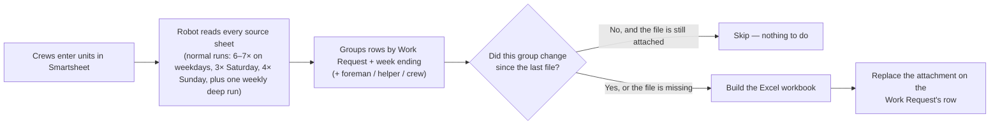

# The weekly Excel reports, explained for operators

**Who this is for:** foremen, billers, coordinators and anyone who reads or
depends on the weekly Excel files but does not touch code.
**Component owner:** the Python billing pipeline (`generate_weekly_pdfs.py`),
running on a GitHub Actions schedule. Nobody builds these files by hand.

## What the automation does, in one paragraph

Several times a day a robot reads the ProMax / Resiliency Smartsheets, finds
every row that describes a completed, priced unit of work, sorts those rows
into **one file per Work Request per week** (and per foreman, helper or crew
where the work is split), builds a formatted Excel workbook for each, and
attaches the file to that Work Request's row on the billing target sheet. If
nothing changed for a Work Request since the last run, its file is left
alone. If something did change, the old attachment is removed and a fresh
file is attached in its place.



## When it runs

| When (Central time) | What kind of run |
| --- | --- |
| Monday–Friday, every 2 hours from 8 AM to 6 PM in summer (7 AM to 5 PM in winter) | Normal run — picks up whatever changed since the last one |
| Sunday–Thursday, one evening run at 8 PM in summer (7 PM in winter) — there is **no Friday-evening run** | Same |
| Saturday and Sunday at 10 AM, 2 PM and 6 PM in summer (9 AM, 1 PM and 5 PM in winter) — Sunday also gets the 8 PM evening run above, so Saturday has three normal runs and Sunday four | Same, lighter cadence |
| Monday 12:00 AM in summer (Sunday 11 PM in winter) | The **weekly deep run** — re-checks everything, including rows that were deleted |

The schedule is fixed in UTC, which is why every time above shifts by an hour
between daylight-saving time ("summer") and standard time ("winter").

A normal run takes about 40–60 minutes, and up to about 75 while the
shadow-parity check is switched on. So a unit entered at 10:05 AM is picked
up by the noon run and is usually in its Excel file by about 1 PM. You do not
need to do anything to make that happen.

## Where the files are

Open the billing target sheet, find the Work Request's row, and open its
**attachments**. Each file is named so you can tell what it is without
opening it:

```
WR_12345678_WeekEnding_080226_User_Jane_Doe.xlsx
   │            │                 │
   │            │                 └─ whose work: the foreman (User), a helper
   │            │                    (Helper_<name>), a VAC crew (VacCrew_<name>), or a
   │            │                    subcontractor variant (AEPBillable_… / ReducedSub_…)
   │            └─ week ending, MMDDYY (Sunday 08/02/2026)
   └─ Work Request number
```

One Work Request can have several files for the same week: one for the
foreman's own units, one per helping foreman, one per VAC crew, and — for
subcontractor sheets — priced variants (`_AEPBillable_User_…`,
`_ReducedSub_User_…`; the ReducedSub files are also attached on the PPP
sheet). A row that is marked as *both* "Helping Foreman Completed Unit?" and
"Units Completed?" **and** names a helping foreman and a helper department
appears **only** in the helper file, never in the main one, so nothing is
billed twice. If the helper name or department is blank, the row is treated
as the foreman's own unit and lands in the main file instead.

## How to read a file

Every workbook has a single sheet called **Work Report**, laid out the same
way every time:

1. **Header** — the Linetec logo, *WEEKLY UNITS COMPLETED PER SCOPE ID*, and
   the *Report Generated On* timestamp (the moment the robot built the file).
2. **REPORT SUMMARY** — *Total Billed Amount*, *Total Line Items*, and the
   *Billing Period* (always the Monday-through-Sunday week that ends on the
   week-ending date, whatever the first logged day in the file is).
3. **REPORT DETAILS** — *Foreman* (or the helper / VAC crew the file is
   for), *Dept #* (only when the rows carry a department), *Work Request #*,
   *Scope ID #*, *Work Order #*, *Customer* and *Job #*.
4. **One block per day** — a red day header (e.g. *Tuesday (07/28/2026)*)
   followed by the units logged that day, with the columns
   *Point Number · Billable Unit Code · Work Type · Unit Description ·
   Unit of Measure · # Units · N/A · Pricing* (the *N/A* column is an unused
   placeholder), and a **TOTAL** line for the day.

If a number looks wrong, the cause is almost always in the Smartsheet row it
came from — see "When something looks wrong" below.

## "How do I build the Excel file for my Work Request?"

You don't build it — you **feed it**. The file is a mirror of the Smartsheet
rows, so the way to get a correct file is to get the rows right. A row is
**picked up** when it has all four of:

- a **Work Request #**
- a **week-ending / weekly reference logged date** (this decides *which*
  file the unit lands in)
- **Units Completed?** checked
- a **price above $0** (a blank or `$0` price drops the row unless the rate
  table can fill the price in; a CU that reads `NO MATCH` drops it too)

For the line to be **correct** it also needs a **CU** (billable unit code)
with a **quantity**, a **Foreman** (or the helper / VAC-crew fields for
split work), and a **Snapshot Date** that is a real date inside that
Monday–Sunday week. Those do *not* stop the row from being picked up: a row
missing the code, quantity or foreman still appears — as a line with a blank
code or a zero quantity, or in a file named `_Unknown_Foreman` — and a row
with a blank, unreadable or out-of-week Snapshot Date is counted in the
file's total but shown in **no day block**, so the total and the lines won't
add up until the date is fixed.

Then wait for the next scheduled run (or ask for a manual run, below). To
check that the robot saw your change, open the attachment after the run and
look at *Report Generated On* — it should be newer than your edit.

### Common reasons a unit is missing from the file

| What you see | Likely cause | Fix |
| --- | --- | --- |
| The unit isn't in any file | Missing WR # or date, *Units Completed?* unchecked, no price (blank / `$0`), or a CU that reads `NO MATCH` — or the Work Request has **no row on any target sheet**, in which case the file is built but never attached | Complete the row; it appears on the next run. If the WR has no target-sheet row, completing the source row changes nothing — ask the engineering owner to fix the target-row mapping |
| The unit is in the file but the line has a blank code or a zero quantity | The row was picked up but its CU or quantity is incomplete (a picked-up row always carries a price above $0) | Fix those fields; the file rebuilds on the next run |
| The file total includes the unit but it is in no day block | The row's Snapshot Date is blank, unreadable, or outside that Monday–Sunday week | Fix the Snapshot Date; the file rebuilds on the next run |
| The unit is in the **wrong week's** file | The week-ending / logged date on the row is wrong | Correct the date; the new week's file gains it. The old week's file rebuilds without it **only if other units remain in that week for that WR** — if it was the only one, nothing regenerates the old file and the stale attachment stays until the engineering owner removes it |
| The unit is in a `_Helper_…` file but you expected the main file | Both helper and primary checkboxes are checked | That is by design — the helper file is the billable one; uncheck the helper flag only if the unit really wasn't helper work |
| The file name says `_NO_MATCH` or `Unknown_Foreman` | The robot could not work out a foreman for the row | Fill in the foreman, then check the next run. The name itself does **not** stop the upload: if the Work Request has a row on a target sheet, the file is attached under that name, so fix it promptly (if the WR is on no target sheet the file is built but withheld). **If the name persists after the next run, escalate** — once a report has been attributed, that attribution is frozen (first write wins) and only engineering can correct it |
| Old file, no update after your edit | The run hasn't happened yet, or the change didn't touch a billed field (a plain manual run makes the same "unchanged, skip" decision, so it won't help either) | Wait for the next run; if it's still stale after two runs, ask the engineering owner — they can force that week with `regen_weeks` or work out why the change isn't billed |

## Asking for a manual run

Anyone with **write** access to the repository can run the workflow by hand
— this is the same robot, started on demand. If you don't see the **Run
workflow** button, that is a permissions issue: ask the engineering owner.

1. GitHub → **Actions** → **Weekly Excel Generation with Sentry Monitoring**
   → **Run workflow**.
2. Leave everything at its default for a normal catch-up run.
3. Useful options:
   - `advanced_options: regen_weeks:080226;080926` — force-rebuild specific
     week endings (the Sunday, as MMDDYY, separated by `;`). This rebuilds
     that week for every Work Request that still has rows in it — it cannot
     rebuild a week whose rows were all moved away or deleted (see the stale
     attachment note above).
   - `wr_filter` (e.g. `12345678,87654321`) — only honoured together with
     `test_mode: true`, and a test-mode run never attaches files. Use it to
     check what the robot *would* build for one Work Request; it cannot
     limit a real, attaching run to one WR.
   - `advanced_options: reset_wr_list:12345678` — **destructive; ask the
     engineering owner first.** It deletes the listed WRs' generated `WR_…xlsx`
     reports on the target sheet before generating, and it also switches off the
     "unchanged, skip" check for *every* group in that run, so the whole run
     regenerates and re-uploads. If the run fails after the delete, those WRs
     have no attachment until the next successful run.
   - `reset_hash_history: true` — rebuild **everything**. **Destructive —
     engineering owner only.** Before generating anything it deletes *every*
     generated report on the target sheet — every attachment named
     `WR_…xlsx`; other attachments and the PPP-sheet copies are not
     touched — so if the run fails afterwards no Work Request has a report
     on the target sheet until the next successful run.
4. Click **Run workflow** and wait for the green check (40–60 minutes, up to
   about 75).

A normal manual run (`test_mode` off) does everything a scheduled run
does, including attaching files. There is currently **no way to pick one Work Request for an attaching
run** — `wr_filter` only works in test mode, which never attaches.
(`max_groups`, and the engineer-side `EXCLUDE_WRS` setting, can shrink an
attaching run, but neither can select a WR.) So a normal manual run is simply
"catch up now".

## When something looks wrong

Work through this in order — most issues stop at step 2:

1. **Check the row in Smartsheet.** Is the WR #, date, CU, quantity, price
   and *Units Completed?* what you expect? Fix it there; never edit the Excel
   file (it will be overwritten on the next run).
2. **Check the timestamp.** *Report Generated On* older than your edit means
   the run hasn't caught up yet. Wait for the next scheduled run.
3. **Check the run.** GitHub → Actions → the latest *Weekly Excel Generation*
   run should be green. A red run means the robot could not finish; tell the
   engineering owner and include the run link.
4. **Still wrong after a green run that is newer than your edit?** Send the
   engineering owner the Work Request number, the week ending, the file
   name, and what you expected to see. The [engineer's guide](./for-engineers.md)
   explains how they trace it.

:::caution Never
Don't rename, edit or re-upload the generated Excel files by hand, and don't
delete attachments to "force a refresh". The robot re-creates a *missing*
file on its next run, but it only checks that a file with the right generated
name is attached — not what is inside it — so a hand-edited workbook
re-uploaded under the generated name is **kept** for as long as the source
rows are unchanged, and a wrong report can sit there for weeks. If a file has
been hand-edited, report it so engineering can force a rebuild.
:::

## Glossary

| Term | Meaning |
| --- | --- |
| **WR / Work Request** | The Work Request number the units are billed under; it decides which report a unit lands in and which row the report is attached to. Not the same field as **Job #** (a separate column shown in REPORT DETAILS) |
| **Week ending** | The Sunday that closes the billing week; files are cut per week ending |
| **CU / Billable Unit Code** | The catalogue code for a unit of work; it decides the description and price |
| **Helper file** | Units a *helping* foreman completed on someone else's WR |
| **VAC crew** | Vacuum-truck crew units, split into their own file per VAC foreman (`_VacCrew_<name>`) |
| **Snapshot date** | The day the unit was done; it places the unit in its day block and must fall inside the Monday–Sunday week. The billing period itself comes from the week-ending date |
| **Deep run** | The once-a-week run at Monday 12:00 AM Central in summer (Sunday 11 PM in winter) that re-checks everything, including deleted rows |
