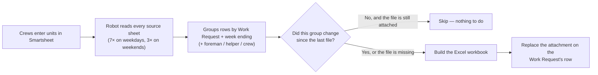

# The weekly Excel reports, explained for operators

**Who this is for:** foremen, billers, coordinators and anyone who reads or
depends on the weekly Excel files but does not touch code.
**Component owner:** the Python billing pipeline (`generate_weekly_pdfs.py`),
running on a GitHub Actions schedule. Nobody builds these files by hand.

## What the automation does, in one paragraph

Several times a day a robot reads the ProMax / Resiliency Smartsheets, finds
every row that describes a completed, priced unit of work, sorts those rows
into **one file per Work Request per week** (and per foreman, helper or crew
where the work is split), builds a formatted Excel workbook for each, and
attaches the file to that Work Request's row on the billing target sheet. If
nothing changed for a Work Request since the last run, its file is left
alone. If something did change, the old attachment is removed and a fresh
file is attached in its place.



## When it runs

| When | What kind of run |
| --- | --- |
| Weekdays, roughly every 2 hours between 8 AM and 8 PM Central | Normal run — picks up whatever changed since the last one |
| Saturday and Sunday, three times a day | Same, lighter cadence |
| Sunday night / Monday ~midnight Central | The **weekly deep run** — re-checks everything, including rows that were deleted |

A normal run takes about 35–55 minutes. So a unit entered at 10:05 AM is
usually in its Excel file by around noon. You do not need to do anything to
make that happen.

## Where the files are

Open the billing target sheet, find the Work Request's row, and open its
**attachments**. Each file is named so you can tell what it is without
opening it:

```
WR_91057431_WeekEnding_080226_User_Charlie_Tremper.xlsx
   │            │                 │
   │            │                 └─ whose work: the foreman (User), a helper
   │            │                    (Helper_<name>), a VAC crew (VacCrew), or a
   │            │                    subcontractor variant (AEPBillable_… / ReducedSub_…)
   │            └─ week ending, MMDDYY (Sunday 08/02/2026)
   └─ Work Request number
```

One Work Request can have several files for the same week: one for the
foreman's own units, one per helping foreman, one per VAC crew, and — for
subcontractor sheets — priced variants (`_AEPBillable_User_…`,
`_ReducedSub_User_…`; the ReducedSub files are also attached on the PPP
sheet). A row that is marked as *both* "Helping Foreman Completed Unit?" and
"Units Completed?" appears **only** in the helper file, never in the main
one, so nothing is billed twice.

## How to read a file

Every workbook has a single sheet called **Work Report**, laid out the same
way every time:

1. **Header** — the Linetec logo, *WEEKLY UNITS COMPLETED PER SCOPE ID*, and
   the *Report Generated On* timestamp (the moment the robot built the file).
2. **REPORT SUMMARY** — *Total Billed Amount*, *Total Line Items*, and the
   *Billing Period* (the first snapshot date in the file through the week
   ending).
3. **REPORT DETAILS** — *Foreman* (or the helper / VAC crew the file is
   for), *Work Request #*, *Scope ID #*, *Work Order #*, *Customer* and
   *Job #*.
4. **One block per day** — a red day header (e.g. *Tuesday (07/28/2026)*)
   followed by the units logged that day, with the columns
   *Point Number · Billable Unit Code · Work Type · Unit Description ·
   Unit of Measure · # Units · Pricing*, and a **TOTAL** line for the day.

If a number looks wrong, the cause is almost always in the Smartsheet row it
came from — see "When something looks wrong" below.

## "How do I build the Excel file for my Work Request?"

You don't build it — you **feed it**. The file is a mirror of the Smartsheet
rows, so the way to get a correct file is to get the rows right. A row is
picked up when it has, at minimum:

- a **Work Request #**
- a **week-ending / weekly reference logged date** (this decides *which*
  file the unit lands in)
- a **CU** (billable unit code) with a **quantity** and a **price**
- **Units Completed?** checked
- a **Foreman** (or the helper / VAC-crew fields for split work)

Then wait for the next scheduled run (or ask for a manual run, below). To
check that the robot saw your change, open the attachment after the run and
look at *Report Generated On* — it should be newer than your edit.

### Common reasons a unit is missing from the file

| What you see | Likely cause | Fix |
| --- | --- | --- |
| The unit isn't in any file | Missing WR #, date, CU, price, or *Units Completed?* unchecked | Complete the row; it appears on the next run |
| The unit is in the **wrong week's** file | The week-ending / logged date on the row is wrong | Correct the date; the old week's file rebuilds without it and the new week's file gains it |
| The unit is in a `_Helper_…` file but you expected the main file | Both helper and primary checkboxes are checked | That is by design — the helper file is the billable one; uncheck the helper flag only if the unit really wasn't helper work |
| The file name says `_NO_MATCH` or `Unknown_Foreman` | The row has no usable foreman | Fill in the foreman. These files are generated but **never attached** — they're quarantined until fixed |
| Old file, no update after your edit | The run hasn't happened yet, or the change didn't touch a billed field | Wait for the next run; if it's still stale after two runs, ask for a manual run |

## Asking for a manual run

Anyone with access to the repository can run the workflow by hand — this is
the same robot, started on demand:

1. GitHub → **Actions** → **Weekly Excel Generation with Sentry Monitoring**
   → **Run workflow**.
2. Leave everything at its default for a normal catch-up run.
3. Useful options:
   - `wr_filter` — only rebuild these Work Requests, e.g. `91057431,90925512`
     (comma-separated, no spaces needed).
   - `advanced_options: regen_weeks:080226;081026` — force-rebuild specific
     week endings (MMDDYY, separated by `;`).
   - `advanced_options: reset_wr_list:91057431` — throw away what the robot
     remembers about these WRs and rebuild them from scratch.
   - `reset_hash_history: true` — rebuild **everything** (slow; only when
     asked to by the engineering owner).
4. Click **Run workflow** and wait for the green check (35–55 minutes).

A manual run does everything a scheduled run does, including attaching
files, so use the filters when you only need one Work Request.

## When something looks wrong

Work through this in order — most issues stop at step 2:

1. **Check the row in Smartsheet.** Is the WR #, date, CU, quantity, price
   and *Units Completed?* what you expect? Fix it there; never edit the Excel
   file (it will be overwritten on the next run).
2. **Check the timestamp.** *Report Generated On* older than your edit means
   the run hasn't caught up yet. Wait for the next scheduled run.
3. **Check the run.** GitHub → Actions → the latest *Weekly Excel Generation*
   run should be green. A red run means the robot could not finish; tell the
   engineering owner and include the run link.
4. **Still wrong after a green run that is newer than your edit?** Send the
   engineering owner the Work Request number, the week ending, the file
   name, and what you expected to see. The [engineer's guide](./for-engineers.md)
   explains how they trace it.

:::caution Never
Don't rename, edit or re-upload the generated Excel files by hand, and don't
delete attachments to "force a refresh" — the robot re-creates a missing
file on its next run, but a hand-edited file will simply be replaced and the
edit lost.
:::

## Glossary

| Term | Meaning |
| --- | --- |
| **WR / Work Request** | The job number a set of units is billed under |
| **Week ending** | The Sunday that closes the billing week; files are cut per week ending |
| **CU / Billable Unit Code** | The catalogue code for a unit of work; it decides the description and price |
| **Helper file** | Units a *helping* foreman completed on someone else's WR |
| **VAC crew** | Vacuum-truck crew units, split into their own file |
| **Snapshot date** | The date the unit was logged — used for the day blocks and the billing period |
| **Deep run** | The Monday-night run that re-checks everything, including deleted rows |
