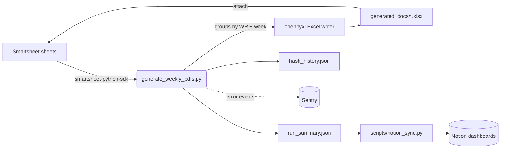

# System overview

The Smartsheet Weekly PDF Generator is an automated billing pipeline that
turns Smartsheet rows into formatted Excel reports and attaches them back to
Smartsheet on a schedule.

## Pipeline at a glance

## What runs where

| Surface | Purpose |
| --- | --- |
| `generate_weekly_pdfs.py` | Primary production entry point — fetches Smartsheet data, groups by work request + week ending, writes Excel files, uploads attachments, tracks hashes for skip-if-unchanged. |
| `audit_billing_changes.py` | Detects unauthorized billing edits; run standalone or imported by the generator. |
| `.github/workflows/weekly-excel-generation.yml` | Scheduled + manual trigger for the generator in GitHub Actions. |
| `.github/workflows/system-health-check.yml` | Daily smoke-test of secrets and connectivity. |
| `scripts/notion_sync.py` | Mirrors each run into Notion pipeline/metric/incident DBs. |
| `portal/` | Express.js operator portal (Node). |
| `portal-v2/` | Vite + React rewrite of the portal. |
| `website/` | This Docusaurus site. |

## Data contract

The generator expects each Smartsheet row to carry a work request number, a
week-ending date, and pricing columns. Its output is an Excel file per
(WR, week) under `generated_docs/` plus a `run_summary.json` with per-run
metrics the Notion sync and the dashboards consume.

For the full configuration surface, see [Environment reference](../reference/environment.md).
