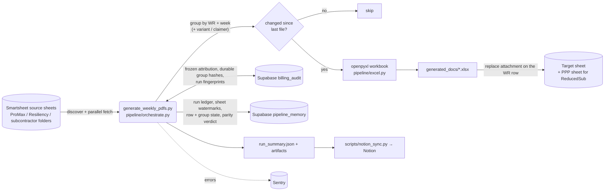

# System overview

The Smartsheet Weekly PDF Generator is an automated billing pipeline that
turns Smartsheet rows into formatted Excel reports and attaches them back to
Smartsheet on a schedule. It is owned by the **Python billing pipeline**
(`generate_weekly_pdfs.py` → the `pipeline/` package) running on GitHub
Actions; the Notion sync and the `portal-v2` web app are separate components
that consume its outputs.

## Pipeline at a glance

```mermaid
flowchart LR
    A[(Smartsheet source sheets<br/>ProMax / Resiliency / subcontractor folders)] -->|discover + parallel fetch| B(generate_weekly_pdfs.py<br/>pipeline/orchestrate.py)
    B -->|"group by WR + week<br/>(+ variant / claimer)"| C{changed since<br/>last file?}
    C -- no --> S[skip]
    C -- yes --> D[openpyxl workbook<br/>pipeline/excel.py]
    D --> E[generated_docs/*.xlsx]
    E -->|replace attachment on the WR row| T[(Target sheet<br/>+ PPP sheet for ReducedSub)]
    B <-->|frozen attribution, durable group hashes,<br/>run fingerprints| BA[(Supabase billing_audit)]
    B -->|run ledger, sheet watermarks,<br/>row + group state, parity verdict| PM[(Supabase pipeline_memory)]
    B --> R[run_summary.json + artifacts]
    R --> N[scripts/notion_sync.py → Notion]
    B -.errors.-> X[(Sentry)]
```

## What runs where

| Surface | Purpose |
| --- | --- |
| `generate_weekly_pdfs.py` + `pipeline/` | Primary production entry point — discovers source sheets, fetches rows in parallel, groups by Work Request + week ending (+ variant), decides per group whether to regenerate, writes Excel, uploads attachments, cleans up superseded files. |
| `billing_audit/` (Supabase) | Frozen claimer attribution, per-run fingerprints, and the **durable group hash store** that the skip-if-unchanged decision reads when `SUPABASE_HASH_STORE_AUTHORITATIVE=1` (production). |
| `pipeline_memory/` (Supabase) | Phase 10–11 run memory: `run_ledger`, `sheet_registry`, `row_state` / `row_event`, `group_state`, and the shadow-parity verdict that gates the incremental-read rollout. Writes are on (`RUN_MEMORY_WRITE_ENABLED=1`) and production reads them (sheet watermarks and last-run status before fetch; changed-row ids for the shadow comparator), but no read alters the generated output until `RUN_MEMORY_INCREMENTAL_ENABLED` is on. |
| `audit_billing_changes.py` | Price-anomaly / risk-level detection; run standalone or imported by the generator. |
| `.github/workflows/weekly-excel-generation.yml` | Scheduled + manual trigger for the generator (weekday 2-hourly, weekend 3×, Monday deep run). |
| `.github/workflows/system-health-check.yml` | Daily smoke test of secrets and connectivity. |
| `scripts/notion_sync.py` | Mirrors each run into Notion pipeline / metric / incident databases. |
| `portal-v2/` | Vite + React + Supabase operator web app (the legacy Express `portal/` was removed 2026-06-02). |
| `website/` | This Docusaurus site. |

## Data contract

The generator **accepts** a Smartsheet row when it carries a Work Request
number, a weekly-reference-logged date, the *Units Completed?* flag and a
price above zero (a blank / `$0` price is dropped unless the rate table can
supply one; a CU reading `NO MATCH` is dropped). A CU with quantity and a
foreman (or the helper / VAC-crew fields for split work) are required for a
*correct* line but do not gate acceptance — a row missing them still lands in
a file, as a blank-code / zero-quantity line or under an `_Unknown_Foreman`
name. Its output is one Excel file per `(WR, week ending, variant, claimer)`
group under `generated_docs/` — department and job are hashed content and,
for helper files, part of the change-detection identity, but never split a
file — attached to the WR's row on the target sheet, plus a frozen 21-key
`run_summary.json` the Notion sync and dashboards consume.

In a normal run files regenerate only when the group's content hash changes
or its attachment is missing; the hash covers every billed field of every row
plus the group's foreman, variant, departments and totals. The operator
overrides (`FORCE_GENERATION`, `REGEN_WEEKS`, `RESET_HASH_HISTORY`,
`RESET_WR_LIST`) bypass that decision. Rows marked as both helper-completed
and units-completed — with a helping foreman and helper department filled in
— appear only in the helper file.

## Where to go next

- Non-technical: [For operators](../learn/for-operators.md).
- Engineers: [For engineers](../learn/for-engineers.md), then
  [Python modules](./python-modules.md) and [Workflows](./workflows.md).
- Every knob: [Environment reference](../reference/environment.md).
- Operating procedures and the Phase 11 rollout: [Operations](./operations.md).
